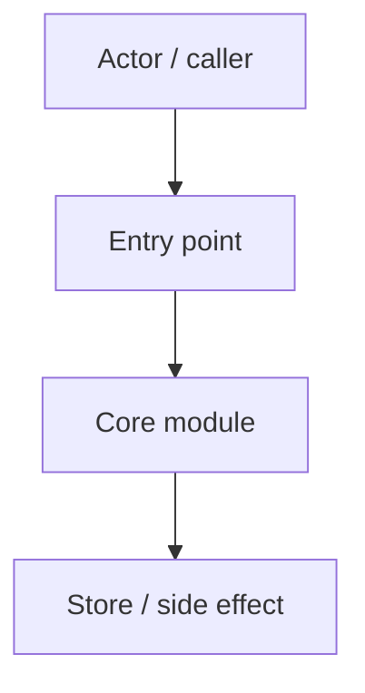

# Change: <NNN-slug> — <Title>

> **STATUS:** `draft` | `approved` | `in-progress` | `complete` (<YYYY-MM-DD>)
>
> **For agentic workers:** REQUIRED: follow `.agents/skills/_shared/conventions/sdd-structure.md`. This file is WHY + HOW (former intent + plan). Spec phase instantiates `tasks.md` + `acceptance.feature` from the Step Blueprint and per-step WHAT below.
>
> Intent only — never decide engineering here (stack/versions, data model, security boundaries, testing arch, error handling, project structure); those belong to design/spec. Flag any such text as deferred to design.

**Goal:** <one sentence — must match `## Goal` below>

**Architecture:** <2–3 sentences about modules, seams, and data path — summary only; details in Architecture decisions>

**Tech stack:** <languages/frameworks/services that matter for this change>

**Research:** `docs/skillgrid/changes/<NNN-slug>/research.md` (if present) | none

**Prototype:** `<path to PROTOTYPE spike>` (if present) | none

**Ticket:** `<tracker-id or none>`

**Depends on:** <other NNN-slugs or none>

**Classification:** `trivial | standard | risky` (optional for trivial — one line suffices; see `_shared/conventions/task-classification.md`)

**Verification floor:** `L1–L4` (trivial→L1 or omit, standard→L2, risky→L3/L4; see `_shared/conventions/verification-ladder.md`)

---

## Goal

<One clear sentence: the user/operator-visible outcome this change must achieve. Not the HOW.>

## Out of scope / Non-Goals

- <Explicit exclusion — do not implement in this change>
- <Deferred / adjacent work that belongs to another NNN-slug>
- <Hard non-goal (e.g. platform, runtime concern) agents must not expand into>

## Definition of Done

This change is done only when **all** of the following are true:

- [ ] <Observable UAT-level outcome — success criterion 1>
- [ ] <Observable UAT-level outcome — success criterion 2>
- [ ] Every Step Blueprint entry has a matching section in `tasks.md` with Verdict `PASS` or `PASS WITH WARNINGS`
- [ ] Every `@step-NN` Feature in `acceptance.feature` has passing `@happy`, `@edge`, and `@failure` scenarios
- [ ] Applicable threat-matrix rows have RED coverage that passed
- [ ] Testing strategy commands below are green
- [ ] Rollback path below is still valid (or N/A documented)
- [ ] Change archived under `docs/skillgrid/archive/<NNN-slug>/`

---

## Problem / why

<What is wrong or missing, who is affected, and why it matters now.>

<!-- Reframe test: if only one solution could fit this statement, it's a spec, not intent — rewrite until more than one answer fits. -->

## Hypothesis

We believe [change] will cause [these users] to [do Y], resulting in [outcome].
We'll know we're RIGHT if [leading signal] within [timeframe].
We'll know we're WRONG if [counter-signal / guardrail moves].

## MVP

<Thinnest end-to-end slice proving the hypothesis right or wrong — not "build the product." Holds → full spec; doesn't → a slice was thrown away, not months.>

## Door check

<Two-way (reversible) → just build it. One-way (expensive to undo) → spike first via `design-spike`, with decision rule: go with [X] if [signal] / [Y] if [counter-signal].>

## Target users

- <Role / persona> — <situation or workflow>

## Business rules

- <Policy, permission, threshold, or domain invariant that must hold>

## In scope

- <Capability or behavior included in this change>

## Risks & rollback

- **Risk:** <risk> — **Mitigation:** <mitigation>
- **Rollback:** <how to undo or disable if the change fails>

## Error handling

| Failure | Behavior | Notes |
|---------|----------|-------|
| <e.g. store open fails> | `abort` \| `warn+continue` | <message / recovery> |
| <e.g. optional hook missing> | `abort` \| `warn+continue` | <…> |

## Testing strategy

- **Unit:** `Run: <command>` — Expected: PASS
- **Integration / acceptance:** `Run: <command or BDD tag filter>` — Expected: PASS (`@step-NN` / `@p0`)
- **Full suite:** `Run: <command>` — Expected: PASS
- **Green means:** <one line — what “done testing” looks like for this change>

---

## Step Blueprint

Contract for `sdd-spec`. Do not renumber after `tasks.md` exists. Per-step Out of scope / DoD live under Per-step WHAT (table is summary only).

| NN | Step slug | Goal (one line) | Primary package / entry | Depends on |
|----|-----------|-----------------|-------------------------|------------|
| 01 | `<name>` | <goal> | `<path or package>` | — |
| 02 | `<name>` | <goal> | `<path or package>` | 01 |

---

## Technical approach

<2–4 sentences: how the change will be implemented end-to-end.>

## Architecture decisions

### Decision: <short title>

**Module / Interface / Seam / Adapter / Depth:** <codebase-design vocabulary>
**Choice:** <chosen option>
**Alternatives considered:** <rejected options>
**Rationale:** <why this wins>

<!-- Repeat ### Decision blocks as needed. Prefer MADR-style Choice / Alternatives / Rationale over fragile code snippets. -->

## Data flow



## File layout

```
<repo-or-module>/
├── <new-or-touched-path>/
│   └── <file>          # <role>
└── …
```

Optional but recommended when many packages move. Complements the Impacted files map (which owns Step assignment).

## Impacted files map

| File | Action | Step | Description |
|------|--------|------|-------------|
| `<path>` | Create \| Modify \| Delete | 01 | <why> |

Every row MUST name exactly one Step NN from the blueprint.

## Per-step WHAT

Observable behavior each step must deliver (feeds Gherkin). Not implementation HOW.

### Step 01 — `<name>`

**Goal:** <what this step alone delivers>
**Out of scope:** <what this step must not touch>
**Definition of Done:** <one line — when this step's WHAT + acceptance scenarios pass>

- <WHAT bullet — user/operator observable>
- <WHAT bullet>

### Step 02 — `<name>`

**Goal:** <…>
**Out of scope:** <…>
**Definition of Done:** <…>

- <WHAT bullet>

## Trust boundaries

| Actors / privileges | Untrusted inputs | External systems / secrets / sensitive data |
|---------------------|------------------|---------------------------------------------|
| <who + what they can do> | <what enters untrusted> | <systems, secrets, data involved> |

Or one line: `No new trust boundary`.

## Security assumptions

- <Stop-and-ask ambiguity (auth model, trust boundary, retention, secret handling) — or none. Never silently pick.>

Minimum secure design: simplest approach with secure defaults; no extra configurability, fallback paths, or optional insecure modes unless explicitly required.

## Threat matrix

Mark each row `Applicable` or `N/A: reason`. Applicable rows name an owning step and propagate into RED tasks + acceptance scenarios.

| Boundary / threat | Applicable? | Owning step | Planned RED coverage |
|-------------------|-------------|-------------|----------------------|
| <authz / injection / data leak / …> | Applicable \| N/A: … | 01 | <scenario or test name> |

## Migration / rollout

- <migration, feature flag, or rollout note — or N/A: reason>

## Open questions

- <Question, owner, and when it must be answered — or none>

## Glossary

| Term | Definition | Glossary file |
|------|------------|---------------|
| **Term** | One-sentence definition | business \| technical |

<!-- Fold new terms here; also upsert docs/skillgrid/glossary/{business,technical}.md. No companion *-glossary-reference.md. -->

## Author self-review

- [ ] **Goal**, **Out of scope / Non-Goals**, and **Definition of Done** are filled and testable
- [ ] **Error handling** and **Testing strategy** are filled
- [ ] Non-goals match Global Constraints that will appear in `tasks.md`
- [ ] Rollback plan is present
- [ ] Step Blueprint covers a vertical-slice sequence (no horizontal-only layers)
- [ ] Every Impacted Files row maps to exactly one step
- [ ] Every applicable threat row names an owning step
- [ ] Glossary terms reused or defined; no companion reference file
