# Playwright E2E Testing

## MCP Workflow

**If you have Playwright MCP tools, ALWAYS explore the live page BEFORE writing any test.** A test built on imagined selectors is a flaky test waiting to happen.

```dot
digraph mcp {
  rankdir=LR;
  nav [label="1. Navigate\nto target page", shape=box];
  snap [label="2. Take snapshot\n(page structure)", shape=box, style=filled, fillcolor="#ffcccc"];
  interact [label="3. Interact with\nforms/elements", shape=box];
  shot [label="4. Screenshot\nexpected states", shape=box];
  verify [label="5. Verify page\ntransitions", shape=box];
  doc [label="6. Document actual\nselectors from refs", shape=box, style=filled, fillcolor="#ccffcc"];
  code [label="7. Write test code\nwith verified selectors", shape=box, style=filled, fillcolor="#ccccff"];
  nav -> snap -> interact -> shot -> verify -> doc -> code;
}
```



**If MCP is NOT available:** proceed from docs and code analysis, and say so.

## File Structure

```
tests/
├── base-page.ts              # Parent class for ALL pages
├── helpers.ts                # Shared utilities
└── {page-name}/
    ├── {page-name}-page.ts   # Page Object Model
    ├── {page-name}.spec.ts   # ALL tests here (no separate files)
    └── {page-name}.md        # Test documentation
```

One spec file per page — `sign-up.spec.ts` holds every sign-up test. Never split into `sign-up-critical-path.spec.ts`, `sign-up-validation.spec.ts`, etc.

## Selector Priority

```typescript
// 1. BEST - getByRole for interactive elements
this.submitButton = page.getByRole("button", { name: "Submit" });
// 2. BEST - getByLabel for form controls
this.emailInput = page.getByLabel("Email");
// 3. SPARINGLY - getByText for static content only
this.errorMessage = page.getByText("Invalid credentials");
// 4. LAST RESORT - getByTestId when above fail
this.customWidget = page.getByTestId("date-picker");
// AVOID - fragile CSS selectors
this.button = page.locator(".btn-primary");  // NO
this.input = page.locator("#email");         // NO
```

## Scope Detection

| User says | Action |
|-----------|--------|
| "a test", "one test", "new test", "add test" | Create ONE `test()` in the existing spec |
| "comprehensive tests", "all tests", "test suite", "generate tests" | Create the full suite |

## Page Object Pattern

```typescript
import { Page, Locator, expect } from "@playwright/test";

// BasePage - ALL pages extend this
export class BasePage {
  constructor(protected page: Page) {}

  async goto(path: string): Promise<void> {
    await this.page.goto(path);
    await this.page.waitForLoadState("networkidle");
  }

  async waitForNotification(): Promise<void> {
    await this.page.waitForSelector('[role="status"]');
  }

  async verifyNotificationMessage(message: string): Promise<void> {
    await expect(this.page.locator('[role="status"]')).toContainText(message);
  }
}

// Page-specific implementation
export interface LoginData { email: string; password: string; }

export class LoginPage extends BasePage {
  readonly emailInput: Locator;
  readonly passwordInput: Locator;
  readonly submitButton: Locator;

  constructor(page: Page) {
    super(page);
    this.emailInput = page.getByLabel("Email");
    this.passwordInput = page.getByLabel("Password");
    this.submitButton = page.getByRole("button", { name: "Sign in" });
  }

  async goto(): Promise<void> { await super.goto("/login"); }

  async login(data: LoginData): Promise<void> {
    await this.emailInput.fill(data.email);
    await this.passwordInput.fill(data.password);
    await this.submitButton.click();
  }

  async verifyCriticalOutcome(): Promise<void> {
    await expect(this.page).toHaveURL("/dashboard");
  }
}
```

## Page Object Reuse

**Always check `tests/` for existing page objects before creating new ones.** Import and reuse; create only when the page doesn't exist. If a test spans multiple pages, ensure every page object exists.

```typescript
// REUSE - import existing page objects, do not recreate their methods
import { SignInPage } from "../sign-in/sign-in-page";
import { HomePage } from "../home/home-page";

test("User can sign up, log out, and log back in", async ({ page }) => {
  const signUpPage = new SignUpPage(page);
  const signInPage = new SignInPage(page);   // REUSE
  const homePage = new HomePage(page);       // REUSE

  await signUpPage.signUp(userData);
  await homePage.verifyPageLoaded();         // REUSE method
  await homePage.signOut();                  // REUSE method
  await signInPage.login(credentials);       // REUSE method
});
```

## Refactoring: BasePage vs helpers.ts

Move to **`BasePage`** when a method is used by multiple pages:

- Navigation helpers (`waitForPageLoad()`, `getCurrentUrl()`)
- Common UI interactions (notifications, modals, theme toggles)
- Verification patterns repeated across pages (`isVisible()`, `waitForVisible()`)
- Error handling that applies to all pages
- Screenshot utilities

Move to **`helpers.ts`** when it is not page-bound:

- Test data generation (`generateUniqueEmail()`, `generateTestUser()`)
- Setup/teardown utilities (`createTestUser()`, `cleanupTestData()`)
- Custom assertions (`expectNotificationToContain()`)
- API helpers for test setup (`seedDatabase()`, `resetState()`)
- Time utilities (`waitForCondition()`, `retryAction()`)

**Rule of thumb:** if two page objects would both contain it, it belongs in `BasePage`. If it has no `this.page`, it belongs in `helpers.ts`.

## Test Pattern with Tags

```typescript
import { test, expect } from "@playwright/test";
import { LoginPage } from "./login-page";

test.describe("Login", () => {
  test("User can login successfully",
    { tag: ["@critical", "@e2e", "@login", "@LOGIN-E2E-001"] },
    async ({ page }) => {
      const loginPage = new LoginPage(page);
      await loginPage.goto();
      await loginPage.login({ email: "user@test.com", password: "pass123" });
      await expect(page).toHaveURL("/dashboard");
    }
  );
});
```

**Tag categories:**

| Category | Examples |
|---|---|
| Priority | `@critical`, `@high`, `@medium`, `@low` |
| Type | `@e2e` |
| Feature | `@signup`, `@signin`, `@dashboard` |
| Test ID | `@SIGNUP-E2E-001`, `@LOGIN-E2E-002` |

## Test Documentation ({page-name}.md)

```markdown
### E2E Tests: {Feature Name}

**Suite ID:** `{SUITE-ID}`
**Feature:** {Feature description}

---

## Test Case: `{TEST-ID}` - {Test case title}

**Priority:** `{critical|high|medium|low}`
**Tags:** type → @e2e · feature → @{feature-name}

**Description:** {Brief description}

**Preconditions:**
- {Prerequisites / required data or state}

### Flow Steps:
1. {Step 1}
2. {Step 2}

### Expected Result:
- {Expected outcome}

### Key verification points:
- {Assertion}

### Notes:
- {Additional considerations}
```

Focus ONLY on the specific test case. Keep under 60 lines. No general running instructions, no file-structure explanations, no code tutorials, no troubleshooting sections.

## Commands

```bash
npx playwright test                    # Run all
npx playwright test --grep "login"     # Filter by name
npx playwright test --ui               # Interactive UI
npx playwright test --debug            # Debug mode
npx playwright test tests/login/       # Run specific folder
```

## Red flags

| Thought | Reality |
|---|---|
| "I'll write the test first, explore later" | MCP available? Explore the live page first. Tests built on imagined selectors are flaky. |
| "`.btn-primary` is fine, it's stable" | CSS class selectors break on restyle. Use `getByRole` / `getByLabel`. |
| "I'll split this into two spec files" | One spec file per page. Never `sign-up-critical-path.spec.ts`. |
| "I'll add a `logout()` to this page object" | Check existing page objects first. If `HomePage` has it, reuse it. |
| "This helper is only used here, I'll inline it" | If two page objects would contain it, it belongs in `BasePage`. If it has no `this.page`, it belongs in `helpers.ts`. |
| "I'll add a quick note on how to run tests in the .md" | The .md documents ONE test case. No running instructions, no file structure, no tutorials. |
| "I'll use `getByText` for the submit button" | `getByText` is for static content. Interactive elements use `getByRole`. |
| "I'll skip the screenshot, the snapshot is enough" | Screenshots document expected *states* (loading, success, error). Snapshots show structure. |
| "I'll use `locator('#email')` for the form" | Use `getByLabel("Email")` — survives label changes, not just ID changes. |
| "I'll create the page object even though one exists" | Reuse beats recreation. Import the existing page object. |

## Keywords

playwright, e2e, testing, page object model, selectors, end-to-end, mcp
