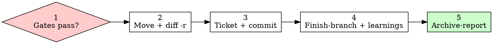

# SDD Archive

> **For agentic workers:** REQUIRED: mechanical move only (`git mv` + `diff -r`). Do not use `handoff` to close.

Stage owner (v4). Terminal step. Archive is the audit trail — mechanical move, not a model paraphrase. Do **not** auto-promote ADRs. Do **not** use **`handoff`** for closing (handoff is out-of-scope spin-off only).

Layout: [`../_shared/conventions/sdd-structure.md`](../_shared/conventions/sdd-structure.md).

## Hard Rules

- Gate before any move: verify + human QA (see below). FAIL/PENDING/missing Verdict → blocked (no prompt override).
- Pure folder move `changes/` → `archive/` via shell `mv` / `git mv` only — never Read/Write copy through the model.
- Mandatory `diff -r` readback against a **pre-move** snapshot; empty diff is the only pass. Missing diff = FAIL.
- **Archive commit is mandatory** after a successful move + empty `diff -r` — stage the rename (and any ticket close-out files) and create a conventional commit (`docs(sdd): archive <NNN-slug>`). Do not leave the move uncommitted. User “skip commits” does **not** apply to archive unless they explicitly waive archive-commit in the same turn (record waiver in archive-report).
- **Ticket close-out (when `change.md` `Ticket:` is not `none`):** follow the tracker **Ticket lifecycle** — mark done/closed and complete/archive the ticket as part of this phase, then include those path changes in the same archive commit (or an immediate follow-up commit if the tracker CLI cannot stage with the move). Footer: `Refs:` / `Closes` per [`../_shared/conventions/commits.md`](../_shared/conventions/commits.md).
- Do not invent `docs/adr/` at archive. Retro may *suggest* promote; human chooses.
- Hybrid: filesystem move + Mnemonic `sdd/<NNN-slug>/archive-report`.
- Archive folder name = exact `<NNN-slug>`; refuse if target exists.

## Gates (all must pass)

Read change-level **`tasks.md`** (and QA artifact):

1. **Verification** — every `## NN-<name>` Verdict is `PASS` or `PASS WITH WARNINGS`; dependency chain sound; Global Constraints held.
2. **Tasks** — no unchecked `- [ ]` under any `### Tasks` (exceptional stale-checkbox reconcile only with proof + explicit instruction, recorded in report).
3. **Human QA** — `qa-plan.md` / `## QA plan` accepted **or** explicitly waived (record waiver).
4. **DoD / Archive checklist** — satisfied or intentional override recorded.
5. **Workspace** — not read-only planning; stay inside allowed edit roots.

Any FAIL → return `blocked` with gate + step named. Do not move.

## Workflow

```
[ ] 1. Load artifacts + pass gates
[ ] 2. Mechanical move + diff -r readback
[ ] 3. Ticket close-out (when Ticket set) + archive commit
[ ] 4. Optional finish-branch + Mnemonic learnings
[ ] 5. Persist archive-report + envelope
```



### 1. Load + gates

Recover `change`, `tasks`, `spec`, `apply-progress`, `verification`, `qa-plan` (Mnemonic → `mem_get_observation`). Read filesystem copies under `docs/skillgrid/changes/<NNN-slug>/`. Run all gates above. Apply `rules.archive`. Note `Ticket:` from `change.md`.

### 2. Mechanical move + readback

```bash
snapshot_root="$(mktemp -d "${TMPDIR:-/tmp}/sdd-archive.move.XXXXXX")"
trap 'rm -rf -- "$snapshot_root"' EXIT
cp -R "docs/skillgrid/changes/<NNN-slug>" "$snapshot_root/source"
mkdir -p docs/skillgrid/archive
# refuse if archive/<NNN-slug> exists
git mv "docs/skillgrid/changes/<NNN-slug>" "docs/skillgrid/archive/<NNN-slug>" \
  || mv "docs/skillgrid/changes/<NNN-slug>" "docs/skillgrid/archive/<NNN-slug>"
# source must be gone
diff -r "$snapshot_root/source" "docs/skillgrid/archive/<NNN-slug>"
```

Include **verbatim** `diff -r` output in the result. Do not write `archive-report.md` inside the folder before the diff (would dirty the readback). No shell → blocked (`shell access required`).

### 3. Ticket close-out + archive commit

1. If `Ticket:` is a real id: run the tracker close-out from [`../_shared/issue-tracker/`](../_shared/issue-tracker/) (Backlog: `-s done` then `backlog task complete <ID>`; GitHub/GitLab: `Closes` on the commit or issue close CLI; Jira: Done). Update refs in the ticket to the **archive** paths when the tracker stores documentation links.
2. Stage the move (+ ticket file moves). Commit with Conventional Commits, e.g. `docs(sdd): archive <NNN-slug>` and the ticket footer when applicable. Honor [`../_shared/conventions/commits.md`](../_shared/conventions/commits.md) (no AI trailers).
3. Record the commit SHA in the archive-report. An empty `diff -r` with an uncommitted move is **not** success.

### 4. Optional finish-branch + learnings

- Optionally call **`finishing-a-development-branch`** (merge / PR / discard) — ship path is optional, not a separate stage.
- Extract learnings via **`mnemonic`** (`mem_save` decisions/patterns; changelog line on `sdd/{project}/changelog`).
- Do **not** call `handoff` to “close” the cycle.

### 5. Persist + envelope

`mem_save` topic `sdd/<NNN-slug>/archive-report` — final-state facts, gate results, observation IDs read, verbatim diff evidence, QA acceptance/waiver, any overrides. Prefer Final-State Authority: repo/filesystem > launch-prompt final facts > tasks.md > older snapshots (do not echo stale “pending” as open when higher rank says fixed — but FAIL still needs fresh verify).

```markdown
## Change Archived
**Change**: {NNN-slug}
**Location**: docs/skillgrid/archive/<NNN-slug>/
**Status**: success | blocked
**Gates**: verify · tasks · human QA · DoD
**Mechanical readback**: empty diff ✅ | FAIL
**Next**: none — SDD cycle complete
```

## Gotchas

- FAIL Verdict is never overridable by “fixed in a later commit” — re-run `sdd-verify`.
- Compare snapshot vs archive, not the (gone) source path.
- `PASS WITH WARNINGS` is archive-eligible; open human QA is not.
- Leaving the archive move uncommitted, or leaving a forced/linked ticket open after archive, is a process defect — fix before claiming success.
- Archive does not auto-promote ADRs or rewrite legacy pre-v3 trees.
- Record every observation ID you read — lineage endpoint.

## References

- [`../sdd-verify/SKILL.md`](../sdd-verify/SKILL.md) · [`../finishing-a-development-branch/SKILL.md`](../finishing-a-development-branch/SKILL.md)
- [`../mnemonic/SKILL.md`](../mnemonic/SKILL.md)
- [`../_shared/templates/template-tasks.md`](../_shared/templates/template-tasks.md)
- [`../_shared/conventions/sdd-structure.md`](../_shared/conventions/sdd-structure.md) · [`../_shared/conventions/mnemonic-memory.md`](../_shared/conventions/mnemonic-memory.md)
