# SDD Propose

> **For agentic workers:** REQUIRED SUB-SKILL: use `questioning` after concrete inputs; `sdd-explore` / `design-spike` via gate only. Do not write production code.

Stage owner (v4). Reserve `NNN`, write **`change.md`**, stop before code. Architecture decisions live **in** `change.md` — promote to ADR later only when they outlive this change.

Layout: [`../_shared/conventions/sdd-structure.md`](../_shared/conventions/sdd-structure.md).

## Hard Rules

- Instantiate [`../_shared/templates/template-change.md`](../_shared/templates/template-change.md) — do not invent a parallel structure.
- Reserve NNN **before** creating the change folder.
- If hard research or taste/UI/unknown API shape remains → **STOP** and require `sdd-explore` / `design-spike` first.
- Run **`questioning`** after concrete inputs (research/spike when used) — not before empty air.
- List `Research:` and `Prototype:` header paths when those artifacts exist.
- No production code. No default ADR write under `docs/adr/`.
- Hybrid: disk + Mnemonic `sdd/<NNN-slug>/change`.
- `force_ticket_creation` → invoke `issue-creation` for the change artifact; Backlog tickets must pass the **Backlog completeness gate** (type, references, DoD, Implementation Plan) — no thin stubs.

## Workflow

```
[ ] 1. Classify path (spike / bounded / architectural) — announce
[ ] 2. Decompose check (>1 subsystem → N changes, not one)
[ ] 3. Gate: explore / spike required?
[ ] 4. Reserve NNN
[ ] 5. Questioning (after concrete inputs)
[ ] 6. Read code (code-index ladder)
[ ] 7. Design checkpoint — present direction, get nod before full change.md
[ ] 8. Write change.md from template
[ ] 9. Glossary + persist + envelope
```



```dot
digraph process {
  rankdir=LR;
  classify [label="1\nClassify path", shape=box, style=filled, fillcolor="#ccffcc"];
  decompose [label="2\nDecompose check", shape=box];
  gate [label="3\nExplore/spike gate?", shape=diamond];
  reserve [label="4\nReserve NNN", shape=box];
  question [label="5\nQuestioning", shape=box];
  read [label="6\nRead code", shape=box];
  checkpoint [label="7\nDesign checkpoint", shape=box, style=filled, fillcolor="#ffcccc"];
  write [label="8\nWrite change.md", shape=box];
  persist [label="9\nPersist + envelope", shape=box, style=filled, fillcolor="#ccccff"];
  classify -> decompose -> gate -> reserve -> question -> read -> checkpoint -> write -> persist;
}
```

### 1. Classify path — announce it

Before the first question, classify how much process this change needs and **say the classification out loud** so the user can override:

| Path | Signal | Process |
|---|---|---|
| **Spike** | Feasibility question ("can we…", "is it possible…"), output is an answer not kept code | Route to `design-spike`. No `change.md`. |
| **Bounded** | Well-scoped change to code that *already exists* — a flag, a small endpoint, a one-file fix | Short `change.md`: Goal, Non-Goals, 1-step Blueprint, Architecture (1 decision). Full ceremony is overkill. |
| **Architectural** | New subsystem, restructures how components fit, alters interfaces others depend on | Full `change.md`: all sections, Step Blueprint, Threat matrix, multiple Architecture decisions. |

**The ratchet is one-way.** Hidden complexity discovered mid-propose *upgrades* the path — stop, say so, and step up. Nothing downgrades. When in doubt, take the heavier path. "I understand this kind of app, so it's bounded" is the doubt — bounded measures the *repo*, not your familiarity.

### 2. Decompose check

If the request describes **more than one independent subsystem** (e.g. "build chat + file storage + billing"), flag it immediately. Do not write one bloated `change.md` — reserve **N NNNs** and write N `change.md` files, one per subsystem. Each gets its own spec → apply → verify cycle. Decompose first, then propose the first.

### 3. Gate — explore / spike first?

| Signal | Action |
|---|---|
| External/rare docs, costly rediscovery, missing/stale research | STOP → **`sdd-explore`** → `research.md` |
| UI taste, unknown API shape, throwaway smoke needed | STOP → **`design-spike`** → list path as `Prototype:` |
| Bounded in-repo change with clear shape | Continue |

Announce the gate decision. Do not lock `change.md` while the gate is open.

### 4. Reserve NNN

Scan `docs/skillgrid/changes/`, `archive/`, Mnemonic `sdd/{project}/changelog`. Next = `max+1`, zero-pad 3. Id = `<NNN>-<slug>`. Append changelog line. Never reuse.

### 5. Questioning

Load **`questioning`**. Cover problem, users, rules, outcome, non-goals, edges, risks. Optional log: `interview.md`. **Propose 2–3 approaches with trade-offs and name your recommendation** — lead with the one you'd pick and why. Prefer revise later via user gate over guessing.

### 6. Read code

`code_status` → `code_index` if stale → `code_search` → `code_read` for every module you will touch. Load `codebase-design` when restructuring. Apply `rules.propose` from `config.yaml`.

### 7. Design checkpoint — approve the direction before the full file

Before writing the full `change.md`, present the **direction** in chat and get a nod:

```
Direction checkpoint for <NNN-slug> (<path classification>):
- Goal: <one sentence>
- Approach: <the one you recommended, one sentence why>
- Impacted modules: <list>
- Non-goals: <what is explicitly out>
- Open risks: <top 1–2>

Does this look right before I write the full change.md?
```

**STOP and wait for an explicit yes.** Presenting the direction and starting to write in the same breath is skipping the gate. This is cheap — it catches mis-scoped changes *before* you pay for the full template, Step Blueprint, and Threat matrix. If the user redirects, go back to step 5 (questioning) and re-present.

- **Bounded path:** this checkpoint *is* the approval. The `change.md` that follows is short (Goal, Non-Goals, 1-step Blueprint, 1 Architecture decision).
- **Architectural path:** this checkpoint confirms direction; the full `change.md` + the later user gate (after `sdd-spec`) are the deeper approvals.

### 8. Write change.md

1. READ the template; copy outline; fill placeholders.
2. Write `docs/skillgrid/changes/<NNN-slug>/change.md` (READ then UPDATE if exists).
3. Header: set **`Research:`** and **`Prototype:`** when present (else `none`).
4. Required: Goal, Out of scope/Non-Goals, Definition of Done, Problem, Testing strategy, Error handling, rollback, **Step Blueprint**, Technical approach, **Architecture decisions** (Choice / Alternatives / Rationale), Impacted files, per-step WHAT, **Threat matrix** ([references/threat-matrix.md](references/threat-matrix.md) — Applicable → owning step), Glossary footer.

**The Architecture decision picks a winner.** Choice / Alternatives / Rationale is not a comparison you hedge — you are *choosing*. State the chosen approach first, then the alternatives you rejected and why. "Recommendation ≠ commitment" applies to `research.md`, not to `change.md` — this is where the choice is locked.

Threat Applicable rows must propagate to `sdd-spec` as `[RED]` tasks.

### 9. Glossary + persist + envelope

- Fold terms into `## Glossary`; upsert `docs/skillgrid/glossary/{business,technical}.md` via **`glossary`**. No companion `*-glossary-reference.md`.
- `mem_session_start` → `mem_save` topic `sdd/<NNN-slug>/change` (full file). File must exist on disk.

```markdown
## Change Proposed
**Change**: {NNN-slug}
**Location**: docs/skillgrid/changes/<NNN-slug>/change.md
**Research / Prototype**: {paths or none}
**Status**: success | partial | blocked
**Step blueprint**: {N} · **Threat rows**: {K applicable}
**Next**: sdd-spec
```

## Red flags

| Thought | Reality |
|---|---|
| "This is too simple to need a path classification" | Classification is one sentence. Simple means a *short* `change.md`, not no classification. Announce it. |
| "I'll call it bounded and skip the Step Blueprint" | Reaching for a label to skip work IS the doubt. Bounded measures the *repo*, not your familiarity. A new project has no existing flow — it is architectural. |
| "The direction is obvious — I'll start writing change.md while they read" | The checkpoint is the approval, not the design's length. Present, then stop until you hear yes. |
| "I understand this kind of app, so it's bounded" | Bounded means the flow you're changing is *already in this repo*. A new subsystem has no existing flow — it is architectural. |
| "The research said the approach was fine, so it's decided" | `research.md` recommends; `change.md` decides. The Architecture section must name a winner, not hedge. |
| "One change.md can hold all of this" | Multiple independent subsystems = N changes, not one bloated file. Decompose before proposing. |
| "I'll fill the Threat matrix later, it's boilerplate" | An empty or hand-waved Threat matrix becomes a handoff gap for `sdd-spec` — Applicable rows must propagate as `[RED]` tasks. |
| "I'll skip the decompose check, the user knows what they want" | The decompose check is one question. An oversized `change.md` produces an oversized `tasks.md` that's hard to execute. |
| "mem_search preview is enough to confirm prior art" | Previews are truncated. `mem_get_observation(id)` is the only full-content path. |
| "I'll archive this as an ADR while I'm here" | Architecture lives in `change.md` only. Archive does not auto-promote ADRs. |

## References

- [`../_shared/templates/template-change.md`](../_shared/templates/template-change.md)
- [references/threat-matrix.md](references/threat-matrix.md)
- [`../questioning/SKILL.md`](../questioning/SKILL.md) · [`../sdd-explore/SKILL.md`](../sdd-explore/SKILL.md) · [`../design-spike/SKILL.md`](../design-spike/SKILL.md)
- [`../codebase-design/SKILL.md`](../codebase-design/SKILL.md) · [`../glossary/SKILL.md`](../glossary/SKILL.md)
- [`../sdd-spec/SKILL.md`](../sdd-spec/SKILL.md)
