# SDD Spec

> **For agentic workers:** REQUIRED SUB-SKILL: use `glossary` for terms; stop at user gate. Do not call `sdd-apply`.

Stage owner (v4). Punch-lists + Gherkin in one phase. Own **NN** numbering; write change-level **`tasks.md`** and **`acceptance.feature`**; then **STOP for user gate** (Implement | Revise). Do not call `sdd-apply`.

Layout: [`../_shared/conventions/sdd-structure.md`](../_shared/conventions/sdd-structure.md).

## Hard Rules

- Instantiate both templates — no `steps/` tree, no per-step `verification.md`.
- **Every** step MUST declare `Depends on: <NN or none>` (kanban DAG for parallel apply).
- Applicable threat rows from `change.md` → `[RED]` tasks **before** production `[AFK]` tasks.
- Missing/ambiguous requirements → prefer revise via `sdd-propose` / `questioning`, not invent.
- `force_ticket_creation` → `issue-creation` for `tasks.md`; Backlog tickets must pass the **Backlog completeness gate** (type, references, DoD, Implementation Plan) — no thin stubs.
- Hybrid: disk + Mnemonic `sdd/<NNN-slug>/tasks` and `sdd/<NNN-slug>/spec`.

## Workflow

```
[ ] 1. Load change.md
[ ] 2. Own NN allocation
[ ] 3. Write tasks.md (blocking DAG)
[ ] 4. Write acceptance.feature
[ ] 5. Self-check + persist
[ ] 6. STOP — user gate
```



```dot
digraph process {
  rankdir=LR;
  load [label="1\nLoad change.md", shape=box];
  nn [label="2\nOwn NN allocation", shape=box];
  tasks [label="3\nWrite tasks.md", shape=box, style=filled, fillcolor="#ffcccc"];
  feature [label="4\nWrite acceptance.feature", shape=box, style=filled, fillcolor="#ffcccc"];
  check [label="5\nSelf-check + persist", shape=box];
  gate [label="6\nSTOP user gate", shape=box, style=filled, fillcolor="#ccffcc"];
  load -> nn -> tasks -> feature -> check -> gate;
}
```

### 1. Load change.md

Required: `docs/skillgrid/changes/<NNN-slug>/change.md` (Mnemonic `sdd/<NNN-slug>/change`). Also read `research.md` / Prototype path if listed. Apply `rules.spec` from `config.yaml`. If `change.md` missing → run `sdd-propose`, do not invent from research alone.

### 2. Own NN allocation

From Step Blueprint allocate every `NN-<name>`. Never renumber after `tasks.md` exists. Vertical slices: each step demoable alone; expand-contract for wide refactors.

### 3. Write tasks.md

1. READ [`../_shared/templates/template-tasks.md`](../_shared/templates/template-tasks.md).
2. Fill Goal / Out of scope / DoD; **Global Constraints** (verbatim from change Error handling + Non-Goals + stack rules); `## State` (`phase: spec`); Step map; Review workload; one `## NN-<name>` per blueprint entry.
3. Per step: Goal, Out of scope, DoD, Files, Interfaces, Tasks, empty Verification stub, Commit hint.
4. **Mandatory** under each step: `Depends on: <NN or none>` — also fill Step map **Blocked by**.
5. Applicable threats → `[RED]` with TDD micro-cycle (`a–e`) and `Run:` / `Expected: FAIL|PASS`.
6. Assign every Impacted Files row to exactly one step.
7. Write `docs/skillgrid/changes/<NNN-slug>/tasks.md`.

**Task right-sizing.** A task is the smallest unit that carries its own test cycle and is worth a fresh reviewer's gate. Fold setup, configuration, scaffolding, and documentation into the task whose deliverable needs them. Split only where a reviewer could meaningfully reject one task while approving its neighbor. Each task ends with an independently testable deliverable.

**Bite-sized steps.** Each step is one action (2–5 minutes): "write the failing test" → "run it, verify it fails" → "implement minimal code" → "run tests, verify they pass" → "commit." A step that does more than one of these is two steps.

**No placeholders.** Every step must contain the actual content an executor needs. These are **plan failures** — never write them:
- "TBD", "TODO", "implement later", "fill in details"
- "Add appropriate error handling" / "add validation" / "handle edge cases"
- "Write tests for the above" (without actual test code)
- "Similar to Task N" (repeat the content — the executor may read tasks out of order)
- Steps that describe what to do without showing how (code blocks required for code steps)
- References to types, functions, or methods not defined in any task

### 4. Write acceptance.feature

1. READ [`../_shared/templates/template-acceptance.feature`](../_shared/templates/template-acceptance.feature) + [references/acceptance-format.md](references/acceptance-format.md).
2. One change-level file; one `Feature` per step tagged `@step-NN`.
3. ≥1 `@happy` + `@edge` + `@failure` per step; every WHAT bullet → scenario; every applicable threat → scenario in owning step.
4. WHAT not HOW — no file paths/function names in Gherkin.
5. Write `docs/skillgrid/changes/<NNN-slug>/acceptance.feature`.

### 5. Self-check + persist

- Every Blueprint step has `## NN` + `@step-NN` Feature + explicit `Depends on:`.
- Every `[RED]` has Run/Expected; Global Constraints present.
- **Placeholder scan:** search `tasks.md` for the "No Placeholders" patterns above. Fix them inline.
- **Type consistency:** do the types, function names, and signatures in later steps match what earlier steps defined? A function called `clearLayers()` in step 03 but `clearFullLayers()` in step 07 is a bug.
- **Spec coverage:** skim each section of `change.md`. Can you point to a step that implements it? If a requirement has no step, add one.
- `mem_session_start` → save `sdd/<NNN-slug>/tasks` and `sdd/<NNN-slug>/spec`.

### 6. STOP — user gate

```markdown
## Spec Created
**Change**: {NNN-slug}
**Status**: success | partial | blocked
**tasks.md**: N steps · blocking edges {ok} · Global Constraints {ok}
**acceptance.feature**: N Features · H/E/F coverage
**Threat handoff**: {K applicable → covered}
**Next**: USER GATE — choose Implement (sdd-apply) | Revise (questioning / sdd-propose)
```

Wait for human decision. Never auto-apply.

## Red flags

| Thought | Reality |
|---|---|
| "I'll skip `Depends on:`, the order is obvious" | Missing `Depends on:` breaks parallel apply — treat as incomplete spec. |
| "I'll omit the `@edge` scenario, it's obvious" | Omitting `@edge`/`@failure` blocks verify. Every step needs all three. |
| "I'll write a PASS under Verification now, save time" | Do not invent a PASS — apply leaves PENDING; verify fills it. |
| "This step is 'similar to step 03'" | Repeat the content. The executor may read tasks out of order. |
| "I'll add 'handle edge cases' and fill in later" | That's a placeholder. Name the edge cases, show the test code. |
| "This step does three things, but they're related" | A step that does more than one action is two steps. Split it. |
| "I'll fold the config into its own step" | Fold setup/config/scaffolding into the task whose deliverable needs them. |
| "The Global Constraints can be inferred from change.md" | Copy them verbatim. The executor reads `tasks.md` as the primary document. |
| "I'll renumber the steps after I've written them" | Never renumber after `tasks.md` exists. Renumbering breaks the DAG and the Mnemonic topic keys. |

## References

- [`../_shared/templates/template-tasks.md`](../_shared/templates/template-tasks.md)
- [`../_shared/templates/template-acceptance.feature`](../_shared/templates/template-acceptance.feature)
- [references/acceptance-format.md](references/acceptance-format.md) · [references/threat-matrix.md](references/threat-matrix.md)
- [`../sdd-propose/SKILL.md`](../sdd-propose/SKILL.md) · [`../sdd-apply/SKILL.md`](../sdd-apply/SKILL.md)
- [`../glossary/SKILL.md`](../glossary/SKILL.md) · [`../questioning/SKILL.md`](../questioning/SKILL.md)
