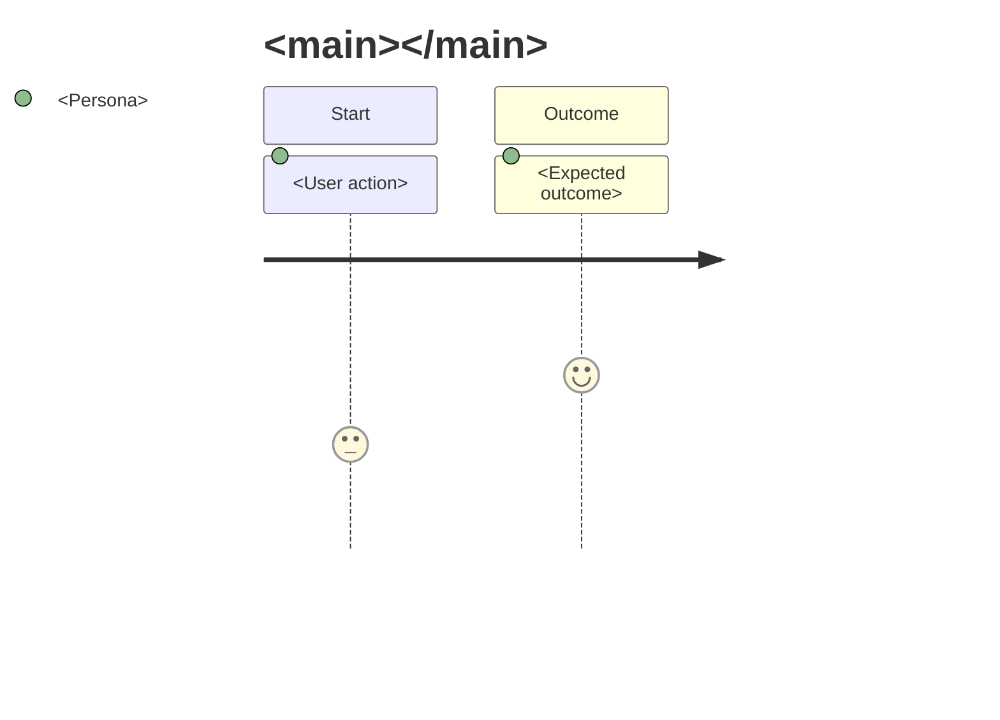
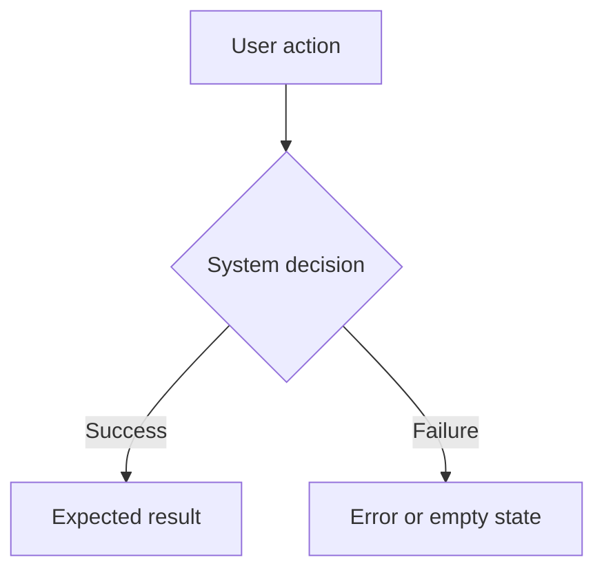

## When to Use

Use this skill when a Skillgrid command needs to create or update files under `.skillgrid/prd/`, align a PRD with an OpenSpec change, update `.skillgrid/prd/INDEX.md`, or reason about PRD execution order and lifecycle status.

## Critical Patterns

### Canonical Location

- Canonical PRDs live under `.skillgrid/prd/`.
- Do not create new PRDs at repository root `prd/`.
- `docs/PRD/` may mirror or link to canonical PRDs, but `.skillgrid/prd/` owns the workflow state.

### Synthesize From Context First

When creating a PRD from the current conversation or an existing OpenSpec change, do not start with a broad interview. First synthesize what is already known:

1. Explore the repo and existing Skillgrid/OpenSpec artifacts if you have not already.
2. Summarize the user-facing problem, desired solution, constraints, and out-of-scope items from current context.
3. Sketch the major modules, surfaces, or system boundaries likely to be built or modified.
4. Look for deep-module opportunities: simple, stable interfaces that encapsulate meaningful behavior and can be tested in isolation.
5. Ask only for decisions that remain genuinely blocking. Use `skillgrid-questioning` for those.

If the user explicitly wants a GitHub/GitLab/Jira issue, hand off to `skillgrid-issue-creation` after the canonical PRD exists. Do not make the remote issue the only source of product intent.

### File Naming

Use:

```text
.skillgrid/prd/PRD<NN>_<descriptive-slug>.md
```

Rules:

- `<NN>` is a two-digit execution order: `01`, `02`, `03`.
- The slug is lowercase `kebab-case` or `lower_snake`.
- List existing `PRD*.md` files before choosing a number.
- Avoid duplicate numbers.
- If execution order changes, rename files and update `INDEX.md`, PRD cross-links, OpenSpec references, and Engram pointers.

### INDEX Discipline

`.skillgrid/prd/INDEX.md` is the ordered work index. Keep it sorted by `PRD<NN>`.

Use the ordered PRD sequence as Skillgrid's lightweight roadmap or milestone view. A broad initiative should appear as several ordered PRDs, where each PRD is one independently reviewable slice.

Each entry should include at least:

- PRD file
- title
- linked `openspec/changes/<change-id>/`
- `Status:`
- optional external issue key or URL when ticketing is not `local`

### Title Block

Every PRD should start with:

```markdown
### PRD: <Title>

- **File:** `.skillgrid/prd/PRD<NN>_<slug>.md`
- **Spec / change:** `openspec/changes/<change-id>/`
- **Session context:** `.skillgrid/tasks/context_<change-id>.md`
- **Status:** `draft`
- **Preview:** optional `.skillgrid/preview/<change-id>-options.html`
- **External:** optional issue key or URL
- **Depends on:** optional PRD dependencies
- **Tech / stack:** optional one-line summary
```

Adapt only when the repository has an explicit stronger template.

### Status Lifecycle

Skillgrid status values are:

```text
draft -> todo -> inprogress -> devdone -> done
```

Commands own phase transitions:

| Phase | Command | Status on successful exit |
|---|---|---|
| Plan | `/skillgrid-plan` | `draft` |
| Breakdown | `/skillgrid-breakdown` | `todo` |
| Apply | `/skillgrid-apply` | `inprogress` |
| Validate | `/skillgrid-validate` | `devdone` |
| Finish | `/skillgrid-finish` | `done` |

When backfilling an existing change:

- archived OpenSpec change -> `done`
- tasks with completed checkboxes -> `inprogress`
- proposal-only or planning-only -> `draft`

### Required PRD Sections

Prefer this copy-ready template:

```markdown
### PRD: <Title>

- **File:** `.skillgrid/prd/PRD<NN>_<slug>.md`
- **Spec / change:** `openspec/changes/<change-id>/`
- **Session context:** `.skillgrid/tasks/context_<change-id>.md`
- **Status:** `draft`
- **Preview:** optional `.skillgrid/preview/<change-id>-options.html`
- **External:** local
- **Depends on:** None
- **Tech / stack:** <languages/frameworks/services that matter for this slice>

#### Problem / why

<What is wrong or missing, who is affected, and why it matters now.>

#### Solution

<The user-facing solution and the outcome the user should experience.>

#### Goals

- <Measurable or clearly verifiable outcome>
- <User-visible or operator-visible result>

#### Assumptions

- <Assumption that should be corrected before implementation if false>

#### In scope

- <Capability or behavior included in this PRD>

#### Out of scope

- <Explicitly excluded capability or future work>

#### User stories

1. As a <actor>, I want <feature or behavior>, so that <benefit>.
2. As a <actor>, I want <feature or behavior>, so that <benefit>.

#### Decomposition

<If this PRD is part of a sequence, explain the slice boundary and adjacent PRDs. If it is too broad, split it before continuing.>

#### Codebase touchpoints

- `<directory-or-module>` — <why it is likely involved>

#### Implementation decisions

- <Module, interface, schema, API, state, or interaction decision that shapes implementation.>
- <Deep-module opportunity or boundary that should remain testable in isolation.>

Do not include fragile code snippets here. Prefer stable module names, interfaces, responsibilities, and contracts over exact implementation steps.

#### Testing decisions

- <External behavior that must be tested, not implementation details.>
- <Modules or boundaries that need tests.>
- <Prior art in the codebase for similar tests.>

#### User Journeys



#### Feature diagram



#### Success criteria

- [ ] <Observable behavior that proves the PRD is done>
- [ ] <Verification that can be tested manually or automatically>

#### Quality bar

- [ ] Accessibility or UX expectation
- [ ] Test coverage expectation
- [ ] Security, privacy, or performance expectation if relevant
- [ ] Documentation or handoff update expectation

#### Implementation tasks

- [ ] `[HITL]` <Human decision or approval needed before autonomous work>
- [ ] `[AFK]` <Autonomous implementation slice tied to this PRD>

#### Open questions

- <Question, owner, and when it must be answered>

#### Author self-review

- [ ] PRD links the correct OpenSpec change.
- [ ] Scope is small enough for a vertical slice.
- [ ] Success criteria are testable.
- [ ] Implementation tasks trace to goals.
```

Keep product intent in the PRD. Detailed CLI instructions and exact code steps belong in OpenSpec artifacts or `tasks.md`.

### INDEX Template

Use a simple table when creating or refreshing `.skillgrid/prd/INDEX.md`:

```markdown
# Skillgrid PRD Index

Local Kanban dashboard:

Run `node .skillgrid/scripts/skillgrid-ui.mjs`, then open `http://127.0.0.1:8787`.

| Order | PRD | Status | Spec / change | External |
|---|---|---|---|---|
| 01 | [`PRD01_<slug>.md`](PRD01_<slug>.md) | `draft` | `openspec/changes/<change-id>/` | local |
```

If ticketing is `local`, `External` may be omitted or set to `local`.

### PRD And OpenSpec Alignment

- PRD is the product intent source.
- OpenSpec `proposal.md`, `design.md`, delta specs, and `tasks.md` are the technical contract.
- Every PRD should link to exactly one primary `openspec/changes/<change-id>/` unless it is intentionally an umbrella PRD.
- If a PRD becomes too broad, split it into ordered PRDs instead of expanding one mega-PRD.

### Source-Of-Truth Rules

- PRD owns product intent: user-facing problem, goals, scope, success criteria, and slice boundary.
- OpenSpec delta specs own verifiable technical behavior and scenarios.
- OpenSpec `tasks.md` owns the implementable checklist; detailed file-by-file steps do not belong in the PRD body.
- External tracker issues mirror PRD slices or blockers for coordination. If an external issue changes product intent, import that decision back into the PRD or OpenSpec artifacts.
- Engram memory summarizes durable decisions and pointers. It must not become the only place a requirement lives.
- When artifacts disagree, stop and reconcile before creating more PRDs, issues, or tasks.

## Commands

```bash
ls .skillgrid/prd/PRD*.md
openspec list --json
```

## Resources

- Full workflow overview: `docs/workflow.md`
- Command sources: `.cursor/commands/skillgrid-plan.md`, `.cursor/commands/skillgrid-explore.md`, `.cursor/commands/skillgrid-breakdown.md`
- Related skills: `skillgrid-spec-artifacts`, `skillgrid-vertical-slices`, `skillgrid-filesystem-handoff`
