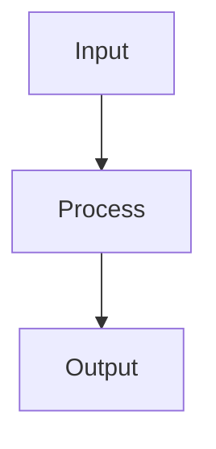

## When to Use

Use this skill when Skillgrid needs durable project documentation outside a single PRD or OpenSpec change.

## Critical Patterns

### Canonical Files

```text
DESIGN.md
.skillgrid/project/ARCHITECTURE.md
.skillgrid/project/STRUCTURE.md
.skillgrid/project/PROJECT.md
```

### File Responsibilities

| File | Purpose |
|---|---|
| `DESIGN.md` | design system tokens, visual principles, UI constraints |
| `ARCHITECTURE.md` | major subsystems, boundaries, durable decisions |
| `STRUCTURE.md` | directory map and ownership conventions |
| `PROJECT.md` | stack, commands, tests, tooling, operational notes |

### Refresh Rules

Refresh docs when:

- initializing a brownfield project
- codebase mapping discovers stable facts
- a change adds durable architecture, tooling, or design conventions
- finishing a change would leave docs stale

Do not update project docs for transient implementation details.

### DESIGN.md

`DESIGN.md` may include machine-readable frontmatter and human-readable rationale. Extract stable tokens from:

- Tailwind config
- CSS custom properties
- theme files
- design system modules
- existing UI components

Use `skillgrid-ui-design-artifacts` for UI previews and design-option decisions.

### DESIGN.md Template

```markdown
---
colors:
  background: "<hex-or-token>"
  foreground: "<hex-or-token>"
  primary: "<hex-or-token>"
  accent: "<hex-or-token>"
typography:
  heading: "<font-family>"
  body: "<font-family>"
rounded: "<radius-token>"
spacing: "<spacing-rule>"
components:
  buttons: "<style rule>"
  cards: "<style rule>"
---

# Design System

## Design sources

- <Figma, brand reference, existing app page, or extracted source>

## Visual principles

- <Principle that should guide future UI>

## Color

<How colors are used, contrast expectations, and semantic roles.>

## Typography

<Font stack, scale, weight, and usage rules.>

## Spacing and layout

<Grid, density, responsive behavior, and composition rules.>

## Components

### Buttons

<Variants, states, motion, accessibility.>

### Cards / panels

<Shape, border, elevation, density.>

### Forms

<Labels, validation, error states, focus states.>

## Motion

<Transition and animation rules; include reduced-motion expectations.>

## Accessibility

<Contrast, keyboard, focus, screen reader, target-size expectations.>
```

### ARCHITECTURE.md Template

```markdown
# Architecture

## Overview

<One-paragraph system overview.>

## Major subsystems

| Subsystem | Responsibility | Key paths |
|---|---|---|
| <name> | <responsibility> | `<path>` |

## Boundaries

- <Boundary or ownership rule>

## Data flow



## Durable decisions

- <Decision> — <why> — <link to ADR/PRD/OpenSpec if available>

## Risks and watch areas

- <God node, fragile integration, migration risk, or missing test area>
```

### STRUCTURE.md Template

```markdown
# Structure

## Directory map

| Path | Purpose |
|---|---|
| `<path>` | <purpose> |

## Naming conventions

- <Convention>

## Test layout

- <Where tests live and how they are named>

## Generated or mirrored files

- <Files generated by scripts, sync tools, or build systems>
```

### PROJECT.md Template

```markdown
# Project

## Stack

- Language:
- Framework:
- Package manager:
- Test tools:
- Build/deploy:

## Common commands

```bash
<install command>
<test command>
<lint command>
<build command>
```

## Configuration

| File | Purpose |
|---|---|
| `<path>` | <purpose> |

## Testing

<What tests exist, what is missing, and which commands are reliable.>

## Tooling

- Skillgrid:
- OpenSpec:
- Engram:
- GitNexus:

## Onboarding notes

- <Fact that saves future agents time>
```

## Commands

```bash
rg "tailwind|theme|:root|--color|font-family"
```

## Resources

- Codebase mapping: `gitnexus-exploring`, `skillgrid-codebase-map`
- UI design artifacts: `skillgrid-ui-design-artifacts`
- Workflow overview: `docs/workflow.md`
