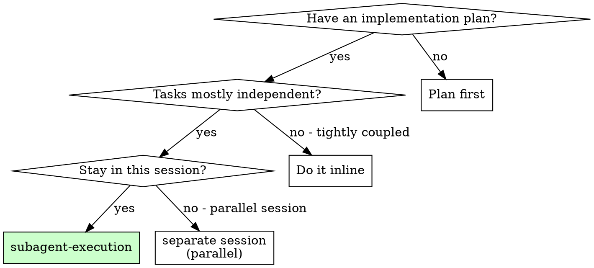

# Subagent Execution

Execute a plan by dispatching a fresh implementer subagent per task, a task-scoped review (spec compliance + code quality) after each, and a broad whole-branch review at the end.

**Core principle:** fresh subagent per task + task review (spec + quality) + broad final review = high quality, fast iteration.

**Why subagents:** each task goes to a fresh subagent with isolated context. You craft exactly the context it needs, so it never inherits your session history and your own context stays free for coordination. Delegate the work, hold the coordination.

**Iron law:**

```
A TASK IS NOT DONE UNTIL ITS REVIEW COMES BACK CLEAN
```

A self-review is not a review. A report without a reviewer verdict is not a task.

**Narration:** between tool calls, narrate at most one short line — the ledger and the tool results carry the record.

**Continuous execution:** do not pause to check in between tasks. "Should I continue?" prompts waste your human partner's time — they asked you to execute the plan, so execute it.

**Rulings, not stalls.** A running plan does not wait on a human. Conflicts, ambiguities, plan defects — decide them. The spec is the binding authority, the plan is its argument, and your judgment settles what neither answers. Record every decision in the ledger: `Ruling: <what> — <why> — <cost if wrong>`. A wrong ruling costs visible rework; a parked session costs their whole day.

## When to use



Delegate when the plan has multiple independent tasks that touch code, or the change is large enough that a fresh, narrow context helps each implementer. For a single small task where delegation overhead exceeds the work, do it inline. For a plan you want to execute in a *parallel* session (not this one), dispatch a separate session instead — same session stays with this skill.

## When to stop (asking)

Only **four** things stop you and require asking:

1. an irreversible or destructive operation
2. a security-sensitive action
3. a side effect outside this worktree that norms say to confirm first (a merge, a push to a shared branch, a publish)
4. a plan so broken that every path forward is a guess

Everything else: rule and continue.

## The process

```dot
digraph process {
  rankdir=LR;
  base [label="Record BASE", shape=box];
  brief [label="Generate brief +\ndispatch implementer", shape=box, style=filled, fillcolor="#ffcccc"];
  report [label="Handle report", shape=diamond];
  pkg [label="Build review\npackage", shape=box];
  review [label="Dispatch task\nreviewer", shape=box, style=filled, fillcolor="#ccffcc"];
  findings [label="Findings?", shape=diamond];
  fix [label="Fix loop\n(≤5 rounds)", shape=box, style=filled, fillcolor="#ffdddd"];
  done [label="Append ledger;\nmark complete", shape=box, style=filled, fillcolor="#ccccff"];
  base -> brief -> report;
  report -> pkg [label="DONE /\nDONE_WITH_CONCERNS"];
  report -> brief [label="NEEDS_CONTEXT /\nBLOCKED (re-dispatch)"];
  pkg -> review -> findings;
  findings -> fix [label="yes"];
  findings -> done [label="clean"];
  fix -> review [label="re-review"];
  fix -> done [label="cap: adjudicate"];
}
```



After all tasks: one broad whole-branch review, one fix wave if needed, then finish.

## Setup

**Worktree first.** Ensure the work happens in an isolated workspace — use [../isolated-workspace/SKILL.md](../isolated-workspace/SKILL.md) to create one or verify the existing one. Never start implementation on main/master without your human partner's explicit consent.

Every plan gets its own work directory of short-lived, git-ignored artifacts:

```
scripts/sdd-workspace <PLAN_FILE>   # prints absolute $WORKSPACE
```

For SDD, `PLAN_FILE` is the change's `docs/skillgrid/changes/<NNN-slug>/tasks.md`
(`task-brief` extracts `## NN-<name>` step sections from it). SDD artifact
basenames (`tasks.md`, `change.md`, …) resolve to the parent `<NNN-slug>` dir.

Artifacts live in `$WORKSPACE`, never in your context:

- Briefs: `$WORKSPACE/task-<N>-brief.md` (SDD steps zero-padded: step 1 → `task-01-brief.md`; always use the path `task-brief` prints, never construct it by hand)
- Reports: `$WORKSPACE/task-<N>-report.md`
- Review packages: `$WORKSPACE/review-<base7>..<head7>.diff`
- Ledger: `$WORKSPACE/progress.md` ← the single source of truth

**Ledger identity and plan-scoping.** The ledger's first line is `# SDD ledger — plan: <plan file path>`. On start:

- If the ledger exists and its first line names *your* plan, resume at the first task not marked `Task <N>: complete`. A task whose last line is a fix round is mid-loop — resume at the next round.
- If the first line names a *different* plan, it is another plan's progress — leave it in place and start your own, fresh.
- `git clean -fdx` destroys the workspace (git-ignored scratch); if that happens, recover from `git log`.

**Conversation memory does not survive compaction.** Controllers that lost their place have re-dispatched *entire completed task sequences* — the single most expensive failure observed. The ledger and `git log` are the recovery record.

Read the plan once, note its context and Global Constraints, and create a todo per task. If the plan names a Spec, read that too — the spec is the authority the plan argues from, and conflicts inside the plan resolve against it. A plan with no reachable spec gets a ledger note saying so — rulings made without one are provisional.

**Pre-flight plan scan (before dispatching Task 1).** Scan the plan once for conflicts, writing down what you checked as you check it:

- tasks that contradict each other or the plan's Global Constraints
- anything the plan explicitly mandates that the review rubric treats as a defect (a test that asserts nothing, verbatim duplication of a logic block)

The output is a **table in the ledger**, not a verdict: one row for every pair of tasks that share a file or interface (what one produces against what the other consumes, and what you found); one row for every task (does its own text agree with itself — tests vs code, files created vs files later touched). "The scan is clean" without those rows is not a scan you ran. Rule on every finding before execution begins — each against the plan text that mandates it — and record each ruling in the ledger. If the scan is clean, proceed without comment.

## Model selection

Use the least powerful model that can handle the role — and **always specify it explicitly** (an omitted model silently inherits the session's most expensive one):

- **Mechanical implementation** (isolated functions, clear spec, 1–2 files): fast, cheap model. Most implementation is mechanical when the plan is well-specified.
- **Integration and judgment** (multi-file, pattern matching, debugging): standard model.
- **Architecture / design / final whole-branch review:** most capable available.
- **Reviews:** scale to the diff's size, complexity, and risk. Floor is mid-tier — cheap models take 2–3× the turns and cost more wall-clock than they save.
- **Fix-loop rounds 4–5:** one tier above the stuck implementer.

## The task loop

**Batch small same-shape work.** Several tasks that each need one identical edit to different files — same constant, same import, same field — are ONE brief to one cheap implementer, reviewed as a single unit. Reserve the per-task loop for work that needs its own judgment or tests.

**Waiting on dispatched subagents.** Never poll a wait interface with short timeouts, and never sit in one silent, open-ended wait either. While you have local work — ledger updates, packaging the next review, reading reports — keep working; child results arrive on their own. When genuinely idle, wait in bounded stretches (five to ten minutes, where your platform allows), and between stretches post one line of status and reconcile your live children: list them, and chase any that finished without reporting. A bounded stretch keeps nearly all of a long wait's efficiency while guaranteeing a stuck or lost child is noticed within minutes, not at the end of the session.

### 1. Dispatch the implementer

- Record `BASE = git rev-parse HEAD` *before* dispatching.
- Generate the brief: `scripts/task-brief <PLAN_FILE> <N>` → `$WORKSPACE/task-<N>-brief.md`. Keep the task text in a file, not pasted through your context.
- Compose the dispatch prompt: (1) one line on where this task sits, (2) the **brief path** as "read this first — your requirements, verbatim", (3) interfaces/decisions from earlier tasks the brief cannot know, (4) your resolution of any ambiguity you saw, (5) the **report path** and a one-line contract ("write your full report there; end with status + commits + one-line test summary + concerns").
- **Carry parked findings forward.** If an earlier task parked a finding in the area this task touches, include a pointer to that ledger entry in the dispatch — the new implementer needs to know the context it is building on.
- **A dispatch prompt describes one task, not the session's history.** One real dispatch was 42k chars, 99% pasted history. A fresh subagent needs its task, the interfaces it touches, and the global constraints. Nothing else.
- **The dispatch carries the no-subagents rule:** the implementer never spawns subagents — not a helper, never a reviewer. Review arrives from you, after the report.
- Record the implementer's agent identity — the fix-loop resume needs it.
- **Never dispatch multiple implementer subagents in parallel** (conflicts).

Template: [references/implementer-prompt.md](references/implementer-prompt.md)

### 2. Handle the report

| Status | Your move |
|---|---|
| **DONE** | **Verify the report's test evidence first** — open the report file and confirm it contains the RED output (failing test before the fix), the GREEN output (passing test after), the command run, and the exit code. A DONE with missing or stale test evidence is a NEEDS_CONTEXT, not a DONE — re-dispatch with the gap named. Only then build the review package and dispatch the task reviewer. |
| **DONE_WITH_CONCERNS** | Read the concerns. Correctness/scope → address before review. Observations → note and proceed. Verify test evidence as above before review. |
| **NEEDS_CONTEXT** | Supply the missing context, re-dispatch. |
| **BLOCKED** | Assess: context gap (supply, same model) / reasoning gap (bigger model) / task too large (split) / plan wrong (rule on it, **ledger the ruling**, re-dispatch carrying the ruling). |

**Never** re-dispatch BLOCKED or NEEDS_CONTEXT on the same model unchanged — if it said it's stuck, something must change. If the implementer asks questions, answer completely and don't rush it into implementation.

### 3. Build the review package

```
scripts/review-package <PLAN_FILE> <BASE> <HEAD> <OUTFILE>
```

The output never enters your context; the reviewer sees commit list + stat + full diff in one file. Use the recorded `BASE` — **never `HEAD~1`**, which silently truncates multi-commit tasks.

### 4. Dispatch the task review

Per-task reviews are task-scoped gates; the broad review happens once, at the end. Never skip the task review, and never accept a report missing either verdict — **spec compliance AND task quality** are both required.

- The reviewer gets three paths (brief, report, review package) plus the global constraints that bind the task.
- **The global-constraints block is its attention lens.** Copy binding requirements *verbatim* from the plan/spec: exact values, formats, stated relationships ("same layout as X", "matches Y"). The template carries process rules; the constraints block is for what *this plan* demands.
- Do not add open-ended directives ("check all uses", "run race tests if useful") without a concrete reason.
- Do not ask a reviewer to re-run tests the implementer already ran — the report carries the evidence.
- Do not pre-judge findings. If your dispatch contains "do not flag", "at most Minor", or "the plan chose", stop: you are pre-judging, usually to spare yourself a fix round.
- **⚠️ Cannot verify from diff** items (requirements in unchanged code or spanning tasks) do not block the rest of the review, but you must resolve each yourself before marking the task complete — you hold the cross-task context the reviewer lacks. A confirmed real gap is a failed spec review → fix loop.

Template: [references/task-reviewer-prompt.md](references/task-reviewer-prompt.md)

### 5. The fix loop

Triggers on **Spec ❌**, any **Critical** or **Important** finding, or a confirmed ⚠️ gap.

Two routes leave immediately:

- **Minor findings** do not enter the loop. Record them as you go (`Task <N>: minor (deferred): <one-liner>`) and point the final review at the list so it can triage. A roll-up nobody reads is a silent discard.
- **Plan-mandated findings** (conflicting with the plan's text) are yours to rule on: weigh against the plan, decide with the spec as binding authority, ledger the ruling before acting. Never dismiss because the plan mandates it; never dispatch a fix that contradicts the plan without a recorded ruling.

A **fix round = one fix dispatch + one scoped re-review**. Five rounds maximum.

**Rounds 1–3 — resume the original implementer** with the open findings verbatim. Its context is intact. If your harness cannot message a live subagent, dispatch fresh carrying the brief path, report path, and findings — the report file is the persistent memory either way.

**Rounds 4–5 — dispatch a fresh implementer on a more capable model** (per Model Selection) with brief, report, open findings, and: "A prior implementer attempted this N times; you own it now." Three resumes survived usually means the implementer cannot see its own problem — fresh eyes plus a capability bump in one move.

**Every round:** the implementer fixes, **re-runs the covering tests, appends its fix report to the same report file**, and returns the short contract. Confirm the fix report contains covering tests + command + output before re-dispatching the reviewer. Name the covering test files — a one-line fix does not need the whole suite.

**The re-review is scoped.** Package over `FIX_BASE..HEAD` (where `FIX_BASE` is the head the previous review saw), dispatch [references/re-review-prompt.md](references/re-review-prompt.md) with the findings list, brief, report, and diff. The re-reviewer verdicts each finding `ADDRESSED`/`NOT ADDRESSED` and flags **new breakage in the fix diff only**. Out-of-scope observations → ledger as deferred minors; they never extend the loop.

**After each round,** append to the ledger:
`Task <N>: fix round <R>/5 (<X> addressed, <Y> open — <one-liners>; commits <a7>..<b7>)`

**Never fix findings yourself in the controller session** — your context stays clean, and a controller fix skips the review you just ran.

**The breaker.** When round 5's re-review still leaves findings open, stop dispatching. Adjudicate each open finding yourself (you hold the plan and cross-task context):

- **Reviewer wrong, or controllable:** park — `Task <N>: parked — <finding> — Ruling: <why the code stands>`.
- **Real, but nothing downstream builds on it:** park with a ruling that it is real and deferred.
- **Real and load-bearing** (a later task builds on it, or it exposes a plan defect): rule on the smallest change that unblocks dependents, ledger it, carry it into the next task's dispatch.

Adjudicate **only at the cap** — adjudicating earlier is pre-judging with a different name. Every adjudication is a ledger entry; a silent discard is forbidden.

### 6. Complete the task

When the review is clean — or every open finding is parked with a ruling at the cap:

- `Task <N>: complete (commits <base7>..<head7>, review clean)`
- `Task <N>: complete (commits <base7>..<head7>, <K> parked)` after a tripped breaker

Then move on.

## Final review

The broad whole-branch review gets a package too:

```
scripts/review-package <PLAN_FILE> <MERGE_BASE> <HEAD>
```

`MERGE_BASE` is where the branch started (e.g. `git merge-base main HEAD`). Dispatch on the **most capable** model. The reviewer reads one file instead of re-deriving the branch diff. **Point the reviewer at the ledger's deferred-minor and parked lines** so it can triage which must be fixed before merge.

If findings: dispatch **ONE** fix subagent with the complete list (per-finding fixers each rebuild context and re-run suites — one real final-review fix wave cost more than all its tasks combined). Then one scoped re-review over the same fix range, and adjudicate residuals with the breaker's four rules. **There is no second fix wave** — residual load-bearing findings surface to your human partner before the finish.

## Finish

1. **Surface the rulings.** Before deleting `$WORKSPACE`, collect every ledger line containing `Ruling:` and present them in order, each with its cost-if-wrong. That list is the only place the decisions you made on your human's behalf reach them. A ruling that dies with the workspace is a decision made in secret.
2. **Clean up.** `rm -rf <this plan's workspace>`. Leave sibling plans' directories alone.
3. **Persist the ledger.** `mem_save(title: "sdd/<NNN-slug>/apply-progress", topic_key: "sdd/<NNN-slug>/apply-progress", type: "architecture", scope: "project", content: <full ledger markdown>)`. See [../_shared/conventions/mnemonic-memory.md](../_shared/conventions/mnemonic-memory.md).
4. **Hand off.** Branch / PR / merge is a separate decision — do **not** push or merge from this skill unless the user explicitly asked. See [../_shared/conventions/commits.md](../_shared/conventions/commits.md).

## Red flags

| Excuse | Reality |
|---|---|
| "Close enough, one more fix will land it" | The loop has a cap. You adjudicate at the cap, not before. |
| "I'll fix the finding myself, dispatching is overhead" | Controller fixes skip review and pollute your context. Resume the implementer. |
| "The reviewer will find something new anyway, skip the re-review" | A scoped re-review verifies the specific finding; it cannot wander. Skipping it is how unfixed regressions land. |
| "The plan says this IS the requirement, the reviewer is wrong" | Plan-mandated findings still get an explicit ledger ruling. You do not silently override a reviewer. |
| "The implementer spawned its own reviewer — extra assurance" | A duplicate seat for the same diff at full cost; its verdict counts for nothing. The task review is the gate. |
| "Let me ask my human partner if I should keep going" | A running plan does not wait on a human. Decide, ledger the ruling, keep going — unless one of the four stops applies. |
| "I'll do task 2 first, it's easier" | The task loop is ordered. Reordering breaks the review and the ledger. |
| "I'll use `HEAD~1` for the diff, it's faster" | A multi-commit task silently loses commits. Use the recorded `BASE`. |
| "I'll paste the brief into the prompt, saves a step" | A pasted brief stays resident in your context forever. Use the brief file. |
| "I'll skip the re-review for this small fix" | A fix round with no re-review is an unreviewed fix. |
| "The implementer said DONE and the tests passed, I'll trust it" | Open the report file. No RED+GREEN output, no command, no exit code → it's a NEEDS_CONTEXT, not a DONE. The reviewer is told not to re-run tests — the report *is* the test evidence. |

## Example workflow

[references/example-workflow.md](references/example-workflow.md) — a full two-task run: clean review, then a Spec ❌ with one fix round, then the final review.

## Parallel investigation (folded from dispatching-parallel-agents)

Investigation-only fan-out. Implementers in the task loop above stay sequential — never parallel implementers.

```
Multiple unrelated work items?
├── no  → single agent handles all
└── yes → Are they independent (root-cause level)?
         ├── no  (related; fixing one may fix others) → single agent investigates together
         └── yes → Can they run truly in parallel (no shared state, no shared files)?
                  ├── no  (shared files, shared resource, single Mnemonic topic_key) → sequential
                  └── yes → PARALLEL DISPATCH
```

Use when 2+ independent domains (different test files, subsystems, root causes) with no shared files/state/`topic_key`. Don't use when failures are related, full-system context is needed, agents would edit the same files or write the same `topic_key` (second upsert silently overwrites the first), or debugging is still exploratory.

Each agent gets one domain: specific scope, clear goal, must-not-change constraints, structured return (root cause / changes / blockers), and a unique `topic_key` (`sdd/<NNN-slug>/parallel/<domain>`). **Mechanical rule:** all parallel dispatches in a single response (multiple `task` calls = parallel; one per response = sequential). On return: read summaries, check conflicts, run full suite, spot-check one acceptance scenario per agent.

## References

- [references/implementer-prompt.md](references/implementer-prompt.md) — implementer dispatch template
- [references/task-reviewer-prompt.md](references/task-reviewer-prompt.md) — task-scoped reviewer template (spec + quality + calibration + output)
- [references/re-review-prompt.md](references/re-review-prompt.md) — scoped re-review template (addressee, new breakage, out-of-scope)
- [references/example-workflow.md](references/example-workflow.md) — full worked example
- [scripts/sdd-workspace](scripts/sdd-workspace) — resolves + creates the per-plan scratch dir
- [scripts/task-brief](scripts/task-brief) — extracts one task's text to `$WORKSPACE/task-<N>-brief.md`
- [scripts/review-package](scripts/review-package) — writes commit list + stat + diff for a reviewer
- [../isolated-workspace/SKILL.md](../isolated-workspace/SKILL.md) — optional work isolation
