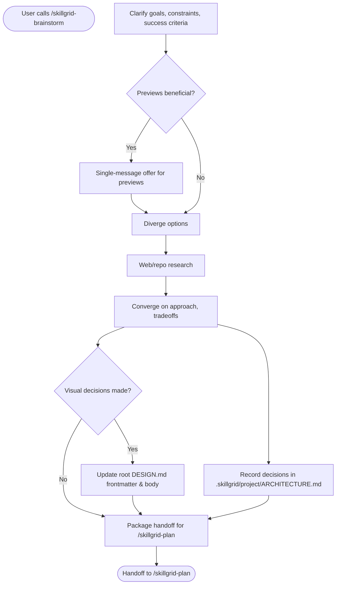
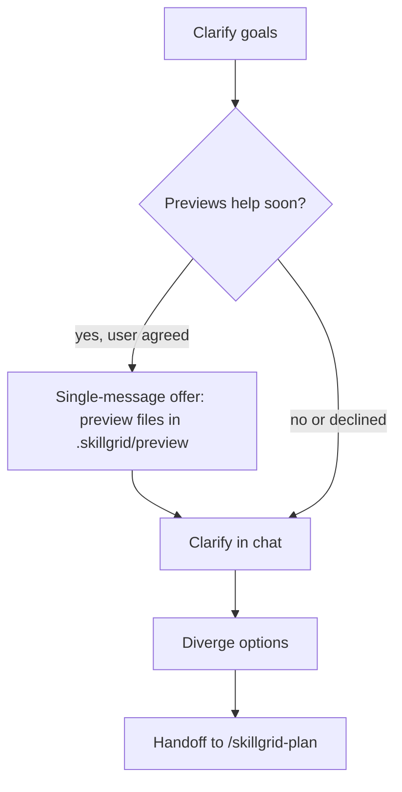

<objective>

You are executing **`/skillgrid-brainstorm`** (DEFINE phase) for the Skillgrid workflow.

Turn ideas into a **reviewable direction** through collaborative dialogue: understand context, ask in a disciplined way, explore options, then hand off to planning—without implementing.

</objective>

<process>

## Flow



## Implementation gate

Do **not** write production code, scaffold apps, or drive **`/skillgrid-apply`** from this command. Brainstorming ends in a **clear enough** problem statement and preferred approach for **`/skillgrid-plan`** (use **`/skillgrid-explore`** first if repo or OpenSpec context is still thin).

## Questioning discipline

Use **one question at a time**, **multiple choice when it helps**, **scope before detail**, and **alternatives with tradeoffs** before locking direction—see the table and **Preview picks** below. Stay inside Skillgrid phases; hand off with a clear problem statement for **`/skillgrid-plan`**.

| Practice | What to do |
|----------|------------|
| **One question per message** | Avoid bundling multiple unrelated questions in one turn. If a topic needs depth, split into a sequence of single questions. |
| **Multiple choice when it fits** | Prefer A/B/C (or similar) when it narrows intent faster than open-ended text; use open-ended when exploration is the point. |
| **Context before grilling** | When the idea touches the codebase, skim relevant files, docs, or recent commits before detailed questions so questions are grounded. |
| **Scope check early** | If the request bundles several independent subsystems (e.g. chat + billing + analytics in one breath), **name that** and help **decompose** before refining low-level details. Brainstorm the **first slice** here; other slices get their own plan cycles later. |
| **“Too simple” is still worth clarifying** | Short or “obvious” ideas still need explicit goals, constraints, and success criteria—keep the design proportionate (a few sentences vs a longer outline), but don’t skip alignment. |
| **Alternatives before commitment** | Before settling, surface **2–3 approaches** with tradeoffs and a recommendation (ties to **Diverge** / **Converge** steps). |
| **Incremental buy-in** | When you present a emerging design, chunk it by section (architecture, data flow, errors, testing mindset) and **check** “does this still match what you want?” as you go; revise if not. |
| **Previews and selection** | When **seeing** beats **reading** (layouts, side-by-sides, diagrammatic structure), use **Preview picks** and **`.skillgrid/preview/`** so the user can **choose** A/B/variants. Not every UI-related question is visual—scope and meaning questions can stay in chat. See **Preview picks**. |

## Preview picks

**Goal:** The user can **select** from previews (options, mockups, diagrams) instead of only free-text answers.

1. **Offer once (standalone message only)**  
   If upcoming questions are likely to benefit from **file-based previews** (e.g. HTML/MD in **`.skillgrid/preview/`**), offer that workflow **in a message that contains nothing else**—no clarifying questions in the same turn. Mention that previews can be **more token- or time-heavy**; the user may decline and stay text-only.

2. **Per-question**  
   After they accept, decide **per question** whether a preview file helps. Test: *Would this be clearer as something shown (layout, two-up comparison, diagram) than as words only?* Conceptual questions (*what does “simple” mean here?*) stay in chat even if the topic is UI.

3. **Where artifacts live**  
   - **Previews:** **`.skillgrid/preview/`** — markdown and/or HTML the user can open in the editor or a browser. Prefer stable names, e.g. `topic-YYYY-MM-DD.html` or a short slug.  
   - **Scaffold:** run **`.skillgrid/scripts/preview.sh`** (from repo root) to create a non-destructive HTML or MD stub under **`.skillgrid/preview/`** (see script `--help` / header). The agent can also **`Write`** files there without the script.  
   - **Commit policy:** the script is part of the tree; individual preview files may be **gitignored** in **`.skillgrid/preview/.gitignore`** in this repo—respect that; do not require committing churn.

4. **IDE-agnostic**  
   Not every environment has an in-editor browser, canvas, or browser MCP. **Do not** require a feature the user’s IDE lacks. Order of fallbacks: **open preview file** (editor or `file://` in a normal browser) → **Mermaid** or labeled **A/B/C in chat** → short **text** descriptions. Rich tooling (embedded browser, MCP) is optional when present.

5. **Selection**  
   The user’s reply can name an option (*A*, *B*, a label, or a short edit request). Do not treat silence as pick until they answer.

**Optional process sketch** (illustrates preview branch; terminal handoff is still **`/skillgrid-plan`**):



## Steps

1. **Clarify** — Follow **Questioning discipline** and **Preview picks** until goals, constraints, and success criteria are explicit.
   - **User flows** – When the feature involves a user (human or API client), ask: *“What are the 2–3 key steps the user takes to achieve their goal? Can we sketch a quick journey?”*  
     * If the user agrees, draft a Mermaid `journey` diagram in chat for validation.  
     * If the user prefers text stories, capture those.  
     * The resulting diagram can be saved into the PRD later by `/skillgrid-plan`.
2. **Diverge** — List options, alternatives, and tradeoffs; keep judgment light until the space is wide enough.
3. **Research** — Use the open web and repo search for prior art; use **Context7** (or your docs MCP) when the idea depends on a specific framework or library.
4. **Converge** — Rank approaches; state assumptions, risks, and tradeoffs explicitly before locking direction.
5. **Document architectural decisions** — After converge, write the session’s architectural choices to **`.skillgrid/project/ARCHITECTURE.md`**.  
   - If the file doesn’t exist, create it using the template from **`/skillgrid-init`**.  
   - Add a new row to the **Design decisions** table for each decision:

     | Decision | Choice | Rationale |
     | -------- | ------ | --------- |
     | …        | …      | …         |

   - For more than a table, use the **## 3. <Domain-specific sections>** (e.g. “Data flow”, “Error handling”) to record diagrams or prose if the brainstorm produced them.  
   - Keep it tight: one‑line decisions are enough; do not rewrite the whole architecture doc.  
   - If the architecture doc already exists and the brainstorm reaffirms existing decisions, do nothing – just note “architecture unchanged” in the completion report.
5b. **Update DESIGN.md (if visual decisions were made)** — If the session settled on concrete design tokens, component styles, or layout patterns, record them in the root **`DESIGN.md`** so later phases (Apply, Review) have a visual reference.

   - **Trigger:** Did the brainstorm pick specific colors, fonts, rounding, spacing, or component behaviors (buttons, inputs, cards)? Did the user select or approve a preview that encoded those?  
   - **If yes:**  
     * Read `DESIGN.md` if it exists; otherwise create it using the template from **`/skillgrid-init`**.  
     * Update the YAML front matter with the chosen tokens (`colors`, `typography`, `rounded`, etc.).  
     * Update the body section(s) that were decided — e.g. **`## Colors`** values, **`## Typography`** choices, **`## Components`** guidelines.  
     * If a preview illustrated a layout or component, cross‑reference the preview file under **`## Design sources`** (e.g., `Preview: .skillgrid/preview/dashboard-layout-2026-04-25.html`).  
   - **If no visual decisions were made** (only architecture, data flow, etc.), do nothing and note in the completion report: “No design tokens chosen — DESIGN.md unchanged.”
6. **Validate** — When breadth or citations matter, run a deeper multi-source pass with explicit sources.
7. **Refine** — Use divergent then convergent structure to sharpen a vague idea into a defensible direction.
8. **OpenSpec `config.yaml`** — If **`openspec/`** exists on disk, read **`openspec/config.yaml`**. After **Converge** (or at **Handoff**), **merge** session-stable context into the file: update **`context`** with goals, constraints, chosen direction, and stack implications from the brainstorm; add or adjust **`rules`** if the session set norms for artifacts (**proposal**, **specs**, **design**, **tasks**). If the file is missing, create it from **OpenSpec project config (template)** below (same as **`/skillgrid-init`**). Keep **`context`** under **50KB**; keep a valid **`schema`** (default `spec-driven` unless the project uses another). **Merge**, do not clobber: if the file is already rich, show a short diff and confirm before replacing large sections. Skip this step if the project has no **`openspec/`** (e.g. Engram-only persistence).
8. **Handoff to `/skillgrid-plan`** — Package the session’s output into a crisp brief that the planner can ingest without rereading the whole chat.

   - **Problem statement** — One sentence: what problem are we solving, and for whom?  
   - **Chosen approach** — The preferred direction (from **Converge**), with 2–3 bullets on key tradeoffs or assumptions.  
   - **Design decisions** — Reference the updates you made to **`.skillgrid/project/ARCHITECTURE.md`** (e.g. “Added data‑flow decision: enforce at‑least‑once delivery”). If no decisions were written, state that explicitly.  
   - **Previews** — List any file paths under **`.skillgrid/preview/`** that capture the agreed visual or structural options (with short descriptions).  
   - **Open questions** — Any lingering unknowns that `/skillgrid-plan` should treat as assumptions or resolve with a spike.  
   - **Suggested PRD title and slug** — Provide a candidate `PRD<NN>_<slug>.md` name to jumpstart `/skillgrid-plan` (the planner can accept or override).  

   The format is free text; keep it brief—a paragraph plus bullets. The goal is for the planner to open **`/skillgrid-plan`** with this summary and immediately know what to build, what’s in scope, and where the architectural risks are.

## OpenSpec project config (template)

Same default body for **`openspec/config.yaml`** as **`/skillgrid-init`**. Use when creating the file or as the merge target for **`context`** / **`rules`**. Replace `<placeholders>` with repo and session facts. Fields: **`schema`** (required), **`context`** (optional), **`rules`** (optional, keyed by artifact id).

```yaml
# openspec/config.yaml — Skillgrid default; merge with existing file if present
schema: spec-driven

context: |
  Project: <short name — purpose in one line>
  Stack: <languages, frameworks, package manager>
  Layout: <e.g. src/, app/, packages/>
  Testing: <runner; where tests live>
  Skillgrid: PRDs in .skillgrid/prd/; persistence per AGENTS.md (hybrid: openspec/ + Engram when used)
  Conventions: <AGENTS.md / team rules — keep brief>

rules:
  proposal:
    - Tie to the PRD under .skillgrid/prd/ when one exists; name scope and non-goals.
  specs:
    - Use clear requirements; scenarios (Given/When/Then) when they help acceptance.
  design:
    - Boundaries, data flow, migration or rollback when relevant.
  tasks:
    - Small, verifiable checkboxes; trace to specs and PRD execution order.
```

## Optional: IDE personas

For a **dedicated research subagent** that leans on hub MCPs (**Exa**, **Firecrawl**, **DeepWiki**, **Context7**) and delivers a cited memo, spawn agent **`skillgrid-researcher`** (definition: **`.cursor/agents/skillgrid-researcher.md`**).

## Notes

- Inspect the repo with tools when brainstorming touches implementation reality.
- **Hybrid persistence** (`openspec/` + Engram) is the default; align with **`/skillgrid-init`** if the repo layout is unclear.

## Anti-patterns

- **“This is too simple to need design”** – Even small features need explicit goals, constraints, and success criteria.
- **Multi‑question messages** – Never bundle unrelated questions in one turn; one clear question at a time.
- **Skipping divergence** – Don’t lock onto the first approach; always produce at least two alternatives with tradeoffs.
- **Forgetting architecture decisions** – Never end a brainstorm that chose patterns or technologies without recording them in `.skillgrid/project/ARCHITECTURE.md`.
- **Previews without an offer** – Don’t create preview files without first asking the user if they want the visual workflow.

## Completion report (required)

End with a **Session wrap-up** the user can scan:

1. **What I did** — Bullets: topics covered, options compared, any **`.skillgrid/preview/`** or **`openspec/config.yaml`** updates, and the agreed direction in one line.
2. **Token / usage** — If the product shows **input/output tokens**, **context used**, or **session cost** for this turn, report it. If not available, state **`Token usage: not shown in this environment`** (do not guess).
3. **Suggested next command** — **`/skillgrid-plan`** to capture a PRD and OpenSpec change (or **`/skillgrid-explore`** if repo reality is still unknown).

</process>
