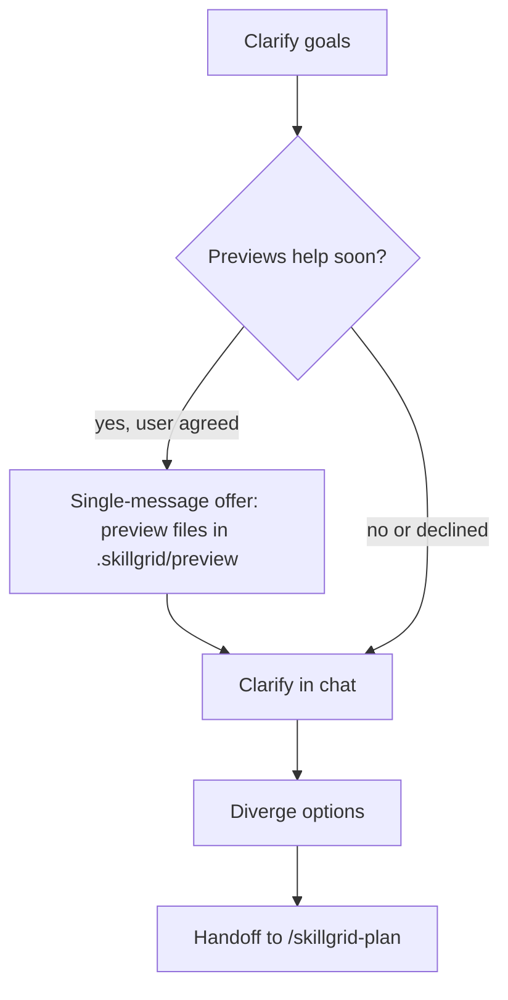

<objective>

You are executing **`/skillgrid-brainstorm`** (DEFINE phase) for the Skillgrid workflow.

Turn ideas into a **reviewable direction** through collaborative dialogue: understand context, ask in a disciplined way, explore options, then hand off to planning—without implementing.

</objective>

<process>

## Implementation gate

Do **not** write production code, scaffold apps, or drive **`/skillgrid-apply`** from this command. Brainstorming ends in a **clear enough** problem statement and preferred approach for **`/skillgrid-plan`** (use **`/skillgrid-explore`** first if repo or OpenSpec context is still thin).

## Questioning discipline

Use **one question at a time**, **multiple choice when it helps**, **scope before detail**, and **alternatives with tradeoffs** before locking direction—see the table and **Preview picks** below. Stay inside Skillgrid phases and the skills at the end of this file.

| Practice | What to do |
|----------|------------|
| **One question per message** | Avoid bundling multiple unrelated questions in one turn. If a topic needs depth, split into a sequence of single questions. |
| **Multiple choice when it fits** | Prefer A/B/C (or similar) when it narrows intent faster than open-ended text; use open-ended when exploration is the point. |
| **Context before grilling** | When the idea touches the codebase, skim relevant files, docs, or recent commits before detailed questions so questions are grounded. |
| **Scope check early** | If the request bundles several independent subsystems (e.g. chat + billing + analytics in one breath), **name that** and help **decompose** before refining low-level details. Brainstorm the **first slice** here; other slices get their own plan cycles later. |
| **“Too simple” is still worth clarifying** | Short or “obvious” ideas still need explicit goals, constraints, and success criteria—keep the design proportionate (a few sentences vs a longer outline), but don’t skip alignment. |
| **Alternatives before commitment** | Before settling, surface **2–3 approaches** with tradeoffs and a recommendation (ties to **Diverge** / **Converge** steps). |
| **Incremental buy-in** | When you present a emerging design, chunk it by section (architecture, data flow, errors, testing mindset) and **check** “does this still match what you want?” as you go; revise if not. |
| **Previews and selection** | When **seeing** beats **reading** (layouts, side-by-sides, diagrammatic structure), use **Preview picks** and **`.skillgrid/preview/`** so the user can **choose** A/B/variants. Not every UI-related question is visual—scope and meaning questions can stay in chat. See **Preview picks**. |

## Preview picks

**Goal:** The user can **select** from previews (options, mockups, diagrams) instead of only free-text answers.

1. **Offer once (standalone message only)**  
   If upcoming questions are likely to benefit from **file-based previews** (e.g. HTML/MD in **`.skillgrid/preview/`**), offer that workflow **in a message that contains nothing else**—no clarifying questions in the same turn. Mention that previews can be **more token- or time-heavy**; the user may decline and stay text-only.

2. **Per-question**  
   After they accept, decide **per question** whether a preview file helps. Test: *Would this be clearer as something shown (layout, two-up comparison, diagram) than as words only?* Conceptual questions (*what does “simple” mean here?*) stay in chat even if the topic is UI.

3. **Where artifacts live**  
   - **Previews:** **`.skillgrid/preview/`** — markdown and/or HTML the user can open in the editor or a browser. Prefer stable names, e.g. `topic-YYYY-MM-DD.html` or a short slug.  
   - **Scaffold:** run **`.skillgrid/scripts/preview.sh`** (from repo root) to create a non-destructive HTML or MD stub under **`.skillgrid/preview/`** (see script `--help` / header). The agent can also **`Write`** files there without the script.  
   - **Commit policy:** the script is part of the tree; individual preview files may be **gitignored** in **`.skillgrid/preview/.gitignore`** in this repo—respect that; do not require committing churn.

4. **IDE-agnostic**  
   Not every environment has an in-editor browser, canvas, or browser MCP. **Do not** require a feature the user’s IDE lacks. Order of fallbacks: **open preview file** (editor or `file://` in a normal browser) → **Mermaid** or labeled **A/B/C in chat** → short **text** descriptions. Rich tooling (embedded browser, MCP) is optional when present.

5. **Selection**  
   The user’s reply can name an option (*A*, *B*, a label, or a short edit request). Do not treat silence as pick until they answer.

**Optional process sketch** (illustrates preview branch; terminal handoff is still **`/skillgrid-plan`**):

## Steps

1. **Clarify** — Follow **Questioning discipline** and **Preview picks** until goals, constraints, and success criteria are explicit.
2. **Diverge** — List options, alternatives, and tradeoffs; keep judgment light until the space is wide enough.
3. **Research** — Use `search-first` and the open web for prior art; use `documentation-lookup` (Context7) when the idea depends on a specific framework or library.
4. **Converge** — Rank approaches; state assumptions and risks (see `karpathy-guidelines`).
5. **Validate** — Use `deep-research` when external evidence or breadth should inform the choice.
6. **Refine** — Use `idea-refine` (divergent/convergent structure) to sharpen a vague idea into a defensible direction.
7. **Handoff** — Output should feed **`/skillgrid-plan`**, not a full locked spec. 

## Skills to read and follow

- `.agents/skills/karpathy-guidelines/SKILL.md` — surface tradeoffs and alternatives before locking direction.
- `.agents/skills/search-first/SKILL.md` — research tools and patterns before building.
- `.agents/skills/documentation-lookup/SKILL.md` — authoritative library/framework docs via Context7 MCP.
- `.agents/skills/deep-research/SKILL.md` — validate assumptions and gather evidence.
- `.agents/skills/idea-refine/SKILL.md` — structured ideation to sharpen a vague idea.

## Optional: IDE personas

For a **dedicated research subagent** that leans on hub MCPs (**Exa**, **Firecrawl**, **DeepWiki**, **Context7**) and delivers a cited memo, spawn **`skillgrid-researcher`** ([`.cursor/agents/skillgrid-researcher.md`](../../.cursor/agents/skillgrid-researcher.md)).

## Notes

- Inspect the repo with tools when brainstorming touches implementation reality.
- If OpenSpec or SDD modes are unclear, ask once, then align with existing `openspec/` or repo conventions.

</process>
