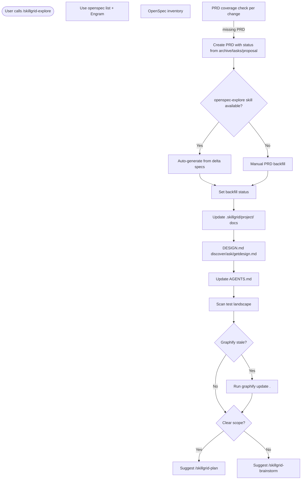

<objective>

You are executing **`/skillgrid-explore`** (DEFINE phase) for the Skillgrid workflow.

</objective>

<process>

## Flow



## Stance: explore, do not implement

**Explore mode is for thinking, not implementing.** You may read files, search code, and investigate the codebase, but you must **not** write application code or ship features. If the user asks you to implement something, remind them to leave explore mode and use **`/skillgrid-plan`** (or a later build phase). You **may** create or edit planning artifacts (PRDs, OpenSpec `proposal.md` / `design.md` text under `openspec/changes/`, ADRs) when that is capturing thinking—not production code.

**This is a stance, not a fixed script** — there is no mandatory sequence. Be curious, open-ended, patient, and grounded in the real repo. Use diagrams when they help. Do not auto-capture: offer to save insights, then let the user decide.

---

## Steps

1. **Hybrid persistence** — Use **`openspec list` / on-disk `openspec/`** as the file inventory, **and** offer to persist important decisions to **Engram** with a stable `topic_key` (see **`/skillgrid-init`**) so context survives compactions. If `openspec/` is still missing, align with init: bootstrap the tree, then run the steps below.

2. **OpenSpec inventory** — If the project uses OpenSpec and the CLI is on `PATH`, from the repository root run:

   ```bash
   openspec list --json
   ```

   This surfaces active changes, names, and status. If the CLI is missing or the command fails, still inspect **`openspec/changes/`** and **`openspec/specs/`** (if present) and summarize what exists. If the project uses `openspec list` without `--json`, that is acceptable; prefer `--json` when available for machine-readable status.

3. **PRD coverage for existing changes** — For each change surfaced by `openspec list` (or each directory under `openspec/changes/<change-id>/` when you inventoried manually), confirm there is a **PRD** that names that change. **Canonical path:** **`.skillgrid/prd/PRD<NN>_<slug>.md`** (two-digit **`<NN>`** = execution order). **First**, glob **`.skillgrid/prd/PRD*.md`** (and root `prd/PRD*.md` only if migrating legacy), **sort by `<NN>`**, and read **`.skillgrid/prd/INDEX.md`**. The PRD’s title block or body should point at the change path (e.g. `openspec/changes/<id>/`). **If execution order of open work is wrong**, renumber files (`PRD01_…` …) and update **`.skillgrid/prd/INDEX.md`**, cross-links, and any Engram or OpenSpec notes (same rules as **`/skillgrid-plan`**). **If a change has no PRD**, create one under **`.skillgrid/prd/`** using the **PRD template** below and assign the next appropriate `<NN>`.

   - **Backfill status (required):** When creating a PRD for an existing OpenSpec change, inspect the change directory to set the initial `Status:` field in the PRD title block. Use the following rules — they precede the normal lifecycle table and ensure every PRD has a correct status from the moment it is created:
     * If the change directory is under **`openspec/changes/archive/`** → `done`
     * Else if a **`tasks.md`** exists and has at least **one completed checkbox** (`- [x]`) → `inprogress`
     * Else if only a **`proposal.md`** (or other planning files) exists but no tasks or no completed tasks → `draft`
     * (If the change has no structured artifacts, treat it as a proposal-only scenario → `draft`)
   - After setting the status, continue with the rest of the PRD creation steps (numbering, INDEX.md update, cross-links). **Do not** create new PRD files at repo root `prd/`. `docs/PRD/` may mirror; keep numbering consistent with **`.skillgrid/prd/`**.

3a. **Auto‑generate with openspec‑explore skill (optional)** — If the skill `openspec-explore` is available (check `.cursor/skills/`, `.kilo/skills/`, `.opencode/skills/`, `.agents/skills/`), offer to run it against a specific change. When invoked, call the skill with the change‑id and the canonical PRD path (adapt to your actual skill interface; it may be a sub‑agent prompt or a tool call).

   The skill should:
   - Extract requirements from existing OpenSpec delta specs into a populated PRD.
   - Or, if a PRD already exists, compare it against the OpenSpec change and flag gaps.
   - Optionally, generate an initial `tasks.md` skeleton from spec requirements if it is missing (it can be refined later with **`/skillgrid-breakdown`**).

   After the skill runs, verify its output: ensure the PRD `Status` is set according to the backfill rules in step 3. If the skill is not installed, continue with the manual backfill in step 3.

4. **Read existing change artifacts in context** — If the user names a change or one is relevant:

   - Read `openspec/changes/<name>/proposal.md`, `design.md`, `tasks.md`, and delta specs as needed.
   - Reference them in conversation; offer to capture new decisions in the right file when the user wants that recorded.

5. **Project docs (canonical)** — Create or refresh **`.skillgrid/project/ARCHITECTURE.md`**, **`STRUCTURE.md`**, and **`PROJECT.md`** using the templates in **`/skillgrid-init`**. Also process the design document below.

5a. **DESIGN.md** — discover, extract, or ask

   **Goal:** Ensure a populated root **`DESIGN.md`** exists for every project. This file follows the [Google Stitch DESIGN.md format](https://stitch.withgoogle.com/docs/design-md/format/): an optional YAML front matter with machine-readable tokens (`colors`, `typography`, `rounded`, `spacing`, `components`) and a markdown body with human-readable rationale.

   **Inspiration library:** If the user wants to adopt a known brand aesthetic, point them to **[getdesign.md](https://getdesign.md)** — a curated collection of 69+ DESIGN.md files (Stripe, Notion, Linear, Apple, Tesla, etc.). They can browse, pick a reference, and either copy the file directly or run:

```bash
npx getdesign@latest add <brand-slug>   # e.g. stripe, notion, linear
```

This drops a ready-made DESIGN.md into the project root. If the user takes this path, skip the rest of step 5a (the file is already populated) and just note it in the completion report.

#### Auto-detection (brownfield)

Scan the codebase for design tokens. Run these checks in parallel where possible:

| Source | What to extract | How |
|--------|----------------|-----|
| `tailwind.config.*` | `theme.colors`, `theme.fontFamily`, `theme.fontSize`, `theme.borderRadius` | Read and map to DESIGN.md token names |
| CSS custom properties (`:root` block, `theme.css`, `globals.css`) | `--color-*`, `--font-*`, `--radius-*` | Extract hex values and font stacks |
| `Theme.ts` / `theme.ts` / `DesignSystem.ts` | Exported colour objects, typography scales, spacing | Map object keys → token names |
| `app.json` / `config/design.*` | Any structured design config | Adapt to DESIGN.md schema |
| Figma links in README or AGENTS.md | URL references | Note under `## Design sources` in the body; do not scrape |

**Mapping rules:**

- Tailwind `colors.primary` → `colors.primary` in YAML front matter
- CSS `--color-primary` → `colors.primary`
- Tailwind `borderRadius.md` → `rounded.md`
- If multiple shades exist (e.g. `primary.500`, `primary.700`), pick the middle weight as `primary` and note the scale under `## Colors` in the body.

#### Populate or create DESIGN.md

If root `DESIGN.md` already exists (from init), update it with discovered tokens. Merge intelligently: detected values override empty placeholders but **never** overwrite user-authored values without asking.

If no `DESIGN.md` exists, scaffold one from the **DESIGN.md template** below, filling every slot you can from auto-detection. Leave undetected values as empty strings (`""`).

#### Ask the user (when detection is incomplete)

After auto-detection, present a **compact summary** of what was found and what’s missing. Ask targeted questions — do not ask the user to fill in the entire file themselves. Example:

> **Design tokens detected:**
> - Colors: primary `#2665fd`, surface `#0b1326` ✅
> - Typography: Inter (body), 16px ✅
> - Rounded: 8px ✅
> - Missing: error color, heading font, spacing scale
>
> **Two quick questions:**
> 1. What hex value should I use for **error/destructive** colour? (default: `#ffb4ab`)
> 2. Do you have a preferred **heading font** or should I keep Inter for everything?

If the user defers all design decisions, leave the empty slots and note in the body: *“To be refined during `/skillgrid-brainstorm`.”*

If the user has **no preferences at all**, suggest picking a reference from **[getdesign.md](https://getdesign.md)** that matches their product category (e.g. Stripe for fintech, Linear for dev tools, Notion for productivity).

#### DESIGN.md template (canonical)

```markdown
---
name: <Project Name>
colors:
  primary: ""
  secondary: ""
  surface: ""
  on-surface: ""
  error: ""
typography:
  body-md:
    fontFamily: ""
    fontSize: ""
    fontWeight: ""
  h1:
    fontFamily: ""
    fontSize: ""
    fontWeight: ""
rounded:
  md: ""
---

# Design System

## Overview
<One-line description of visual direction. If unknown: "To be refined during brainstorming.">

## Design sources
<Link to Figma, getdesign.md reference, brand guidelines, or "None — defined in this file.">

## Colors
- **Primary** (`primary`): CTAs, active states, key interactive elements
- **Secondary** (`secondary`): Supporting UI, chips, secondary actions
- **Surface** (`surface`): Page backgrounds
- **On-surface** (`on-surface`): Primary text on surface backgrounds
- **Error** (`error`): Validation errors, destructive actions

## Typography
- **Headlines** (h1): <font, weight, size — or "To be defined">
- **Body** (body-md): <font, weight, size — or "To be defined">
- **Labels**: <font, weight, size — or "To be defined">

## Spacing & Layout
<To be defined during brainstorming — or describe scale if detected>

## Components
- **Buttons**: <shape, fill, hover behaviour — or "To be defined">
- **Inputs**: <border, background, focus ring — or "To be defined">
- **Cards**: <elevation, border, padding — or "To be defined">

## Do's and Don'ts
- Do …
- Don't …
```

6. **AGENTS.md** — Create or refresh at repo root so agent behavior and project rules are current.

7. **Documentation** — When recording exploration outcomes, document the *why* (ADRs, API docs, inline standards) per team norms.

8. **Code discovery** — Use **`graphify-out/`** and **`AGENTS.md`** for orientation, then **`rg` / IDE search** and targeted file reads. Optional: deeper external research when the question needs off-repo evidence (document sources).
   - **User flows** — Search for existing user‑flow documentation (flowcharts in `docs/`, `README`, Figma links, even inline Mermaid diagrams). If found, reference them in the exploration summary; they can seed later PRD journeys.

8a. **Test landscape (optional)** — If the user is interested in quality or this is a brownfield project, scan for the testing setup. Do **not** implement anything; just map what’s there and note gaps that will matter when the change moves to the **Test** phase.

   - Find test directories and test files (`**/*.test.*`, `**/*.spec.*`, `**/__tests__/`, etc.)
   - Identify the test runner from config or scripts (`vitest.config.*`, `jest.config.*`, `pytest`, `cargo test`, etc.)
   - Check if there is a coverage setup (`.nycrc`, `vitest --coverage`, `coverage/` folder)
   - See if the project follows a testing pattern (unit, integration, e2e; separate or alongside code)
   - Note integration with CI (`.github/workflows/`, `Jenkinsfile`, etc.) – just flag, do not replicate
   - Summarize under a `### Testing` heading in **`.skillgrid/project/PROJECT.md`** if you are already updating that file, or include a short note in the session wrap‑up.

8b. **Graphify freshness** — If **`graphify-out/`** is present but its contents are older than the most recent commit touching source code (check `git log -1 --format=%ct -- <src paths>` vs `stat graphify-out/`), offer to run **`graphify update .`** in a subagent or background task before deep code search. The updated graph ensures exploration works from current code.

9. **Ending** — There is no required ending. You may offer a short summary or suggest moving to **`/skillgrid-plan`** when the idea is ready to formalize.

### What you might do (from conversation)

- Explore the problem space, compare options, surface risks, sketch ASCII architecture.
- Map integration points and hidden complexity in the codebase.
- **When a change exists:** map insights to the table below and offer to update files—only if the user agrees.

| Insight type | Where to capture |
|--------------|------------------|
| New or changed requirement | `openspec/.../specs/` or delta specs (per project) |
| Design decision | `design.md` |
| Scope change | `proposal.md` |
| New work | `tasks.md` |
| Invalidated assumption | Relevant artifact |

### What you do not have to do

Follow a single script, force a single artifact, or rush to a conclusion. Long tangents are fine if they are valuable.

### Guardrails

- **Do not implement** product behavior in this phase. Planning markdown under `openspec/` or **`.skillgrid/prd/`** is allowed.
- **Do not** copy meta-blocks meant for the agent (e.g. raw `<context>` / `<rules>`) into user-facing files—use them as constraints only.
- **Do** question assumptions and visualize when it helps.
- **Do** ground discussion in the repo when relevant.

## PRD template (use when a change has no PRD)

Adapt headings if the repo’s own template overrides. **Filename** matches **`/skillgrid-plan`:** `.skillgrid/prd/PRD<NN>_<slug>.md` (execution order = `<NN>`) and **`.skillgrid/prd/INDEX.md`** (sorted by `<NN>`). Check existing **`.skillgrid/prd/PRD*.md`** before choosing `<NN>`.

#### Title block

- Heading: `### PRD: <Title>`
- **File:** `.skillgrid/prd/PRD<NN>_<slug>.md` — execution order = `<NN>`
- **Spec / change:** `<path>` — canonical source for status and technical artifacts (e.g. `openspec/changes/<id>/` or project equivalent)
- **Status:** Use the Skillgrid lifecycle: `draft` → `todo` → `inprogress` → `devdone` → `done` (set by each phase per **`/skillgrid-init`**) when the PRD is created or updated here
- **Depends on (optional):** other `PRDNN_` files that must land first
- **Tech / stack (optional):** one line — see full PRD outline in **`/skillgrid-plan`** (**Decomposition**, **Codebase touchpoints**, **Quality bar**, **Author self-review**)

#### Problem / why

What is wrong or missing, who is affected, and why it matters now.

#### Goals

Bullet list of measurable or clearly verifiable outcomes.

#### Assumptions (optional but recommended)

Surface assumptions the plan depends on; wrong assumptions should be corrected before design or implementation.

#### In scope / out of scope

What this change includes and what is explicitly not included (prevents scope creep).

#### User stories (optional)

Short “As a … I want … so that …” items when behavior is user-facing.

#### Functional requirements

Numbered or bulleted **must-haves** for behavior, APIs, UX, and data. Each item should be testable.

#### Non-functional requirements

Include as relevant: performance, security, privacy, accessibility, compatibility, observability, operational runbooks.

#### Success criteria

How reviewers will know the work is done (acceptance-level checks, not a task list).

#### Boundaries (agent / team guardrails)

- **Always do** — e.g. tests before merge, naming, validation
- **Ask first** — e.g. schema, new deps, CI
- **Never do** — e.g. secrets in repo, silent requirement changes

#### Project fit (when the change affects how work is done)

Concise notes on: **Commands** (real commands with flags), **structure** (paths for code, tests, docs), **code style** (one short illustrative pattern), **testing strategy** (levels and expectations). Skip subsections that are unchanged.

#### Implementation tasks (from `/skillgrid-breakdown`)

Add or update using the checklist format below. Every checkbox item must **trace** to goals or requirements above. **Keep PRD and `openspec/changes/<change-id>/tasks.md` identical** when that file exists (same numbering and `- [ ]` lines). Link: `[tasks.md](openspec/changes/<change-id>/tasks.md)`.

- Optional `---` before the section.
- Section title, e.g. `### Implementation tasks` or `### Implementation tasks (from OpenSpec)`.
- **Workstreams** as `#### <n>. <Workstream title>`.
- **Sub-tasks** with **global numbering**: `- [ ] 1.1 ...`, then `#### 2. ...` with `- [ ] 2.1 ...`, and so on.
- **Minimal pattern:**

```markdown
---

### Implementation tasks

**Canonical checklist:** [tasks.md](openspec/changes/<change-id>/tasks.md) — keep this section in sync with that file.

#### 1. <First workstream>

- [ ] 1.1 …
- [ ] 1.2 …

#### 2. <Next workstream>

- [ ] 2.1 …
```

If `tasks.md` does not exist yet, still include an **Implementation tasks** section in the new PRD with a reasonable draft checklist; the user can run **`/skillgrid-breakdown`** to sync to OpenSpec.

## Optional: IDE personas

When spawning a **subagent** for exploration-only work in a clean context, use **`skillgrid-explore-architect`** ([`.cursor/agents/skillgrid-explore-architect.md`](../../.cursor/agents/skillgrid-explore-architect.md)).

For **external / cited research** rather than in-repo mapping, use **`skillgrid-researcher`** ([`.cursor/agents/skillgrid-researcher.md`](../../.cursor/agents/skillgrid-researcher.md)).

## Notes

- Inspect the repo with tools; do not assume stack or layout.
- **Hybrid** is the default: **`openspec/`** on disk plus Engram for durable summaries. If something is still missing, run **`/skillgrid-init`** or align with existing `openspec/` and `AGENTS.md`.

## Anti-patterns

- **Implementing during exploration** – Never write production code or drive `/skillgrid-apply` from this phase; exploration is for mapping and understanding.
- **Skipping DESIGN.md detection** – Don’t ignore the design token scan; a brownfield project has a design system even if it’s not documented yet.
- **Creating PRDs without status** – Never backfill a PRD without setting its `Status:` according to the change’s real state (archive = `done`, `tasks.md` with checkmarks = `inprogress`, etc.).
- **Endless exploration** – Don’t explore forever; when the scope is clear, suggest moving to `/skillgrid-plan` or `/skillgrid-brainstorm`.

## Completion report (required)

End with a **Session wrap-up** the user can scan:

1. **What I did** — Bullets: what was explored, which changes/PRDs inspected, which **`.skillgrid/project/`** files were created or updated, and key findings.
2. **Token / usage** — If the product shows **input/output tokens**, **context used**, or **session cost** for this turn, report it. If not available, state **`Token usage: not shown in this environment`** (do not guess).
3. **Suggested next command** —  
   - If exploration uncovered several viable approaches, unresolved trade-offs, or design decisions that need creative options → **`/skillgrid-brainstorm`** to diverge/converge and create previews.  
   - If the scope is already sharp and a specific change / PRD is ready to formalize → **`/skillgrid-plan`** to create or update the PRD and open an OpenSpec change.  
   - If the repo is still unbootstrapped (no `openspec/`, no `.skillgrid/`) → **`/skillgrid-init`** first.

</process>
