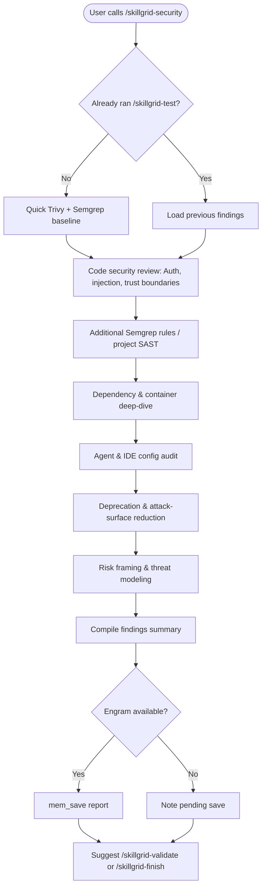

<objective>
You are executing **`/skillgrid-security`** (REVIEW — security) for the Skillgrid workflow.

This command provides a **human-centric, threat-oriented review** that goes beyond the automated Trivy/Semgrep scans already run in **`/skillgrid-test`**. Use that test‑phase output as a starting point, then dig into design‑level weaknesses, trust boundaries, and operational risks.
</objective>

<process>

## Flow

## Steps

1. **Review automated findings** — If **`/skillgrid-test`** was run previously, start from its Trivy/Semgrep results; otherwise, run a quick scan to get a baseline (`trivy fs --scanners vuln,secret,misconfig --severity HIGH,CRITICAL .` and `semgrep --config auto --error .`). Do not replicate the full test phase here.

2. **Code security review** — Manually inspect the change’s critical paths for:
   - Authentication & authorization logic
   - Hardcoded secrets, keys, or tokens (even in comments)
   - Injection points (SQL, command, template, NoSQL)
   - SSRF, open redirects, path traversal, unsafe deserialisation
   - Trust boundaries: where does data cross from untrusted → trusted?
   - Blast radius: what’s the worst case if this component is compromised?

3. **Static analysis (additional rules)** — Extend beyond auto‑rules: write custom **Semgrep** patterns if the project has recurring anti‑patterns; run project‑specific SAST tools (bandit, gosec, etc.) and examine their warnings in context.

4. **Dependency / container deep‑dive** — For every added or bumped dependency:
   - Check for unmaintained packages, expired certificates, licence changes
   - Review container images for minimal base, non‑root user, and known exploits (`trivy image`, `docker scout` if used)
   - IaC misconfigurations: open ports, overly permissive IAM, unencrypted storage

5. **Agent & IDE config audit** — Review the AI‑assisted development surface:
   - `.cursor/`, `.kilo/`, `.opencode/`, `.github/prompts/` for unsafe defaults or leaked system prompts
   - MCP server configurations (permissions, network access, tool allow‑lists)
   - Agent definitions (`.cursor/agents/` etc.) that might execute unfiltered user input

6. **Deprecation & attack‑surface reduction** — If the change removes, replaces, or modifies an endpoint, auth mechanism, API key, or dependency:
   - Explicitly list old entry points to be shut down
   - Plan a deprecation timeline (grace periods, hard removal dates)
   - Verify no stale secrets or docs remain

7. **Risk framing & threat modeling** — For changes with significant exposure:
   - Identify the “who” and “what” of a potential attack (user, insider, automated bot)
   - Document assumptions (e.g. “the internal network is trusted”)
   - Prioritise findings using a simple 🟥 Critical / 🟧 High / 🟨 Medium / 🟩 Low grid
   - Recommend mitigations with concrete actions

## Practices (inline)

- State explicit **threat assumptions** upfront — don’t assume a secure environment.
- Prefer **measurable checks** (scanner commands, policy-as-code) over generic advice, but interpret the results rather than just dumping logs.
- If scanners are not installed, say what is missing and what commands would run once configured.

## Notes

- **Hybrid persistence:** Update the relevant `.skillgrid/tasks/context_<change-id>.md` with a short security sign‑off note after completion.
- Tie findings to OpenSpec requirements or PRD success criteria if possible.
- This command is **optional** for low‑risk changes; the automated scans in `/skillgrid-test` already cover the baseline.

## Anti-patterns

- **Scanner‑only security** – Don’t stop after Trivy and Semgrep; a manual review of auth, trust boundaries, and agent config is essential.
- **Ignoring agent/IDE config** – The AI‑assisted development surface (`.cursor/`, MCP servers, prompts) is part of the attack surface; never skip it.
- **Silent acceptance of critical bugs** – Any critical or high finding must be actively decided by the user, not buried in a report.
- **No threat model** – Don’t finish without stating who is trusted, what data is sensitive, and the blast radius of a compromise.

## Completion report (required)

End with a **Session wrap-up** the user can scan:

1. **What I did** — Bullets: scanners or checklists run, findings severity summary (with count), files written (e.g. `.skillgrid/security/` report if configured).
2. **Token / usage** — If the product shows **input/output tokens**, **context used**, or **session cost** for this turn, report it. If not available, state **`Token usage: not shown in this environment`** (do not guess).
3. **Suggested next command** — **`/skillgrid-validate`** for combined review+security sign‑off, or **`/skillgrid-finish`** if you already ran a full review and are ready to ship.

</process>