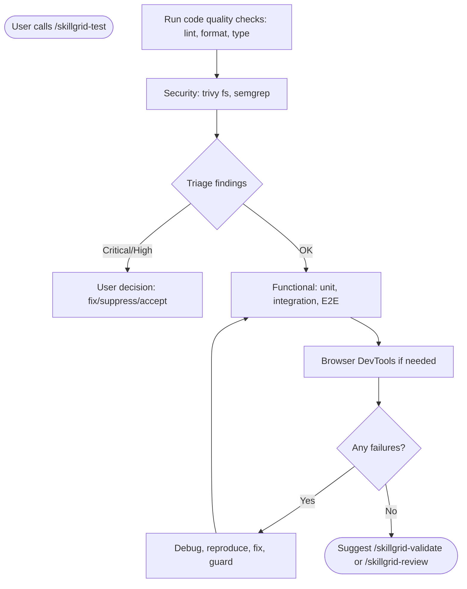

<objective>

You are executing **`/skillgrid-test`** (VERIFY phase) for the Skillgrid workflow.

</objective>

<process>

## Flow

## Steps

1. **Automated tests** — Run or add tests that match the change; for bugs, prefer a failing test first, then the fix.
2. **Code quality (automated)** — Run or verify project‑standard quality checks for the change.

   - Detect the project’s quality tools from config: ESLint, Prettier, Ruff, Black, Pylint, Clippy, TypeScript strict mode, etc.
   - At minimum, check for:
     - **Linting** – no rule violations in changed files
     - **Formatting** – consistent formatting
     - **Type checking** – if the language has a type system, ensure no new errors
   - If the project has no pre‑configured quality checks, offer to add a minimal `lint-staged` or CI‑ready command; do **not** add global tooling without user approval.
   - If checks fail, report the failures clearly. Do **not** proceed to security or deeper functional tests until the code is clean.
3. **Security (automated)** — Scan for vulnerabilities, secrets, misconfigurations, and code‑level weaknesses using both **[Trivy](https://github.com/aquasecurity/trivy)** and **Semgrep** (or the project’s configured SAST). This step mirrors the automation portion of **`/skillgrid-security`** and keeps the Test phase self‑contained.

   - **Check tool availability:**
     - `trivy --version`
     - `semgrep --version` (or the project’s chosen SAST: `bandit`, `gosec`, etc.)
     - If missing, offer to install them; for lightweight environments, fall back to package‑manager audits.

   - **Trivy — filesystem & dependencies:**
     `trivy fs --scanners vuln,secret,misconfig --severity HIGH,CRITICAL . ` (limit to changed paths for speed; use `trivy image <image>` for containerised projects)

   - **Semgrep — code patterns:**
     `semgrep --config auto --error --strict .` (respect `.semgrep.yml` if present; prefer project‑configured rules)

   - **Secrets deep‑dive (if Trivy found nothing):**
     `trivy fs --scanners secret .` If a real credential is detected, do not echo it to chat; warn the user immediately and stop further scanning until it is revoked.

   - **Triage findings:**
     * **Critical / High CVEs or Semgrep errors:** list them plainly; the user must decide to **fix**, **suppress** (with a short justification), or **accept risk** before continuing.
     * **Misconfigurations:** fix trivial ones immediately (e.g., `USER` in Dockerfile); surface design‑level changes to the user.
     * **Secrets:** if any real credential is exposed, stop the scan, warn the user without echoing the secret, and block progress until it is revoked.

   - **Risk framing (light):** Summarise the change’s attack surface in one sentence—does it touch auth, data stores, or external APIs? If the surface is non‑trivial, mention that a full manual review with **`/skillgrid-security`** is recommended later.

4. **E2E** — Cover critical user journeys; quarantine or stabilize flaky cases per team practice.
5. **Layers** — Use unit and integration tests with sensible mocks where the stack expects them.
6. **Browser** — For UI, use DevTools or a browser MCP: DOM, console, network, performance as needed.
7. **Debug** — Reproduce, localize, reduce, fix, then add a guard (test or assertion).

## Practices (inline)

- Tie tests to **success criteria** from the PRD or change artifacts; avoid speculative coverage.
- Prefer the repo’s existing test runner and patterns (`package.json`, `Makefile`, CI config).
- Good tests describe **what** the system does through public interfaces. They should survive internal refactors and read like behavior specs, not implementation audits.
- Prefer integration-style coverage for critical paths. Mock only at system boundaries such as external APIs, time/randomness, email/payment providers, or filesystem access when a real fixture is impractical.
- Avoid tests that assert private methods, internal collaborator call counts/order, or direct storage details when the same behavior can be verified through a public retrieval/query interface.

## Notes

- Inspect the repo with tools; do not assume stack or layout.
- **Hybrid persistence** is the default (`openspec/` + Engram); align with **`/skillgrid-init`** if layout is unclear.
- **“Ticket” in arguments** means **issue id** in the sense of your tracker: e.g. GitHub **`#42`**, GitLab **iid**, Jira **`PROJ-123`**, or a PRD slice label when **`ticketing.provider`** is **`local`** (see **`.skillgrid/config.json`**).

## Anti-patterns

- **Skipping quality and security** – Don’t jump to functional tests before running linting, formatting, type checks, and Trivy/Semgrep.
- **“Looks correct” without evidence** – Never claim a test passed without reading the full output and exit code.
- **Ignoring security findings** – Critical/High findings must be explicitly resolved (fix, suppress, or accept risk) before handoff.
- **Speculative coverage** – Don’t write tests for unrelated code; tie every test to a PRD success criterion or OpenSpec scenario.

## Completion report (required)

End with a **Session wrap-up** the user can scan:

1. **What I did** — Bullets: which test commands ran, pass/fail summary, and artifacts (logs, coverage paths) if any.
2. **Token / usage** — If the product shows **input/output tokens**, **context used**, or **session cost** for this turn, report it. If not available, state **`Token usage: not shown in this environment`** (do not guess).
3. **Suggested next command** — **`/skillgrid-review`** for spec/implementation traceability; or **`/skillgrid-apply`** if tests failed and the change needs more work.

</process>
