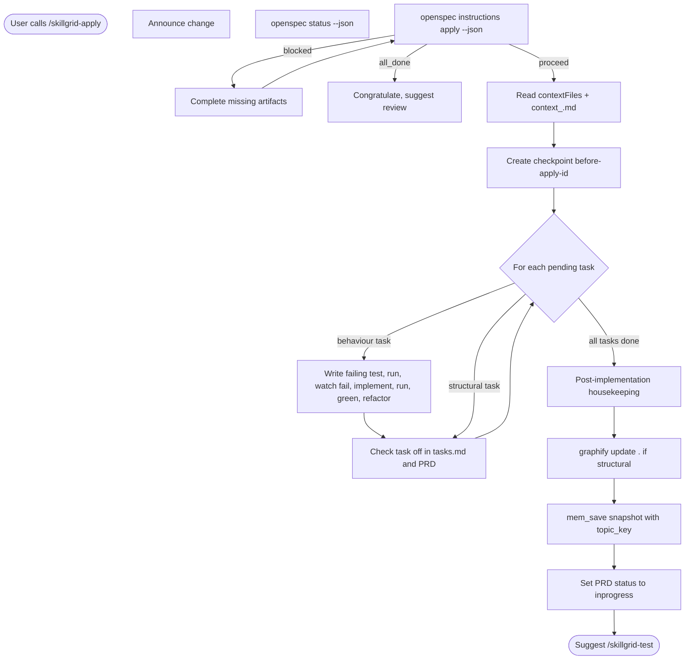

<objective>

You are executing **`/skillgrid-apply`** (BUILD phase) for the Skillgrid workflow.

Implement from the OpenSpec change’s **apply** instructions. **Always use hybrid persistence:** keep **PRD**, **`tasks.md`**, and **Engram** aligned — update checkboxes on disk and **`mem_save`** task progress to a stable `topic_key` (e.g. `skillgrid/{change}/tasks`) when you complete or restructure work.

**Status on exit:** Set the PRD’s **`Status:`** to **`inprogress`** once this run advances implementation (e.g. lands code, marks tasks, or checkboxes change). If the run only loads context and does not advance work, you may keep the prior value. Next lifecycle values: **`devdone`** after **`/skillgrid-review`**, **`done`** after **`/skillgrid-finish`** (see **`/skillgrid-init` → PRD / change `Status` lifecycle**).

</objective>

<process>

## Flow



## Part A — OpenSpec apply loop (on-disk OpenSpec)

**Input**: Optionally the change name (e.g. `/skillgrid-apply add-auth`). If omitted, infer from context, or if only one active change exists, use it. If ambiguous, run `openspec list --json` and ask the user to choose.

1. **Announce the change** — State you are **using change: `<name>`** and how to override (e.g. pass a different name next time).

2. **Status**

   ```bash
   openspec status --change "<name>" --json
   ```

   Note `schemaName` and which artifact holds tasks (often `tasks`).

3. **Apply instructions**

   ```bash
   openspec instructions apply --change "<name>" --json
   ```

   This yields context file paths, progress (total / complete / remaining), task list, and a dynamic note for the current state.

   **Handle states:**

   - **`blocked`** (missing artifacts): show which artifacts are missing; complete them with **`/skillgrid-plan`** or **`/skillgrid-breakdown`**, or create files per `openspec instructions <artifact-id> --change "<name>" --json`. Do not guess past schema requirements.
   - **`all_done`**: congratulate; suggest **`/skillgrid-review`** and **`/skillgrid-finish`**.
   - Otherwise: proceed to implementation.

4. **Read context** — Read every path in `contextFiles` from the apply output (commonly proposal, specs, design, `tasks` for spec-driven flows). Prefer CLI output over hard-coded filenames. Also read **`.skillgrid/tasks/context_<name>.md`** if it exists (rolling handoff; see `docs/workflow.md` — *Filesystem handoff*).

5. **Filesystem handoff (subagents)** — If you use **`Task`** to delegate **research, design critique, or exploration** to a subagent for this change: create or open **`.skillgrid/tasks/context_<name>.md`** and **include its path in the subagent prompt**. After the subagent returns, **read** that file and any **`.skillgrid/tasks/research/<name>/`** files it cites **before** writing product code. The parent session keeps full implementation context; subagents spill long output to disk.

6. **Create automatic pre-apply checkpoint** — Before any implementation edit, create a checkpoint entry equivalent to **`/skillgrid-checkpoint create before-apply-<name>`**:

   - Ensure **`.skillgrid/tasks/`** exists.
   - Append to **`.skillgrid/tasks/checkpoints.log`** using the checkpoint command format: timestamp, checkpoint name, current branch, current short SHA, dirty count, quick verification result, and active context files.
   - Use checkpoint name **`before-apply-<name>`** by default; if that exact name already exists today, append the current task focus or timestamp to keep it distinct.
   - This is a **log checkpoint only**. Do **not** create a commit or stash unless the user explicitly asked for that behavior.
   - If the checkpoint cannot be written, stop and report the filesystem error before modifying product code.

7. **Show progress** — Display schema, **N/M tasks** complete, remaining work, and the CLI’s current instruction.

8. **Implement (loop)** — For each **pending** task line:

   - State which task you are on.
   - Make minimal, focused code changes.
   - **Immediately** set the task checkbox in **`openspec/changes/<name>/tasks.md`**: `- [ ]` → `- [x]`.
   - **Immediately** mirror the same line in the **PRD** **Implementation tasks** section (**`.skillgrid/prd/PRD<NN>_<slug>.md`**). The two must stay identical.
   - Continue until done, blocked, or interrupted.

9. **Pause if** the task is unclear, implementation contradicts the design, an error is hit, or the user stops you—report and wait.

10. **Post-implementation housekeeping** — After a meaningful run (especially when code or the tree changed):

    - **Ask** (or self-check with the user): *Did this change affect the architecture or repo structure?*
    - **Checklist — update `.skillgrid/project/` when needed:** If you **added, renamed, or removed** top-level directories, **new services** or subsystems, **major patterns**, or **runtime topology**, update the right file(s) **in this pass** (do not defer without reason):
      - **`.skillgrid/project/STRUCTURE.md`** — folder and package layout; where code lives.
      - **`.skillgrid/project/ARCHITECTURE.md`** — design decisions, boundaries, new subsystems, pattern or topology shifts. When you add a **new ADR**, **cross-reference** it from here.
      - **`.skillgrid/project/PROJECT.md`** — new **dependencies**, **build** / **CI** config, and **tooling** the team must know about.
    - **Graph** — When the project uses **graphify**, run **`graphify update .`** to refresh the repo map (see also **Part B**). Typical triggers: this housekeeping step after a significant apply; **structural** code edits; **major** file additions/removals (e.g. new packages, deleted trees, large moves).

11. **End of session** — Summarize completed tasks, N/M progress, checkpoint name/path, housekeeping actions (if any), and next action (continue apply, run review, or archive).

### Output shape (optional)

Use clear headings, e.g. `Implementing: <change> (schema: …)`, per-task progress, and a short completion or pause block.

### Apply guardrails

- Read context from the **apply** instruction output every time; do not assume fixed filenames beyond what the schema provides.
- Create the automatic **before-apply** checkpoint before touching product code.
- Keep changes scoped; one task at a time.
- Update checkboxes in **`tasks.md` and the PRD** in the same edit pass when possible.
- On ambiguity or schema mismatch, stop and ask—do not invent missing artifacts.

### Fluid workflow

- Apply can be invoked with partial progress; you may need to **update design or specs** if implementation finds issues—suggest that explicitly before coding around the schema.

---

## Part B — Skillgrid-specific (hybrid bookkeeping)

1. **Single working tree + handoff** — Default: implement in **one repo checkout** using **per-change handoff** (`.skillgrid/tasks/context_<change-id>.md`) and an optional **feature branch** in the same directory. Do **not** treat git worktrees as part of the standard path; see `docs/workflow.md` — *Filesystem handoff*. If the next pending task line is tagged **`[HITL]`**, do **not** implement it until the handoff records the human decision (e.g. ADR link, approval note with date)—unless the user explicitly overrides in session.
2. **Task bookkeeping (mandatory)** — Whenever a task is **done** or **split/deferred/corrected**, update:

   - `openspec/changes/<change-id>/tasks.md` (when it exists)
   - The **PRD** **Implementation tasks** (same line numbers and checkbox state)
   - The **PRD** **`Status:`** line to **`inprogress`** when this session advances work (per **objective**)

   If there is no PRD file, update `tasks.md` (or Engram) only and add a pointer when the team expects a PRD.
3. **Engram snapshot (reindex):** After every substantive apply run that lands code or alters the repo, `mem_save` a brief progress snapshot with topic key `skillgrid/<change>/apply`. Include:
     - Tasks completed this session and N/M total.
     - Files created, modified, or deleted.
     - Any structural changes (new packages, services, ADRs).
     - Link to the PRD and OpenSpec change directory.
     This keeps Engram current and allows other agents to pick up without rereading the entire disk state.
4. **Scope** — Smallest vertical slice that satisfies the current tasks; no unrelated refactors.
5. **Contracts** — Preserve agreed APIs and error behavior at public boundaries; document contract changes in design/PRD when you must change them.
6. **TDD** — When tests are in play: red–green–refactor; write the failing test first when the task calls for it.
   - **TDD Iron Law:** No production code without a failing test first. If you wrote implementation code before the test, delete that code immediately and start over with the test.
   - **No horizontal slices:** Do not write all tests first and then all implementation. Use tracer bullets: one behavior test, minimal implementation, green test, then the next behavior.
   - **If the task requires a behavioural change (new feature, bug fix, or contract adjustment):**
     1. **Write (or update) a failing test** that clearly proves the intended behaviour.
     2. **Run the test suite** and observe it fail (or confirm the new test fails while nothing else breaks unexpectedly).
     3. **Implement the minimal code** to make the test pass.
     4. **Run the test again** and confirm it passes (green).
     5. **Refactor** for clarity and performance without changing behaviour, then rerun tests.
   - **Good test shape:** Test observable behavior through public interfaces. Avoid private methods, internal call counts, or tests that break during a harmless refactor.
   - **Mocking boundary:** Mock external systems only (network APIs, email/payment providers, time/randomness, filesystem when needed). Do not mock internal collaborators you control unless the repo has an explicit existing pattern and you state why.
   - For tasks that are purely structural (renames, formatting, non‑behavioural refactors), a test is optional; explain why you skipped it.
7. **Model selection for subagents** — When delegating work to a `Task` subagent, choose the model based on task complexity:

   - **Cheap / fast model** — For mechanical 1–2 file edits with a complete, unambiguous spec and existing tests.
   - **Standard model** — For multi‑file integration changes, moderate ambiguity, or when the spec needs light interpretation.
   - **Most capable model** — For architecture decisions, design critique, security review, or any task that requires broad judgement.

   State the model choice in the subagent prompt and explain the reason. Never use a cheap model for design or review tasks.
8. **Frameworks** — Ground behavior in the official docs for the stack the repo uses; cite in commits or code comments when useful.
9. **Quality** — Small, reviewable commits; work in **vertical slices** (implement, verify, commit).
10. **Migrations** — For schema/data changes, follow safe migration practices (one migration per logical change, rollback story).
11. **Graph & project docs** — At end of a substantive apply run, follow **Part A — step 9 (Post-implementation housekeeping)**: **`graphify update .`** when needed, and keep **`.skillgrid/project/ARCHITECTURE.md`**, **STRUCTURE.md**, and **PROJECT.md** aligned with what you changed (see step 9 for which file to touch). **`/skillgrid-finish`** runs a final consistency pass before archive.

## Notes

- Inspect the repo; do not assume stack or layout.
- Checklist format and PRD link live in **`/skillgrid-breakdown`**.

## Anti-patterns

- **Checking tasks off before the test passes** – Never mark a task as done until the test is green (or structural change is verified).
- **Skipping TDD because “it’s simple”** – Every behavioural task starts with a failing test; if no test is written, you haven’t proven correctness.
- **Code first, test later** – Writing production code without the test is an anti‑pattern; delete it and start with the test.
- **Silent contract changes** – Never alter a public API, event schema, or error contract without updating the PRD, `design.md`, and specs.
- **Stale Engram** – Don’t finish a substantive apply run without `mem_save`‑ing progress to the skillgrid change key.

## Completion report (required)

End with a **Session wrap-up** the user can scan:

1. **What I did** — Bullets: change name, which **`openspec instructions apply`** steps completed, files changed in the repo, PRD **`Implementation tasks`** sync, and (if any) **`.skillgrid/project/`** or **`graphify`** updates from post-implementation housekeeping.
2. **Token / usage** — If the product shows **input/output tokens**, **context used**, or **session cost** for this turn, report it. If not available, state **`Token usage: not shown in this environment`** (do not guess).
3. **Suggested next command** — **`/skillgrid-test`** to run automated checks; if tests are not in scope, **`/skillgrid-review`**.

</process>
