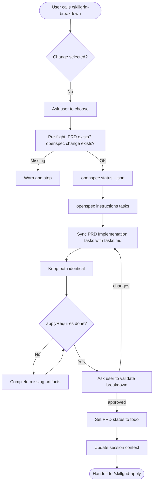

<objective>

You are executing **`/skillgrid-breakdown`** (TASKS phase) for the Skillgrid workflow.

Merge **PRD “Implementation tasks”** with the canonical OpenSpec **`tasks.md`**, and use the OpenSpec CLI to see which artifacts are still incomplete before implementation.

**Status on exit:** Set the PRD’s **`Status:`** to **`todo`** (and INDEX / ticket table if used). Follows **`draft`** from **`/skillgrid-plan`**; next is **`inprogress`** after **`/skillgrid-apply`** (see **`/skillgrid-init` → PRD / change `Status` lifecycle**).

**Persistence (hybrid):** Keep **PRD**, **`openspec/changes/.../tasks.md`**, and **Engram** in sync: same checklist on disk and a **`mem_save`** under a stable `topic_key` (e.g. `skillgrid/{change}/tasks`) when the task list changes materially.

</objective>

<process>

## Flow



## Steps

1. **Select the change** — If the name is not given, infer from context or list `openspec/changes/` / `openspec list --json` and ask.

   - **Pre-flight check:**  
     - If **no PRD** exists for this change (glob `.skillgrid/prd/PRD*_<slug>.md` and check the `Spec / change` link), warn: *“No PRD found for this change. Run `/skillgrid-plan` first to create one.”* Do not proceed until a PRD exists.  
     - If **`openspec/changes/<name>/`** does not exist, warn: *“No OpenSpec change directory. Run `/skillgrid-plan` to scaffold it.”*  
   - Announce which change and PRD you are using.

2. **CLI status (readiness)** — For on-disk OpenSpec:

   ```bash
   openspec status --change "<name>" --json
   ```

   Use this to see:

   - Which artifacts exist and which are not `done`
   - `applyRequires` — what must exist before **apply** (often includes `tasks`)

3. **Instructions for the tasks artifact** — When the schema exposes a `tasks` artifact, refresh instructions until it is complete:

   ```bash
   openspec instructions tasks --change "<name>" --json
   ```

   (Use the actual artifact id if your schema names it differently.) Apply `context` and `rules` as **constraints only**; do not copy them into the file. Fill `tasks.md` from the template and dependency artifacts (`proposal`, specs, `design`).

4. **PRD — Implementation tasks chapter** — In the change’s PRD (path **`.skillgrid/prd/PRD<NN>_<slug>.md`**, or equivalent from **`/skillgrid-plan`**), add or replace the **Implementation tasks** section using the checklist format below. Every checkbox must **trace** to product intent in the same PRD. If you discover tasks belong to a different execution step, add or renumber a PRD file and **reorder** other `PRD*.md` and **`.skillgrid/prd/INDEX.md`** as needed.

5. **OpenSpec `tasks.md` (canonical on disk)** — For the active change, produce or update `openspec/changes/<change-id>/tasks.md` from proposal, specs, and design. **Treat this file as the canonical checklist** when the project uses OpenSpec on disk.

6. **Keep PRD and `tasks.md` identical** — After any edit, **update both** the PRD Implementation tasks block and `openspec/changes/<change-id>/tasks.md` so workstreams and `- [ ]` / `- [x]` lines match. If only one location exists, say so in the PRD index or plan.

7. **Link** — In the PRD, include ** `[tasks.md](openspec/changes/<change-id>/tasks.md)`** next to the Implementation tasks heading (adjust path as needed).

8. **Readiness (verify-style checks)** — Before handoff to build:

   - In `tasks.md` (or PRD checklists), ensure every item is small, testable, and ordered by dependencies.
   - Re-run `openspec status --change "<name>" --json` and confirm every id in `applyRequires` is `done` (including `tasks` when your schema requires it).
   - If delta specs exist, confirm requirements and scenarios are complete enough to task out; close gaps with **`/skillgrid-plan`** if needed.

9. **Testing stance** — For tasks that need automated proof, call out test level (unit, integration, e2e) in workstream titles or task lines. Prefer red–green–refactor and the smallest verifiable slice.

10. **Graph** — After large breakdown edits to repo structure, run **`graphify update .`** when the project uses graphify.

11. **No orphan work** — Each task should map to a spec or agreed design; call out gaps before coding.

11a. **Validate with the user** — After the checklist is synced and `applyRequires` are met, present a summary and quiz the user:
   - **Summary**: Change id, PRD path, number of workstreams/slices, total tasks.
   - **Quiz** (one question at a time if needed):
   1. Does the granularity feel right? (too coarse / too fine)
   2. Are the dependency relationships correct?
   3. Should any slices be merged or split further?
   4. Are the correct items marked as HITL and AFK?
   - Iterate until the user approves.
   - Only after explicit approval set the PRD `Status:` to `todo`.

12. **PRD `Status`** — Set the change’s PRD **`Status:`** to **`todo`** (and INDEX / ticket table if used) before handoff. Next is **`inprogress`** in **`/skillgrid-apply`**.

12b. **Update session context** — If `.skillgrid/tasks/context_<change-id>.md` exists, set:
   - `state:` from `planning` to `breakdown` (or your team’s convention)
   - Add a one-line note: *“Tasks broken down; N workstreams, M total tasks. Ready for apply.”*

## PRD: Implementation tasks checklist format

- Optional `---` before the section.
- Section title, e.g. `### Implementation tasks` or `### Implementation tasks (from OpenSpec)`.
- **Workstreams** as `#### <n>. <Workstream title>`.
- **Sub-tasks** with **global numbering**: `- [ ] 1.1 ...`, then `#### 2. ...` with `- [ ] 2.1 ...`.
- Use the **same** structure in `openspec/changes/<change-id>/tasks.md` when it exists.

**Minimal pattern:**

```markdown
---

### Implementation tasks

**Canonical checklist:** [tasks.md](openspec/changes/<change-id>/tasks.md) — keep this section in sync with that file.

#### 1. <First workstream>

- [ ] 1.1 …
- [ ] 1.2 …

#### 2. <Next workstream>

- [ ] 2.1 …
```

### Tracer-Bullet Vertical Slices
When the PRD is large or the implementation crosses multiple layers, consider breaking the work into **tracer-bullet issues**. Each slice is a thin vertical slice that cuts through ALL integration layers end-to-end (schema, API, UI, tests). A completed slice is demoable or verifiable on its own.

- Prefer many thin slices over few thick ones.
- Mark each slice as **HITL** (requires human interaction, e.g. architectural decision) or **AFK** (can be implemented and merged without human interaction).
- Prefer AFK over HITL where possible.

## Optional: IDE personas

After you draft or sync **`tasks.md` and the PRD checklist**, you can spawn **`skillgrid-task-breakdown-auditor`** ([`.cursor/agents/skillgrid-task-breakdown-auditor.md`](../../.cursor/agents/skillgrid-task-breakdown-auditor.md)) for a planning-only audit (acceptance, ordering, testability) without a full code read.

## Notes

- Inspect the repo with tools; do not assume stack, change id, or layout.
- For PRD sections outside Implementation tasks, follow **`/skillgrid-plan`**.

## Anti-patterns

- **No PRD or OpenSpec change** – Never start breakdown if the change doesn’t already have a PRD and an `openspec/changes/<id>/` directory; redirect to `/skillgrid-plan`.
- **Drifting checklists** – Don’t let the PRD “Implementation tasks” section and `tasks.md` get out of sync; update both in the same edit pass.
- **Skipping user validation** – Never move to `todo` status without asking the user to review the workstreams and task ordering.
- **Tasks too large** – Each checkbox must be a single, verifiable, small step; avoid “build the auth module” as one task.

## Completion report (required)

End with a **Session wrap-up** the user can scan:

1. **What I did** — Bullets: change id, updates to **`.skillgrid/prd/…`** and **`openspec/changes/.../tasks.md`**, and checklist sync status.
2. **Token / usage** — If the product shows **input/output tokens**, **context used**, or **session cost** for this turn, report it. If not available, state **`Token usage: not shown in this environment`** (do not guess).
3. **Suggested next command** — **`/skillgrid-apply`** to implement with the `openspec instructions apply` loop.

#### Optional: Create remote issues for vertical slices (per `.skillgrid/config.json`)

**Preflight:** Read **`.skillgrid/config.json`**. If missing, default to **`local`** and note that **`/skillgrid-init`** can set ticketing. **Do not** assume GitHub.

For each **approved** vertical slice, optionally create a **remote** issue **in dependency order** (blockers first), or keep tracking **only** in `tasks.md` + PRD when `provider` is `local` or the user declines.

| `ticketing.provider` | Behavior |
|------------------------|----------|
| **`local`** | No `gh` / `glab` / Jira calls. Keep slices in **PRD** + **`tasks.md`**; use **HITL** / **AFK** tags. Optionally reference the Kanban script from **`/skillgrid-init`**. |
| **`github`** | If `gh` is available: `gh issue create` per slice with a body from the template below. If not, print title/body for manual creation. |
| **`gitlab`** | If `glab` is available: `glab issue create` per slice. If not, print title/body for manual creation. |
| **`jira`** | Use Jira CLI if installed and documented; else add a one-line “Jira key TBD” note per slice in the PRD or INDEX. |

**Issue body template (GitHub / GitLab):**

```markdown
## Parent #[parent issue number if applicable]
## What to build
A concise description of this vertical slice. End-to-end behavior, not layer-by-layer.
## Acceptance criteria
- [ ] Criterion 1
- [ ] Criterion 2
## Blocked by
- Blocked by #[issue number] (or "None - can start immediately")
```

**GitLab:** Prefer “Closes” / related links in the merge request to the created issue iid per team practice.

</process>
