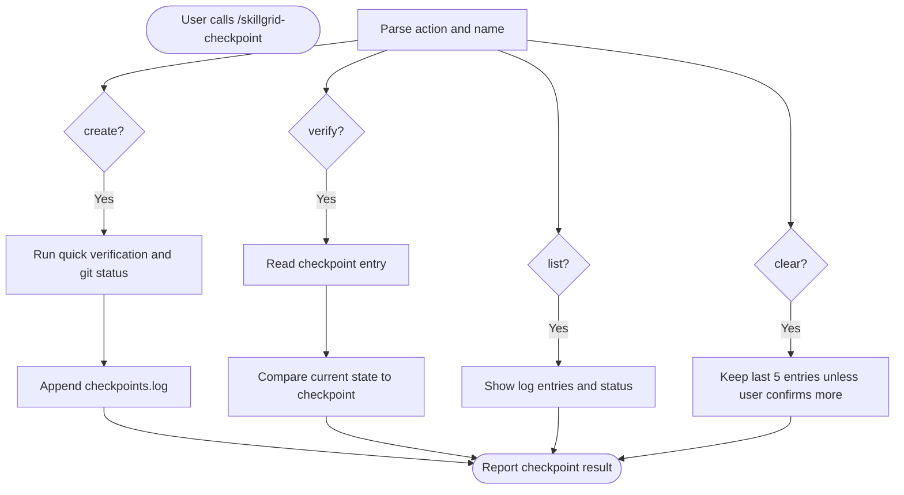

<objective>

You are executing **`/skillgrid-checkpoint`** for the Skillgrid workflow.

Create or inspect lightweight workflow checkpoints without requiring git worktrees. A checkpoint records the current branch, git SHA, dirty status, optional quick verification evidence, and active Skillgrid context so the user or another agent can compare later.

**Checkpoint store:** `.skillgrid/tasks/checkpoints.log`

</objective>

<process>

## Usage

```text
/skillgrid-checkpoint create <name>
/skillgrid-checkpoint verify <name>
/skillgrid-checkpoint list
/skillgrid-checkpoint clear
```

If the action is missing, ask the user which action they want. If `create` or `verify` is missing a name, ask for the checkpoint name.

## Flow



## Create checkpoint

1. **Preflight**
   - Ensure `.skillgrid/tasks/` exists; create it if needed.
   - Capture:
     - timestamp: `date +%Y-%m-%d-%H:%M`
     - checkpoint name from arguments
     - branch: `git branch --show-current`
     - SHA: `git rev-parse --short HEAD`
     - dirty count: number of lines from `git status --short`
     - active handoff files: `.skillgrid/tasks/context_*.md` (if any)

2. **Quick verification**
   - Run the cheapest meaningful check available for the repo or current change. Prefer an existing quick command if obvious from project files.
   - If no quick command is obvious, run `git status --short` only and record `verification=not-run`.
   - Do **not** add new tooling or run long test suites unless the user asks.

3. **Do not auto-commit**
   - A checkpoint is a log entry by default.
   - Only create a commit or stash when the user explicitly asks for that behavior in this command invocation. Never create commits as an implicit side effect.

4. **Append log entry**

   ```text
   <timestamp> | <name> | branch=<branch> | sha=<sha> | dirty=<count> | verification=<pass|fail|not-run> | contexts=<paths-or-none>
   ```

5. **Report**
   - Checkpoint name
   - Branch and SHA
   - Dirty count
   - Verification result
   - Log path

## Verify checkpoint

1. Read `.skillgrid/tasks/checkpoints.log`.
2. Find the newest entry whose name matches the requested checkpoint.
3. Compare current state to the checkpoint:
   - current SHA vs checkpoint SHA
   - current branch vs checkpoint branch
   - file changes since checkpoint: `git diff --name-status <sha>...HEAD` when the SHA exists locally
   - dirty working tree: `git status --short`
   - quick verification now vs recorded verification (run the same quick check only if it is obvious and cheap)

4. Report:

   ```text
   CHECKPOINT COMPARISON: <name>
   ============================
   Branch: <then> -> <now>
   SHA: <then> -> <now>
   Files changed since checkpoint: <count>
   Dirty files now: <count>
   Verification then: <pass|fail|not-run>
   Verification now: <pass|fail|not-run>
   ```

If the checkpoint SHA is missing (rebased, pruned, or from another clone), say so and fall back to branch/name/status comparison.

## List checkpoints

Show all entries in `.skillgrid/tasks/checkpoints.log` with:

- name
- timestamp
- branch
- SHA
- dirty count
- verification result
- status relative to current HEAD (`current`, `behind`, `ahead`, `unknown`)

If the log does not exist, say no checkpoints exist yet and suggest `/skillgrid-checkpoint create <name>`.

## Clear checkpoints

By default, keep the last **5** log entries and remove older entries. If the user asks to clear all checkpoints, confirm before deleting the whole log.

`/skillgrid-finish` cleans up **change-scoped** checkpoint entries automatically when a change is finished or discarded. It should keep unrelated entries and keep ambiguous entries rather than guessing.

## Notes

- `/skillgrid-apply` automatically creates a **`before-apply-<change-id>`** checkpoint before product-code edits when the apply instruction proceeds to implementation.
- Checkpoints complement, but do not replace, git commits, PRDs, OpenSpec changes, or `.skillgrid/tasks/context_<change-id>.md`.
- Prefer named checkpoints around phase boundaries: before `/skillgrid-apply`, after a coherent AFK slice, before `/skillgrid-validate`, and before `/skillgrid-finish`.
- Keep the output concise; do not paste long diffs unless the user asks.

</process>
