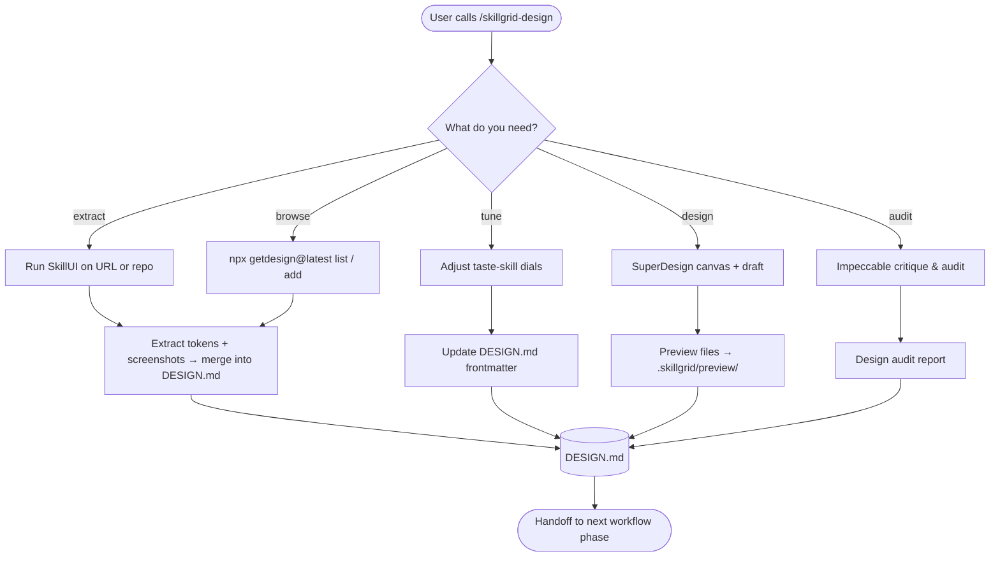

<objective>
You are executing **`/skillgrid-design`** — an on-demand design workshop for the Skillgrid workflow.

This command is **not part of the linear Plan → Breakdown → Apply pipeline**. It's a supporting workshop that bootstraps, tunes, and audits the project's visual identity. All paths converge on the single source of truth: root **`DESIGN.md`**.
</objective>

<process>

## Flow

## Modes

Ask the user which mode they want, or infer from their argument.

### 1. Extract — pull a design system from a reference

- **From a URL:** `skillui --url <reference-url>`  
  Produces a complete `DESIGN.md`, token JSON files, and screenshots.
- **From the repo itself:** `skillui --dir ./`  
  Scans the local codebase for Tailwind/CSS tokens and builds a `DESIGN.md`.
- After extraction, review the output and merge relevant tokens into the project's root `DESIGN.md`. Keep the `design_sources` frontmatter updated with provenance.

### 2. Browse — pick from the getdesign.md collection

- **List available brands:** `npx getdesign@latest list`
- **Search:** `npx getdesign@latest search "<query>"`
- **Add one:** `npx getdesign@latest add <slug>` (e.g. `stripe`, `linear`, `notion`)
- This drops a ready-made `DESIGN.md`. Review it, keep what fits, and update `design_sources`.

### 3. Tune — adjust the aesthetic dials

- Read the current `design_variance`, `motion_intensity`, and `visual_density` from `DESIGN.md` frontmatter.
- Present the three dials (1–10) and ask the user what to change:
  - **Design variance (1=conservative, 10=wild):** how far to push visuals from convention.
  - **Motion intensity (1=static, 10=lively):** how much animation and transition.
  - **Visual density (1=sparse, 10=dense):** how much information per screen.
- Update the frontmatter. These dials guide all agents reading the file.

### 4. Design — create mockups with SuperDesign

- Ensure the skill is installed: `npx skills add superdesigndev/superdesign-skill`
- Use `/superdesign help me design <feature description>` to generate visual mockups on the canvas.
- Save screenshots or HTML exports to `.skillgrid/preview/` for later A/B selection.
- Update `DESIGN.md` with any concrete tokens chosen from the mockups.

### 5. Audit — critique the current UI

- Ensure the skill is installed: `npx skills add pbakaus/impeccable`
- Follow Impeccable's critique commands: it scores UX on visual hierarchy, cognitive load, emotional resonance, and more.
- Write findings into the session. If this is part of a Validate pass, include them in the verify report.
- Flag any anti-patterns Impeccable finds; update `DESIGN.md` with recommended fixes.