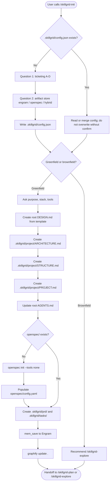
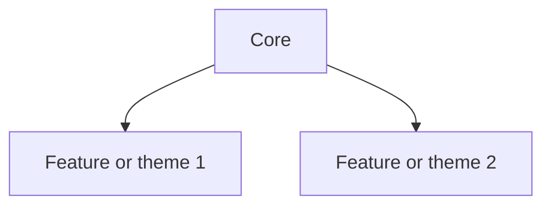

<objective>

You are executing **`/skillgrid-init`** (DEFINE phase) for the Skillgrid workflow.

You detect the stack and repo layout, then record **ticketing** and **artifact store mode** in **`.skillgrid/config.json`** (see below). **Default artifact store mode is `hybrid`**: on-disk **`openspec/`** plus **Engram** so work survives compactions — same **persistence contract** as SDD-style init (e.g. **`sdd-init`**: `engram` → no default `openspec/`; `openspec` → disk bootstrap; `hybrid` → both). Reconcile the `openspec/` tree with whatever your installed **OpenSpec CLI** scaffolds (`openspec init`, `openspec new change`, project templates)—do not assume a frozen layout beyond what the CLI and repo already use.

**PRD files (non-negotiable):** **Never** create **`prd/`** at the **repository root**—no **`prd/INDEX.md`**, no **`prd/PRD*.md`**, no root **`prd/`** folder. The **only** Skillgrid paths are **`.skillgrid/prd/INDEX.md`** and **`.skillgrid/prd/PRD<NN>_<slug>.md`**. If root `prd/` exists from legacy work, **do not** add new files there; create under **`.skillgrid/prd/`** and migrate or leave root as read-only until cleaned up.

</objective>

<process>

## Flow



## `.skillgrid/config.json` (ticketing + artifact store)

**Purpose:** (1) **Ticketing** — which **work-tracking backend** later **`/skillgrid-*`** commands use for optional remote issues. (2) **Artifact store** — where spec/change **persistence** lives: **Engram** only, **`openspec/`** on disk only, or **both** (`hybrid`). **PRD `Status:`** on disk remains the product source of truth for phases; remote trackers are mirrors unless you add automation.

**When:** Run the **questioning phase** (below) when **`.skillgrid/config.json`** is missing or when **`artifactStore.mode`** (or `ticketing`) is missing and the user agrees to merge. If the file **already exists**, **read** it, **do not** overwrite without explicit user confirmation; you may **merge** new keys only if the user agrees.

**Schema (version `1`):**

| Field | Required | Description |
|-------|----------|-------------|
| `version` | Yes | Integer schema version; use `1`. |
| `ticketing.provider` | Yes (after Q1) | One of: `local`, `github`, `gitlab`, `jira`. |
| `ticketing.github` | No | `{ "defaultRepo": "owner/name" }` if not inferrable from `git remote`. |
| `ticketing.gitlab` | No | `{ "projectPath": "group/subgroup/project" }` and/or `projectId` if your CLI uses it. |
| `ticketing.jira` | No | `{ "siteUrl": "https://…", "projectKey": "PROJ" }` for links and keys. |
| `ticketing.local` | No | `{ "kanban": { "script": ".skillgrid/scripts/prd-kanban.mjs", "port": 8787 } }` — local PRD Kanban over markdown. |
| `artifactStore.mode` | Yes (after Q2) | One of: **`hybrid`** (default), **`openspec`**, **`engram`**. Same **persistence contract** as SDD **`sdd-init`**: **`engram`** — do **not** create `openspec/` by default; use **`mem_save`**. **`openspec`** — bootstrap `openspec/` on disk; Engram optional. **`hybrid`** — bootstrap `openspec/` **and** Engram (`topic_key` **`skillgrid-init/{project-name}`**). |

**Example (GitHub + hybrid artifact store, typical):**

```json
{
  "version": 1,
  "ticketing": {
    "provider": "github",
    "github": {
      "defaultRepo": "org/repo"
    }
  },
  "artifactStore": {
    "mode": "hybrid"
  }
}
```

**Example (local + engram-only artifacts):**

```json
{
  "version": 1,
  "ticketing": {
    "provider": "local",
    "local": {
      "kanban": {
        "script": ".skillgrid/scripts/prd-kanban.mjs",
        "port": 8787
      }
    }
  },
  "artifactStore": {
    "mode": "engram"
  }
}
```

If the user picks GitHub or GitLab but does not know `defaultRepo` / `projectPath`, set `provider` and leave the nested object empty or omit it; note in the completion report that they should complete the file or rely on `gh` / `glab` default repo from the working tree. If the user does not answer **Question 2**, set **`artifactStore.mode` to `hybrid`** and say so in the report.

## Steps

1. **`.skillgrid/config.json` — questioning phase (Q1 + Q2)** — Before greenfield/brownfield branching, ensure **ticketing** and **artifact store mode** are recorded (or merged into an existing file).

   **Question 1 — Ticketing** (multiple choice; **one message, one question**):
   - **A — `local`:** PRDs under **`.skillgrid/prd/`**, **`.skillgrid/prd/INDEX.md`**, optional local Kanban: `node .skillgrid/scripts/prd-kanban.mjs` (see `PRD_KANBAN_PORT` / defaults in the script).
   - **B — `github`:** GitHub Issues / Projects; optional **`gh issue create`** in later phases.
   - **C — `gitlab`:** GitLab Issues; optional **`glab issue create`** or web + links in PRD.
   - **D — `jira`:** Jira; CLI or REST if available, else link placeholders in PRD / INDEX.  
   **Optional follow-ups** (only for the selected provider, max **1–2** questions): default repo / GitLab project path / Jira `siteUrl` + `projectKey`.

   **Question 2 — Artifact store mode** (multiple choice; **one message, one question** — ask **after** Q1 and any ticketing follow-ups; aligns with **SDD `sdd-init` persistence contract**):
   - **A — `hybrid` (default):** `openspec/` on disk **+** Engram `mem_save` — **recommended** for long sessions and compaction survival.
   - **B — `openspec`:** `openspec/` on disk; Engram optional / not required by Skillgrid.
   - **C — `engram`:** Engram for durable context; **do not** create `openspec/` by default.
   - If the user defers or does not choose, set **`artifactStore.mode`** to **`hybrid`**.

   **Write / merge** — After Q1 and Q2, write **`.skillgrid/config.json`** per the **Schema** in **`.skillgrid/config.json` (ticketing + artifact store)**. Create **`.skillgrid/`** if needed. **If the file already exists** but **`artifactStore`** is missing, ask Q2 (or set **`hybrid`** with a note). Load + merge with user approval only; do not clobber.  
   **Later phases** — **`/skillgrid-plan`**, **`/skillgrid-breakdown`**, **`/skillgrid-finish`**, etc. read this file: respect **`ticketing.provider`**; respect **`artifactStore.mode`** for whether **`openspec/`** and **Engram** are in play (see **Persistence modes** and steps 3–4).

2. **Greenfield vs brownfield** — Classify from **evidence**, not from “repo already has files.”

   - **Greenfield (default for init) when** any of these hold: there is **no** substantive **application** source tree yet—typical roots include `src/`, `app/`, `lib/`, `backend/`, `packages/<name>/` **with product code** (not only config). **OR** the tree is **only** workflow / IDE / agent setup: e.g. **`.cursor/`**, **`.kilo/`**, **`.opencode/`**, **`.github/`**, **`.agents/`**, **`.vscode/`**, **`.skillgrid/`**, **`openspec/`**, root **`AGENTS.md`**, **`docs/`** — that pattern is a **config hub or pre-code** project → **greenfield**, not brownfield. Having **`openspec/`** or **`.git/`** does **not** mean brownfield.
   - **Brownfield** when: real product code exists in the repo to map and change (services, app entrypoints, libraries beyond stubs), or the user **explicitly** says the codebase is existing / legacy / brownfield.
   - **Wrong:** calling a repo brownfield just because **`.skillgrid/`**, **`openspec/`**, or IDE folders exist.
   - **Greenfield path:** clarify **purpose**, **stack**, and **tools**; then create or update **`.skillgrid/project/*.md`** and the **Project** section of root **`AGENTS.md`** (see **`docs/workflow.md`** in this hub, or your project’s workflow doc).
   - * **Design intent** — Ask: *“Do you have design preferences—colors, typography, aesthetic direction—or a design system you’d like to use?”*  
     - * Create (or update) **`DESIGN.md`** at the root.  
     - * Always scaffold the file using the template below, even if the user provides only a vague direction. Fill provided tokens; leave unspecified ones empty (`""`).  
     - * The front matter must match the structure used by Skillgrid’s design tokens: `name`, `colors`, `typography`, `rounded`.  
     - * If the user wants to defer all design decisions, still create the file with empty front matter and a placeholder `## Overview` (e.g. “To be defined during brainstorming.”).
   - **Brownfield path:** recommend **`/skillgrid-explore`** before big structural work so **`.skillgrid/project/`** and **`AGENTS.md`** are grounded in the real code.

3. **On-disk OpenSpec** — For **`artifactStore.mode`** **`openspec`** or **`hybrid`** (from **`.skillgrid/config.json`**; default **`hybrid`** for new inits) only: if there is no `openspec/` yet, run the **OpenSpec CLI** from the **project root** using the Skillgrid default:

   - **Default command:** `openspec init --tools none`  
   - **Do not** substitute other “init” flows for this step (e.g. `opencode init . --tools all --force` or any `init . --tools all --force` pattern). Those are different products; Skillgrid OpenSpec bootstrap is **`openspec`** with **`--tools none`** unless the user explicitly asks for more tools.  
   - If your installed `openspec --help` shows different flags, follow the CLI, but keep **`--tools none`** as the baseline to avoid unsolicited editor integrations.  
   - Typical output includes `openspec/config.yaml` (or equivalent), `openspec/specs/`, `openspec/changes/`, and `openspec/changes/archive/`; **match generated output**, do not hand-craft a conflicting tree. If `openspec/` already exists, summarize what is there and ask before overwriting. For **`artifactStore.mode`** **`engram`**, **do not** create `openspec/` unless the user explicitly asks to add it later.
   - **`openspec/config.yaml` after init:** As soon as `openspec init` succeeds, ensure **`openspec/config.yaml`** exists and is populated for the project. If the CLI already wrote a minimal file, **merge**: keep a valid **`schema`** (default `spec-driven` unless the project uses another schema); fill or expand **`context`** from stack detection and this session; add **`rules`** if missing. If the file is absent, create it from **OpenSpec project config (template)** below. **`context`** must stay under **50KB** (OpenSpec hard limit). If a non-empty config already exists with custom content, do not blindly overwrite—show a short diff summary and ask before replacing.  
   - **Ticketing in OpenSpec `context`:** **After** **`.skillgrid/config.json`** is written (Step 1), if **`openspec/config.yaml`** exists (this step) or is about to be created, ensure the project **`context`** block includes a **Ticketing** line that matches **`ticketing.provider`** in **`.skillgrid/config.json`** (same as the template), so `openspec instructions` does not default to a different tracker. Re-merge on later edits to **`config.json`** the same way **`/skillgrid-plan`** does.

4. **Engram** — For **`artifactStore.mode`** **`engram`**, **`hybrid`**, and (optionally) **`openspec`** when the team wants cross-session recall: after you have detected context (stack, test tooling, layout), **`mem_save`** with a stable **`topic_key`** so reruns **update** instead of duplicating:

   - **Topic key:** `skillgrid-init/{project-name}` (derive `{project-name}` from the repo or package name; keep it short and unique).
   - **Type** (e.g. `architecture` or your convention) and **project** field as your Engram setup expects.
   - **Content:** markdown summary: stack, test runner, key paths, whether `openspec/` exists, **`artifactStore.mode`**, and **`ticketing.provider`** from **`.skillgrid/config.json`** (or `not set`).

5. **Create folder structure** — Establish or verify **`.skillgrid/project/`**, **`.skillgrid/prd/`**, **`.skillgrid/tasks/`**, **`.skillgrid/tasks/research/`** . **PRD files** use **`.skillgrid/prd/PRD<NN>_<slug>.md`**: two-digit `<NN>` is **execution order**; add **`.skillgrid/prd/INDEX.md`** listing PRDs sorted by `<NN>`. **Repeat:** do **not** create **`prd/`** at repo root. Application source lives where the stack expects (`src/`, `app/`, `packages/`, etc.).

6. **Graphify** — When graphify is in use, run **`graphify update .`** from the project root. **Do not** block the whole turn on it: use a subagent/background run; the user can read **`graphify-out/`** when ready.

7. **OpenCode** — If the product uses OpenCode, ensure **`.opencode/`** (or product-specific) config exists; if not, `opencode init` per product docs. **Do not** treat this as the OpenSpec bootstrap in step 3 — that must stay **`openspec init --tools none`**.

8. **OpenSpec CLI check** — If the team uses OpenSpec, ensure `openspec` is on `PATH` (`openspec --version`). For a **full first-cycle walkthrough** (narrated propose → apply → archive), run **`/opsx-onboard`** or follow the same phases embedded there.

9. **Baseline practices** (no external skill list required) — Research tools and similar repos before big bespoke code; keep edits small and verifiable; save decisions to Engram that should survive compactions; align **`AGENTS.md`** and project rules with how your team works.

## Persistence modes (authoritative)

**Source of truth after init:** **`artifactStore.mode`** in **`.skillgrid/config.json`**, set by **Question 2** (default **`hybrid`**). The table matches the **SDD `sdd-init` / hybrid-engram-openspec** contract. If the file is missing (brownfield, hand edits), infer from the repo or **`AGENTS.md`**; prefer merging into **`config.json`** on next **`/skillgrid-init`**.

| `artifactStore.mode` | `openspec/` on disk | Engram `mem_save` |
|------|---------------------|-------------------|
| **`hybrid`** (default) | Yes — bootstrap if missing | Yes — `topic_key` **`skillgrid-init/{project-name}`** |
| **`openspec`** | Yes — bootstrap if missing | Optional — only if the team wants memory in addition to disk |
| **`engram`** | **No** — do not create `openspec/` by default | Yes — same `topic_key`; planning artifacts in Engram / external docs per team |

**Legacy / advanced:** A fourth behavior (**no** `openspec/`, **no** Engram) is not offered in the init questionnaire; you can still document in **`AGENTS.md`** and omit **`openspec/`** for repos that do not use OpenSpec. Multi-session work without either store is **not** recommended.

- **Skill registry (optional):** If your org uses a generated skill registry (e.g. `.atl/skill-registry.md`), follow the same policies as the rest of the repo; do not block init on it.

## OpenSpec project config (template)

Default body for **`openspec/config.yaml`** when creating or completing the file after **`openspec init`**. Replace `<placeholders>` with values from repo inspection and the init conversation. Fields: **`schema`** (required), **`context`** (optional, injected into artifact instructions), **`rules`** (optional, keyed by artifact id).

```yaml
# openspec/config.yaml — Skillgrid default; merge with CLI output if present
schema: spec-driven

context: |
  Project: <short name — purpose in one line>
  Stack: <languages, frameworks, package manager>
  Layout: <e.g. src/, app/, packages/>
  Testing: <runner; where tests live>
  Skillgrid: PRDs in .skillgrid/prd/; AGENTS.md
  Ticketing: <local|github|gitlab|jira> — canonical .skillgrid/config.json ticketing.provider; optional remote issues only per that provider; do not assume GitHub when local.
  Artifact store: <hybrid|openspec|engram> — per .skillgrid/config.json artifactStore.mode
  Conventions: <AGENTS.md / team rules — keep brief>

rules:
  proposal:
    - Tie to the PRD under .skillgrid/prd/ when one exists; name scope and non-goals.
    - Optional remote issues (e.g. gh, glab, Jira) only when .skillgrid/config.json ticketing.provider matches; otherwise keep tracking in PRD and INDEX.
  specs:
    - Use clear requirements; scenarios (Given/When/Then) when they help acceptance.
  design:
    - Boundaries, data flow, migration or rollback when relevant.
  tasks:
    - Small, verifiable checkboxes; trace to specs and PRD execution order.
```

## Project structure (example)

Conventions for a **Skillgrid-initialized** repo. Application code lives under whatever fits the stack.

```text
project-root/
├── AGENTS.md
├── README.md
├── DESIGN.md
├── .skillgrid/
│   ├── config.json
│   ├── tasks/
│   │   ├── context_<change-id>.md
│   │   └── research/
│   │       └── <change-id>/
│   │           └── <topic-or-agent>_<optional-date>.md
│   ├── project/
│   │   ├── ARCHITECTURE.md
│   │   ├── STRUCTURE.md
│   │   └── PROJECT.md
│   ├── prd/
│   │   ├── INDEX.md
│   │   ├── PRD01_<first-slug>.md
│   │   └── PRD02_<next-slug>.md
│   ├── preview/
│   └── scripts/
│       └── preview.sh
├── .cursor/
│   └── commands/
├── openspec/                      # hybrid: disk + Engram
│   ├── config.yaml
│   ├── specs/
│   ├── changes/
│   └── changes/archive/
├── graphify-out/
└── src/ or app/ or lib/
```

Adjust for monorepos (`packages/`, `apps/`) and tool-generated folders.

## PRD / change `Status` lifecycle (authoritative)

Use these **exact** values on the **PRD** `**Status:**` line (and in **`.skillgrid/prd/INDEX.md`** / ticket tables) so phases stay consistent across **`/skillgrid-plan`**, **`/skillgrid-breakdown`**, **`/skillgrid-apply`**, **`/skillgrid-review`**, and **`/skillgrid-finish`**:

| When this command completes successfully | Set `Status` to |
|------------------------------------------|-----------------|
| **`/skillgrid-init`** | `draft` |
| **`/skillgrid-plan`** | `draft` |
| **`/skillgrid-breakdown`** | `todo` |
| **`/skillgrid-apply`** | `inprogress` |
| **`/skillgrid-review`** | `devdone` |
| **`/skillgrid-finish`** | `done` |

- **Initial Status:** At creation the PRD’s **`Status:`** is `draft`
- **Single line of truth:** the PRD’s **`Status:`** (and any mirrored table column). The agent **updates** that field at the end of the matching phase; later phases may overwrite the previous value.
- **Optional metadata:** OpenSpec on-disk or Engram can carry parallel notes, but the PRD `Status` is what humans scan first.

## Project document templates

Use these when creating **`.skillgrid/project/ARCHITECTURE.md`**, **`.skillgrid/project/STRUCTURE.md`**, and **`.skillgrid/project/PROJECT.md`** (greenfield or after **`/skillgrid-explore`**). Prefer mermaid in architecture where it helps.

### `.skillgrid/project/ARCHITECTURE.md`

````markdown
# <Project Name> — System Architecture

> **Version:** <semver or date>
> **Last Updated:** <YYYY-MM-DD>
> **Status:** <Draft | ToDo | InProgress | DevDone | Done | Superseaded>

---

## Table of Contents

1. [Architecture overview](#1-architecture-overview)
2. [Application layers](#2-application-layers)
3. [<Domain-specific sections>](#) <!-- e.g. data, auth, plugins, API, frontend, security, multi-tenancy, errors -->

---

## 1. Architecture overview

<One paragraph: layered or modular mental model.>

### High-level system diagram

```mermaid
graph TB
  %% User / edge / app / data / external systems
```

### Design decisions

| Decision | Choice | Rationale |
| -------- | ------ | --------- |
| …        | …      | …         |

## 2. Application layers

<ASCII or mermaid: presentation → service → data + cross-cutting concerns.>

### Layer rules

| Rule | Description |
| ---- | ----------- |
| …    | …           |

## 3. <Next sections>

<!-- Add per-domain sections as needed, e.g. database, auth, external APIs, plugins, caching, UI, security. -->
````

### `.skillgrid/project/STRUCTURE.md`

````markdown
# <Project Name> — Structure

> **Scope:** Repository layout. Optional: runtime / deployment topology (not CI/CD unless needed).

## Repository tree (high level)

- `<path>/`: <what lives here; main packages, apps, services>
- …

### Layout diagram (optional)

```text
<tree or mermaid of packages>
```

## Runtime / deployment (optional)

<!-- Topology: mermaid, workloads, services, data stores, ingress, config/secrets, environments. -->

### High-level topology

```mermaid
graph TB
  %% users, edge, cluster/services, data stores
```

### Environments

- **Local / dev:** …
- **Staging:** …
- **Production:** …

### Where to read next

- Link to `ARCHITECTURE.md`, `PROJECT.md`, and operator or developer docs.
````

### `.skillgrid/project/PROJECT.md`

````markdown
### Overview

**<Name>** is <one tight paragraph: stack, main capabilities, and notable companion tools or modules>.

### Audience

- **New developers:** …
- **Ops / SRE:** …
- **AI assistants / agents:** …

### Repository structure (high level)

- `<path>/`: <role>
- …

### Conceptual architecture

```mermaid
graph LR
  %% major boxes and trust boundaries
```

- **<Component A>:** <2–4 bullets>
- **<Component B>:** …

### How <main parts> fit together

- **Typical flow:** …

### Development setup (local)

- **Prerequisites:** …
- **Run:** …
- **Configuration:** …

### Testing

- **Unit / integration / e2e:** where tests live and how to run them.

### <Optional: product themes or roadmap at a glance>



### Where to read next

- Architecture: `.skillgrid/project/ARCHITECTURE.md`
- Structure / infra: `.skillgrid/project/STRUCTURE.md`
- PRDs: `.skillgrid/prd/INDEX.md`
- …
````

### `DESIGN.md`

```markdown
---
name: <Project Name>
colors:
  primary: ""
  secondary: ""
  surface: ""
  on-surface: ""
  error: ""
typography:
  body-md:
    fontFamily: ""
    fontSize: ""
    fontWeight: ""
rounded:
  md: ""
# taste-skill dials (1–10)
design_variance: 5
motion_intensity: 3
visual_density: 5
# provenance
design_sources: []
---

# Design System

## Overview
<User-provided one-liner; else “To be defined during brainstorming.”>

## Design sources
<!-- List of sources: getdesign.md slug, skillui URL, Figma link, etc. -->
- None yet — defined in this file.

## Colors
- **Primary** (``): CTAs, active states, key interactive elements
- **Secondary** (``): Supporting UI, chips, secondary actions
- **Surface** (``): Page backgrounds
- **On-surface** (``): Primary text on dark/light backgrounds
- **Error** (``): Validation errors, destructive actions

## Typography
- **Headlines**: To be defined
- **Body**: To be defined
- **Labels**: To be defined

## Components
- **Buttons**: To be defined
- **Inputs**: To be defined
- **Cards**: To be defined

## Do's and Don'ts
- Do …
- Don't …
```

## Notes

- **Session hygiene:** For a new or compacted session, run **`/skillgrid-session`** before heavy work.
- If Engram is unavailable in a given session, still bootstrap **`openspec/`** and record in **`AGENTS.md`** that a **`mem_save`** to `skillgrid-init/{project-name}` is pending.

## Anti-patterns

- **Root `prd/` folder** – Never create `prd/INDEX.md` or new `prd/*.md` files at the repo root; all PRDs live under `.skillgrid/prd/`.
- **Config‑only = brownfield** – Don’t treat a repo that has only IDE/agent setup (`.cursor`, `openspec/`, `.skillgrid/`, etc.) as brownfield; it’s still greenfield unless there’s product code.
- **Skipping DESIGN.md** – Never defer the design document because “we’ll do it later”; at minimum create a stub with the token skeleton.
- **Ignoring persistence** – Don’t skip Engram if you’ve chosen hybrid mode; the `mem_save` is the backup for session compactions.
- **Blind overwrites** – Never overwrite an existing `openspec/config.yaml` without showing a diff and asking.
- **Blind overwrites of `.skillgrid/config.json`** – Same as `openspec/config.yaml`: read first; merge or replace only with user approval.

## Completion report (required)

End with a **Session wrap-up** the user can scan:

1. **What I did** — Bullets: files/dirs created or edited (including **`.skillgrid/config.json`**: `ticketing.provider` and **`artifactStore.mode`**), CLI commands run, `openspec` / Engram / graphify actions, and classification (greenfield vs brownfield). One line on remote tickets vs INDEX; one line on **`artifactStore.mode`** (e.g. `hybrid` → `openspec/` + Engram; `engram` → no default `openspec/`).
2. **Token / usage** — If the product shows **input/output tokens**, **context used**, or **session cost** for this turn, report it. If not available, state **`Token usage: not shown in this environment`** (do not guess).
3. **Suggested next command** — **Greenfield:** **`/skillgrid-plan`** (or **`/skillgrid-brainstorm`** if ideation first). **Brownfield:** **`/skillgrid-explore`** before planning. If context is cold: **`/skillgrid-session`**.

</process>
