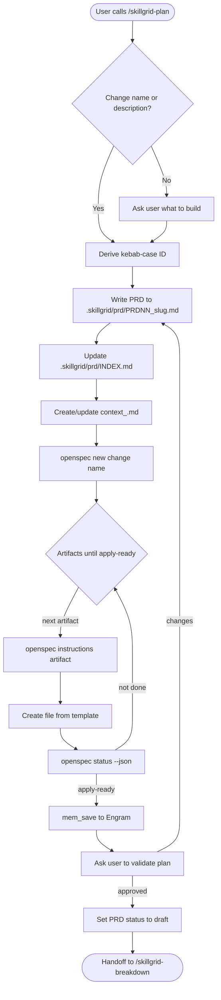
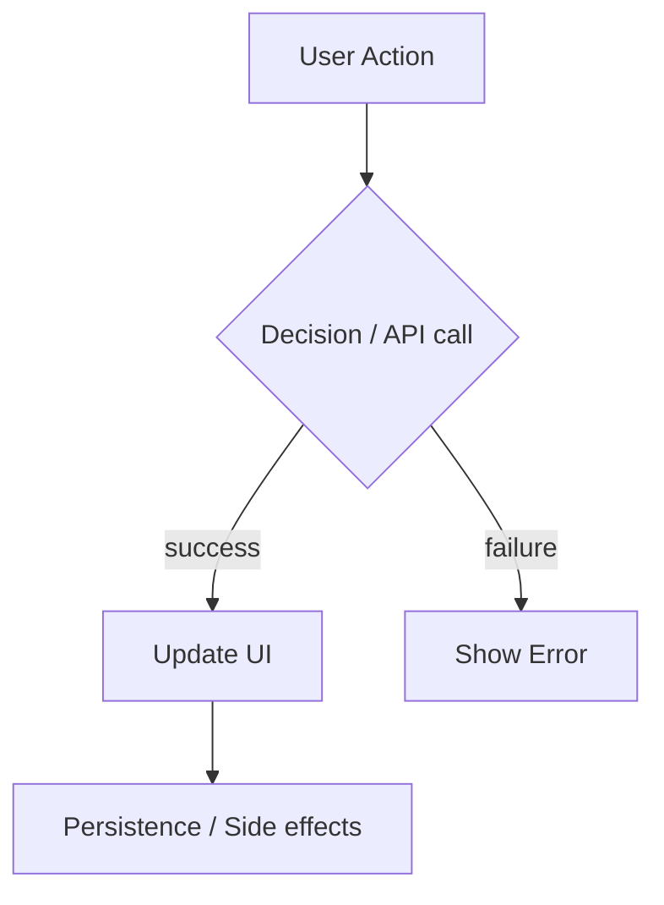
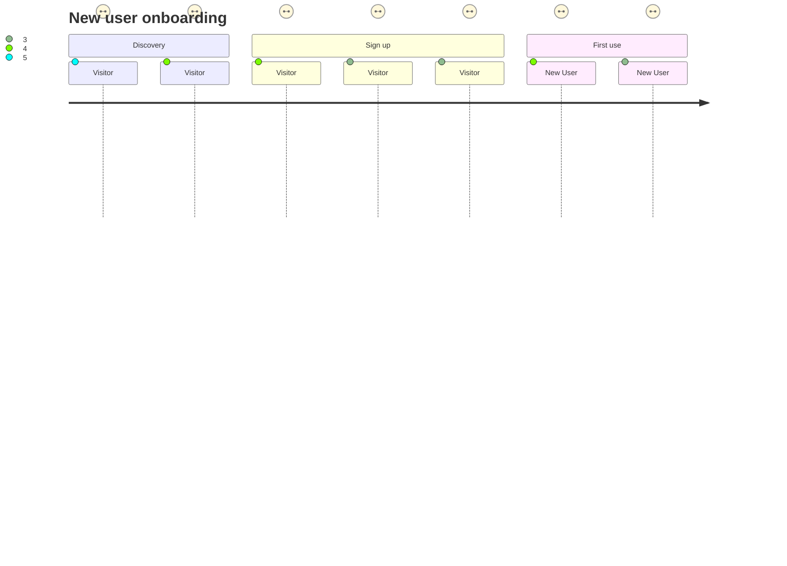
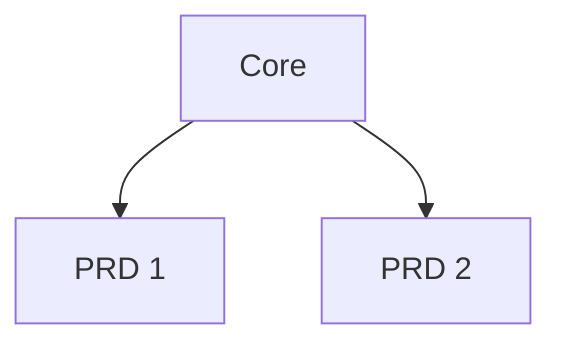
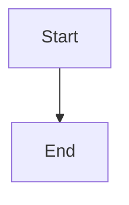
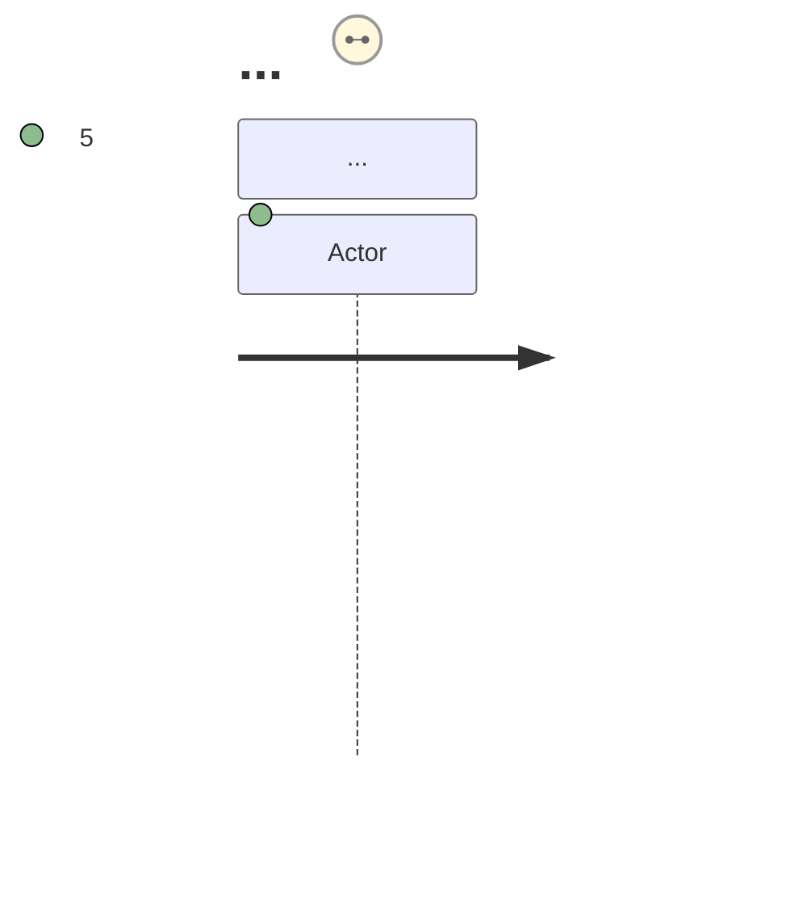

<objective>

You are executing **`/skillgrid-plan`** (PLAN phase) for the Skillgrid workflow.

**Order:** Produce or update the **PRD** first (human intent and scope), then create or refresh the **OpenSpec change** and drive artifacts with the OpenSpec CLI. **Always use hybrid persistence:** on-disk `openspec/changes/<name>/` **and** a **`mem_save`** to Engram with a stable **`topic_key`** (e.g. `skillgrid/{change-name}/plan` or your team’s prefix) containing the change id, PRD path, and links to `openspec/changes/<name>/` (align with **`/skillgrid-init`**).

**Status on exit:** Set the PRD’s **`Status:`** to **`draft`** (and the same in **`.skillgrid/prd/INDEX.md`** ticket tables, if used). This is the first step in the lifecycle under **`/skillgrid-init` → PRD / change `Status` lifecycle** (`draft` → `todo` → `inprogress` → `devdone` → `done`).

</objective>

<process>

## Flow



## Part A — PRD (required)

### PRD file naming and execution order (authoritative)

- **Pattern (canonical):** **`.skillgrid/prd/PRD<NN>_<descriptive-slug>.md`** where **`<NN>`** is a **two-digit** index (`01`, `02`, `03`, …) giving the **intended order of execution** (first to ship / first dependency first). The slug is `kebab-case` or `lower_snake` after the second underscore. **Example:** `.skillgrid/prd/PRD01_auth-foundation.md`, `.skillgrid/prd/PRD02_tasks-to-do.md`.
- **Index:** **`.skillgrid/prd/INDEX.md`** — one row or bullet per PRD, sorted by `<NN>`.
- **Before** creating, splitting, or merging PRDs, **list every** `PRD*.md` under **`.skillgrid/prd/`** (and, if present for migration only, root `prd/`). **Sort by `<NN>`.** If execution order should change, **rename files** (update `<NN>`) so the sequence matches reality, then fix **`.skillgrid/prd/INDEX.md`**, any cross-links between PRDs, and references in `openspec/changes/…` or Engram notes.
- **New PRD** — Use the next free number **or** an intermediate number and **reorder** (renumber) existing files so numbers stay **contiguous in execution order** (no duplicate `<NN>`, no gaps when you intend a strict total order—optional gaps are allowed only if documented in `INDEX.md`).

1. **PRD (required format)** — Produce or update a PRD that follows the structure below, using the path **`.skillgrid/prd/PRD<NN>_<slug>.md`** and **`.skillgrid/prd/INDEX.md`**: one row or bullet per PRD, **sorted by `NN`**, with title and `openspec/changes/…` link. If the project keeps extra copies under `docs/PRD/`, mirror names or link back to the canonical **`.skillgrid/prd/PRDNN_…`** file. **Do not** create new PRDs under root **`prd/`** (use **`.skillgrid/prd/`** only; see **`/skillgrid-init`**).
   - **User journeys** – Once scope, goals, and actors are clear, ask:  
     *“Would you like to add Mermaid user‑journey diagrams for the main personas? They help acceptance testing.”*  
     * If yes, draft a `journey` diagram together and place it in the PRD under `### User Journeys`.  
     * If the user prefers text stories alone, skip the diagram.  
     * The `### Feature diagram` can also be added at this point if a visual flow clarifies the feature.
2. **Spec discipline** — The PRD is the single source of product intent until superseded by design or delta specs; keep it consistent with any existing `openspec/changes/<id>/proposal.md` when both exist.

### PRD document format

Use this outline for every PRD. Adapt headings only if the repo’s own PRD template says otherwise.

#### Title block

- Heading: `### PRD: <Title>` (should align with the filename, e.g. `PRD02_tasks-to-do` → a clear title for that slice)
- **File:** `.skillgrid/prd/PRD<NN>_<slug>.md` — execution order = `<NN>`
- **Spec / change:** `<path>` — canonical source for status and technical artifacts (e.g. `openspec/changes/<id>/` or project equivalent)
- **Session context (optional):** `.skillgrid/tasks/context_<change-id>.md` — rolling handoff for parent + subagents; create or refresh during this command (see *Session context* under Part B)
- **Status:** `draft` (after this command; later phases set `todo` → `inprogress` → `devdone` → `done` per **`/skillgrid-init`**) — or project extension of that lifecycle
- **Depends on (optional):** other PRD files (by `PRDNN_` name) that must be done or stable before this one
- **Tech / stack (optional):** one line — key languages, framework, and critical dependencies for this slice (helps scoping; mirror deeper detail in **Project fit** or `design.md`)

#### Problem / why

What is wrong or missing, who is affected, and why it matters now.

#### Goals

Bullet list of measurable or clearly verifiable outcomes.

#### Assumptions (optional but recommended)

Surface assumptions the plan depends on; wrong assumptions should be corrected before design or implementation.

#### In scope / out of scope

What this change includes and what is explicitly not included (prevents scope creep).

#### Decomposition (optional, recommended for large work)

- If the work spans **several independent subsystems** (each could ship and be tested on its own), **split** into **separate** `PRDNN_` files (one focus per PRD), rather than one mega-PRD. Aligns with a “one plan = one shippable slice” discipline.
- If you keep a single PRD, list **subsystems** here and note which is in scope for **this** `PRDNN_` only.

#### Codebase touchpoints (optional)

High-level only (not a full implementation plan): **packages, top-level dirs, or files** expected to be **created** or **modified**—enough to lock **boundaries** and inform **`/skillgrid-breakdown`**. Put **detailed** file-by-file steps, exact commands, and per-step code in **`openspec/.../tasks.md`** (via **`/skillgrid-breakdown`**) and keep that checklist in sync with the PRD. If the team also keeps a long-form implementation write-up, store it under something like `docs/.../plans/YYYY-MM-DD-<feature>.md` (or your repo’s path); do **not** paste that level of detail into the PRD body.

#### Feature diagram (optional)



#### User Journeys



#### User stories (optional)

Short “As a … I want … so that …” items when behavior is user-facing.

#### Functional requirements

Numbered or bulleted **must-haves** for behavior, APIs, UX, and data. Each item should be testable.

**Quality bar:** Do not leave **TBD**, **TODO**, or **“implement later”** in must-haves. Avoid vague items (“add appropriate error handling”, “add validation”) without a **verifiable** signal. If something is unknown, make it an **assumption** or a **spike** requirement with an explicit exit.

#### Non-functional requirements

Include as relevant: performance, security, privacy, accessibility, compatibility, observability, operational runbooks.

#### Success criteria

How reviewers will know the work is done (acceptance-level checks, not a task list).

#### Author self-review (before “done” on the PRD draft)

Run once yourself (not a subagent). **(1) Coverage** — each goal and major **in-scope** item maps to a requirement or success criterion. **(2) Placeholder scan** — no forbidden vague patterns in **Functional requirements** (see **Quality bar**). **(3) Consistency** — same names for features, APIs, and entities across requirements (avoid `clearLayers` in one place and `clearFullLayers` in another). Fix gaps in the PRD before handoff; detailed task-level review belongs in **`/skillgrid-breakdown`** and **`tasks.md`**.

#### Boundaries (agent / team guardrails)

- **Always do** — e.g. tests before merge, naming, validation
- **Ask first** — e.g. schema, new deps, CI
- **Never do** — e.g. secrets in repo, silent requirement changes

#### Project fit (when the change affects how work is done)

Concise notes on: **Commands** (real commands with flags), **structure** (paths for code, tests, docs), **code style** (one short illustrative pattern), **testing strategy** (levels and expectations). Skip subsections that are unchanged.

#### Implementation tasks (optional in PRD; often refined in `/skillgrid-breakdown`)

If present: numbered workstreams and checkboxes; should trace to requirements above. Prefer linking to `tasks.md` for the full breakdown when it exists.

---

## Part B — OpenSpec change + Engram (hybrid, required)

Run the CLI steps below. After artifacts reach **apply-ready** (or when you have a solid checkpoint), **`mem_save`** a short planning summary to **Engram** (change id, PRD path, links to `openspec/changes/<name>/`).

**Input**: The argument after `/skillgrid-plan` is the change name (kebab-case), **or** a description of what to build. If the user only gave a description, derive a kebab-case name (e.g. “add user authentication” → `add-user-auth`).

### Steps (CLI-driven artifact loop)

1. **If no input provided, ask what to build**  
   Ask in your own words what change they want. Do **not** proceed without a clear intent and a kebab-case **change id** (or an explicit decision to use an existing id).

2. **Create the change directory**

   ```bash
   openspec new change "<name>"
   ```

   This creates a scaffolded change at `openspec/changes/<name>/` (layout depends on OpenSpec CLI version; follow the generated tree).

3. **Session context (filesystem handoff)** — For Skillgrid, establish the per-change handoff the parent and `Task` subagents will use:

   - Create **`.skillgrid/tasks/research/<name>/`** if missing.
   - Create or update **`.skillgrid/tasks/context_<name>.md`** using the skeleton in **`docs/workflow.md`** (*Filesystem handoff*). Set **Change / PRD links**, **current goal**, and **state** (`planning` / `research`). Cross-link the PRD path you use in Part A.
   - When you write or next edit **`openspec/changes/<name>/proposal.md`**, add a single line the reader cannot miss, e.g. `**Skillgrid session context:** .skillgrid/tasks/context_<name>.md` (body or frontmatter, per team convention; keep one canonical pointer).

4. **Get the artifact build order**

   ```bash
   openspec status --change "<name>" --json
   ```

   Parse the JSON to get:

   - `applyRequires`: artifact IDs that must be complete before implementation (e.g. `["tasks"]`)
   - `artifacts`: all artifacts with status and dependencies

5. **Create artifacts in sequence until apply-ready**

   Use a todo list to track progress through the artifacts.

   Loop in dependency order (artifacts with satisfied dependencies first):

   a. **For each artifact that is `ready`:**

   - Get instructions:

     ```bash
     openspec instructions <artifact-id> --change "<name>" --json
     ```

   - The JSON typically includes: `context`, `rules`, `template`, `instruction`, `outputPath`, `dependencies`. **Do not** paste raw `<context>`, `<rules>`, or `<project_context>` blocks into the output files—they constrain what you write, not the file body.
   - Read completed dependency files for context.
   - Create the file at `outputPath` using `template` and `instruction`.
   - Show brief progress (e.g. `Created <artifact-id>`).

   b. **Continue until every id in `applyRequires` is `done`**

   - After each artifact, re-run `openspec status --change "<name>" --json` and confirm all `applyRequires` entries show `status: "done"`.

   c. **If an artifact needs user input**, ask, then continue.

6. **Final status**

   ```bash
   openspec status --change "<name>"
   ```

7. **Validate with the user** — After all artifacts are created and the change is apply‑ready, present a summary and ask for approval.

   - Summarise:
     - PRD path and title
     - Change id and path (`openspec/changes/<name>/`)
     - Key in‑scope goals, out‑of‑scope items, and success criteria (2–3 bullets)
     - List of created OpenSpec artifacts with one‑line descriptions
     - Current PRD status: `draft`
   - Ask: *“Does this plan look correct? Reply **approved** to proceed to `/skillgrid-breakdown`, or describe what should change.”*
   - If the user requests changes, apply them to the PRD and/or OpenSpec artifacts, then re‑check status and repeat validation.
   - Only after explicit approval should you produce the completion report (below) and suggest the next command.

### Output after Part B

Summarize: change name and path; list of artifacts and short descriptions; state that the change is **apply-ready** when `applyRequires` are done. Confirm the Engram `mem_save` (hybrid) was done or queued. **Ensure** the PRD’s **`Status:`** is **`draft`** and INDEX / ticket table matches. Point the user to **`/skillgrid-breakdown`** (then **`/skillgrid-apply`**) to implement.

### Artifact creation guardrails

- Follow each artifact’s `instruction` and schema.
- Read dependency artifacts before creating dependents.
- **Never** copy `context` / `rules` blocks into the written files.
- If a change with that name already exists, ask whether to continue it or use a new name.
- Verify each file exists on disk before moving to the next artifact.
- **Fan-out / `Task` subagents:** If you spin off research or exploration in a **subagent**, put **`.skillgrid/tasks/context_<name>.md`** and **`.skillgrid/tasks/research/<name>/`** in the subagent prompt so it can read the handoff and spill long output; see `docs/workflow.md` — *Parallel discovery* / *Subagent contract*.

## PRD file templates (formatting)

Use with **Part A — PRD** above. **Canonical paths:** **`.skillgrid/prd/INDEX.md`** and **`.skillgrid/prd/PRD<NN>_<slug>.md`**.

### `.skillgrid/prd/INDEX.md`

Index of product requirement write-ups. If you use OpenSpec, each row can point at `openspec/changes/<change-id>/` or your equivalent.

````markdown
### <Product> PRD index

This folder holds **human-friendly PRDs**; canonical technical detail may live in `<e.g. openspec/changes/>`.



### Available PRDs

- **<Short title>**
  - Spec / change: `<path to change or spec>`
  - PRD: `.skillgrid/prd/<slug>.md`
- …
````

### `.skillgrid/prd/PRD<NN>_<slug>.md` (minimal skeleton)

One file per major change or feature. Expand using **### PRD document format** in Part A; this skeleton is a short starting point.

````markdown
### PRD: <Title>

**Spec / change:** `<path>` (canonical source of truth for status)  
**Status:** draft

#### Problem / why

<What is wrong or missing; user impact.>

#### Goals

- …

#### Functional requirements

- …

#### Non-functional requirements

- **Performance / security / compatibility:** …

#### Feature diagram (optional)



#### User Journeys


---

### Implementation tasks

<!-- Optional checklist; mirror `openspec/.../tasks.md` after /skillgrid-breakdown. -->

#### 1. <Workstream>

- [ ] 1.1 …
- [ ] 1.2 …

#### 2. <Workstream>

- [ ] …
````

### Jira-style ticket list (click through to PRD)

Add this on top of the normal PRD files.

1. **Linkable index** — In **`.skillgrid/prd/INDEX.md`**, add a **table** (renders as a ticket list in GitHub, GitLab, many IDEs). Each **Summary** or **Key** cell links to the PRD file so one click opens the full document.

| Key | Summary | Status | Spec / change | PRD |
|-----|---------|--------|---------------|-----|
| PRD-01 | [Short title](.skillgrid/prd/PRD01_<slug>.md) | draft | `openspec/changes/<id>/` | [Open →](.skillgrid/prd/PRD01_<slug>.md) |

- Use stable **keys** (`PRD-01` …) matching **`<NN>`** so cross-links stay obvious.
- **Status** column must match the PRD **`Status:`** line; use the Skillgrid lifecycle: `draft` | `todo` | `inprogress` | `devdone` | `done` (see **`/skillgrid-init`**).

2. **PRD body — Jira-shaped blocks (optional)** — At the top of each **`.skillgrid/prd/PRD<NN>_<slug>.md`**, after the title, you may add a tight block so the file “reads like” an issue:

   - **Ticket key:** `PRD-<NN>` (or your project prefix)  
   - **Type:** Story | Task | Bug (product convention)  
   - **Summary:** one line (repeat the PRD title)  
   - Then keep **Problem / why**, **Goals**, requirements, and **Success criteria** as the **Description / Acceptance** equivalent.

3. **Plain markdown limit** — True Jira UI (modals, inline expand) needs Jira or a web app. In-repo workflow: **clickable links only** (table + `[text](path)`). If the user uses **Jira**: paste the PRD link in the Jira **Description** or use automation; do not claim the markdown file is a Jira mirror unless they integrate it.

4. **Optional file** — If **INDEX.md** gets crowded, add **`.skillgrid/prd/TICKETS.md`** containing only the table + one line of intro; keep **INDEX.md** as the narrative index and link to **TICKETS.md** from **`AGENTS.md`** or the README when the team opts in.

## Notes

- Inspect the repo with tools; do not assume stack or layout.
- **Formatting templates** for project docs live in **`/skillgrid-init`** (**Project document templates**).
- For a guided first OpenSpec cycle, run `/opsx-onboard` or follow that command’s preflight and phases.

## Anti-patterns

- **Implementation detail in the PRD** – Never put file‑by‑file steps, CLI commands, or code snippets in the PRD body; that belongs in `tasks.md` after breakdown.
- **Skipping user validation** – Never proceed to `/skillgrid-breakdown` without the user explicitly approving the plan.
- **PRD without OpenSpec link** – Don’t create a PRD without pointing it at a concrete `openspec/changes/<id>/` directory.
- **Vague requirements** – Never leave `TBD`, `TODO`, or “add appropriate error handling” in the **Functional requirements**; every item must be testable.
- **Root `prd/` files** – No new PRDs outside `.skillgrid/prd/`.

## Completion report (required)

End with a **Session wrap-up** the user can scan:

1. **What I did** — Bullets: PRD path(s) under **`.skillgrid/prd/`**, OpenSpec change name, artifacts driven (`openspec` commands), and Engram `topic_key` if saved.
2. **Token / usage** — If the product shows **input/output tokens**, **context used**, or **session cost** for this turn, report it. If not available, state **`Token usage: not shown in this environment`** (do not guess).
3. **Suggested next command** — **`/skillgrid-breakdown`** to align **`tasks.md`** and PRD checklists; if tasks are already trivial, **`/skillgrid-apply`**.

</process>
