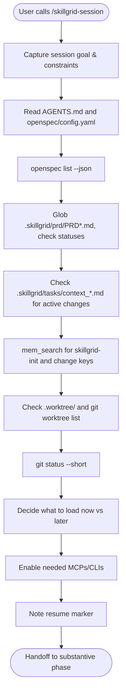

<objective>

You are executing **`/skillgrid-session`** (Phase 0) for the Skillgrid workflow.

Use this at the **start of a new agent session**, after context compaction, or when switching tracks so work stays bounded and reproducible.

</objective>

<process>

## Flow

## Steps

1. **Charter** — Capture a short session note: goal, constraints, success criteria, and stack or repo assumptions. Align with how your project records session context (e.g. project playbook or `NOTE.md`).
2. **Restore project memory (hybrid)**  
   - Read **`AGENTS.md`** and **`openspec/config.yaml`** (if present) for stack, conventions, and rules.  
   - Run `openspec list --json` to identify active changes.  
   - Glob **`.skillgrid/prd/PRD*.md`** and check `Status:` lines to find work in flight.  
   - For each active change, check for **`.skillgrid/tasks/context_<change-id>.md`** — if one exists, display its `state`, `current goal`, and `last checkpoint` so the user can resume immediately.  
   - If Engram is available, `mem_search` for `skillgrid-init/{project-name}` and any change-scoped keys (`skillgrid/<change>/plan`, `skillgrid/<change>/verify-report`). Offer to load the full text via `mem_get_observation`.

3. **Detect parallel work**  
   - Check for **`.worktree/`** directories and any associated branches (`git worktree list`). Warn if multiple worktrees are active and which changes they map to.
   - Run `git status --short` to surface uncommitted work from a previous session.
4. **Context budget** — Decide what must be loaded now versus later: rules, skills, MCP servers, and large files. Prefer minimal viable context until a phase needs depth.
5. **Tooling** — Enable only the MCPs and CLIs needed for this session; defer the rest to avoid noise and token burn.
6. **Checkpoint** — Note where to resume if interrupted (open change, branch, last task id, or spec section).
7. **Research vs build** — If discovery is still open, prefer a quick literature pass (web, docs MCPs, repo search) before locking design; if building, defer broad research unless a risk appears.

## Practices (inline)

- **Context** — Pack rules and files in layers; load deep docs only when a phase needs them.
- **Assumptions** — State what you believe about stack and scope; keep edits small and falsifiable.
- **Packaged instructions** — Optional: some IDEs auto-discover extra instruction files in the repo; this command does not link to any of them by path.

## Notes

- Phase 0 is **orthogonal** to `/skillgrid-init` (repo bootstrap). Run session when the **agent context** resets; run init when the **repository** still needs structure or tooling setup.
- Inspect the repo with tools; do not assume stack or layout.

## Anti-patterns

- **Relying on chat history** – Never assume context from a previous chat; always run `/skillgrid-session` first to restore active changes, worktrees, and Engram state.
- **Loading everything** – Don’t enable all MCPs and files at once; use the context budget to load only what the imminent phase needs.
- **Skipping the checkpoint** – Never start heavy work without noting a resume marker (change id, task number, branch, etc.).
- **Ignoring parallel work** – Don’t forget to check for active `.worktree/` directories and uncommitted changes before modifying files.

## Completion report (required)

End with a **Session wrap-up** the user can scan:

1. **What I did** — Bullets: Engram or memory steps run, `topic_key` or summaries saved, context loaded, and any repo paths refreshed.
2. **Token / usage** — If the product shows **input/output tokens**, **context used**, or **session cost** for this turn, report it. If not available, state **`Token usage: not shown in this environment`** (do not guess).
3. **Suggested next command** — The user’s substantive task: usually **`/skillgrid-plan`**, **`/skillgrid-init`**, or **`/skillgrid-apply`** depending on their goal; state which you recommend and why in one line.

</process>
