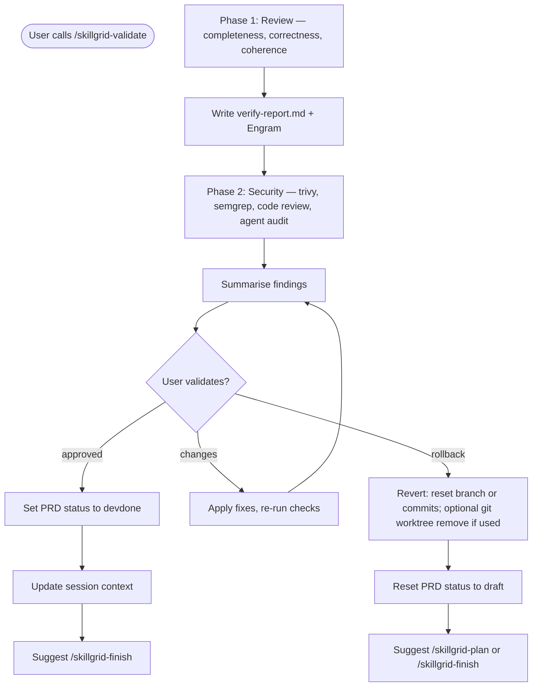

<objective>
You are executing **`/skillgrid-validate`** for the Skillgrid workflow.

This command is a **single, self‑contained gate** that performs a complete review, a complete security check, and then requires the user to approve (or rollback) the change. Do **not** delegate to separate `/skillgrid-review` or `/skillgrid-security` commands; all steps are defined here.

**Hybrid persistence:** always use on‑disk `openspec/changes/<name>/` **and** Engram (`mem_save`) to persist findings.
</objective>

<process>

## Flow

## Phase 1 – Review (on‑disk & code/product)

### 1.1 OpenSpec verification

**Input:** The change name (kebab‑case). If missing, list active changes with `openspec list --json` and ask the user to choose.

- **Status**  
  `openspec status --change "<name>" --json`

Note `schemaName` and existing artifacts.

- **Apply context**  
  `openspec instructions apply --change "<name>" --json`

Read all listed `contextFiles`.

### 1.2 Completeness

- **Tasks:** If `tasks.md` is in context, count open `- [ ]` vs completed `- [x]`. Flag incomplete core tasks as **CRITICAL**.
- **Delta specs:** If `openspec/changes/<name>/specs/` exists, extract `### Requirement:` blocks and search the codebase for likely implementations. Unimplemented requirements → **CRITICAL**.

### 1.3 Correctness

- For each requirement, find implementation evidence; divergence → **WARNING** with file:line.
- For `#### Scenario:` blocks, check for corresponding test coverage; missing coverage → **WARNING** or **SUGGESTION**.

### 1.4 Coherence

- Compare `design.md` decisions against code; contradictions → **WARNING**.
- Check new code against repo patterns (naming, layout); big deviations → **SUGGESTION**.

### 1.5 Code & product review

- **Code review** — Readability, coupling, error handling, change size. Use blocker / major / minor.
- **Performance** — Check hot paths the change touched; flag obvious regressions.
- **Data** — For storage changes: review schema, queries, migrations.
- **Documentation** — If public APIs or behaviour changed, note missing docs.
- **Design audit (optional):** If the change includes UI, offer to audit the visual quality. Use Impeccable’s critique capabilities: quantitative UX scoring, anti‑pattern detection, and actionable feedback on visual hierarchy, cognitive load, and emotional resonance. Write findings into the review report or flag them during user validation.

### 1.6 Review report

Write **`openspec/changes/<name>/verify-report.md`** with a summary table (completeness / correctness / coherence), all findings with severity (CRITICAL / WARNING / SUGGESTION), and a verdict (ready / must‑fix / ship‑with‑warnings). Persist to Engram as `mem_save` with topic key `skillgrid/<change-name>/verify-report`.

---

## Phase 2 – Security (deep review)

### 2.1 Automated baseline (if not already in test phase)

Run quick scanner baseline to ensure no glaring issues slipped through:
  - `trivy fs --scanners vuln,secret,misconfig --severity HIGH,CRITICAL .`
  - `semgrep --config auto --error --strict .`

### 2.2 Code security review

Manually inspect critical paths for:
- AuthN/Z flaws, hardcoded secrets, injection (SQL/command/template/noSQL)
- SSRF, open redirects, path traversal, unsafe deserialisation
- Trust boundaries and blast radius

### 2.3 Dependency & container deep‑dive

- For every added/bumped dependency: check for unmaintained, licence issues, known exploits
- Container images: minimal base, non‑root user, Trivy image scan if applicable
- IaC misconfigurations (open ports, overly permissive IAM)

### 2.4 Agent & IDE config audit

- Review `.cursor/`, `.kilo/`, `.opencode/`, `.github/prompts/` for unsafe defaults
- MCP server permissions, tool allow‑lists
- Agent definitions for risky patterns

### 2.5 Deprecation hygiene

If the change removes or replaces endpoints/keys/dependencies:
- List old entry points and plan a deprecation timeline
- Verify no stale secrets or docs remain

### 2.6 Risk framing & threat model

- Identify threat actors and trust assumptions
- Prioritise findings: 🟥 Critical / 🟧 High / 🟨 Medium / 🟩 Low
- Document mitigations

### 2.7 Security findings summary

Collect all security findings into a concise summary for the user (do not write a separate file unless the user requests; include in the combined validation prompt).

---

## Phase 3 – User validation & rollback

Present the combined outcome:

- Change id and linked PRD path
- Review verdict and security severity counts
- Any unresolved blockers from either pass

Then ask:
> *“Does this change pass validation? Reply **approved** to set status to `devdone` and proceed to `/skillgrid-finish`, describe what to fix, or reply **rollback** to discard the change.”*

Handle responses:
- **Approved:** continue to Phase 4.
- **Changes requested:** apply fixes, re‑run affected checks, re‑prompt.
- **Rollback:**
  - **Default (single working tree):** guide reverting commits or resetting the feature branch; do not assume a second checkout (see `docs/workflow.md` — *Filesystem handoff*).
  - **If** the team uses an **optional** `.worktree/<slug>/`, remove it with `git worktree remove .worktree/<slug>/ --force` before or as part of branch cleanup.
  - Reset PRD status to `draft` (or archive). Suggest next steps: `/skillgrid-plan` or `/skillgrid-finish`.
- **No response:** wait; do not advance.

---

## Phase 4 – Finalise (after approval)

- Set PRD **`Status:`** to **`devdone`** (and update `.skillgrid/prd/INDEX.md` / ticket table).
- Update `.skillgrid/tasks/context_<change-id>.md` with a validation sign‑off note.

---

## Verification discipline

- Never claim a check passed without running it and reading the output.
- Avoid weak claims (“should pass”, “looks correct”); always provide evidence.
- If work was delegated to subagents, independently confirm the repository state and results.
- Regression tests must show red‑green where possible.

---

## Optional: IDE personas

If your environment supports parallel subagents, you may fan out the review and security steps concurrently, but the user validation (Phase 3) must happen after all reports are merged.

---

## Notes

- Inspect the repo with tools; do not assume stack or layout.
- This command is self‑contained; it does not invoke separate `/skillgrid-review` or `/skillgrid-security` commands.
- **Ticketing:** Read **`.skillgrid/config.json`**. If **`ticketing.provider`** is not **`local`**, mention in the Phase 3 summary that **`/skillgrid-finish`** should align the remote issue (GitHub / GitLab / Jira) with **`devdone`** — PRD status on disk remains the primary signal for agents.

## Anti-patterns

- **Skipping user validation** – Never set status to `devdone` automatically; the combined review+security report must be approved by the user.
- **No rollback option** – Don’t finish the gate without offering to revert the change (branch, commits, and only if used: optional worktree) if the user rejects.
- **Weak claims** – Never state “the change passes” without running fresh checks and reading their results.
- **Combining without review** – Don’t treat this as a substitute for a separate human review when the team requires it; still present all findings.

## Completion report (required)

End with a **Session wrap-up** the user can scan:

1. **What I did** — Bullets: review + security outcomes, reports written, and final validation decision (approved / changes requested / rollback).
2. **Token / usage** — If the product shows **input/output tokens**, **context used**, or **session cost** for this turn, report it. If not available, state **`Token usage: not shown in this environment`** (do not guess).
3. **Suggested next command** — **`/skillgrid-finish`** to archive, sync specs, and create a PR (if approved); **`/skillgrid-apply`** if blockers need more implementation; or **`/skillgrid-plan`** if a rollback requires a fresh start.

</process>
