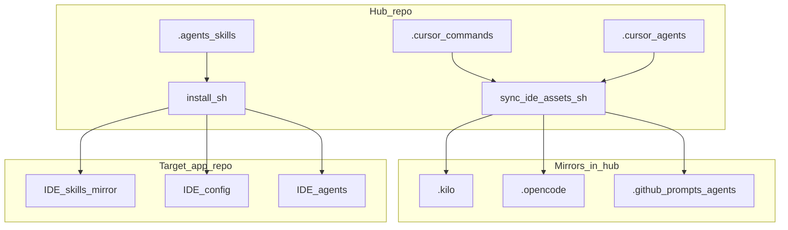

# AISkillGrid — Architecture

> **Status:** Active hub layout (living document).

## Overview

AISkillGrid separates **authoring** (what humans and lead agents edit) from **installation** (what `install.sh` copies into a product repo). The hub optimizes for **Skillgrid** phase commands, **OpenSpec** (`opsx-*`) operations, and **Agent Skills** loaded by multiple IDEs.

## Layers

| Layer | Responsibility |
|-------|----------------|
| **Skills** | Durable playbooks: OpenSpec, SDD, testing, security, etc. |
| **Commands** | Phase entry points: when to load which skills. |
| **Personas** | Optional *who*: subagent prompts for a single perspective (review, audit, explore, …). |
| **Installer** | Merge MCP, copy `AGENTS.md`, rsync IDE dirs, sync skills per selected IDE. |
| **Sync script** | Keep non-Cursor copies of commands and agents identical to Cursor in this repo. |

## Design decisions

| Decision | Choice | Rationale |
|----------|--------|-----------|
| Canonical IDE folder | `.cursor/` | Single edit location; mirrors reduce per-IDE drift. |
| Copilot prompts | Stripped frontmatter | Copilot expects `description` + body; full YAML lives in Cursor. |
| CI | `sync-ide-assets.sh --check` | Fails PRs when mirrors drift. |

## Where to read next

- [STRUCTURE.md](STRUCTURE.md) — paths and sync detail
- [PROJECT.md](PROJECT.md) — onboarding narrative
- [docs/wokflow.md](../docs/wokflow.md) — end-user workflow phases
