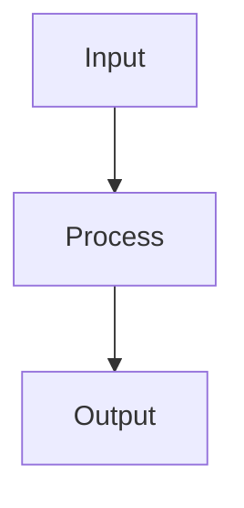

# Architecture

## Overview

<One-paragraph system overview.>

## Major subsystems

| Subsystem | Responsibility | Key paths |
|---|---|---|
| <name> | <responsibility> | `<path>` |

## Boundaries

- <Boundary or ownership rule>

## Data flow

## Architecture decision records (MADR)

Full ADR documents live under **`.skillgrid/adr/`** (MADR only; see `documentation-and-adrs` and `.skillgrid/templates/template-adr.md`). Use **Durable decisions** below for one-line summaries with links to `NNNN-slug.md` files.

## Durable decisions

- <Decision> — <why> — <link to `.skillgrid/adr/NNNN-slug.md`, PRD, or OpenSpec if available>

## Risks and watch areas

- <God node, fragile integration, migration risk, or missing test area>
