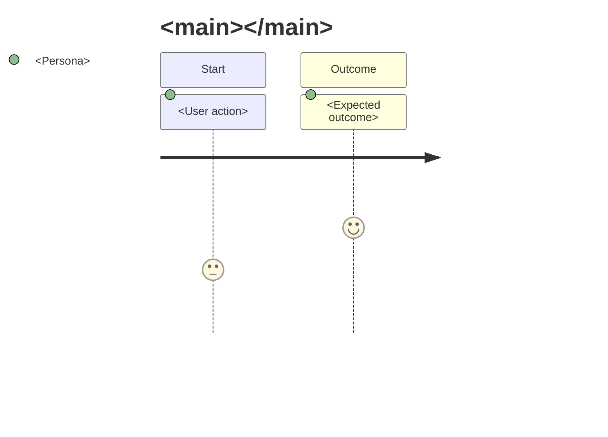
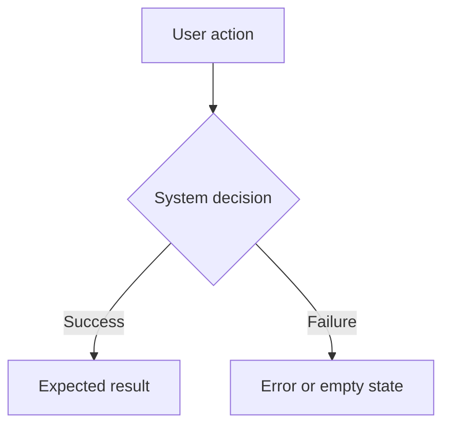

### PRD: <Title>

- **File:** `.skillgrid/prd/PRD<NN>_<slug>.md`
- **Spec / change:** `openspec/changes/<change-id>/`
- **Session context:** `.skillgrid/tasks/context_<change-id>.md`
- **Status:** `draft`
- **Preview:** optional `.skillgrid/preview/<change-id>-options.html`
- **External:** local
- **Depends on:** None
- **Tech / stack:** <languages/frameworks/services that matter for this slice>

#### Problem / why

<What is wrong or missing, who is affected, and why it matters now.>

#### Solution

<The user-facing solution and the outcome the user should experience.>

#### Goals

- <Measurable or clearly verifiable outcome>
- <User-visible or operator-visible result>

#### Assumptions

- <Assumption that should be corrected before implementation if false>

#### In scope

- <Capability or behavior included in this PRD>

#### Out of scope

- <Explicitly excluded capability or future work>

#### User stories

1. As a <actor>, I want <feature or behavior>, so that <benefit>.
2. As a <actor>, I want <feature or behavior>, so that <benefit>.

#### Decomposition

<If this PRD is part of a sequence, explain the slice boundary and adjacent PRDs. If it is too broad, split it before continuing.>

#### Codebase touchpoints

- `<directory-or-module>` — <why it is likely involved>

#### Implementation decisions

- <Module, interface, schema, API, state, or interaction decision that shapes implementation.>
- <Deep-module opportunity or boundary that should remain testable in isolation.>

Do not include fragile code snippets here. Prefer stable module names, interfaces, responsibilities, and contracts over exact implementation steps.

#### Testing decisions

- <External behavior that must be tested, not implementation details.>
- <Modules or boundaries that need tests.>
- <Prior art in the codebase for similar tests.>

#### User Journeys

#### Feature diagram

#### Success criteria

- [ ] <Observable behavior that proves the PRD is done>
- [ ] <Verification that can be tested manually or automatically>

#### Quality bar

- [ ] Accessibility or UX expectation
- [ ] Test coverage expectation
- [ ] Security, privacy, or performance expectation if relevant
- [ ] Documentation or handoff update expectation

#### Implementation tasks

- [ ] `[HITL]` <Human decision or approval needed before autonomous work>
- [ ] `[AFK]` <Autonomous implementation slice tied to this PRD>

#### Open questions

- <Question, owner, and when it must be answered>

#### Author self-review

- [ ] PRD links the correct OpenSpec change.
- [ ] Scope is small enough for a vertical slice.
- [ ] Success criteria are testable.
- [ ] Implementation tasks trace to goals.
