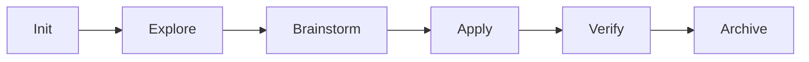

# AISkillGrid

<div align="center">


<p><strong>AISkillGrid — An In-Battery spec-driven workflows orchestration for AI coding agents.</strong></p>

<p>
<a href="LICENSE"></a>


</p>

</div>

---

## What It Does

AISkillGrid is a local-first operating layer for AI-assisted development.

It turns open-ended chat into a structured engineering workflow:

- phase commands (`/sdd-*`)
- reusable skills (`.agents/skills/*`)
- durable artifacts (`.skillgrid/` + `openspec/changes/`)
- verification-first quality gates
- memory and indexing integration

The goal is not blind autonomy. The goal is controllable, reviewable progress with clear stop conditions.

## Active Command Surface

This repository currently uses:

- `/sdd-init`
- `/sdd-explore`
- `/sdd-brainstorm`
- `/sdd-design-ui`
- `/sdd-diagnose`
- `/sdd-apply`
- `/sdd-verify`
- `/sdd-archive`

Typical flow:



## Quick Start

1. Open this repository in your agent-enabled IDE.
2. Bootstrap project context:

   ```text
   /sdd-init
   ```

3. Start a change:

   ```text
   /sdd-brainstorm <change-name>
   ```

4. Implement and verify:

   ```text
   /sdd-apply
   /sdd-verify
   /sdd-archive
   ```

## Core Structure

- `.agents/workflows/` — command-level workflow entry points
- `.agents/skills/` — executable skill procedures and guardrails
- `.skillgrid/templates/` — canonical artifact templates
- `openspec/changes/` — per-change specs, tasks, proposal/design artifacts
- `docs/` — numbered documentation for installation, workflow, logic, skills, multi-agent, memory, ticketing, and UI

## Documentation

Read in order:

1. `docs/00-start-here.md`
2. `docs/01-installation.md`
3. `docs/02-workflow-usage.md`
4. `docs/03-skillgrid-logic.md`
5. `docs/04-commands.md`
6. `docs/05-skills.md`
7. `docs/06-rules-and-governance.md`
8. `docs/07-hooks-and-automation.md`
9. `docs/08-multi-agent-work.md`
10. `docs/09-subagent-personas.md`
11. `docs/10-mcp-servers.md`
12. `docs/11-memory-and-indexing.md`
13. `docs/12-ticketing-integrations.md`
14. `docs/13-webui.md`
13. `docs/100-ide-configs.md`

## Contributing

- Keep changes aligned to active `/sdd-*` workflow commands.
- Update numbered docs whenever command or skill behavior changes.
- Prefer small, reviewable PRs with clear verification evidence.

## License

Apache-2.0. See `LICENSE`.

