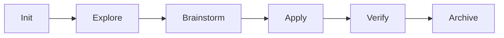

# AISkillGrid

<div align="center">


<p><strong>AISkillGrid — An In-Battery spec-driven workflows orchestration for AI coding agents.</strong></p>

<p>
<a href="LICENSE"></a>


</p>

</div>

---

## What It Does

AISkillGrid is a local-first operating layer for AI-assisted development.

It turns open-ended chat into a structured engineering workflow:

- phase commands (`/sdd-*`)
- reusable skills (`.agents/skills/*`)
- durable artifacts (`.skillgrid/` + `openspec/changes/`)
- verification-first quality gates
- memory and indexing integration

The goal is not blind autonomy. The goal is controllable, reviewable progress with clear stop conditions.

## Active Command Surface

This repository currently uses:

- `/sdd-init`
- `/sdd-explore`
- `/sdd-brainstorm`
- `/sdd-design-ui`
- `/sdd-diagnose`
- `/sdd-openspec-git` (OpenSpec git gates vs `main`)
- `/sdd-adr` (architectural decision records)
- `/sdd-c4` (C4 diagrams)
- `/sdd-gherkin` (Gherkin / BDD scenarios)
- `/sdd-apply`
- `/sdd-verify`
- `/sdd-archive`

Typical flow:



## Quick Start

1. Open this repository in your agent-enabled IDE.
2. Bootstrap project context:

   ```text
   /sdd-init
   ```

3. Start a change:

   ```text
   /sdd-brainstorm <change-name>
   ```

4. Implement and verify:

   ```text
   /sdd-apply
   /sdd-verify
   /sdd-archive
   ```

## Core Concepts

| Concept | Meaning here |
|--------|----------------|
| **Human-in-the-loop (HITL)** | An enforceable task label for human-required decisions. HITL-labeled work hard-stops unattended execution and must be resolved before AFK apply continues. |
| **Away-from-keyboard (AFK)** | An enforceable task label for unattended execution. Only AFK-labeled slices with explicit scope, files, acceptance criteria, and verification should pass into `/sdd-apply`. |
| **Shared understanding** | Before planning, the agent should question the user until goal, scope, constraints, and tradeoffs are understood well enough to write durable artifacts. |
| **Smart zone / dumb zone** | Long context makes coding judgment worse. Keep implementation and review units small enough to fit in a fresh, focused context. |
| **Context rot** | Accuracy drops when a session carries too much stale chat, compacted history, or unrelated work. AISkillGrid fights this with slices, artifacts, and fresh subagents. |
| **Vertical slices** | Break work into thin, testable increments that cross the necessary layers and produce feedback early. Avoid long horizontal phases that only build one layer. |
| **TDD loop** | Behavioral implementation should use RED/GREEN/refactor: write a failing test, make it pass with minimal code, then clean up. |
| **Build Loop** | A controlled `/sdd-loop` iteration that advances one safe `[AFK]` slice, records evidence, then reassesses before continuing or stopping. |
| **User validation** | Explicit checks: spec alignment, review gates, test evidence, security passes, not silent merge-by-default. |
| **Spec-driven development** | Intent lives in specs and change artifacts before and during code. AI implements toward those specs; verification traces back to them. |
| **Intent-driven development** | The workflow starts from durable user intent: goals, scope, constraints, and success criteria. Shared understanding and specs translate that intent into plans and slices so implementation stays aligned with what “done” means—not only with files changed. |
| **Agentic pipeline** | A sequence of command-driven phases (`/sdd-init`, `/sdd-explore`, `/sdd-brainstorm`, `/sdd-loop`, `/sdd-apply`, `/sdd-board`, `/sdd-verify`, `/sdd-archive`) with tools and skills attached, not one long autonomous chat. Optional adjuncts (`/sdd-openspec-git`, `/sdd-adr`, `/sdd-c4`, `/sdd-gherkin`) support git gates, ADRs, diagrams, and Gherkin when needed — see `docs/04-commands.md`. |
| **Harness** | The configured layer around the model: rules, skills, MCP, memory, indexing, handoff paths, UI, so behavior is repeatable and auditable. |
| **Artifacts over transcripts** | PRDs, OpenSpec changes, handoff markdown, logs, and checkpoints are the system of record; chat is ephemeral. |
| **Specialist persona board** | The parent can ask focused personas for independent reports on a decision, but the parent/user/spec remains authoritative. |
| **Local-first and portable** | State lives in the repo and local services where possible; no single vendor runtime is required to resume work. |

## High Council

Specialist **Norse** personas are delegated viewpoints—not owners of the workflow. The parent session (typically **`odin`**) merges reports; **`tyr`** and **`heimdall`** can **hard-gate** progression on critical findings. Details, routing matrix, and commands: [`subagent-personas`](docs/09-subagent-personas.md).

| Persona | Job |
| --- | --- |
| Odin | Primary session owner: SDD sequencing, tools, delegation (default OpenCode primary). |
| Board | Persona-board chair: route personas, run parallel reports, merge verdicts, enforce gates (`/sdd-persona-board`, `/sdd-board`, …). |
| Kvasir | Fast read-only codebase recon: map, entrypoints, dependency direction before big edits. |
| Thor | Implementation enforcer: delivery feasibility, execution quality, momentum. |
| Tyr | Spec and compliance verifier: traceability and acceptance criteria; **critical = hard stop** until resolved or accepted. |
| Heimdall | Security and release-gate sentinel: threat model and exploitability; **critical = hard stop** until resolved or accepted. |
| Frigg | UX and product-clarity reviewer: flows, accessibility, content quality. |
| Loki | Adversarial critic: counterexamples and assumption stress-tests; can flag conflicts needing HITL. |
| Mimir | Bootstrap / memory continuity and architecture coherence; strategic voice on architecture-style boards. |
| Bragi | Structured artifact author: specs, tasks, and clear traceable requirement wording. |
| Vidar | Root-cause debugging: systematic investigation, evidence, regression prevention. |

## Documentation

Read in order:

1. [`docs/00-start-here.md`](docs/00-start-here.md)
2. [`docs/01-installation.md`](docs/01-installation.md)
3. [`docs/02-workflow-usage.md`](docs/02-workflow-usage.md)
4. [`docs/03-skillgrid-logic.md`](docs/03-skillgrid-logic.md)
5. [`docs/04-commands.md`](docs/04-commands.md)
6. [`docs/05-skills.md`](docs/05-skills.md)
7. [`docs/06-rules-and-governance.md`](docs/06-rules-and-governance.md)
8. [`docs/07-hooks-and-automation.md`](docs/07-hooks-and-automation.md)
9. [`docs/08-multi-agent-work.md`](docs/08-multi-agent-work.md)
10. [`docs/09-subagent-personas.md`](docs/09-subagent-personas.md)
11. [`docs/10-mcp-servers.md`](docs/10-mcp-servers.md)
12. [`docs/11-memory-and-indexing.md`](docs/11-memory-and-indexing.md)
13. [`docs/12-ticketing-integrations.md`](docs/12-ticketing-integrations.md)
14. [`docs/13-webui.md`](docs/13-webui.md)

## Contributing

- Keep changes aligned to active `/sdd-*` workflow commands.
- Update numbered docs whenever command or skill behavior changes.
- Prefer small, reviewable PRs with clear verification evidence.

## License

Apache-2.0. See `LICENSE`.

