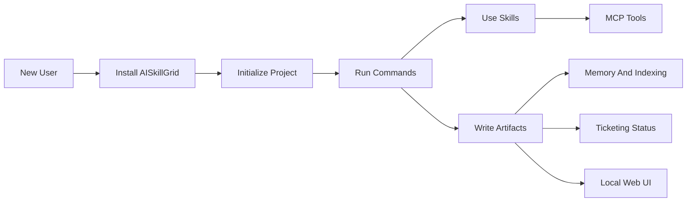
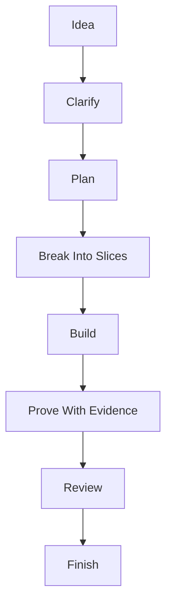

# Start Here

AISkillGrid is a batteries-included operating layer for AI-assisted software development. It gives your agents a shared workflow, reusable skills, specialist personas, MCP tools, durable memory, codebase indexing, ticketing-aware artifacts, and a local web UI.

The point is simple: agent work should not disappear into a chat transcript. It should leave a clear plan, visible state, reviewable files, verification evidence, and a next step that another human or agent can continue. For the project's **manifesto** on pipelines, validation, and harness engineering—not a "dark factory" of unattended coding—see **[10-manifesto.md](10-manifesto.md)**.

## Why This Exists

Most AI coding setups start with a capable model and a few prompts. That works for small one-off tasks, but it gets fragile when the work spans days, agents, IDEs, requirements, tests, research, and review. Context is lost. Decisions are repeated. Subagents duplicate each other. The user has to remember what happened.

AISkillGrid solves that by packaging the whole operating system around the model:

- Commands define the phase of work.
- Skills define how the agent should perform specialized tasks.
- Subagent personas provide independent review, research, security, test, and architecture viewpoints.
- MCP servers connect agents to memory, browser tools, research, docs, security scanners, and code maps.
- Memory and indexing make the work resumable and searchable.
- Ticketing integration keeps product intent and status visible.
- The web UI shows the work without asking the agent to reconstruct it from memory.

That makes AISkillGrid stronger than a loose folder of prompts. It is a full solution, not a single trick.

## The Advantage

AISkillGrid is built for teams and serious solo developers who want the speed of AI without giving up engineering discipline.

It gives you:

- A portable workflow across supported IDEs.
- A local-first artifact model that does not require a hosted runtime.
- A practical memory layer that complements files instead of replacing them.
- A command system that turns vague chat into named phases.
- A multiagent model where specialists produce bounded reports instead of noisy side quests.
- A dashboard where PRDs, events, previews, blockers, and subagent work become visible.
- A path from idea to implementation to validation to finish.

The result is less prompt babysitting and more deliberate progress. Agents can move faster because the boundaries are clearer.

## How The Pieces Fit

## Reading Order

Read the files in this folder in numeric order:

1. `00-start-here.md` explains the whole solution and why it matters.
2. `01-installation.md` explains what gets installed and where.
3. `02-commands.md` explains the workflow commands.
4. `03-skills.md` explains reusable agent skills.
5. `04-subagent-personas.md` explains specialist multiagent work.
6. `05-mcp-servers.md` explains external tool connections.
7. `06-memory-and-indexing.md` explains durable context and codebase search.
8. `07-ticketing-integrations.md` explains local and external work tracking.
9. `08-webui.md` explains the local dashboard.
10. `09-workflow-usage.md` explains how a new user should operate the system.
11. `10-manifesto.md` states the project manifesto and core concepts of AI-assisted development (pipelines, validation, specs, harness).

## First Mental Model

Think of AISkillGrid as a guided path:

Every phase has a purpose. Every important decision should land in a durable place. Every handoff should be readable by the next agent. That is the core logic of the solution.
