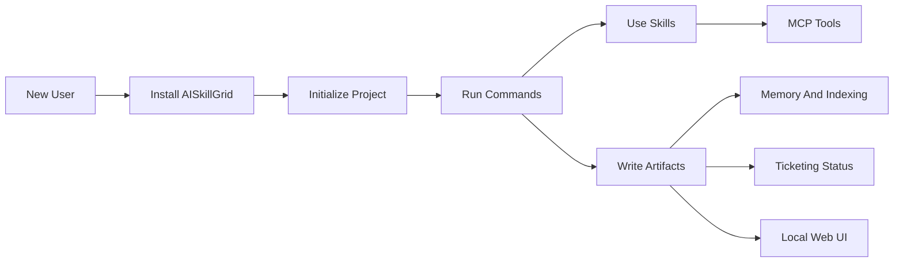
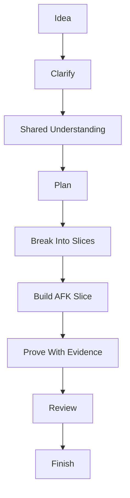

# Start Here

AISkillGrid is a batteries-included operating layer for AI-assisted software development. It gives your agents a shared workflow, reusable skills, specialist personas, MCP tools, durable memory, codebase indexing, ticketing-aware artifacts, and a local web UI.

The point is simple: agent work should not disappear into a chat transcript. It should leave a clear plan, visible state, reviewable files, verification evidence, and a next step that another human or agent can continue. This is the project's manifesto too: AISkillGrid is not a "dark factory" of unattended coding. It is a harness for controllable, spec-driven, human-validated AI-assisted development.

## Why This Exists

Most AI coding setups start with a capable model and a few prompts. That works for small one-off tasks, but it gets fragile when the work spans days, agents, IDEs, requirements, tests, research, and review. Context is lost. Decisions are repeated. Subagents duplicate each other. The user has to remember what happened.

AISkillGrid solves that by packaging the whole operating system around the model:

- Commands define the phase of work.
- Skills define how the agent should perform specialized tasks.
- Subagent personas provide independent review, research, security, test, and architecture viewpoints.
- MCP servers connect agents to memory, browser tools, research, docs, security scanners, and code maps.
- Memory and indexing make the work resumable and searchable.
- Ticketing integration keeps product intent and status visible.
- The web UI shows the work without asking the agent to reconstruct it from memory.

That makes AISkillGrid stronger than a loose folder of prompts. It is a full solution, not a single trick.

## The Advantage

AISkillGrid is built for teams and serious solo developers who want the speed of AI without giving up engineering discipline.

It gives you:

- A portable workflow across supported IDEs.
- A local-first artifact model that does not require a hosted runtime.
- A practical memory layer that complements files instead of replacing them.
- A command system that turns vague chat into named phases.
- A multiagent model where specialists produce bounded reports instead of noisy side quests.
- A dashboard where PRDs, events, previews, blockers, and subagent work become visible.
- A path from idea to implementation to validation to finish.

The result is less prompt babysitting and more deliberate progress. Agents can move faster because the boundaries are clearer.

## Manifesto

**The goal is not autonomy for its own sake.** Some visions of agentic coding end in a fully automated factory: humans fade out, models ship on their own. We do not treat that as the end state. It compresses risk, hides mistakes, and confuses motion with progress.

**The goal is a controllable agentic pipeline.** The future we build for is workflows you design: phases, checkpoints, explicit **human-in-the-loop (HITL)** gates, and **user validation** at the points that matter. Agents accelerate execution; **you** retain authority over scope, quality bar, and when something is done enough to merge or release.

**Specs guide the AI.** Requirements and design artifacts are not paperwork; they are the steering signal. **Spec-driven development** (OpenSpec-style changes, PRDs, delta specs, tasks) gives the model something stable to implement against and something reviewers can verify against. Chat alone drifts; files and specs anchor the work.

**Harness engineering.** A model in isolation is not a process. A **harness** is commands, skills, rules, MCP tools, memory, indexing, handoff files, and dashboards that bound what agents do, when they stop, and what evidence they must produce. AISkillGrid is that harness: structured phases (`/skillgrid-*`), reusable skills, subagent discipline, and durable artifacts so work survives compaction and handoff.

**Humans stay in the loop.** Automation without validation is debt. Validation is not a failure mode; it is the mechanism that makes agentic pipelines trustworthy in real teams.

**Shared understanding comes before plans.** A good agent should question vague intent until the user, domain expert, and agent are aligned on the same design concept. PRDs are useful because they capture that alignment, not because specs magically compile into correct code.

**Small context beats heroic context.** Large windows help retrieval, but coding judgment still degrades when a session carries too much stale chat, compacted history, or unrelated work. AISkillGrid keeps agents in the smart zone with vertical slices, fresh subagents, durable artifacts, and context-budgeted handoffs.

**Feedback loops set the ceiling.** Tests, type checks, linters, browser checks, security scans, code review, and human QA are not optional ceremony. They are how agents see whether their work is correct. For behavioral code, the default implementation loop is TDD: RED, GREEN, then refactor.

## Core Concepts

| Concept | Meaning here |
|--------|----------------|
| **Human-in-the-loop (HITL)** | You approve boundaries, risky moves, and "done." Commands like `/skillgrid-loop` and validate/finish steps assume you can stop or steer the process. |
| **Away-from-keyboard (AFK)** | Work the agent can safely do without a human present because scope, files, acceptance criteria, and verification are explicit. |
| **Shared understanding** | Before planning, the agent should question the user until goal, scope, constraints, and tradeoffs are understood well enough to write durable artifacts. |
| **Smart zone / dumb zone** | Long context makes coding judgment worse. Keep implementation and review units small enough to fit in a fresh, focused context. |
| **Context rot** | Accuracy drops when a session carries too much stale chat, compacted history, or unrelated work. AISkillGrid fights this with slices, artifacts, and fresh subagents. |
| **Vertical slices** | Break work into thin, testable increments that cross the necessary layers and produce feedback early. Avoid long horizontal phases that only build one layer. |
| **TDD loop** | Behavioral implementation should use RED/GREEN/refactor: write a failing test, make it pass with minimal code, then clean up. |
| **Build Loop** | A Ralph-loop-style controlled loop that advances one safe `[AFK]` slice or phase, records evidence, then reassesses before continuing. |
| **User validation** | Explicit checks: spec alignment, review gates, test evidence, security passes, not silent merge-by-default. |
| **Spec-driven development** | Intent lives in specs and change artifacts before and during code. AI implements toward those specs; verification traces back to them. |
| **Agentic pipeline** | A sequence of phases (explore, plan, apply, test, validate, finish) with tools and skills attached, not one long autonomous chat. |
| **Harness** | The configured layer around the model: rules, skills, MCP, memory, indexing, handoff paths, UI, so behavior is repeatable and auditable. |
| **Artifacts over transcripts** | PRDs, OpenSpec changes, handoff markdown, logs, and checkpoints are the system of record; chat is ephemeral. |
| **Specialist persona board** | The parent can ask focused personas for independent reports on a decision, but the parent/user/spec remains authoritative. |
| **Local-first and portable** | State lives in the repo and local services where possible; no single vendor runtime is required to resume work. |

If a single idea ties this together: **AI assists; you validate; specs and harnesses keep both honest.**

## How The Pieces Fit

## Reading Order

Read the files in this folder in numeric order:

1. `00-start-here.md` explains the whole solution and why it matters.
2. `01-installation.md` explains what gets installed and where.
3. `02-workflow-usage.md` explains how a new user should operate the system.
4. `03-skillgrid-logic.md` explains PRD/INDEX/OpenSpec hierarchy and **`.skillgrid/templates/`** file blanks.
5. `04-commands.md` explains the workflow commands.
6. `05-skills.md` explains reusable agent skills.
7. `06-multi-agent-work.md` explains subagents, personas, dependency waves, handoff/event logs, orchestration, worktree separation, and parallelism.
8. `07-subagent-personas.md` explains the specialist persona catalog.
9. `08-mcp-servers.md` explains external tool connections.
10. `09-memory-and-indexing.md` explains durable context and codebase search.
11. `10-ticketing-integrations.md` explains local and external work tracking.
12. `11-webui.md` explains the local dashboard.

## First Mental Model

Think of AISkillGrid as a guided path:

Every phase has a purpose. Every important decision should land in a durable place. Every handoff should be readable by the next agent. The agent should ask until the shared understanding is strong, split implementation into smart-zone vertical slices, prove each slice with feedback loops, and stop when human judgment is required.
