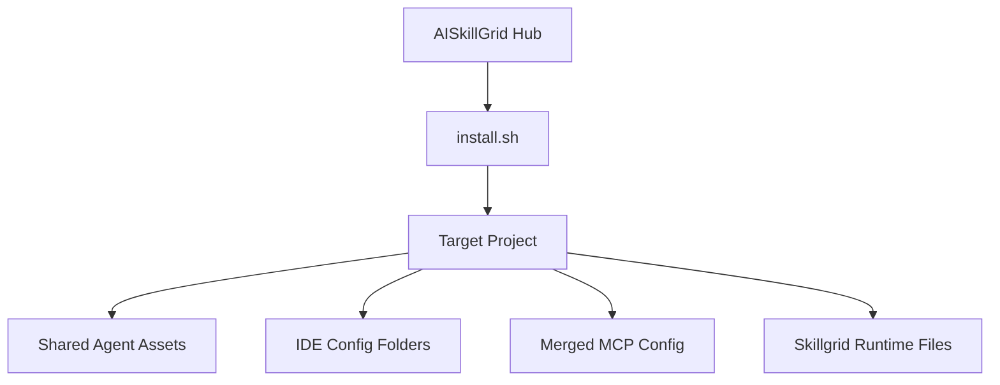
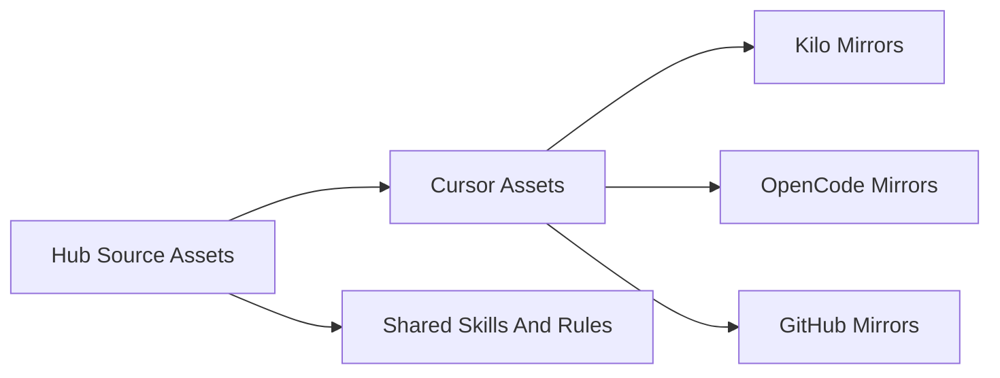

# Installation

Installation places the AISkillGrid operating layer inside a target project. After install, supported IDEs and agents can see the same commands, skills, rules, personas, and MCP server definitions.

This is one of the main advantages of AISkillGrid: you do not have to rebuild your AI workflow by hand in every editor. The installer gives the project a consistent agent environment.

## What The Installer Does

At a high level, `install.sh` copies shared assets from the hub into your application project and prepares IDE-specific configuration folders.



## Common Commands

Run these from the AISkillGrid hub repository:

```bash
./install.sh --sanity-check
./install.sh -p /path/to/project
./install.sh -p /path/to/project -n
./install.sh -p /path/to/project -A -y
./install.sh -d
```

Use `--sanity-check` before installing when you want a quick machine readiness check. Use `-n` for a dry run. Use `-A -y` when you want the full supported IDE asset set installed without interactive prompts.

## Requirements

The core install path expects common development tools:

- `bash`
- `rsync`
- `jq`
- Node.js and `npx`
- Python 3

Optional capabilities may use:

- `uv` for Python-based tools.
- Docker for Docker-backed MCP servers.
- Engram for persistent memory.
- graphify for repository maps.
- CocoIndex Code, usually called `ccc`, for semantic code search.
- Trivy for security scanning.

Missing optional tools should not block the basic workflow. They reduce capability, not the value of the whole system.

## What Gets Installed

The exact result depends on selected options and the target IDEs, but the intended shape is:

| Capability | Typical Target Location | Purpose |
|---|---|---|
| Shared rules | `AGENTS.md` | Project-wide agent behavior and operating principles |
| Skills | `.agents/skills/` | Reusable agent procedures and checklists |
| Cursor commands | `.cursor/commands/` | Slash command prompts for Cursor |
| Kilo commands | `.kilo/commands/` | Slash command prompts for Kilo |
| OpenCode commands | `.opencode/commands/` | Slash command prompts for OpenCode |
| GitHub prompts | `.github/prompts/` | Prompt files for GitHub Copilot style workflows |
| Cursor personas | `.cursor/agents/` | Specialist subagent definitions |
| Kilo personas | `.kilo/agents/` | Mirrored specialist agent definitions |
| OpenCode personas | `.opencode/agents/` | Mirrored specialist agent definitions |
| GitHub personas | `.github/agents/` | Mirrored specialist agent definitions |
| Cursor rules | `.cursor/rules/` | Cursor-specific persistent guidance |
| Kilo rules | `.kilo/rules/` | Kilo-specific persistent guidance |
| OpenCode rules | `.opencode/rules/` | OpenCode-specific persistent guidance |
| GitHub instructions | `.github/instructions/` | Copilot instruction files where supported |
| Cursor MCP | `.cursor/mcp.json` | Cursor MCP server configuration |
| VS Code MCP | `.vscode/mcp.json` | VS Code or Copilot MCP server configuration |
| Kilo MCP | `.kilo/kilo.jsonc` | Kilo configuration and MCP wiring |
| OpenCode MCP | `.opencode/opencode.jsonc` | OpenCode configuration and MCP wiring |
| Hooks | IDE-specific hook files | Optional automation around tool use |
| Plugins | IDE-specific plugin folders | Optional editor extension points |

The installer is designed to make the project self-describing. A future agent should be able to open the target project and discover the same workflow pieces without asking the user to paste a long prompt.

## IDE Configuration Matrix

AISkillGrid treats IDE support as a distribution problem. The same workflow concepts are placed where each product expects them.

| Asset Type | GitHub Copilot | Cursor | Kilo | OpenCode | Antigravity | Gemini |
|---|---|---|---|---|---|---|
| Commands | `.github/prompts/` | `.cursor/commands/` | `.kilo/commands/` | `.opencode/commands/` | `.agents/workflows` | `.gemini/commands/` |
| Skills | `.agents/skills/` and compatible mirrors | `.agents/skills/` and `.cursor/skills/` | `.agents/skills/` and `.kilo/skills/` | `.agents/skills/` and `.opencode/skills/` | `.agents/skills/` | `.agents/skills/` |
| Rules | `.github/instructions/` and `AGENTS.md` | `.cursor/rules/` and `AGENTS.md` | `.kilo/rules/` and `AGENTS.md` | `.opencode/rules/` and `AGENTS.md` | `.agents/rules/` and `AGENTS.md` | project settings and `AGENTS.md` |
| Agents | `.github/agents/` | `.cursor/agents/` | `.kilo/agents/` | `.opencode/agents/` | future support | future support |
| Hooks | `.github/hooks/` when supported | `.cursor/hooks.json` and `.cursor/hooks/` | future support | `.opencode/hook/` | `.agents/hooks/` | `.gemini/settings.json` |
| MCP | `.vscode/mcp.json` | `.cursor/mcp.json` | `.kilo/kilo.jsonc` | `.opencode/opencode.jsonc` | user MCP config | `.gemini/settings.json` |
| Plugins | not typical | `.cursor/plugins/` | not typical | `.opencode/plugins/` | not typical | future support |

Some entries are aspirational or product-dependent. The docs and installer should be clear when a feature is supported, optional, or planned.

## Source Of Truth And Mirrors

The hub keeps one editorial base for many assets, then mirrors them into product-specific locations.



This is a practical advantage for teams. You can improve a command, persona, or skill once, then distribute the same behavior to the surfaces your developers actually use.

## What Is Not Installed Automatically

AISkillGrid should not silently create or store sensitive or external state. The installer does not provide:

- API keys.
- Browser sessions.
- External account credentials.
- Remote tracker projects.
- Paid service subscriptions.
- Team-specific policy decisions.
- Optional CLIs that the user declines.

The system is powerful because it is integrated, but it should remain explicit about anything that touches credentials, billing, or remote systems.

## After Installation

The usual next step in a target project is:

```text
/skillgrid-init
```

That initializes project-specific workflow state, artifact storage, ticketing mode, PRD workflow status columns, optional memory setup, and optional indexing.
