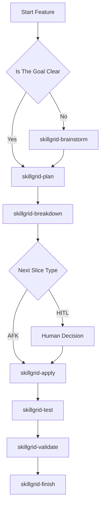
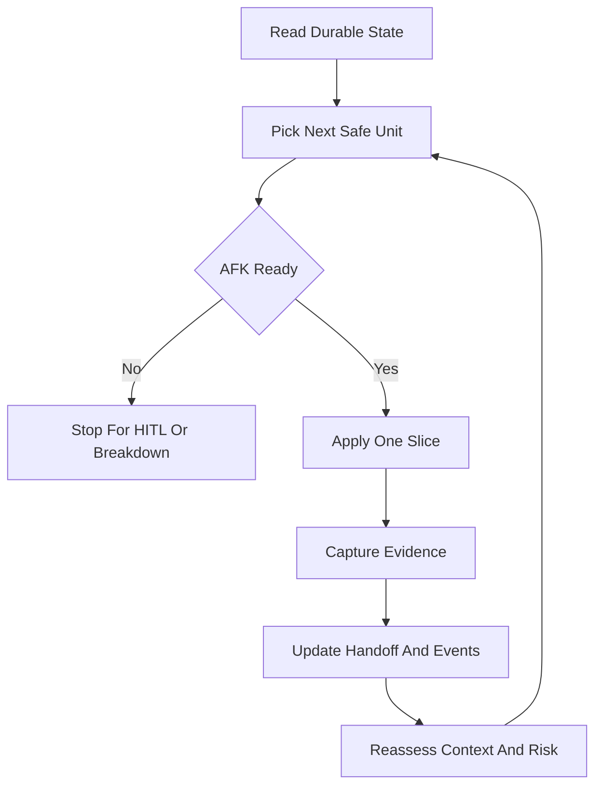
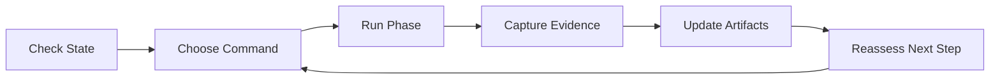

# Workflow Usage

This guide explains how a new user should operate AISkillGrid from first setup to finished work.

The core habit is simple: choose the command that matches the phase, let it create or update artifacts, then use the artifacts to decide the next command.

## First Run

Start by installing the hub into a target project. After installation, initialize the project workflow:

```text
/skillgrid-init
```

During initialization, decide:

- Ticketing provider: local, GitHub, GitLab, or Jira.
- Artifact store: disk-first, memory-first, or hybrid.
- PRD workflow: default statuses, provider-style statuses, imported statuses, or custom statuses.
- Optional indexing: GitNexus and ccc.
- Optional persistent memory: Engram.
- Skill registry: `.skillgrid/project/SKILL_REGISTRY.md` for compact rules used in subagent prompts.

The recommended default for most users is a hybrid model: keep reviewable files in the repository and save concise durable memory summaries.

When Engram is enabled, active changes should also have a compact `skillgrid/<change-id>/state` memory entry. It helps a later session recover the phase, blockers, artifact paths, and next action without trusting chat history.

## First Feature

For a new feature, use this path:



Use `/skillgrid-brainstorm` when the idea still needs shape. Use `/skillgrid-plan` when the goal is ready to become a PRD and technical change.

## PRD index, hierarchy, and OpenSpec layout

Skillgrid uses one mental model for planning and execution (see `skillgrid-prd-artifacts`, `skillgrid-vertical-slices`, `skillgrid-spec-artifacts`):

| Concept | Jira-style | GitHub-style | Where it lives |
|---------|------------|--------------|----------------|
| Milestone / program slice | Epic | Milestone | `.skillgrid/prd/INDEX.md` — dependency-ordered PRD table **and** optional **Execution snapshot** at the top (current phase, active change/slice, discovered work, session notes). |
| Feature initiative | Task | Issue | `.skillgrid/prd/PRD<NN>_<slug>.md` + `openspec/changes/<change-id>/` |
| Shippable unit | Sub-task | Checklist item | Vertical slice — `openspec/changes/<change-id>/tasks.md` **and** `openspec/changes/<change-id>/specs/<vertical-slice-slug>/spec.md` (see `docs/03-skillgrid-logic.md`) |

**OpenSpec per change** (one folder per PRD-style initiative):

```text
openspec/changes/<change-id>/
  proposal.md
  design.md
  tasks.md
  specs/<vertical-slice-slug>/spec.md   # slice-scoped requirements + checklist
```

Optional umbrella: `openspec/specs/<change-id>/spec.md` for cross-cutting requirements. There is **no** `.skillgrid/project/TASK.md`; use INDEX snapshot + `tasks.md` + slice specs for “where we are” and sub-task detail.

Canonical **blank files** (`template-*.md` under **`.skillgrid/templates/`**) and a consolidated explanation live in **`docs/03-skillgrid-logic.md`**.

## Shared Understanding Before Planning

Do not rush vague intent into a PRD. For ambiguous work, the agent should question the user or domain expert until both sides have the same understanding of the goal, scope, non-goals, risks, and tradeoffs.

Good questioning is direct and incremental:

- ask one meaningful question at a time;
- include a recommended answer when useful;
- record accepted answers as decisions;
- record unknowns as open questions or HITL blockers;
- stop when the remaining ambiguity is low enough to write durable artifacts.

This is HITL work. Do not send product alignment into an unattended Build Loop.

## Working In Slices

AISkillGrid prefers small vertical slices. Each slice should be understandable, implementable, and verifiable.

Tasks can be marked:

- `[AFK]` when the agent can safely proceed with clear instructions and verification.
- `[HITL]` when a human decision is required before work continues.

This distinction is important. It lets agents keep moving where safe while stopping on product, design, architecture, security, credential, or destructive decisions.

Vertical slices should create early feedback. Prefer a thin path through the necessary layers over a horizontal plan where one phase only changes schema, another only changes API, and another only changes UI. A good first slice behaves like a tracer bullet: small enough to build safely, but complete enough to prove direction.

Each apply-ready slice should include:

- acceptance criteria;
- blockers and unblocks;
- `[HITL]` or `[AFK]` reason;
- vertical-slice or horizontal-setup classification, with justification for horizontal setup work;
- relevant files and artifacts;
- context budget or split trigger;
- fresh-agent input list with exact artifact and source/test paths;
- verification command;
- TDD expectation or explicit non-TDD exception.

Treat the PRD and OpenSpec artifacts as the destination: they define what done means. Treat `tasks.md`, issues, handoff, event logs, and checkpoints as the journey: they define how agents move toward done. The journey should be a Kanban/DAG of independently grabbable slices, not only a linear checklist. Record `blockedBy` and `unblocks` relationships so independent work can be grouped into safe dependency waves.

## Smart Zone And Context Rot

Large context windows are useful for retrieval, but coding quality still drops when the session carries too much unrelated or stale context. AISkillGrid treats this as context rot.

Use the smart zone deliberately:

- keep the system prompt and always-loaded rules small;
- move durable state into PRDs, OpenSpec changes, handoff files, events, and research files;
- split large tasks before implementation;
- dispatch fresh subagents with bounded artifact paths instead of pasting chat history;
- review implementation in a fresh context when risk is meaningful.

If a slice needs broad chat memory, whole-repo rereading, or multiple unrelated subsystems, it is too large for AFK apply. Route it back to breakdown.

Context budget gate: before apply, confirm the slice can be executed by a fresh agent using durable artifacts and a bounded file list. If the agent would need broad chat history, whole-repo reading, or multiple unrelated subsystems, split the slice or route back to breakdown.

## Operating Guardrails

Keep the fixed context surface small. Load optional skills, personas, research, and project standards only when the current phase needs them. Use `.skillgrid/project/SKILL_REGISTRY.md` as a compact pull-based index, and push only the relevant standards into reviewer prompts.

Use quality gates before validation and finish:

- no silent scope reduction from PRD/OpenSpec/task intent;
- no schema, migration, or API drift without an updated artifact;
- no missing verification for behavior-changing work;
- no unresolved security, credential, destructive-action, merge, release, or product-signoff risk;
- no stale release docs, README guidance, rules, or project context for shipped behavior.

For risky changes, add a second-opinion review from an independent specialist or model and record overlapping and unique findings. For destructive commands or production-impacting work, warn explicitly and restrict edits to the intended path or stop for `[HITL]`.

## When To Use Explore

Use:

```text
/skillgrid-explore
```

when the project is brownfield or the agent needs to understand architecture before planning. Exploration should produce project knowledge, not implementation changes.

## When To Use Design

Use:

```text
/skillgrid-design
```

when the work includes user-facing UI, layout, interaction, visual direction, or product experience decisions.

Design work should create durable direction so later implementation does not depend on memory or taste guesses.

## When To Use Import

Use:

```text
/skillgrid-import
```

when a project already has PRDs, specs, or planning files that should be normalized into the Skillgrid artifact model.

This is helpful when adopting AISkillGrid in an existing repository.

## During Implementation

Use:

```text
/skillgrid-apply
```

for implementation from an approved task list.

The agent should:

- Read the active PRD.
- Read the technical change artifacts.
- Read the handoff.
- Implement the next task or slice.
- Run focused verification.
- Update state and evidence.
- Stop on unclear scope or HITL blockers.

For behavioral code, implementation should follow TDD:

1. **RED:** write one focused failing test and confirm it fails for the expected reason.
2. **GREEN:** implement the smallest change that makes the test pass.
3. **Refactor:** clean up only after the behavior is proven.

Do not delete, weaken, or bypass tests to get green.

For controlled continuation, use:

```text
/skillgrid-loop
```

The loop should advance one safe unit at a time. It is not an excuse for unbounded autonomous work.

This is the Ralph-loop-style Build Loop in Skillgrid terms: the parent session keeps state small, chooses the next safe unit from durable artifacts, dispatches or executes that unit, records evidence, updates handoff/events, then reassesses. The loop continues only while the next step is clearly `[AFK]`.



## Verification And Review

Use:

```text
/skillgrid-test
/skillgrid-security
/skillgrid-validate
```

Testing proves behavior. Security checks risk. Validation reconciles specs, code review, evidence, and sign-off.

This is where AISkillGrid becomes more than a productivity wrapper. It helps users keep the speed of AI while preserving review discipline.

Delegated implementation must pass a double review gate before the parent marks the slice complete:

1. **Spec compliance review:** verify PRD/OpenSpec/task traceability, acceptance criteria, and slice boundaries.
2. **Code quality review:** verify correctness, maintainability, architecture, security, performance, tests, and local conventions.

Ordering matters. Do not accept code quality review before spec compliance passes. If either review returns required changes, fix the issue, rerun focused verification, and repeat the same review stage. Critical or important findings block completion until fixed, explicitly accepted with rationale, or converted into follow-up work.

For user-facing behavior, add UAT notes or a manual QA checklist after automated evidence. Failed UAT should create focused fix tasks rather than a vague “try again” loop.

When a decision needs multiple viewpoints, use a specialist persona board. The parent picks only the relevant personas, asks each for a bounded report, reads the reports, records the accepted decision and rejected options, then either continues or marks the issue HITL.

The board must write durable state:

- reports under `.skillgrid/tasks/research/<change-id>/`;
- a decision record in `.skillgrid/tasks/context_<change-id>.md`;
- JSONL events in `.skillgrid/tasks/events/<change-id>.jsonl`.

The board advises. It does not silently vote the workflow forward.

For the full multi-agent operating model, see `06-multi-agent-work.md`. It covers personas, dependency waves, handoff and event logs, the subagent orchestration skill, planned git worktree separation, and parallelism rules.

## Finishing Work

Use:

```text
/skillgrid-finish
```

when implementation has passed validation.

Finish should handle closure tasks such as:

- Updating final PRD status.
- Archiving or syncing specs.
- Marking completed PRDs and journey artifacts closed or archived so stale docs are not mistaken for current architecture.
- Cleaning up previews or checkpoints when appropriate.
- Preparing git or PR handoff when requested.
- Confirming docs and evidence are not stale.
- Saving final Engram closure/state summaries when memory is available.

If your team intentionally shares Engram memories through git, run:

```bash
engram sync
```

after significant finish work, and use:

```bash
engram sync --import
```

on another machine after cloning. Review `.engram/` before committing because it may contain prompts, decisions, and sensitive project context.

## Resuming Work

When returning after an interruption, start with:

```text
/skillgrid-session
```

or ask for current state through:

```text
/skillgrid-help current-state
```

The agent should inspect the durable state:

- Project config.
- PRD index.
- Active handoff files.
- Event logs.
- Relevant memory.
- Skill registry.
- Open change artifacts.

Then it should recommend the next command.

If Engram returns memory search hits, the agent should retrieve full observations before relying on them. Search previews are not enough for requirements, blocker state, task status, or user decisions.

## What To Expect After Each Phase

| Phase | Expected Output |
|---|---|
| Init | Project config, artifact-store choice, ticketing choice, workflow statuses |
| Explore | Project map, architecture notes, imported existing planning artifacts |
| Brainstorm | Chosen direction, clarified assumptions, possible approaches |
| Plan | PRD and technical change scaffold |
| Breakdown | Vertical-slice tasks, blockers, HITL and AFK labels, context packets, verification plan |
| Apply | TDD-backed code changes, evidence, updated handoff |
| Test | Test results and remaining gaps |
| Security | Security findings or sign-off |
| Validate | Review outcome, specialist board decisions when needed, and spec compliance decision |
| Finish | Closed status, archive or handoff, final evidence |

## Daily Usage Pattern



The best way to use AISkillGrid is not to memorize every command. It is to trust the phase model. Ask what state the work is in, run the command for that state, and let the artifacts guide the next move.

## Why This Feels Different

Many AI coding tools help with a single task. AISkillGrid helps with the lifecycle around the task.

That is the full-solution advantage:

- New users get a guided path.
- Experienced users get control.
- Teams get consistent process across IDEs.
- Agents get durable context.
- Reviewers get evidence.
- Work can resume without rebuilding the story from chat.

This is how AI-assisted development becomes repeatable engineering practice.
