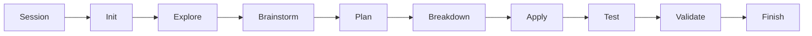
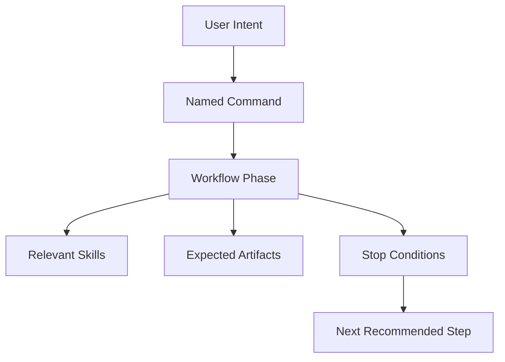

# Commands

Commands are the phase controls of AISkillGrid. They turn open-ended AI work into named steps with a purpose, expected artifacts, and stop conditions.

Instead of asking an agent to “keep working,” you ask it to run the right command for the current phase. That makes the workflow easier to follow, easier to resume, and easier to review.

## What Commands Do

Commands guide the agent through a specific kind of work:

- Starting a session.
- Initializing a project.
- Exploring an existing codebase.
- Designing a UI or product direction.
- Brainstorming requirements.
- Planning a change.
- Breaking work into slices.
- Applying implementation tasks.
- Testing and validating the result.
- Finishing the change.

Each command should leave something behind: a config update, PRD, task list, handoff, event log, test result, review report, or final status.

## Main Workflow

## Command Families

### Session And Orientation

Use these when starting, resuming, or checking state.

- `/skillgrid-help` explains the available workflow and can recommend a next step.
- `/skillgrid-session` establishes the current session charter, context budget, and tool posture.
- `/skillgrid-checkpoint` creates or verifies a named workflow checkpoint.

### Project Setup

Use this when installing or aligning AISkillGrid in a project.

- `/skillgrid-init` creates or updates project configuration, artifact-store mode, ticketing mode, PRD workflow statuses, project docs, optional memory, and optional indexing.

### Definition And Discovery

Use these before committing to a plan.

- `/skillgrid-explore` maps a brownfield codebase and records project knowledge.
- `/skillgrid-design` develops UI and UX direction, previews, design constraints, and design artifacts.
- `/skillgrid-brainstorm` clarifies goals and compares possible approaches. For ambiguous work, it should run an alignment interview: one blocking question at a time, a recommended answer when useful, and durable records for accepted assumptions or open questions.
- `/skillgrid-import` normalizes existing PRDs or OpenSpec changes into the Skillgrid artifact model.

### Planning

Use these when the change is understood enough to shape into implementable work.

- `/skillgrid-plan` creates the destination artifacts: PRD, OpenSpec proposal/design/specs, accepted assumptions, non-goals, risks, and open HITL questions.
- `/skillgrid-breakdown` creates the journey artifacts: vertical-slice Kanban/DAG tasks with blockers, unblocks, context packets, verification commands, and `[HITL]` or `[AFK]` labels.

### Build

Use these to implement controlled units of work.

- `/skillgrid-apply` implements from the approved task list.
- `/skillgrid-loop` runs the Ralph-loop-style Build Loop: advance one safe phase or one safe `[AFK]` slice, record evidence, then reassess before continuing.

Build commands should stay in the model's smart zone. If a slice needs too much chat history, broad repo reading, or multiple unrelated subsystems, route back to `/skillgrid-breakdown` and split it before implementation. For behavioral changes, `/skillgrid-apply` should use TDD: RED, GREEN, then refactor. Every delegated implementation slice must then pass spec compliance review before code quality review.

### Verification

Use these before declaring the work complete.

- `/skillgrid-test` runs tests and captures evidence tied to success criteria.
- `/skillgrid-security` performs a deeper security pass when needed.
- `/skillgrid-validate` combines spec verification, code review, security review, evidence reconciliation, and sign-off.

Validation uses a double review gate for delegated or risky implementation: first confirm the work built the right thing against PRD/OpenSpec/tasks, then review whether the implementation is good enough to keep. Required fixes send the work back through focused verification and the same review stage before completion.

When a decision needs multiple viewpoints, validation can use a specialist persona board: bounded reports from focused personas such as `spec-verifier`, `code-reviewer`, `test-engineer`, `security-auditor`, `design-critic`, or `researcher`. The board advises; the parent session records the decision and remains responsible for the final go/no-go.

For subagent operating rules, use `05-multi-agent-work.md` and `.agents/skills/skillgrid-subagent-orchestration/SKILL.md`. They cover dependency waves, handoff/event logs, safe parallelism, and planned git worktree separation for parallel implementation.

### Finish

Use this when the change is ready to close.

- `/skillgrid-finish` archives or syncs specs, updates status, prepares git or PR handoff, checks docs and evidence for drift, and marks completed artifacts closed so stale PRDs do not mislead future agents.

## OpenSpec Command Style

AISkillGrid may also expose `opsx` commands for users who want a more OpenSpec-shaped entry point. These are useful when the user thinks in proposal, spec, apply, verify, sync, and archive steps.

The important distinction is that Skillgrid owns the full operating workflow around OpenSpec: PRDs, handoffs, checkpoints, ticketing, dashboard events, previews, personas, and memory.

## Why Commands Matter

Commands reduce drift. A chat prompt can change meaning as context grows, but a command has a stable job.

That is the commercial value in everyday terms: the agent spends less effort guessing what kind of work it is doing and more effort producing reviewable progress.

## Key Operating Terms

- **HITL:** human-in-the-loop work. Stop for product, design, architecture, security, credentials, destructive actions, merge/release decisions, or unclear scope.
- **AFK:** away-from-keyboard work. Continue only when scope, files, acceptance criteria, and verification are explicit.
- **Smart zone:** the focused context range where agents make better coding decisions.
- **Dumb zone:** overloaded context where judgment degrades and errors become more likely.
- **Context rot:** loss of accuracy caused by long chat history, stale summaries, and unrelated prior work.
- **Vertical slice:** a thin, testable increment across the necessary layers, designed to create feedback early.
- **Build Loop:** controlled continuation through safe slices, not unbounded autonomy.
