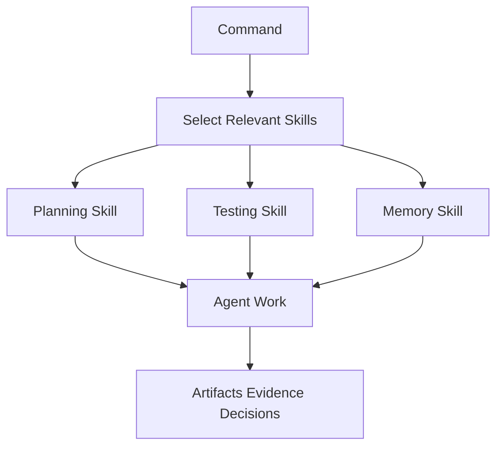
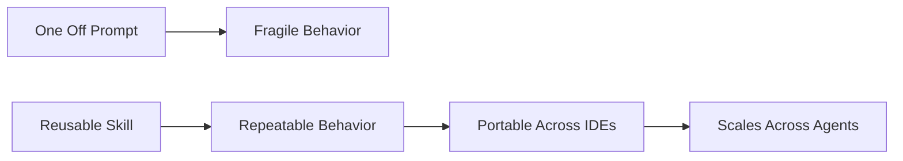

# Skills

Skills are reusable operating procedures for agents. They tell an agent how to perform a specialized task well: testing, reviewing, planning, researching, debugging, using memory, designing UI, handling git, or working with Skillgrid artifacts.

Commands answer “what phase are we in?” Skills answer “how should the agent do this kind of work?”

## What A Skill Provides

A good skill gives the agent:

- A clear trigger.
- A specific role or method.
- A process to follow.
- Tools or evidence to prefer.
- Guardrails and stop conditions.
- Output expectations.

This is better than repeating long instructions in every prompt. The skill carries the discipline.

## Command And Skill Relationship

Commands may load only the skills needed for their phase. That keeps agent context focused and reduces confusion.

## Skill Categories

### Skillgrid Workflow Skills

These skills manage the Skillgrid-specific workflow:

- Questioning and requirement capture.
- Codebase mapping.
- Parallel research coordination.
- Subagent orchestration.
- PRD artifacts.
- OpenSpec bridge artifacts.
- Vertical slice planning.
- UI design artifacts.
- Issue creation rules.
- Hybrid persistence.
- Filesystem handoff.
- Skill registry generation.
- OpenSpec config alignment.
- Project docs.
- Checkpoints.

These are the backbone of the solution. They keep product intent, technical tasks, memory, and agent handoffs connected.

During init or session refresh, Skillgrid can generate `.skillgrid/project/SKILL_REGISTRY.md`. That registry is project-local context for parent sessions: it lists available skills, compact rules, and project convention files so subagent prompts can receive only the relevant standards instead of rediscovering every skill.

### Planning And Product Skills

These help move from an unclear idea to a useful plan:

- Idea refinement.
- Spec-driven development.
- Planning and task breakdown.
- Search-first research.
- Deep research.
- Context engineering.

They are useful because AI work is most risky when requirements are vague. These skills make uncertainty visible before code is written.

### Build Skills

These guide implementation:

- Source-driven development.
- API and interface design.
- Frontend UI engineering.
- Frontend design.
- Code simplification.
- Incremental implementation.

They help the agent keep changes small, respect existing patterns, and build with evidence instead of speculation.

### Test And Debug Skills

These focus on proof:

- Test-driven development.
- Testing patterns.
- Playwright browser automation.
- E2E testing.
- Browser testing with runtime evidence.
- Debugging and error recovery.

They keep the workflow honest. A solution is not complete just because code changed.

### Review, Security, And Performance Skills

These help catch risk before shipping:

- Code review and quality.
- Security review.
- Semgrep security.
- Trivy security.
- Vulnerability scanning.
- Performance optimization.

They are especially valuable in multiagent flows because independent review can catch issues the implementer normalized.

### Research And Documentation Skills

These help agents gather and preserve knowledge:

- Documentation lookup.
- Context7.
- Exa search.
- Deep research.
- Documentation and ADRs.
- Documentation templates.

They keep answers grounded and make future sessions easier.

### Memory, Indexing, Git, And Shipping Skills

These keep work durable and reviewable:

- Memory protocol.
- CocoIndex Code.
- GitNexus workflows.
- GitNexus CLI (**gitnexus@1.3.11** via `npx -y`), exploration, debugging, impact analysis, PR review, and refactoring skills.
- Git workflow and versioning.
- Git master.
- Shipping and launch.

These are the skills that stop AI work from becoming disposable. They preserve state, searchability, and review hygiene.

## Why Skills Matter

Skills turn tribal knowledge into reusable agent behavior.

Without skills, every session depends on the user remembering the perfect instruction. With skills, the operating pattern travels with the project.

That is a key advantage of AISkillGrid: it does not only provide prompts. It provides a library of operating procedures that help agents behave like careful engineering partners.
