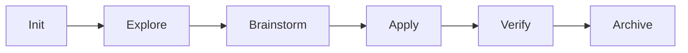
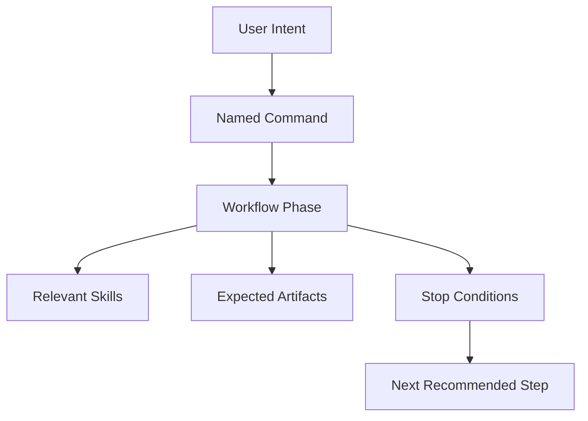

# Commands

Commands are the phase controls of AISkillGrid. They turn open-ended AI work into named steps with a purpose, expected artifacts, and stop conditions.

Instead of asking an agent to “keep working,” you ask it to run the right command for the current phase. That makes the workflow easier to follow, easier to resume, and easier to review.

## What Commands Do

Commands guide the agent through a specific kind of work:

- Starting a session.
- Initializing a project.
- Exploring an existing codebase.
- Designing a UI or product direction.
- Brainstorming requirements.
- Planning a change.
- Breaking work into slices.
- Applying implementation tasks.
- Testing and validating the result.
- Finishing the change.

Each command should leave something behind: a config update, PRD, task list, handoff, event log, test result, review report, or final status.

## Main Workflow

## Command Families

### Setup

Use this command to bootstrap SDD in a repository.

- `/sdd-init` detects stack and conventions, then bootstraps persistence mode.

### Discovery And Planning

Use these when you need to understand a codebase or define a change.

- `/sdd-explore <topic>` researches current behavior and compares approaches without changing code.
- `/sdd-brainstorm <change-name>` orchestrates the full planning pipeline: explore, clarify, propose, spec, design, PRD, and tasks.
- `/sdd-design-ui <description>` runs the UI-design flow for preview and design artifacts.
- `/sdd-diagnose` runs a structured debug loop (reproduce, isolate, hypothesize, fix, verify).

### Orchestrated Planning Phases

`/sdd-brainstorm` delegates to these skills/phases in order:

- `sdd-explore`
- `sdd-clarify`
- `sdd-propose`
- `sdd-spec`
- `sdd-design` (and UI flow when needed)
- `sdd-prd`
- `sdd-tasks`

### Build

Use this command to implement task items from active change artifacts.

- `/sdd-apply` implements remaining incomplete tasks and updates task progress.

Implementation should stay in small slices. For behavioral changes, `/sdd-apply` should run TDD (RED, GREEN, REFACTOR) using the `skillgrid-tdd` skill.

### Verification

Use this command before declaring the change complete.

- `/sdd-verify` validates implementation against proposal/spec/design/tasks with real execution evidence.

Verification confirms completeness, correctness, and coherence. Required fixes should return to `/sdd-apply` and then re-run `/sdd-verify`.

When needed, run specialist skills in parallel (for example GitNexus debugging/review or Engram architecture guardrails), but keep `sdd-verify` as the quality gate.

For subagent operating rules, use `06-multi-agent-work.md` and the `sdd-*` skill set under `.agents/skills/`.

### Finish

Use this command when verification passes and the change is ready to close.

- `/sdd-archive` syncs delta specs into source-of-truth specs and archives the completed change.

## Current Command Surface

The active workflow commands in this repository are:

- `/sdd-init`
- `/sdd-explore`
- `/sdd-brainstorm`
- `/sdd-design-ui`
- `/sdd-diagnose`
- `/sdd-apply`
- `/sdd-verify`
- `/sdd-archive`

## Milestone 1 Core Enforcement

Milestone 1 runtime enforcement is centralized in:

- `.agents/skills/_shared/sdd-enforcement-contract.md`

That shared contract is authoritative for:

- phase routing and stop conditions
- mandatory skill-gate matrix
- two-stage review gate
- standard return envelope for all `sdd-*`

Workflow files may define stricter phase-specific overrides, but must not weaken the shared contract.

## Why Commands Matter

Commands reduce drift. A chat prompt can change meaning as context grows, but a command has a stable job.

That is the commercial value in everyday terms: the agent spends less effort guessing what kind of work it is doing and more effort producing reviewable progress.

## Key Operating Terms

- **HITL:** human-in-the-loop work. This is an enforceable label: stop for product, design, architecture, security, credentials, destructive actions, merge/release decisions, or unclear scope.
- **AFK:** away-from-keyboard work. This is an enforceable label: continue only when scope, files, acceptance criteria, and verification are explicit.
- **Smart zone:** the focused context range where agents make better coding decisions.
- **Dumb zone:** overloaded context where judgment degrades and errors become more likely.
- **Context rot:** loss of accuracy caused by long chat history, stale summaries, and unrelated prior work.
- **Vertical slice:** a thin, testable increment across the necessary layers, designed to create feedback early.
- **Build Loop:** controlled continuation through safe slices, not unbounded autonomy.
