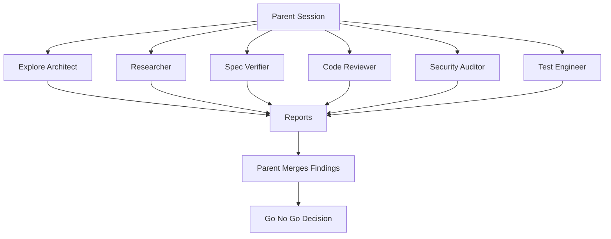

# Subagent Personas

Subagent personas are specialist roles for delegated work. A persona is not the same as a skill. A skill is a procedure. A persona is a viewpoint and reporting style.

AISkillGrid uses personas to bring focused judgment into a workflow without turning every task into a long manual review meeting.

## What Personas Do

Personas help with independent work such as:

- Reviewing code quality.
- Auditing security risk.
- Verifying implementation against specs.
- Reviewing test strategy.
- Exploring brownfield architecture.
- Checking task breakdown quality.
- Critiquing design and UX.
- Researching external evidence.

The parent session remains responsible for orchestration. Personas should not secretly coordinate with one another or rewrite the plan on their own.

## Core Personas

### Code Reviewer

Reviews correctness, readability, architecture, security, and performance. This persona is useful after implementation or before merge.

### Security Auditor

Looks for threat models, insecure defaults, secret handling problems, unsafe dependencies, and abuse cases.

### Test Engineer

Evaluates whether the change is actually proven. This persona connects test coverage to user-facing success criteria.

### Spec Verifier

Checks whether implementation matches the PRD, OpenSpec proposal, delta specs, and task list.

### Explore Architect

Maps existing systems, architecture boundaries, conventions, and onboarding knowledge.

### Task Breakdown Auditor

Checks whether tasks are ordered, testable, scoped, and ready for implementation.

### Design Critic

Reviews UX flows, accessibility, design decisions, and interface boundaries. It is not a general code reviewer.

### Researcher

Uses research tools and documentation sources to produce cited findings and durable research artifacts.

## Fan-Out Model

Use multiple personas when their work is independent.

## When To Use Personas

Use personas when the work benefits from a fresh perspective:

- Before planning a large change.
- Before implementation when tasks may be unclear.
- After implementation when review risk is meaningful.
- Before finish when spec compliance, security, and evidence matter.
- When external research should be separated from local code exploration.

Do not use personas just to create activity. Each delegation should have a narrow question, a clear artifact target, and a short return format.

## Parent Session Responsibilities

The parent session should:

- Define the scope.
- Provide the handoff path.
- Prevent duplicate exploration.
- Read the returned report.
- Verify claims against code and artifacts.
- Decide which findings are accepted.
- Update the handoff or event log when needed.
- Stop on critical blockers.

This is how AISkillGrid gets the benefit of multiagent work without losing control.

## Why Personas Matter

Personas make review cheaper and more consistent. Instead of relying on one agent to be planner, implementer, tester, security engineer, and product reviewer all at once, AISkillGrid can call in focused judgment at the right moment.

That gives users a practical advantage: stronger coverage, clearer reports, and fewer hidden assumptions.
