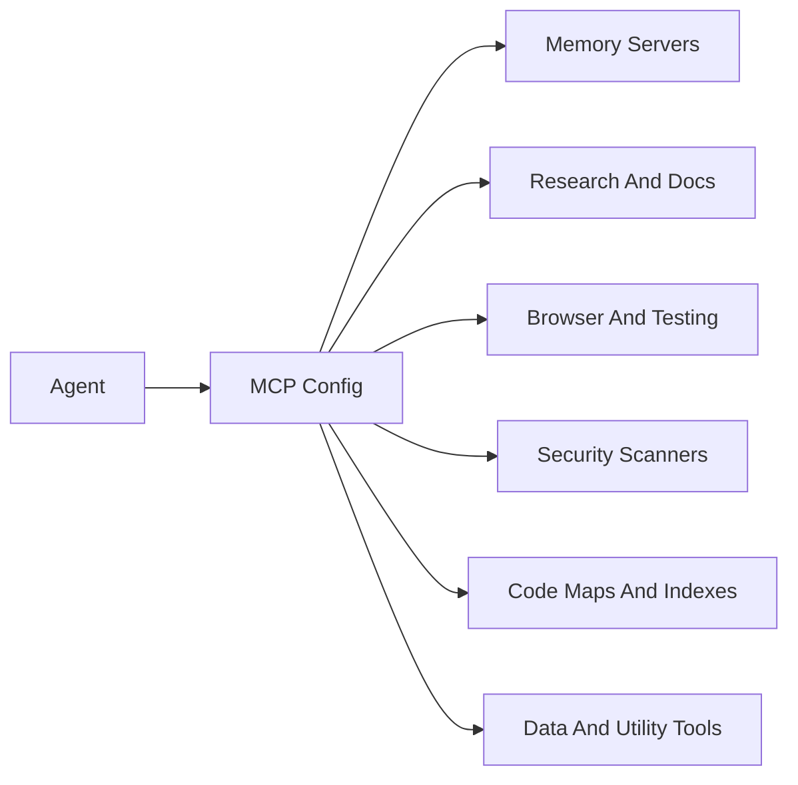
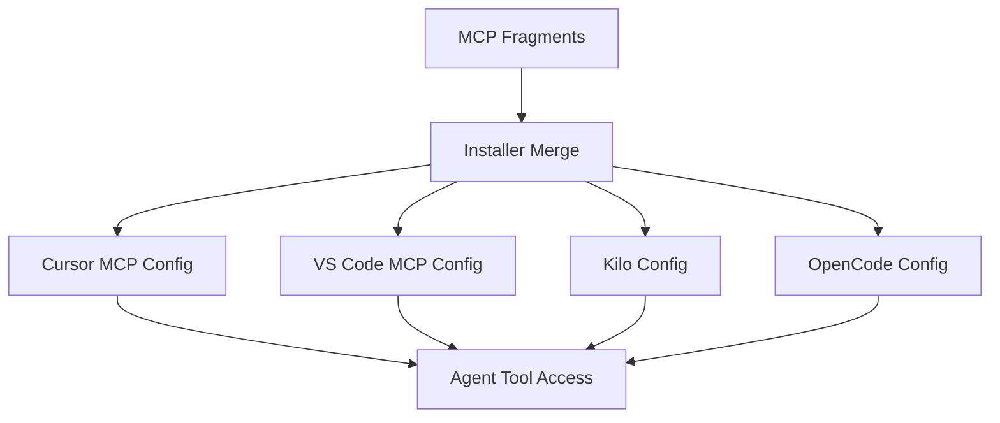

# MCP Servers

MCP servers connect agents to external tools. In AISkillGrid, they are the bridge between the workflow and capabilities such as memory, browser testing, documentation lookup, research, security scanning, database tools, and repository graphs.

The value is not only that the tools exist. The value is that AISkillGrid gives them a place in the workflow.

## What MCP Adds

An agent can reason from text alone, but real engineering work often needs live context:

- What did we decide last session?
- What does the current documentation say?
- What happens in the browser?
- What does the code graph look like?
- Are there known vulnerabilities?
- What does an external repository or docs site explain?

MCP servers provide those answers through tool connections.

## MCP Flow



## Server Categories

### Memory

Engram stores durable observations that should survive compaction and new sessions. It is the main persistent memory layer.

Typical server key:

```text
engram
```

Typical role:

- Save decisions.
- Search past context.
- Store session summaries.
- Keep project preferences available to future agents.

### Research And Documentation

These servers help agents answer questions from current sources instead of stale assumptions.

Typical server keys:

```text
context7
exa-http
deepwiki
firecrawl
fetch-docker
```

Typical roles:

- Context7 for library and framework documentation.
- Exa for neural or semantic web search.
- DeepWiki for GitHub repository knowledge.
- Firecrawl for search, scrape, crawl, and page extraction.
- Fetch for simpler URL-to-content retrieval.

### Browser And Testing

Browser-related servers give agents runtime evidence.

Typical server keys:

```text
chrome-devtools
browsermcp
playwright-docker
```

Typical roles:

- Inspect page structure.
- Capture screenshots.
- Check browser console messages.
- Review network activity.
- Run or support end-to-end testing workflows.

### Security

Security servers help add automated checks to the review process.

Typical server key:

```text
trivy-command
```

Typical role:

- Scan dependencies.
- Detect vulnerabilities.
- Review misconfigurations.
- Support security validation before finish.

### Indexing And Code Maps

Indexing servers help agents understand the repository.

Typical server keys:

```text
gitnexus
cocoindex-code
```

Typical roles:

- GitNexus exposes repository graph, context, impact, process, and query tools.
- CocoIndex Code supports semantic code search.

### Product And Design Utilities

Some MCP servers serve specific product or UI workflows.

Typical server keys:

```text
supabase-npx
magic-npx
sequentialthinking-docker
```

Typical roles:

- Supabase project operations.
- UI component generation or design helpers.
- Structured reasoning support.

## Configuration Model

AISkillGrid stores reusable MCP fragments in the hub, then merges selected fragments into the target project’s IDE configuration.



This keeps the system portable. A team can standardize tool access without each developer assembling an MCP setup by hand.

## Skill-Scoped MCP Guidance

Not every task needs every server. AISkillGrid pairs MCP usage with skills and commands:

- Documentation tasks can prefer Context7 or DeepWiki.
- Research tasks can prefer Exa or Firecrawl.
- Browser tasks can prefer Playwright or DevTools.
- Security tasks can prefer Trivy.
- Memory tasks can prefer Engram.
- Architecture orientation can prefer GitNexus or ccc.

This matters because tool overload is real. Skill-scoped guidance keeps the agent focused.

## Credentials And Availability

Some MCP servers work locally with no credentials. Others need accounts, API keys, Docker, browser permissions, or installed CLIs.

AISkillGrid should treat unavailable MCPs as reduced capability, not total failure. The agent should report what is missing and continue with the best safe fallback.

## Why MCP Servers Matter

MCP turns the agent from a text-only assistant into an operator that can use real tools. AISkillGrid makes that practical by connecting those tools to phases, skills, evidence, and artifacts.

The advantage is not tool novelty. The advantage is coherent tool use.
