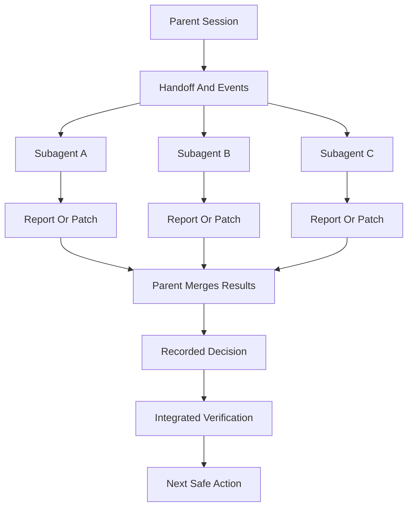
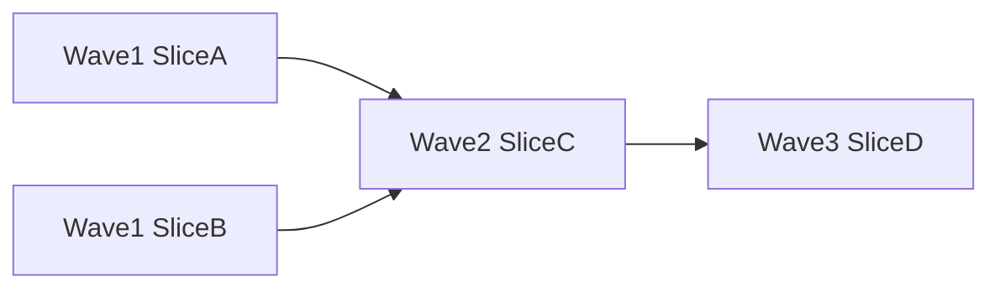

# Multi-Agent Work

This guide explains how Skillgrid should coordinate multiple agents without losing control of scope, context, evidence, or decisions.

The main rule is simple: **delegate work, not responsibility**. The parent session owns workflow state, decisions, handoff updates, and final verification. Subagents provide fresh-context work products.



## Core Model

Use multiple agents when the work benefits from either:

- a fresh context window;
- a specialist viewpoint;
- safe parallelism;
- a separate report, audit, or implementation lane.

Do not use multiple agents to hide uncertainty. If scope is unclear, route back to questioning, planning, or HITL decision-making before dispatch.

## Personas

Personas are specialist roles. They are not workflows by themselves. A skill is the procedure; a persona is the viewpoint and report style.

Canonical persona names should be product-neutral:

- `code-reviewer` — correctness, readability, architecture, security, performance.
- `security-auditor` — threat models, vulnerabilities, secrets, auth, dependency risk.
- `test-engineer` — test strategy, coverage gaps, browser/E2E evidence, feedback-loop quality.
- `spec-verifier` — PRD, OpenSpec, task, and acceptance criteria traceability.
- `explore-architect` — brownfield architecture, boundaries, conventions, onboarding context.
- `task-breakdown-auditor` — queue readiness, vertical slices, blockers, HITL/AFK, context packets.
- `design-critic` — UX flows, accessibility, states, visual/product boundaries.
- `researcher` — cited external research, docs lookup, prior art, framework evidence.

Avoid `skillgrid-` prefixes in persona filenames, frontmatter names, board presets, event logs, and prompt examples. Skillgrid is the workflow that composes the personas.

## Handoff And Event Logs

Multi-agent work must be visible outside chat. Skillgrid uses three durable paths:

```text
.skillgrid/tasks/context_<change-id>.md
.skillgrid/tasks/events/<change-id>.jsonl
.skillgrid/tasks/research/<change-id>/
```

- The handoff is the current state: phase, blockers, AFK-ready work, decisions, evidence, and next action.
- The event log is the append-only timeline: starts, completions, blockers, subagent dispatches, returns, and decisions.
- The research directory holds long outputs: reports, audits, browser evidence, comparisons, design critiques, and subagent findings.

Every delegated subagent should either append an event or return a suggested event object for the parent to append. The parent should not advance the workflow until the handoff and event log reflect the subagent result.

Useful event fields:

```json
{
  "time": "<iso8601>",
  "changeId": "<change-id>",
  "phase": "<phase>",
  "node": "subagent",
  "status": "dispatched|completed|blocked|failed",
  "subagent": "<persona-or-role>",
  "role": "<role>",
  "task": "<short task>",
  "output": ".skillgrid/tasks/research/<change-id>/<file>.md",
  "summary": "<one-line result>",
  "artifacts": ["<path>"]
}
```

## Subagent Orchestration Skill

The canonical operating rules live in `.agents/skills/skillgrid-subagent-orchestration/SKILL.md`. Load that skill whenever a Skillgrid command dispatches subagents for exploration, research, design critique, implementation, testing, security, validation, or decision-board work.

That skill defines:

- fresh-context prompt construction from durable artifacts;
- prompt contracts and return formats;
- model selection guidance;
- parallelization rules;
- apply dispatch loop;
- two-stage review;
- red flags and reassessment rules.

Subagent prompts should include:

- goal and phase;
- PRD path;
- OpenSpec change path when present;
- `.skillgrid/tasks/context_<change-id>.md`;
- `.skillgrid/tasks/events/<change-id>.jsonl`;
- expected output path under `.skillgrid/tasks/research/<change-id>/`;
- selected project standards from `.skillgrid/project/SKILL_REGISTRY.md` when relevant;
- exact return format.

Do not paste session history into subagent prompts. Build the prompt from durable artifacts and a short task-specific context packet.

## Specialist Persona Board

Use a specialist persona board when a decision needs independent viewpoints before the parent session chooses a path.

Common board presets:

- Product or UX: `design-critic`, `researcher`, optional `task-breakdown-auditor`.
- Architecture: `explore-architect`, `code-reviewer`, `test-engineer`.
- Security-sensitive: `security-auditor`, `code-reviewer`, `spec-verifier`.
- Queue readiness: `task-breakdown-auditor`, optional `test-engineer`.
- Post-implementation go/no-go: `spec-verifier`, `code-reviewer`, `test-engineer`, optional `security-auditor`.

The board is advisory. It is not a majority-vote machine and it does not replace the user, PRD, OpenSpec change, or parent session judgment.

Every board must produce:

- one focused report per persona under `.skillgrid/tasks/research/<change-id>/`;
- a decision entry in `.skillgrid/tasks/context_<change-id>.md`;
- JSONL events in `.skillgrid/tasks/events/<change-id>.jsonl`;
- a parent summary that records accepted decision, rejected options, conflicts, HITL status, and next safe action.

Suggested handoff record:

```markdown
## Decision Board: <decision-id>

Question:
Personas:
Report paths:
Accepted decision:
Rejected options:
Reason:
Conflicts:
HITL required: yes/no
Artifacts updated:
Next safe action:
```

Suggested board event statuses:

- `started` when the parent opens the board;
- `persona_reported` for each returned persona report;
- `decided` when the parent records an accepted decision;
- `blocked` when reports conflict or HITL is required.

## Dependency Waves

Dependency waves are how Skillgrid should parallelize safely. A wave is a group of independent tasks that can run at the same time because they have no unresolved blockers and do not edit overlapping files.



Use waves when `tasks.md` or the handoff records:

- `blockedBy`: task ids that must finish first;
- `unblocks`: task ids that become eligible afterward;
- file ownership or edit boundaries;
- verification requirements for the wave.

Rules:

- independent tasks can share a wave;
- dependent tasks move to a later wave;
- tasks touching the same files should be sequential unless ownership is explicit and non-overlapping;
- failed verification in one wave blocks dependent waves;
- the parent merges evidence after each wave before dispatching the next.

Dependency waves pair naturally with vertical slices. Horizontal layer plans usually parallelize badly because later tasks cannot be verified until the stack is assembled.

## Git Worktree Separation

Skillgrid currently works safely in a single working tree by using handoff files, event logs, small scopes, and non-overlapping outputs. For heavier parallel implementation, use isolated git worktrees: after design and task approval, create an isolated workspace on a new branch, run project setup, verify a clean test baseline, and let the agent work without contaminating the main working tree.

Use worktree separation when:

- two or more implementation agents need to edit code in parallel;
- file ownership is not trivially non-overlapping;
- a task is risky enough to isolate from the main workspace;
- a dependency wave should produce separate reviewable branches before merge.

Expected worktree lifecycle:

1. **Prepare:** parent confirms PRD, OpenSpec, tasks, handoff, and HITL blockers are ready.
2. **Create branch/worktree:** one isolated branch per implementation lane or wave.
3. **Bootstrap:** install or refresh dependencies only as needed for that worktree.
4. **Baseline:** run the project’s clean baseline checks before edits. If baseline fails, stop and record the failure before assigning implementation.
5. **Implement:** subagent works only on the assigned slice with a bounded context packet.
6. **Verify:** run slice-level tests and any required integrated checks.
7. **Review:** parent or reviewer inspects diff, reports, and evidence.
8. **Finish:** choose explicitly: merge, open PR, keep for later, discard, or convert failures into fix tasks.
9. **Clean up:** remove temporary worktrees only after evidence, handoff, and event logs are recorded.

Parallel lane model:

- parent creates or selects one worktree per implementation lane;
- each lane gets the same PRD/OpenSpec/handoff context plus its assigned slice;
- each lane writes its own report and event suggestions;
- parent reviews diffs, runs verification, and merges lanes in dependency order;
- conflicts or failed verification route back to a fix task, not silent merge.

Worktree event fields should include the branch and worktree path when available:

```json
{
  "node": "worktree",
  "status": "created|baseline_passed|baseline_failed|merged|discarded|kept",
  "branch": "<branch-name>",
  "worktree": "<path>",
  "summary": "<one-line result>"
}
```

Do not use worktrees as a substitute for clear task boundaries. They reduce file-level collisions; they do not solve ambiguous scope.

## Parallelism Rules

Parallelism is useful only when it reduces wall-clock time without multiplying risk.

Good parallel work:

- repo mapping and external research;
- design critique and API constraint review;
- independent decision-board reports;
- test strategy and security review;
- implementation lanes in separate worktrees or with explicit non-overlapping file ownership.

Bad parallel work:

- multiple agents editing the same files;
- multiple guesses at the same bug root cause;
- dependent tasks launched together;
- implementation before HITL blockers are resolved;
- broad “fix everything” prompts.

Before launching parallel subagents, the parent should verify:

- each agent has a distinct goal;
- each agent has a distinct output path;
- each agent has a bounded context packet;
- file ownership is clear for any writer;
- the parent has time to read and merge all results;
- verification can cover the integrated result.

## Implementation Delegation

For implementation, prefer one `[AFK]` vertical slice at a time unless worktree separation or explicit file ownership makes parallel lanes safe.

The standard implementation delegation loop is:

1. Parent reads PRD, OpenSpec artifacts, `tasks.md`, handoff, and relevant research.
2. Parent selects one `[AFK]` task or one wave of independent `[AFK]` tasks.
3. Each implementer receives only the assigned task, required artifacts, relevant files, and verification command.
4. Behavioral code uses TDD: RED, GREEN, then refactor.
5. Fresh-context review checks spec compliance first, then code quality.
6. Parent updates tasks, handoff, events, evidence, and next action only after review and verification.

Do not let implementers infer scope from the entire plan. The parent should pass the exact task text and constraints.

## Double Review Gate

Delegated implementation is not complete until it passes two ordered reviews:

1. **Spec compliance:** the result matches the PRD, OpenSpec artifacts, task text, acceptance criteria, and assigned slice boundaries.
2. **Code quality:** the implementation is correct, maintainable, secure, performant enough, tested, and consistent with local conventions.

Run spec compliance first. If it fails, fix or record the finding before code quality review. If code quality fails, fix, rerun focused verification, and repeat code quality review. Record report paths, accepted fixes, rejected findings with rationale, and verification evidence in the handoff and event log.

## Parent Session Responsibilities

The parent session should:

- define scope;
- provide handoff and event log paths;
- prevent duplicate exploration;
- assign non-overlapping outputs;
- read returned reports and cited files;
- verify claims against code and artifacts;
- reconcile conflicting reports;
- decide which findings are accepted;
- update handoff and event logs;
- sequence dependency waves;
- decide whether worktree separation is required;
- run integrated verification after parallel work;
- stop on critical blockers.

The parent is the only place where multiple reports become a decision.

## Multi-Agent Checklist

Before dispatch:

- [ ] Active PRD and change id are known.
- [ ] Handoff and event log paths exist or are planned.
- [ ] The delegated task is small enough for fresh context.
- [ ] HITL blockers are resolved or the task is read-only.
- [ ] Output path and return format are explicit.
- [ ] Parallel tasks are independent or isolated.
- [ ] File ownership is clear for writer agents.
- [ ] Verification can cover the integrated result.

After return:

- [ ] Read the subagent summary.
- [ ] Read linked report, audit, evidence, or diff.
- [ ] Check conflicts with PRD, OpenSpec, handoff, and other agents.
- [ ] Append or verify event log entries.
- [ ] Update the handoff with decisions, evidence, blockers, and next action.
- [ ] Run relevant integrated verification before marking work complete.

Good multi-agent work should feel boring and auditable: clear prompts, fresh context, separate outputs, recorded events, and parent-owned decisions.
