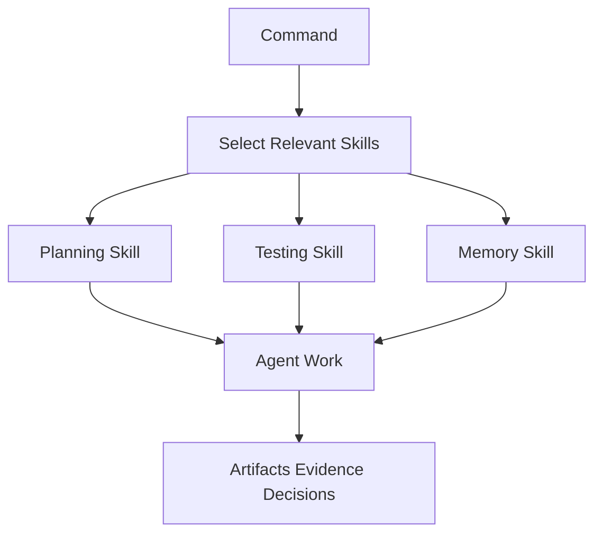
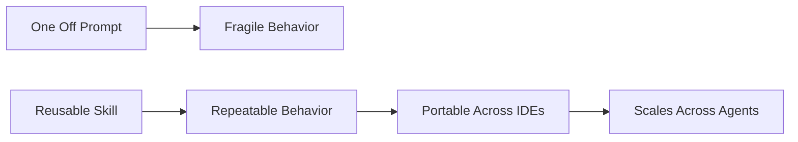

# Skills

Skills are reusable operating procedures for agents. They tell an agent how to perform a specialized task well: testing, reviewing, planning, researching, debugging, using memory, designing UI, handling git, or working with Skillgrid artifacts.

Commands answer “what phase are we in?” Skills answer “how should the agent do this kind of work?”

## What A Skill Provides

A good skill gives the agent:

- A clear trigger.
- A specific role or method.
- A process to follow.
- Tools or evidence to prefer.
- Guardrails and stop conditions.
- Output expectations.

This is better than repeating long instructions in every prompt. The skill carries the discipline.

## Command And Skill Relationship

Commands may load only the skills needed for their phase. That keeps agent context focused and reduces confusion.

## Skill Categories

### Core SDD Workflow Skills

These are directly tied to the active `/sdd-*` command surface:

- `sdd-init`
- `sdd-explore`
- `sdd-clarify`
- `sdd-propose`
- `sdd-spec`
- `sdd-design`
- `sdd-ui-design`
- `sdd-prd`
- `sdd-tasks`
- `sdd-apply`
- `sdd-verify`
- `sdd-archive`

`/sdd-brainstorm` orchestrates most of these phases in sequence.

### Spec, Architecture, And Git Discipline (Intent-driven style)

These complement OpenSpec / SDD without replacing phase skills:

- `architectural-decision-records` — ADRs and decision history (`/sdd-adr`).
- `c4-diagrams` — C4-style diagrams in ASCII or Mermaid (`/sdd-c4`).
- `gherkin-authoring` — Gherkin / BDD scenarios and acceptance criteria (`/sdd-gherkin`).
- `openspec-git-discipline` — git gates so proposal/apply/archive line up with `main` (`/sdd-openspec-git`).

### Implementation And TDD Skills

- `skillgrid-tdd` enforces RED/GREEN/REFACTOR loops during `/sdd-apply`.
- `skillgrid-vertical-slices` helps split work into independently testable slices.

### Memory And Persistence Skills

- `engram-memory-protocol`
- `engram-sdd-flow`
- `skillgrid-skill-registry`
- `ccc` (code search/index support)

These keep SDD artifacts durable across sessions and subagent runs.

### GitNexus Skills

- `gitnexus-cli`
- `gitnexus-exploring`
- `gitnexus-debugging`
- `gitnexus-impact-analysis`
- `gitnexus-pr-review`
- `gitnexus-refactoring`
- `gitnexus-guide`

Use these for exploration, debugging, risk analysis, and review support.

### Engram Guardrail Skills

- architecture, business, API, dashboard/UI, docs, testing, commit/PR, and cultural norms skills under the `engram-*` namespace.

These provide project-specific quality and boundary rules when changes touch those domains.

### External Docs And Research Skills

- `context7` for up-to-date library/framework docs.
- `exa-search` for broader web research.

## Why Skills Matter

Skills turn tribal knowledge into reusable agent behavior.

Without skills, every session depends on the user remembering the perfect instruction. With skills, the operating pattern travels with the project.

That is a key advantage of AISkillGrid: it does not only provide prompts. It provides a library of operating procedures that help agents behave like careful engineering partners.
