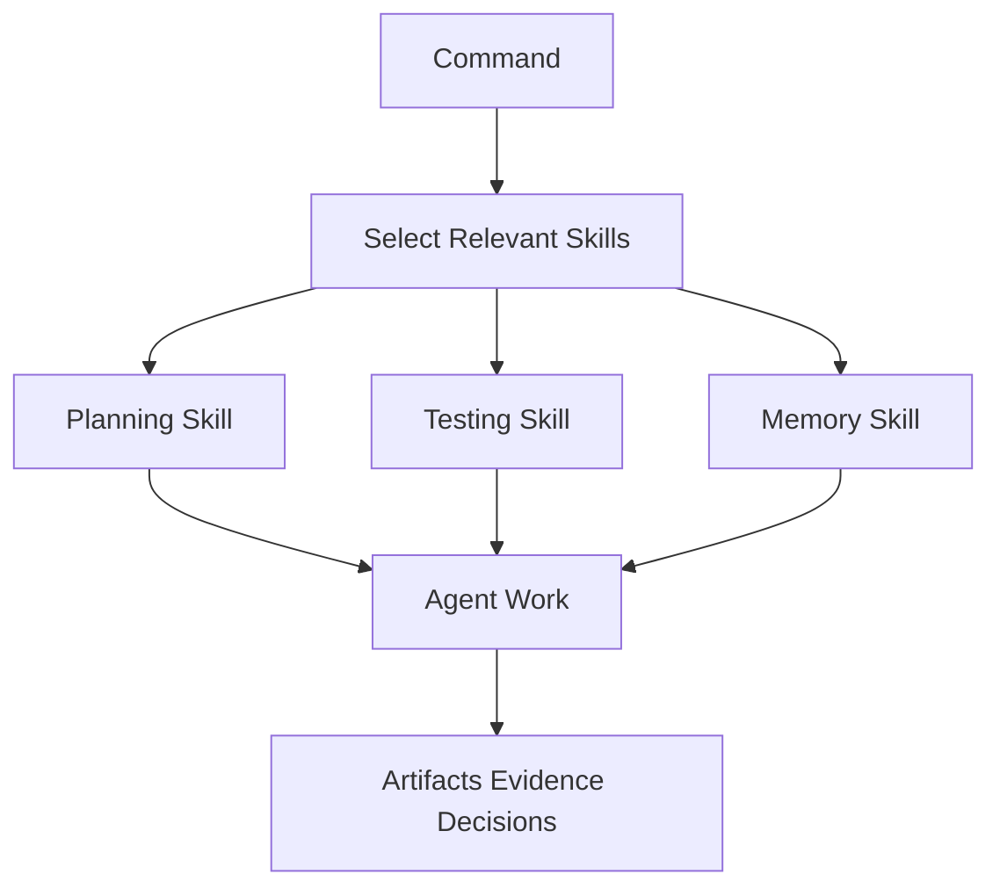
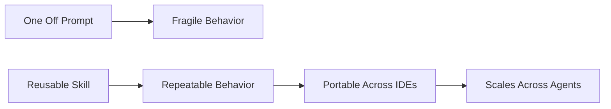

# Skills

Skills are reusable operating procedures for agents. They tell an agent how to perform a specialized task well: testing, reviewing, planning, researching, debugging, using memory, designing UI, handling git, or working with Skillgrid artifacts.

Commands answer “what phase are we in?” Skills answer “how should the agent do this kind of work?”

## What A Skill Provides

A good skill gives the agent:

- A clear trigger.
- A specific role or method.
- A process to follow.
- Tools or evidence to prefer.
- Guardrails and stop conditions.
- Output expectations.

This is better than repeating long instructions in every prompt. The skill carries the discipline.

## Command And Skill Relationship

Commands may load only the skills needed for their phase. That keeps agent context focused and reduces confusion.

## Skill Categories

### Core SDD Workflow Skills

These are directly tied to the active `/sdd-*` command surface:

- `sdd-init`
- `sdd-explore`
- `sdd-clarify`
- `sdd-propose`
- `sdd-spec`
- `sdd-design`
- `sdd-ui-design`
- `sdd-prd`
- `sdd-tasks` — enhanced with TDD enforcement, granularity rules, no-placeholders validation
- `sdd-apply` — orchestrator: invokes `isolated-workspace` → validates granular plan → dispatches `sequential-agent-executor`
- `sdd-verify` — **Stage 1:** spec compliance verification (invokes `spec-compliance-verifier`)
- `sdd-review` — **Stage 2:** code quality review (invokes `code-quality-reviewer`)
- `sdd-archive` — requires `sdd-verify` PASS + `sdd-review` APPROVED + `pre-merge-verification` PASS
- `sdd-diagnose` — enhanced with 4-phase systematic debugging protocol: evidence gathering → pattern analysis → hypothesis → fix. Includes 3-fixes threshold escalation: if 3+ attempted fixes fail, STOP and question architecture → escalate to `sdd-architecture-review`.
- `sdd-adr` (conditional) — ADRs in `.skillgrid/adr/` if architectural decisions needed
- `sdd-openspec-git` — git gates for proposal/apply/archive alignment

`/sdd-brainstorm` orchestrates most of these phases in sequence.

### Authoring new agent skills

New `SKILL.md` files should follow the shared scaffold: **`.agents/skills/_shared/SKILL-authoring-template.md`** (front matter, triggers, out of scope, stop conditions, example user prompt). Use **`skillgrid-skill-registry`** to refresh `.skillgrid/project/SKILL_REGISTRY.md` after adding skills.

### Spec, Architecture, And Git Discipline (Intent-driven style)

Adapted from [intent-driven-template](https://github.com/intent-driven-dev/intent-driven-template/tree/main/.agents/skills) (`grill-me` not vendored here). Slash workflows: **`docs/04-commands.md`** (*Discovery and planning*, adjunct list, and *Current command surface*).

These complement OpenSpec / SDD without replacing phase skills:

- `architectural-decision-records` — ADRs and decision history (`/sdd-adr`).
- `c4-diagrams` — C4-style diagrams in ASCII or Mermaid (`/sdd-c4`).
- `gherkin-authoring` — Gherkin / BDD scenarios and acceptance criteria (`/sdd-gherkin`).
- `openspec-git-discipline` — git gates so proposal/apply/archive line up with `main` (`/sdd-openspec-git`).

### Implementation And TDD Skills

- `micro-plan` — short operational plans (3–7 steps, exit criteria) for quick work; does not replace `sdd-tasks` / `sdd-design` / `openspec-continue-change`.
- `enforced-tdd-protocol` — mandatory TDD gate: RED (failing test) → GREEN (minimal code) → REFACTOR. Auto-invoked before every implementation task. Iron law: NO PRODUCTION CODE WITHOUT A FAILING TEST FIRST.
- `skillgrid-tdd` — legacy TDD enforcer (still used for backward compatibility; `enforced-tdd-protocol` is stricter).
- `skillgrid-vertical-slices` — helps split work into independently testable slices.

### Parallel delegation (sub-agents)

- `parallel-delegate` — coordinator playbook for **parallel Task-style** runs: split independent lanes, child prompt shape, merge and conflict rules. Does not replace `sdd-*` / OpenSpec phases.
- `sequential-agent-executor` — core execution engine: dispatches fresh subagent per task, two-stage review (spec compliance then code quality), continuous execution without human checkpoints. Used by `sdd-apply`.
- `parallel-slice-dispatcher` — orchestrates independent vertical slices in parallel worktrees, merges results, detects conflicts. Used by `sdd-parallel-execute` (future).
- `batch-executor` — alternative execution mode: execute tasks in batches with manual checkpoints between batches.

### Quality Gates & Verification Skills

These form the two-stage review pipeline:

- `spec-compliance-verifier` — **Stage 1:** traces every spec requirement to code/test evidence, produces PASS/FAIL/PARTIAL verdict with gap analysis. Used by `sdd-verify`.
- `code-quality-reviewer` — **Stage 2:** evaluates code health (readability, DRY, error handling, test quality, security, performance). Severity-tags issues (CRITICAL/IMPORTANT/MINOR), recommends APPROVED/CHANGES_REQUESTED. Used by `sdd-review`.
- `pre-merge-verification` — **Final gate:** combines spec compliance + code review + tests green + lint clean + worktree clean + branch mergeable + security scan. Required before `sdd-archive`.
- `enforced-tdd-protocol` — pre-implementation gate ensuring RED-GREEN-REFACTOR sequence with failure evidence capture.

### Workspace & Environment Skills

- `isolated-workspace` — automatically creates and manages git worktrees for each `sdd-apply` session. Ensures clean baseline, parallel work safety, automatic cleanup on archive. Mandatory pre-step for all implementation.

### Planning & Decomposition Skills

- `granular-planning` — creates atomic task lists (2–5 minutes per task) with exact file paths, complete code blocks, verification commands, and no placeholders. Enforces TDD task structure and budget checks. Output: `tasks.md`.
- `sdd-tasks` (enhanced) — orchestrates vertical slice validation and granular breakdown. Enforces TDD sequence, granularity rules, and no-placeholders validation before task persistence.

### Pull request work modes (author vs reviewer)

Keep **author** and **reviewer** paths in different skills so one `SKILL.md` does not mix roles (for example *requesting* human review vs *integrating* review feedback).

| Mode | Who | Skill |
| --- | --- | --- |
| Open PR (Engram policy) | Author | `engram-branch-pr` |
| Ask for human review (readiness, context, reviewers) | Author | `requesting-code-review` |
| Integrate review feedback (threads, fixes, push) | Author | `receiving-code-review` |
| Assess merge risk with GitNexus | Reviewer | `gitnexus-pr-review` |
| Deep Engram merge gate | Reviewer | `engram-pr-review-deep` |

Note: `sdd-review` is the **automated** quality review step; human peer review is requested separately via `requesting-code-review` if project policy requires it.

### Memory And Persistence Skills

- `engram-memory-protocol`
- `engram-sdd-flow`
- `skillgrid-skill-registry`
- `ccc` (code search/index support)

These keep SDD artifacts durable across sessions and subagent runs.

### GitNexus Skills

- `gitnexus-cli`
- `gitnexus-exploring`
- `gitnexus-debugging`
- `gitnexus-impact-analysis`
- `gitnexus-pr-review` — **reviewer** workflow on someone else’s PR (with GitNexus); authors use `receiving-code-review` / `requesting-code-review` instead.
- `gitnexus-refactoring`
- `gitnexus-guide`

Use these for exploration, debugging, risk analysis, and review support.

### Engram Guardrail Skills

- architecture, business, API, dashboard/UI, docs, testing, commit/PR, and cultural norms skills under the `engram-*` namespace.

These provide project-specific quality and boundary rules when changes touch those domains.

### External Docs And Research Skills

- `context7` for up-to-date library/framework docs.
- `exa-search` for broader web research.

### Security & Architecture Analysis Skills

External analysis tools integrated into quality review:

- `truecourse-analyze` — runs TrueCourse repository architecture analysis; produces baseline and diff of violations (circular deps, layer violations, missing abstractions). Used by `sdd-review` when architecture checking enabled.
- `truecourse-list` — lists TrueCourse violations with filtering, paging; shows new and resolved since baseline.
- `truecourse-fix` — applies automated fixes for some TrueCourse violations (where available).
- `truecourse-hooks` — installs and manages pre-commit hook that blocks new violations.
- `trivy` (MCP) — vulnerability scanner for dependencies, secrets, and misconfigurations. Invoked as MCP tool `trivy_scan_filesystem`, `trivy_scan_image`, `trivy_scan_repository`. Integrated into `sdd-review` security stage.

## Why Skills Matter

Skills turn tribal knowledge into reusable agent behavior.

Without skills, every session depends on the user remembering the perfect instruction. With skills, the operating pattern travels with the project.

That is a key advantage of AISkillGrid: it does not only provide prompts. It provides a library of operating procedures that help agents behave like careful engineering partners.
