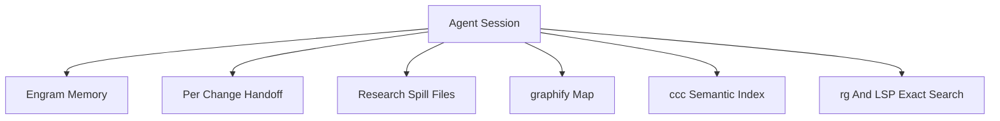
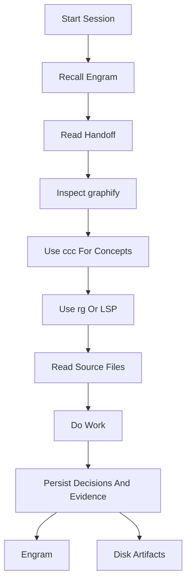

# Memory And Indexing

AISkillGrid treats memory as a layered system. No single tool should pretend to hold the whole truth.

The goal is durable context: an agent should be able to resume after compaction, a new session, a handoff, or a different IDE without starting from zero.

## The Layers



Each layer answers a different question.

| Layer | Question It Answers | Typical Artifact |
|---|---|---|
| Engram | What should survive sessions? | Durable observations and summaries |
| Handoff | What is happening in this change right now? | `.skillgrid/tasks/context_<change-id>.md` |
| Research spill | Where is the long evidence? | `.skillgrid/tasks/research/<change-id>/` |
| graphify | How is the repo structured? | `graphify-out/` |
| ccc | Where is this concept in code? | semantic code index |
| rg and LSP | Where is this exact symbol or string? | live source lookup |

## Engram

Engram is the persistent memory layer. It stores concise observations that should survive chat compaction and new sessions.

Use it for:

- Decisions.
- User preferences.
- Project conventions.
- Bugfix discoveries.
- Session summaries.
- Pointers to important artifacts.

Do not use Engram as a dumping ground for huge files or as a replacement for reading the repository. It should remember what matters and point back to durable artifacts.

Your AI agent automatically remembers decisions, bugs, and context across sessions. You don't need to do anything -- but when you do:

```bash
engram projects list          # See all projects with memory counts
engram projects consolidate   # Fix name drift ("my-app" vs "My-App")
engram search "auth bug"      # Find a past decision from the terminal
engram tui                    # Visual memory browser
```

## Per-Change Handoff

The handoff file records current state for one change.

Typical path:

```text
.skillgrid/tasks/context_<change-id>.md
```

It should answer:

- What is the goal?
- What phase are we in?
- What is blocked?
- What has been completed?
- What evidence exists?
- What should happen next?
- Which subagent reports or research files matter?

This is the shared working memory for the current change. It is local, readable, and reviewable.

## Research Spill Files

Long research does not belong in chat. Subagent reports, web research, audits, and large notes should go under:

```text
.skillgrid/tasks/research/<change-id>/
```

The parent session can then summarize only what matters and keep a pointer to the full evidence.

## graphify

graphify creates a structural map of the repository. It helps agents orient before reading raw files.

Use it for:

- Architecture overview.
- Important nodes.
- Communities or clusters.
- High-level codebase shape.

Typical output:

```text
graphify-out/
```

graphify is not a replacement for code review. It is a map.

## CocoIndex Code

CocoIndex Code, often called `ccc`, supports semantic code search.

Use it when you want to ask concept questions such as:

- Where is authentication handled?
- How are browser previews generated?
- Which code updates PRD status?
- Where do command assets get mirrored?

Semantic search complements exact search. If you know the exact string or symbol, use exact search.

## Exact Search

Use exact search through `rg`, IDE search, or LSP when you know the name of a file, function, class, command, or literal.

This is still essential. Memory and semantic indexing should not replace reading the code that will be changed.

## Recommended Order



## Why This Matters

AI failures often come from context loss. AISkillGrid reduces that risk by separating:

- Durable memory.
- Current change state.
- Research evidence.
- Structural maps.
- Semantic search.
- Exact source truth.

That layered approach is one of the strongest advantages of the solution. It keeps agents fast without asking users to trust invisible memory.
