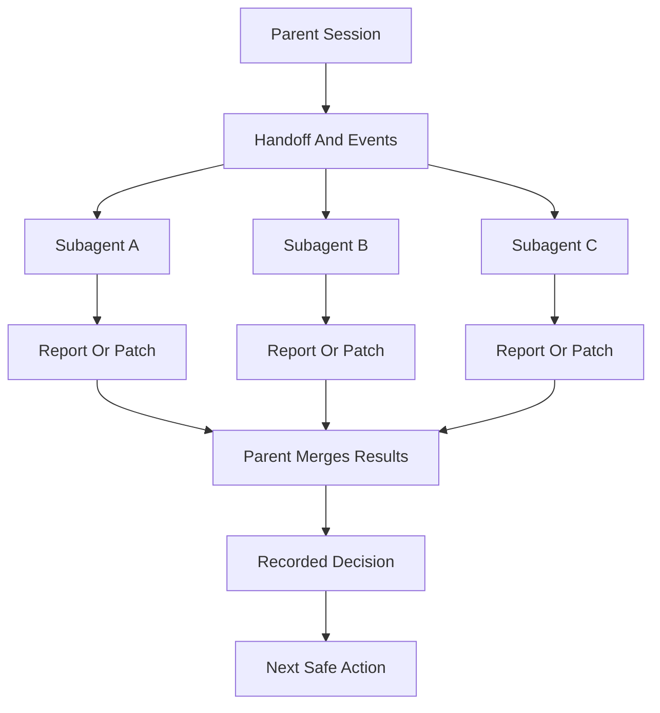
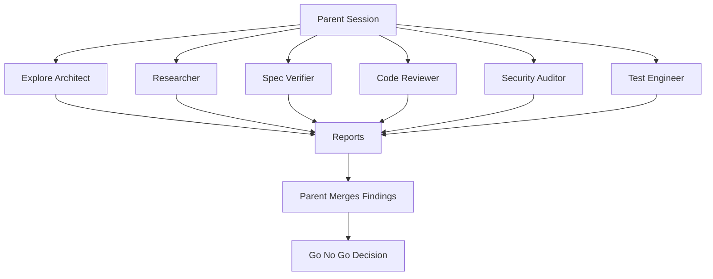
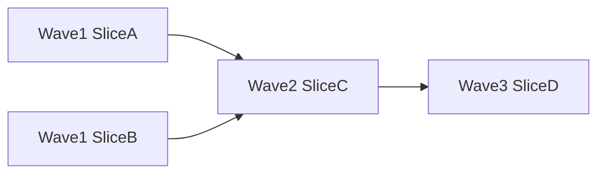

# Subagents And Personas

Subagent personas are specialist roles for delegated work. A persona is not the same as a skill. A skill is a procedure. A persona is a viewpoint and reporting style.

AISkillGrid uses personas to bring focused judgment into a workflow without turning every task into a long manual review meeting.

Subagents are how Skillgrid keeps the parent session small. The parent owns workflow state and decisions; subagents get fresh context, do bounded work, write or return evidence, and stop.



The main rule is simple: delegate work, not responsibility.

## What Personas Do

Personas help with independent work such as:

- Reviewing code quality.
- Auditing security risk.
- Verifying implementation against specs.
- Reviewing test strategy.
- Exploring brownfield architecture.
- Checking task breakdown quality.
- Critiquing design and UX.
- Researching external evidence.

The parent session remains responsible for orchestration. Personas should not secretly coordinate with one another or rewrite the plan on their own.

Persona names should be product-neutral in agent folders. Prefer names like `code-reviewer`, `security-auditor`, `test-engineer`, `spec-verifier`, `explore-architect`, `task-breakdown-auditor`, `design-critic`, and `researcher` instead of names with a `skillgrid-` prefix. Skillgrid is the workflow that composes them; the persona is the specialist role.

## Subagent Operating Model

Use subagents for work that benefits from a fresh context window or independent perspective:

- repo exploration, research, design critique, test strategy, security review, and validation;
- implementation of one clearly scoped `[AFK]` slice;
- review of an implementation in a fresh context;
- decision-board reports for ambiguous product, architecture, UX, security, or testing choices.

Do not use subagents for:

- unclear scope;
- product alignment that still needs user answers;
- tasks that edit the same files without explicit separation;
- tasks that depend on each other but are launched in parallel;
- hidden orchestration where one persona decides which other personas to call.

The parent session must read the returned summaries and cited files before updating state or moving to the next phase.

## Core Personas

### Code Reviewer

Reviews correctness, readability, architecture, security, and performance. This persona is useful after implementation or before merge.

### Security Auditor

Looks for threat models, insecure defaults, secret handling problems, unsafe dependencies, and abuse cases.

### Test Engineer

Evaluates whether the change is actually proven. This persona connects test coverage to user-facing success criteria.

### Spec Verifier

Checks whether implementation matches the PRD, OpenSpec proposal, delta specs, and task list.

### Explore Architect

Maps existing systems, architecture boundaries, conventions, and onboarding knowledge.

### Task Breakdown Auditor

Checks whether tasks are ordered, testable, scoped, and ready for implementation.

### Design Critic

Reviews UX flows, accessibility, design decisions, and interface boundaries. It is not a general code reviewer.

### Researcher

Uses research tools and documentation sources to produce cited findings and durable research artifacts.

## Orchestration Skill

The canonical operating rules live in `.agents/skills/skillgrid-subagent-orchestration/SKILL.md`. Load that skill whenever a Skillgrid command dispatches subagents for exploration, research, design critique, implementation, testing, security, validation, or decision-board work.

That skill defines:

- fresh-context prompt construction from durable artifacts;
- prompt contracts and return formats;
- model selection guidance;
- parallelization rules;
- apply dispatch loop;
- two-stage review;
- red flags and reassessment rules.

Subagent prompts should include:

- goal and phase;
- PRD path;
- OpenSpec change path when present;
- `.skillgrid/tasks/context_<change-id>.md`;
- `.skillgrid/tasks/events/<change-id>.jsonl`;
- expected output path under `.skillgrid/tasks/research/<change-id>/`;
- selected project standards from `.skillgrid/project/SKILL_REGISTRY.md` when relevant;
- exact return format.

## Specialist Persona Board

Use a specialist persona board when a decision needs independent viewpoints before the parent session chooses a path. This is useful for product, UX, architecture, security, testing, queue readiness, and post-implementation go/no-go decisions.

The board is advisory. It is not a majority-vote machine and it does not replace the user, PRD, OpenSpec change, or parent session judgment.

Common board presets:

- Product or UX: `design-critic`, `researcher`, optional `task-breakdown-auditor`.
- Architecture: `explore-architect`, `code-reviewer`, `test-engineer`.
- Security-sensitive: `security-auditor`, `code-reviewer`, `spec-verifier`.
- Queue readiness: `task-breakdown-auditor`, optional `test-engineer`.
- Post-implementation go/no-go: `spec-verifier`, `code-reviewer`, `test-engineer`, optional `security-auditor`.

Every board should produce durable state:

- one focused report per persona under `.skillgrid/tasks/research/<change-id>/`;
- a decision entry in `.skillgrid/tasks/context_<change-id>.md`;
- JSONL events in `.skillgrid/tasks/events/<change-id>.jsonl`;
- a parent summary that records accepted decision, rejected options, conflicts, HITL status, and next safe action.

Suggested handoff record:

```markdown
## Decision Board: <decision-id>

Question:
Personas:
Report paths:
Accepted decision:
Rejected options:
Reason:
Conflicts:
HITL required: yes/no
Artifacts updated:
Next safe action:
```

Suggested event statuses for board work:

- `started` when the parent opens the board;
- `persona_reported` for each returned persona report;
- `decided` when the parent records an accepted decision;
- `blocked` when reports conflict or HITL is required.

## Fan-Out Model

Use multiple personas when their work is independent.



The same fan-out pattern powers the specialist persona board. The difference is that the board is centered on a named decision and must write that decision into the handoff and event log before the workflow continues.

## Dependency Waves

Dependency waves are how Skillgrid should parallelize safely. A wave is a group of independent tasks that can run at the same time because they have no unresolved blockers and do not edit overlapping files.



Use waves when `tasks.md` or the handoff records blockers such as:

- `blockedBy`: task ids that must finish first;
- `unblocks`: task ids that become eligible afterward;
- file ownership or edit boundaries;
- verification requirements for the wave.

Rules:

- independent tasks can share a wave;
- dependent tasks move to a later wave;
- tasks touching the same files should be sequential unless ownership is explicit and non-overlapping;
- failed verification in one wave blocks dependent waves;
- the parent merges evidence after each wave before dispatching the next.

Dependency waves pair naturally with vertical slices. Horizontal layer plans usually parallelize badly because later tasks cannot be verified until the stack is assembled.

## Handoff And Event Logs

Subagent work must be visible outside chat. Skillgrid uses three paths:

```text
.skillgrid/tasks/context_<change-id>.md
.skillgrid/tasks/events/<change-id>.jsonl
.skillgrid/tasks/research/<change-id>/
```

- The handoff is the current state: phase, blockers, AFK-ready work, decisions, evidence, and next action.
- The event log is the append-only timeline: starts, completions, blockers, subagent dispatches, returns, and decisions.
- The research directory holds long outputs: reports, audits, browser evidence, comparisons, and design critiques.

Every delegated subagent should either append an event or return a suggested event for the parent to append. The parent should not advance the workflow until the handoff and event log reflect the subagent result.

Useful event fields for subagents:

```json
{
  "time": "<iso8601>",
  "changeId": "<change-id>",
  "phase": "<phase>",
  "node": "subagent",
  "status": "dispatched|completed|blocked|failed",
  "subagent": "<persona-or-role>",
  "role": "<role>",
  "task": "<short task>",
  "output": ".skillgrid/tasks/research/<change-id>/<file>.md",
  "summary": "<one-line result>",
  "artifacts": ["<path>"]
}
```

## Planned Worktree Separation

Skillgrid currently works safely in a single working tree by using handoff files, event logs, small scopes, and non-overlapping outputs. For heavier parallel implementation, planned support should add optional git worktree or sandbox separation.

Use planned worktree separation when:

- two or more implementation agents need to edit code in parallel;
- the file ownership is not trivially non-overlapping;
- a task is risky enough to isolate from the main workspace;
- a dependency wave should produce separate reviewable branches before merge.

Expected worktree model:

- parent creates or selects one worktree per implementation lane;
- each lane gets the same PRD/OpenSpec/handoff context plus its assigned slice;
- each lane writes its own report and event suggestions;
- parent reviews diffs, runs verification, and merges lanes in dependency order;
- conflicts or failed verification route back to a fix task, not silent merge.

Do not use worktrees as a substitute for clear task boundaries. They reduce file-level collisions; they do not solve ambiguous scope.

## Parallelism Rules

Parallelism is useful only when it reduces wall-clock time without multiplying risk.

Good parallel work:

- repo mapping and external research;
- design critique and API constraint review;
- independent decision-board reports;
- test strategy and security review;
- implementation lanes in separate worktrees or with explicit non-overlapping file ownership.

Bad parallel work:

- multiple agents editing the same files;
- multiple guesses at the same bug root cause;
- dependent tasks launched together;
- implementation before HITL blockers are resolved;
- broad “fix everything” prompts.

Before launching parallel subagents, the parent should verify:

- each agent has a distinct goal;
- each agent has a distinct output path;
- each agent has a bounded context packet;
- file ownership is clear for any writer;
- the parent has time to read and merge all results;
- verification can cover the integrated result.

## Multi-Agent Checklist

Before dispatch:

- [ ] Active PRD and change id are known.
- [ ] Handoff and event log paths exist or are planned.
- [ ] The delegated task is small enough for fresh context.
- [ ] HITL blockers are resolved or the task is read-only.
- [ ] Output path and return format are explicit.
- [ ] Parallel tasks are independent or isolated.

After return:

- [ ] Read the subagent summary.
- [ ] Read linked report, audit, evidence, or diff.
- [ ] Check conflicts with PRD, OpenSpec, handoff, and other agents.
- [ ] Append or verify event log entries.
- [ ] Update the handoff with decisions, evidence, blockers, and next action.
- [ ] Run relevant integrated verification before marking work complete.

## When To Use Personas

Use personas when the work benefits from a fresh perspective:

- Before planning a large change.
- Before implementation when tasks may be unclear.
- After implementation when review risk is meaningful.
- Before finish when spec compliance, security, and evidence matter.
- When external research should be separated from local code exploration.

Do not use personas just to create activity. Each delegation should have a narrow question, a clear artifact target, and a short return format.

## Parent Session Responsibilities

The parent session should:

- Define the scope.
- Provide the handoff path.
- Prevent duplicate exploration.
- Read the returned report.
- Verify claims against code and artifacts.
- Decide which findings are accepted.
- Update the handoff and event log for board decisions.
- Stop on critical blockers.
- Sequence dependency waves.
- Decide whether worktree separation is required.
- Run integrated verification after parallel work.

This is how AISkillGrid gets the benefit of multiagent work without losing control.

## Why Personas Matter

Personas make review cheaper and more consistent. Instead of relying on one agent to be planner, implementer, tester, security engineer, and product reviewer all at once, AISkillGrid can call in focused judgment at the right moment.

That gives users a practical advantage: stronger coverage, clearer reports, and fewer hidden assumptions.

Good multi-agent work should feel boring and auditable: clear prompts, fresh context, separate outputs, recorded events, and parent-owned decisions.
