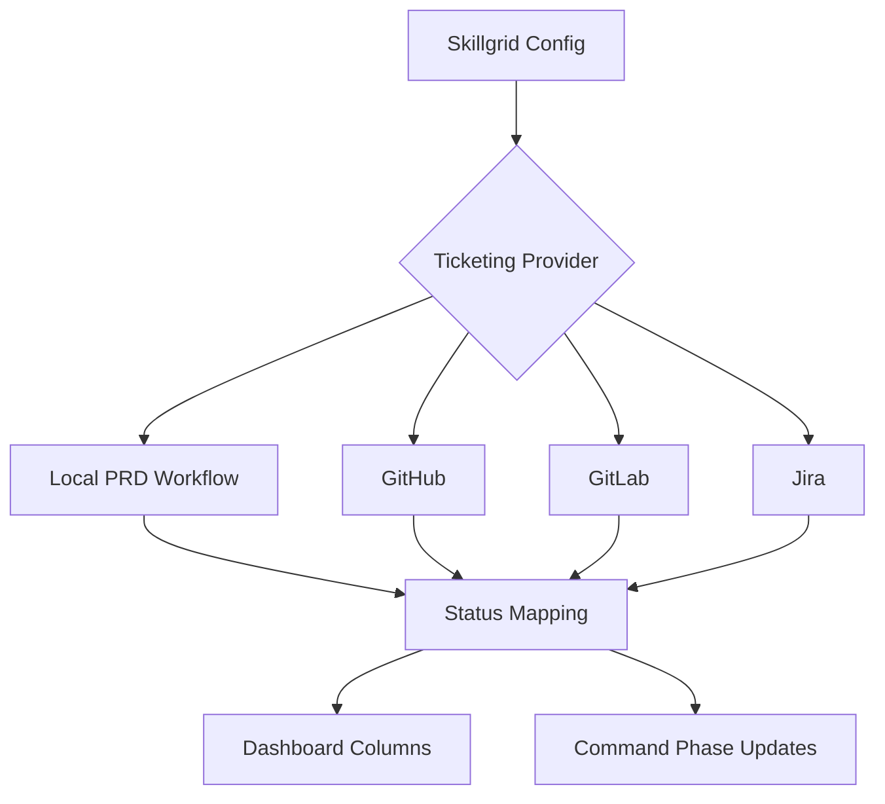

# Ticketing Integrations

AISkillGrid is local-first, but it is designed to work with external ticketing systems when a team needs them.

The core idea is that product intent should remain visible and structured. A local PRD can be enough for one developer. A remote issue can help a team coordinate. AISkillGrid supports both modes.

## Ticketing Model



## Local-First Workflow

The simplest setup is local:

```text
ticketing.provider = local
```

In this mode, AISkillGrid uses repository files to track work:

- PRD files describe product intent.
- The PRD index gives ordered visibility.
- Handoff files record current state.
- Event logs record workflow history.
- The dashboard renders local status.

This is powerful because it does not require a remote tracker, hosted service, or account setup before the team can work.

## External Providers

AISkillGrid can be configured for external providers such as:

- GitHub.
- GitLab.
- Jira.

External providers are useful for:

- Assignment.
- Team coordination.
- Discussion.
- Review references.
- Release tracking.
- Cross-team visibility.

The external tracker should not become a hidden second source of truth. If a product decision changes in the external issue, import or record that decision back into the Skillgrid artifacts.

## PRD Workflow Statuses

AISkillGrid stores a configurable PRD workflow. A common default looks like:

```text
draft
todo
inprogress
devdone
done
```

Each status can map to workflow phases:

| Phase | Typical Status |
|---|---|
| Plan | `draft` |
| Breakdown | `todo` |
| Apply | `inprogress` |
| Validate | `devdone` |
| Finish | `done` |

Teams can change the labels and ordering to match their process.

## Provider Import And Fallback

During initialization, AISkillGrid can ask how the project wants to handle ticketing:

- Use the Skillgrid default workflow.
- Use a provider-style preset.
- Import statuses from a provider when credentials and project metadata are available.
- Define a custom ordered workflow.

If provider discovery fails, AISkillGrid should not block project setup. It should record the reason and use a selected fallback.

## What Each System Owns

| System | Owns |
|---|---|
| PRD | Product intent, scope, success criteria, and slice boundary |
| OpenSpec change | Technical behavior and scenarios |
| Task list | Ordered implementation and verification checklist |
| Handoff | Current state, blockers, evidence, and next action |
| External tracker | Coordination, assignment, comments, and team visibility |
| Dashboard | Local visualization of workflow and artifacts |

This ownership model prevents requirements from being scattered across too many places.

## Why Ticketing Integration Matters

AISkillGrid lets users start local and grow into team workflows. That is a practical advantage over tools that require a platform account before value appears, and over ad hoc chat workflows that cannot show status.

You can begin with local PRDs, add external tickets later, and keep the same underlying work model.
