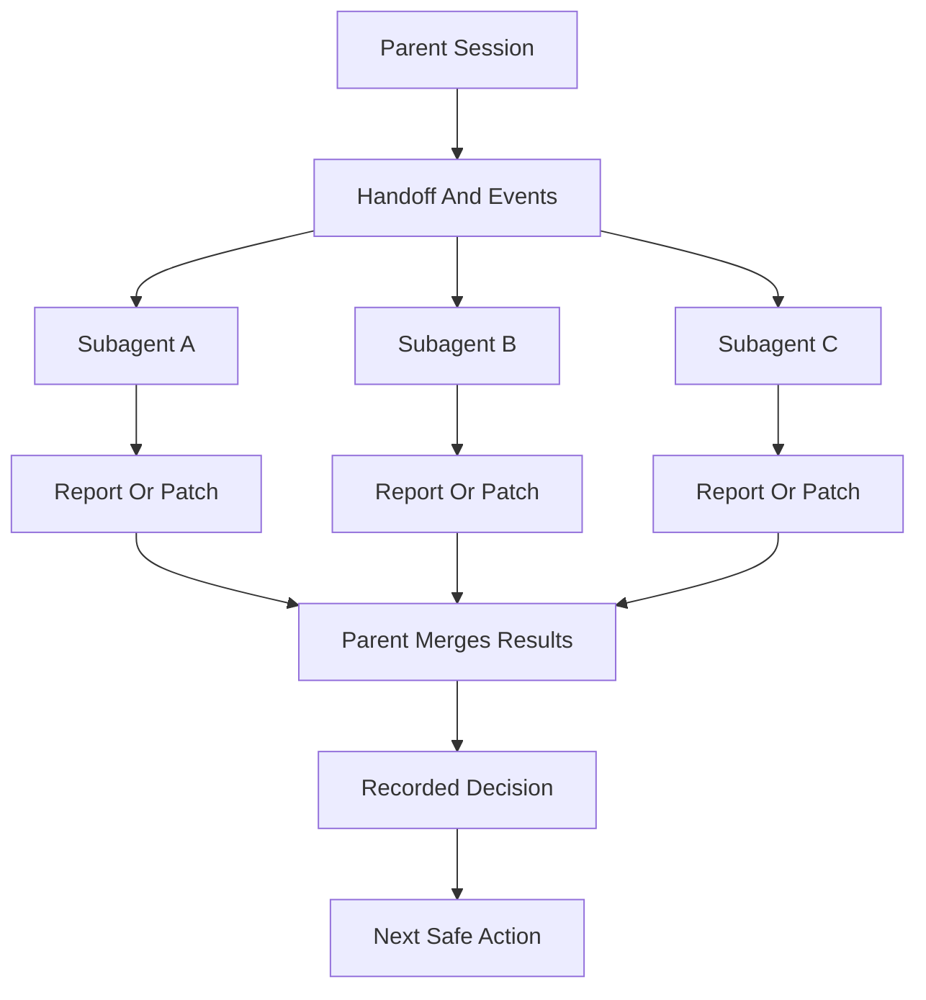
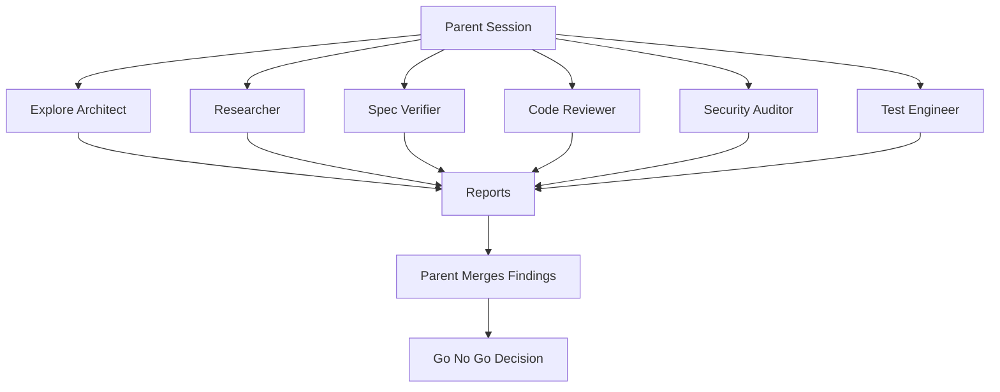
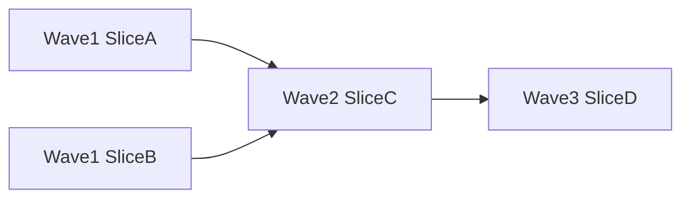

# Subagents And Personas

Subagent personas are specialist roles for delegated work. A persona is not the same as a skill. A skill is a procedure. A persona is a viewpoint and reporting style.

AISkillGrid uses personas to bring focused judgment into a workflow without turning every task into a long manual review meeting.

Subagents are how Skillgrid keeps the parent session small. The parent owns workflow state and decisions; subagents get fresh context, do bounded work, write or return evidence, and stop.



The main rule is simple: delegate work, not responsibility.

## What Personas Do

Personas help with independent work such as:

- Reviewing code quality.
- Auditing security risk.
- Verifying implementation against specs.
- Reviewing test strategy.
- Exploring brownfield architecture.
- Checking task breakdown quality.
- Critiquing design and UX.
- Researching external evidence.

The parent session remains responsible for orchestration. Personas should not secretly coordinate with one another or rewrite the plan on their own.

Workflow-facing persona IDs use the Norse set defined in `.agents/workflows/sdd-persona-route.md`: `odin`, `thor`, `tyr`, `heimdall`, `frigg`, `loki`, `mimir`, and `bragi`. Legacy neutral labels may still appear as descriptive role text, but command routing and board outputs should use Norse IDs.

| ID | Title | Role | Hard gate on critical? | Notes |
| --- | --- | --- | --- | --- |
| `odin` | Odin | Orchestrator and planner authority | No | Board routing, merge, HITL boundaries. |
| `thor` | Thor | Implementation enforcer | No | Delivery feasibility, execution quality, momentum. |
| `tyr` | Tyr | Spec and compliance verifier | **Yes** | Traceability, acceptance criteria, spec compliance. |
| `heimdall` | Heimdall | Security and release-gate sentinel | **Yes** | Threat model, exploitability, release risk. |
| `frigg` | Frigg | UX and product clarity reviewer | No | Flows, accessibility, content clarity. |
| `loki` | Loki | Adversarial critic | No | Counterexamples, assumption stress-test; can surface conflicts that require HITL. |
| `mimir` | Mimir | Bootstrap and memory-knowledge keeper | No | Init quality, context hydration, registry readiness. |
| `bragi` | Bragi | Structured artifact author | No | Specification/task structure, writing clarity, traceability wording. |

## Agent Files In This Repo

- Nordic personas:
  - `.cursor/agents/skillgrid-odin.md`
  - `.cursor/agents/skillgrid-thor.md`
  - `.cursor/agents/skillgrid-tyr.md`
  - `.cursor/agents/skillgrid-heimdall.md`
  - `.cursor/agents/skillgrid-frigg.md`
  - `.cursor/agents/skillgrid-loki.md`
  - `.cursor/agents/skillgrid-mimir.md`
  - `.cursor/agents/skillgrid-bragi.md`

## How To Use Them

1. Use Nordic personas for both execution ownership and gatekeeping.
2. Route by phase owner:
   - `init` -> `odin`/`mimir`
   - `explore` -> `loki` (+ `odin`)
   - `propose` -> `odin`
   - `spec` -> `tyr`/`bragi`
   - `design` -> `odin` (+ `thor`)
   - `tasks` -> `thor`/`bragi`
   - `apply` -> `thor`
   - `verify` -> `tyr` (+ `heimdall` when security/release-sensitive)
   - `archive` -> `odin` (+ `mimir`/`bragi`)
3. Keep hard-gate authority independent:
   - `tyr` and `heimdall` critical findings block progression.

## Enforcement Checklist (Orchestrator)

To ensure both sets are actually used (not just present on disk), enforce this checklist per phase:

1. Phase has matching required Nordic owner invocation.
2. Verify phase includes `tyr`; include `heimdall` on security/release-sensitive changes.
3. Completion is blocked if required owner/gate outputs are missing.
4. Board flows must include `personas_invoked`, `conflicts`, `hitl_required`, and `accepted_decision`.
5. Critical findings from `tyr` or `heimdall` require fix, explicit risk acceptance, or HITL before progression.

## Subagent Operating Model

Use subagents for work that benefits from a fresh context window or independent perspective:

- repo exploration, research, design critique, test strategy, security review, and validation;
- implementation of one clearly scoped `[AFK]` slice;
- review of an implementation in a fresh context;
- decision-board reports for ambiguous product, architecture, UX, security, or testing choices.

Do not use subagents for:

- unclear scope;
- product alignment that still needs user answers;
- tasks that edit the same files without explicit separation;
- tasks that depend on each other but are launched in parallel;
- hidden orchestration where one persona decides which other personas to call.

The parent session must read the returned summaries and cited files before updating state or moving to the next phase.

## Core Personas

### Odin

Orchestrator and planner authority for board decisions. Owns routing, synthesis, and HITL boundaries.

### Thor

Implementation enforcer focused on delivery feasibility, execution quality, and momentum.

### Tyr

Spec and compliance verifier. Critical findings are hard gates that block progression.

### Heimdall

Security and release-gate sentinel. Critical security findings are hard gates that block progression.

### Frigg

UX and product-clarity reviewer focused on user flow, accessibility, and content quality.

### Loki

Adversarial critic that challenges assumptions, proposes counterexamples, and stress-tests risk acceptance.

## Orchestration Skill

The canonical operating rules live in the `sdd-*` workflow skills under `.agents/skills/` (especially `sdd-explore`, `sdd-apply`, `sdd-verify`, and `sdd-archive`). Load the relevant skill whenever an `sdd-*` workflow dispatches subagents for exploration, research, design critique, implementation, testing, security, validation, or decision-board work.

That skill defines:

- fresh-context prompt construction from durable artifacts;
- prompt contracts and return formats;
- model selection guidance;
- parallelization rules;
- apply dispatch loop;
- two-stage review;
- red flags and reassessment rules.

Subagent prompts should include:

- goal and phase;
- PRD path;
- OpenSpec change path when present;
- `.skillgrid/tasks/context_<change-id>.md`;
- `.skillgrid/tasks/events/<change-id>.jsonl`;
- expected output path under `.skillgrid/tasks/research/<change-id>/`;
- selected project standards from `.skillgrid/project/SKILL_REGISTRY.md` when relevant;
- exact return format.

## Specialist Persona Board

A **persona board** is for decisions that benefit from **independent viewpoints** before the parent session or human operator commits: architecture trade-offs, security posture, UX and content clarity, go/no-go release, and explicit risk acceptance.

Use it when a decision needs that kind of review before choosing a path. This is useful for product, UX, architecture, security, testing, queue readiness, and post-implementation go/no-go decisions.

The board is **advisory**. It does not replace the user, PRD, OpenSpec artifacts, or orchestration policy. It is not a majority-vote machine. It produces **durable reports**, a **recorded decision**, and a **clear continue vs HITL** outcome.

### Source of truth

Canonical definitions (personas, routing matrix, required return fields, hard rules) live in `.agents/workflows/sdd-persona-route.md` and `.agents/workflows/sdd-persona-board.md`.

Workflow prompts for board-related commands live under:

- `.agents/workflows/sdd-persona-*.md`
- `.agents/workflows/sdd-board.md` (compatibility alias for the Norse board flow)

### Decision routing matrix

Presets map **decision types** to **which personas** participate. Aliases such as `arch`, `ux`, `release`, and `risk` normalize to the canonical keys below (see `.agents/workflows/sdd-persona-board.md` and `.agents/workflows/sdd-persona-route.md`).

| Decision type | Personas invoked (order is workflow-defined) |
| --- | --- |
| `architecture` | `odin`, `thor`, `tyr`, `loki` |
| `security` | `heimdall`, `tyr`, `thor`, `loki` |
| `ux-content` | `frigg`, `loki`, `thor` |
| `go-no-go-release` | `odin`, `tyr`, `heimdall`, `thor`, `frigg` |
| `risk-acceptance` | `odin`, `loki`, `tyr`, `heimdall` |

### Commands (persona board family)

Primary entrypoints:

- `/sdd-persona-board --preset <arch|security|ux|release|risk>` — full board cycle: scope, route, parallel reports, merge, persist.
- `/sdd-persona-list` — personas, roles, and availability or limitations by surface when known.
- `/sdd-persona-route --decision <type>` — auto-select personas from the matrix; **fail closed** on unknown types.
- `/sdd-persona-report --id <decision-id>` — merge verdicts and conflict summary for one decision.
- `/sdd-persona-resolve --id <decision-id>` — record accepted decision and rejected options in handoff/events.
- `/sdd-persona-health` — check contract alignment, model tier mapping, and surface capability readiness where applicable.

Compatibility: `/sdd-board` is treated as an alias that follows the same Norse board flow (see `.agents/workflows/sdd-board.md`).

Command inventory and phase context: `04-commands.md`.

### Durable artifacts

Board work must be visible outside chat. Typical paths:

- Reports: `.skillgrid/tasks/research/<change-id>/`
- Handoff and decisions: `.skillgrid/tasks/context_<change-id>.md`
- Timeline: `.skillgrid/tasks/events/<change-id>.jsonl`

Follow handoff and event contracts in `.agents/skills/_shared/skillgrid-handoff.md` when persisting board output.

Every board should produce durable state:

- one focused report per persona under `.skillgrid/tasks/research/<change-id>/`;
- a decision entry in `.skillgrid/tasks/context_<change-id>.md`;
- JSONL events in `.skillgrid/tasks/events/<change-id>.jsonl`;
- a parent summary that records accepted decision, rejected options, conflicts, HITL status, and next safe action.

Suggested handoff record:

```markdown
## Decision Board: <decision-id>

Question:
Personas:
Report paths:
Accepted decision:
Rejected options:
Reason:
Conflicts:
HITL required: yes/no
Artifacts updated:
Next safe action:
```

Suggested event statuses for board work:

- `started` when the parent opens the board;
- `persona_reported` for each returned persona report;
- `decided` when the parent records an accepted decision;
- `blocked` when reports conflict or HITL is required.

### Return contract (persona commands)

Persona-related commands share an extended envelope. Required fields (from the contract):

- `status`
- `executive_summary` (including `overview` and `used_tokens` where applicable)
- `artifacts`
- `next_recommended`
- `risks`
- `personas_invoked`
- `conflicts`
- `hitl_required`
- `accepted_decision`

Milestone-wide enforcement envelopes for other `sdd-*` phases remain defined in `.agents/skills/_shared/sdd-enforcement-contract.md`; persona commands **add** the board-specific keys above.

### Hard gates and HITL rules

From `.agents/workflows/sdd-persona-route.md`:

- No persona overrides **hard gates**.
- **`tyr`** or **`heimdall`** reporting **critical** severity blocks progression until resolved or explicitly handled per policy.
- **Unresolved critical conflict** between personas blocks progression (HITL).
- The **user** remains the final authority on **release** and **destructive** choices.

Unresolved conflicts escalated by `loki` or merged reports still flow through these rules.

### Where agent prompts live by surface

Specialist persona markdown agents use the shared `skillgrid-<persona>.md` filenames (same body conventions: identity, mandatory context, rules, composition):

- Cursor: `.cursor/agents/`
- GitHub Copilot agents mirror: `.github/agents/`
- Kilo and OpenCode mirrors (transformed frontmatter): `.kilo/agents/`, `.opencode/agents/`
- Antigravity hub: `.agent/agents/`

Regenerate cross-IDE persona manifests (optional tooling):

```bash
node scripts/render-multi-ide-personas.mjs
```

Mirror agent files from Cursor sources:

```bash
./scripts/sync-ide-assets.sh
```

Surface capability tiers and fallback behavior: `.configs/ide-persona-capabilities.json`, described alongside other IDE layout notes in `100-ide-configs.md`.

### Related reading

- `04-commands.md` — command list and persona board entrypoints
- `02-workflow-usage.md` — when boards appear in the main workflow
- `08-multi-agent-work.md` — delegate work, not responsibility
- `100-ide-configs.md` — Norse persona config set and IDE layout

## Fan-Out Model

Use multiple personas when their work is independent.



The same fan-out pattern powers the specialist persona board. The difference is that the board is centered on a named decision and must write that decision into the handoff and event log before the workflow continues.

## Dependency Waves

Dependency waves are how Skillgrid should parallelize safely. A wave is a group of independent tasks that can run at the same time because they have no unresolved blockers and do not edit overlapping files.



Use waves when `tasks.md` or the handoff records blockers such as:

- `blockedBy`: task ids that must finish first;
- `unblocks`: task ids that become eligible afterward;
- file ownership or edit boundaries;
- verification requirements for the wave.

Rules:

- independent tasks can share a wave;
- dependent tasks move to a later wave;
- tasks touching the same files should be sequential unless ownership is explicit and non-overlapping;
- failed verification in one wave blocks dependent waves;
- the parent merges evidence after each wave before dispatching the next.

Dependency waves pair naturally with vertical slices. Horizontal layer plans usually parallelize badly because later tasks cannot be verified until the stack is assembled.

## Handoff And Event Logs

Subagent work must be visible outside chat. Skillgrid uses three paths:

```text
.skillgrid/tasks/context_<change-id>.md
.skillgrid/tasks/events/<change-id>.jsonl
.skillgrid/tasks/research/<change-id>/
```

- The handoff is the current state: phase, blockers, AFK-ready work, decisions, evidence, and next action.
- The event log is the append-only timeline: starts, completions, blockers, subagent dispatches, returns, and decisions.
- The research directory holds long outputs: reports, audits, browser evidence, comparisons, and design critiques.

Every delegated subagent should either append an event or return a suggested event for the parent to append. The parent should not advance the workflow until the handoff and event log reflect the subagent result.

Useful event fields for subagents:

```json
{
  "time": "<iso8601>",
  "changeId": "<change-id>",
  "phase": "<phase>",
  "node": "subagent",
  "status": "dispatched|completed|blocked|failed",
  "subagent": "<persona-or-role>",
  "role": "<role>",
  "task": "<short task>",
  "output": ".skillgrid/tasks/research/<change-id>/<file>.md",
  "summary": "<one-line result>",
  "artifacts": ["<path>"]
}
```

## Planned Worktree Separation

Skillgrid currently works safely in a single working tree by using handoff files, event logs, small scopes, and non-overlapping outputs. For heavier parallel implementation, planned support should add optional git worktree or sandbox separation.

Use planned worktree separation when:

- two or more implementation agents need to edit code in parallel;
- the file ownership is not trivially non-overlapping;
- a task is risky enough to isolate from the main workspace;
- a dependency wave should produce separate reviewable branches before merge.

Expected worktree model:

- parent creates or selects one worktree per implementation lane;
- each lane gets the same PRD/OpenSpec/handoff context plus its assigned slice;
- each lane writes its own report and event suggestions;
- parent reviews diffs, runs verification, and merges lanes in dependency order;
- conflicts or failed verification route back to a fix task, not silent merge.

Do not use worktrees as a substitute for clear task boundaries. They reduce file-level collisions; they do not solve ambiguous scope.

## Parallelism Rules

Parallelism is useful only when it reduces wall-clock time without multiplying risk.

Good parallel work:

- repo mapping and external research;
- design critique and API constraint review;
- independent decision-board reports;
- test strategy and security review;
- implementation lanes in separate worktrees or with explicit non-overlapping file ownership.

Bad parallel work:

- multiple agents editing the same files;
- multiple guesses at the same bug root cause;
- dependent tasks launched together;
- implementation before HITL blockers are resolved;
- broad “fix everything” prompts.

Before launching parallel subagents, the parent should verify:

- each agent has a distinct goal;
- each agent has a distinct output path;
- each agent has a bounded context packet;
- file ownership is clear for any writer;
- the parent has time to read and merge all results;
- verification can cover the integrated result.

## Multi-Agent Checklist

Before dispatch:

- [ ] Active PRD and change id are known.
- [ ] Handoff and event log paths exist or are planned.
- [ ] The delegated task is small enough for fresh context.
- [ ] HITL blockers are resolved or the task is read-only.
- [ ] Output path and return format are explicit.
- [ ] Parallel tasks are independent or isolated.

After return:

- [ ] Read the subagent summary.
- [ ] Read linked report, audit, evidence, or diff.
- [ ] Check conflicts with PRD, OpenSpec, handoff, and other agents.
- [ ] Append or verify event log entries.
- [ ] Update the handoff with decisions, evidence, blockers, and next action.
- [ ] Run relevant integrated verification before marking work complete.

## When To Use Personas

Use personas when the work benefits from a fresh perspective:

- Before planning a large change.
- Before implementation when tasks may be unclear.
- After implementation when review risk is meaningful.
- Before finish when spec compliance, security, and evidence matter.
- When external research should be separated from local code exploration.

Do not use personas just to create activity. Each delegation should have a narrow question, a clear artifact target, and a short return format.

## Parent Session Responsibilities

The parent session should:

- Define the scope.
- Provide the handoff path.
- Prevent duplicate exploration.
- Read the returned report.
- Verify claims against code and artifacts.
- Decide which findings are accepted.
- Update the handoff and event log for board decisions.
- Stop on critical blockers.
- Sequence dependency waves.
- Decide whether worktree separation is required.
- Run integrated verification after parallel work.

This is how AISkillGrid gets the benefit of multiagent work without losing control.

## Why Personas Matter

Personas make review cheaper and more consistent. Instead of relying on one agent to be planner, implementer, tester, security engineer, and product reviewer all at once, AISkillGrid can call in focused judgment at the right moment.

That gives users a practical advantage: stronger coverage, clearer reports, and fewer hidden assumptions.

Good multi-agent work should feel boring and auditable: clear prompts, fresh context, separate outputs, recorded events, and parent-owned decisions.
