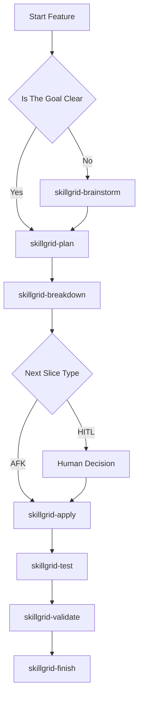
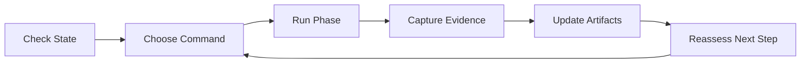

# Workflow Usage

This guide explains how a new user should operate AISkillGrid from first setup to finished work.

The core habit is simple: choose the command that matches the phase, let it create or update artifacts, then use the artifacts to decide the next command.

## First Run

Start by installing the hub into a target project. After installation, initialize the project workflow:

```text
/skillgrid-init
```

During initialization, decide:

- Ticketing provider: local, GitHub, GitLab, or Jira.
- Artifact store: disk-first, memory-first, or hybrid.
- PRD workflow: default statuses, provider-style statuses, imported statuses, or custom statuses.
- Optional indexing: graphify and ccc.
- Optional persistent memory: Engram.
- Skill registry: `.skillgrid/project/SKILL_REGISTRY.md` for compact rules used in subagent prompts.

The recommended default for most users is a hybrid model: keep reviewable files in the repository and save concise durable memory summaries.

When Engram is enabled, active changes should also have a compact `skillgrid/<change-id>/state` memory entry. It helps a later session recover the phase, blockers, artifact paths, and next action without trusting chat history.

## First Feature

For a new feature, use this path:



Use `/skillgrid-brainstorm` when the idea still needs shape. Use `/skillgrid-plan` when the goal is ready to become a PRD and technical change.

## Working In Slices

AISkillGrid prefers small vertical slices. Each slice should be understandable, implementable, and verifiable.

Tasks can be marked:

- `[AFK]` when the agent can safely proceed with clear instructions and verification.
- `[HITL]` when a human decision is required before work continues.

This distinction is important. It lets agents keep moving where safe while stopping on product, design, architecture, security, credential, or destructive decisions.

## When To Use Explore

Use:

```text
/skillgrid-explore
```

when the project is brownfield or the agent needs to understand architecture before planning. Exploration should produce project knowledge, not implementation changes.

## When To Use Design

Use:

```text
/skillgrid-design
```

when the work includes user-facing UI, layout, interaction, visual direction, or product experience decisions.

Design work should create durable direction so later implementation does not depend on memory or taste guesses.

## When To Use Import

Use:

```text
/skillgrid-import
```

when a project already has PRDs, specs, or planning files that should be normalized into the Skillgrid artifact model.

This is helpful when adopting AISkillGrid in an existing repository.

## During Implementation

Use:

```text
/skillgrid-apply
```

for implementation from an approved task list.

The agent should:

- Read the active PRD.
- Read the technical change artifacts.
- Read the handoff.
- Implement the next task or slice.
- Run focused verification.
- Update state and evidence.
- Stop on unclear scope or HITL blockers.

For controlled continuation, use:

```text
/skillgrid-loop
```

The loop should advance one safe unit at a time. It is not an excuse for unbounded autonomous work.

## Verification And Review

Use:

```text
/skillgrid-test
/skillgrid-security
/skillgrid-validate
```

Testing proves behavior. Security checks risk. Validation reconciles specs, code review, evidence, and sign-off.

This is where AISkillGrid becomes more than a productivity wrapper. It helps users keep the speed of AI while preserving review discipline.

## Finishing Work

Use:

```text
/skillgrid-finish
```

when implementation has passed validation.

Finish should handle closure tasks such as:

- Updating final PRD status.
- Archiving or syncing specs.
- Cleaning up previews or checkpoints when appropriate.
- Preparing git or PR handoff when requested.
- Confirming docs and evidence are not stale.
- Saving final Engram closure/state summaries when memory is available.

If your team intentionally shares Engram memories through git, run:

```bash
engram sync
```

after significant finish work, and use:

```bash
engram sync --import
```

on another machine after cloning. Review `.engram/` before committing because it may contain prompts, decisions, and sensitive project context.

## Resuming Work

When returning after an interruption, start with:

```text
/skillgrid-session
```

or ask for current state through:

```text
/skillgrid-help current-state
```

The agent should inspect the durable state:

- Project config.
- PRD index.
- Active handoff files.
- Event logs.
- Relevant memory.
- Skill registry.
- Open change artifacts.

Then it should recommend the next command.

If Engram returns memory search hits, the agent should retrieve full observations before relying on them. Search previews are not enough for requirements, blocker state, task status, or user decisions.

## What To Expect After Each Phase

| Phase | Expected Output |
|---|---|
| Init | Project config, artifact-store choice, ticketing choice, workflow statuses |
| Explore | Project map, architecture notes, imported existing planning artifacts |
| Brainstorm | Chosen direction, clarified assumptions, possible approaches |
| Plan | PRD and technical change scaffold |
| Breakdown | Ordered tasks, HITL and AFK labels, verification plan |
| Apply | Code changes, evidence, updated handoff |
| Test | Test results and remaining gaps |
| Security | Security findings or sign-off |
| Validate | Review outcome and spec compliance decision |
| Finish | Closed status, archive or handoff, final evidence |

## Daily Usage Pattern



The best way to use AISkillGrid is not to memorize every command. It is to trust the phase model. Ask what state the work is in, run the command for that state, and let the artifacts guide the next move.

## Why This Feels Different

Many AI coding tools help with a single task. AISkillGrid helps with the lifecycle around the task.

That is the full-solution advantage:

- New users get a guided path.
- Experienced users get control.
- Teams get consistent process across IDEs.
- Agents get durable context.
- Reviewers get evidence.
- Work can resume without rebuilding the story from chat.

This is how AI-assisted development becomes repeatable engineering practice.
