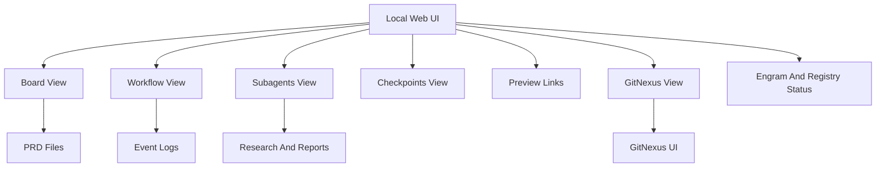

# Web UI

The AISkillGrid web UI is a local dashboard for project workflow state. It makes agent work visible without requiring a hosted platform.

Start it with the **skillgrid-cli** binary (`skillgrid serve`). The UI matches the standalone **ai-dashboard** reference package (React + Vite): sources live under `skillgrid-cli/src/dashboard/` (`server/` for the HTTP API and data adapters, `web/` for the React app). The CLI serves a prebuilt static client from `skillgrid-cli/dist/dashboard/client` (run `npm run build:dashboard` or full `npm run build` in `skillgrid-cli` before `serve`). The compiled `skillgrid` binary bundles the Node entry; the dashboard client is loaded from `dist/dashboard/client` on disk next to the compiled server output.

From your **application** repo (after building the CLI in this hub):

```bash
/path/to/aiskillgrid/skillgrid-cli/bin/skillgrid serve
```

Options match the **ai-dashboard** CLI: `--repo` (repository root, default current directory), `--host`, `--port` (use `0` for an OS-assigned port; default is `0` unless `SKILLGRID_UI_PORT` is set), `--open` / `--no-open`, and `--dev` (Vite middleware for local UI development). PRDs are always read from `<repo>/.skillgrid/prd`. There is no `--prd-dir` flag (use `--repo` only). Run `skillgrid serve --help` for the full list.

The server prints `URL: http://…` after bind; the browser opens by default (`--no-open` to skip).

**GitNexus Web** ([upstream `gitnexus-web`](https://github.com/abhigyanpatwari/GitNexus/tree/main/gitnexus-web)) is vendored into this server at **`/gitnexus/`** when you run `npm run build:gitnexus` in `skillgrid-cli` (or a full `npm run build`). That step clones the GitNexus monorepo, builds the web app with `base: '/gitnexus/'`, and copies static assets into `dist/dashboard/gitnexus`. The graph UI still talks to a separate **GitNexus API** process (upstream default port `4747`); after starting the API, open e.g. `/gitnexus/?server=http://127.0.0.1:4747`. To skip cloning and building (for example on Node older than 20 or offline CI), run `SKIP_GITNEXUS_WEB=1 npm run build` so `build:gitnexus` exits immediately (the `/gitnexus/` route will respond 503 until you build GitNexus web separately).

```text
skillgrid serve --help
```

## Why The Web UI Exists

AI work can become invisible when it lives only in chat. The web UI gives users and stakeholders a place to see:

- What PRDs exist.
- Which phase a change is in.
- What is blocked.
- What subagents did.
- Which previews exist.
- Whether graph output is available.
- Whether Engram shared-memory export metadata exists.
- Whether the project skill registry exists.
- What event history has been recorded.

This turns AISkillGrid from a prompt library into an observable workflow.

## Main Views



## Board View

The Board view shows PRDs in workflow columns.

It helps answer:

- What work exists?
- What status is each PRD in?
- Which items are blocked?
- Which items have previews?
- Which item should be opened in the Workflow view?

When the workflow status changes, the dashboard updates the PRD status field. That keeps the board tied to files instead of a hidden database.

The visible workflow phase order defaults to:

```text
brainstorm, design, plan, breakdown, apply, test, security, validate, finish
```

Projects can override the Workflow view order through `.skillgrid/config.json`:

```json
{
  "workflow": {
    "phaseOrder": ["plan", "breakdown", "apply", "validate", "finish"]
  }
}
```

Events remain the source of truth; the configured phase order only controls the dashboard lanes and empty-state ordering.

## Workflow View

The Workflow view focuses on one selected PRD or change.

It can show:

- Current phase.
- Current state.
- Next recommended action.
- HITL blockers.
- AFK-ready work.
- Event timeline.
- Artifacts such as PRD, handoff, previews, research, tests, and review reports.

This is the view to use when asking, “Can the agent keep going, or does a human need to decide something?”

## Subagents View

The Subagents view collects delegated work activity.

It is useful for:

- Seeing what reviewers, researchers, critics, auditors, and verifiers did.
- Finding their output files.
- Spotting blockers.
- Checking whether independent reports agree.

This makes multiagent work easier to trust because the activity is visible.

## Preview Links

When a workflow produces HTML previews, the dashboard can surface them from:

```text
.skillgrid/preview/
```

This is especially useful for UI design, prototypes, visual comparisons, or generated documentation pages.

## GitNexus View

When GitNexus is indexed or available, the dashboard exposes a GitNexus view with index status, setup commands, and the embedded GitNexus web UI. Starting the Skillgrid dashboard also starts the local GitNexus web runtime, so users do not need to run a separate `gitnexus serve` process first.

Typical local source:

```text
.gitnexus/
```

This gives users a quick way to jump from workflow state into codebase structure, impact analysis, and graph-aware exploration.

## Data Sources

The dashboard reads files that already belong to the Skillgrid workflow:

| Source | What It Powers |
|---|---|
| `.skillgrid/prd/` | Board cards and product intent |
| `.skillgrid/tasks/context_<change-id>.md` | Current state and next action |
| `.skillgrid/tasks/events/<change-id>.jsonl` | Timeline and subagent activity |
| `.skillgrid/tasks/research/<change-id>/` | Reports and research artifacts |
| `.skillgrid/preview/` | Preview links |
| `.gitnexus/` | GitNexus view and graph status |
| `.engram/manifest.json` | Engram export counts, when team memory sync is used |
| `.skillgrid/project/SKILL_REGISTRY.md` | Skill registry availability and skill count |

No separate database is required for the core local dashboard model.

The dashboard reads `.engram/manifest.json` directly when it exists. It does not call the Engram CLI or expose memory contents.

## Practical Advantage

The web UI gives AISkillGrid a visible operating surface. New users can understand what is happening without reading every artifact by hand. Leads and reviewers can inspect state without asking the agent to summarize itself.

That visibility is a major difference between a full workflow solution and a collection of isolated prompts.
