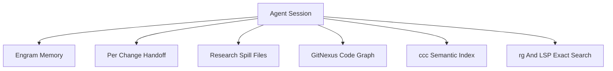
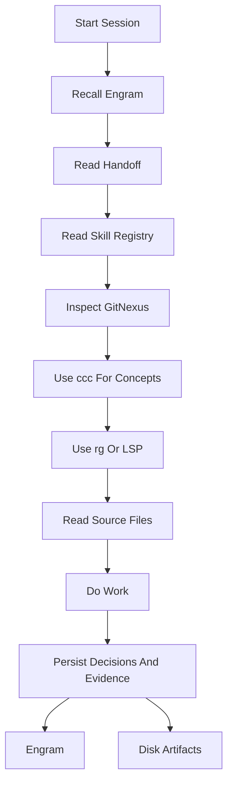

# Memory And Indexing

AISkillGrid treats memory as a layered system. No single tool should pretend to hold the whole truth.

The goal is durable context: an agent should be able to resume after compaction, a new session, a handoff, or a different IDE without starting from zero.

## The Layers



Each layer answers a different question.

| Layer | Question It Answers | Typical Artifact |
|---|---|---|
| Engram | What should survive sessions? | Durable observations and summaries |
| Handoff | What is happening in this change right now? | `.skillgrid/tasks/context_<change-id>.md` |
| Research spill | Where is the long evidence? | `.skillgrid/tasks/research/<change-id>/` |
| Skill registry | Which compact rules should subagents receive? | `.skillgrid/project/SKILL_REGISTRY.md` |
| GitNexus | How is the repo structured and what depends on what? | `.gitnexus/` plus MCP resources |
| ccc | Where is this concept in code? | semantic code index |
| rg and LSP | Where is this exact symbol or string? | live source lookup |

## Engram

Engram is the persistent memory layer. It stores concise observations that should survive chat compaction and new sessions.

Use it for:

- Decisions.
- User preferences.
- Project conventions.
- Bugfix discoveries.
- Session summaries.
- Pointers to important artifacts.

Do not use Engram as a dumping ground for huge files or as a replacement for reading the repository. It should remember what matters and point back to durable artifacts.

For active Skillgrid changes, use a compact state key:

```text
skillgrid/<change-id>/state
```

This state observation should contain only the current phase, status, artifact-store mode, PRD/OpenSpec/handoff/event paths, blockers, next action, and last updated timestamp. It is a recovery index, not a second copy of the PRD or task list.

Versioning is required for state-like artifacts:

- `version.id` (monotonic integer per `topic_key`)
- `version.previous_id` (prior version or `null`)
- `timestamps.created_at` (immutable ISO-8601 UTC)
- `timestamps.updated_at` (write-time ISO-8601 UTC)

Conflict resolution is deterministic:

1. Higher `version.id` wins.
2. If versions tie, newer `timestamps.updated_at` wins.
3. If still tied, keep existing and treat incoming write as duplicate replay.
4. If concurrent writes touch different sections, merge and emit a new version.
5. If concurrent writes touch the same section, keep winner and append a conflict note with loser metadata.

When recovering from Engram, search is only step one. `mem_search` returns short previews; use `mem_get_observation(id)` before relying on recovered requirements, blocker state, task status, or decisions.

Your AI agent automatically remembers decisions, bugs, and context across sessions. You don't need to do anything -- but when you do:

```bash
engram projects list          # See all projects with memory counts
engram projects consolidate   # Fix name drift ("my-app" vs "My-App")
engram search "auth bug"      # Find a past decision from the terminal
engram tui                    # Visual memory browser
engram sync                   # Export project memories to .engram/ for intentional team sharing
engram sync --import          # Import committed .engram/ memories on another machine
```

Commit `.engram/` only when your team explicitly wants shared memory in git. It can contain prompts, decisions, and project context, so treat it like a reviewable knowledge artifact.

## Per-Change Handoff

The handoff file records current state for one change.

Typical path:

```text
.skillgrid/tasks/context_<change-id>.md
```

It should answer:

- What is the goal?
- What phase are we in?
- What is blocked?
- What has been completed?
- What evidence exists?
- What should happen next?
- Which subagent reports or research files matter?

This is the shared working memory for the current change. It is local, readable, and reviewable.

## Research Spill Files

Long research does not belong in chat. Subagent reports, web research, audits, and large notes should go under:

```text
.skillgrid/tasks/research/<change-id>/
```

The parent session can then summarize only what matters and keep a pointer to the full evidence.

## Skill Registry

The project skill registry records the locally available skills, compact actionable rules, and project convention files:

```text
.skillgrid/project/SKILL_REGISTRY.md
```

It is generated or refreshed by `/sdd-init` (via the skill registry flow). Parent sessions use it before launching subagents, selecting only the compact rules relevant to the delegated task.

## GitNexus

GitNexus creates the local code graph and exposes it through CLI, MCP, and the GitNexus web UI bridge. It helps agents orient before broad raw file reads and supports impact/context queries.

Use it for:

- Architecture overview.
- Symbol context and dependencies.
- Communities, clusters, and processes.
- Impact analysis before edits.

Typical local output:

```text
.gitnexus/
```

GitNexus is not a replacement for code review. It is the code graph and context layer.

## CocoIndex Code

CocoIndex Code, often called `ccc`, supports semantic code search.

Use it when you want to ask concept questions such as:

- Where is authentication handled?
- How are browser previews generated?
- Which code updates PRD status?
- Where do command assets get mirrored?

Semantic search complements exact search. If you know the exact string or symbol, use exact search.

## Exact Search

Use exact search through `rg`, IDE search, or LSP when you know the name of a file, function, class, command, or literal.

This is still essential. Memory and semantic indexing should not replace reading the code that will be changed.

## Cross-Source Ranking Strategy

When combining retrieval results from multiple sources (Engram, GitNexus, ccc, exact search), use a weighted relevancy score and explicit decay:

`final_score = source_weight * relevance_score * freshness_decay * confidence_multiplier`

Recommended defaults:

- `source_weight`:
  - Engram decision/state artifacts: `1.00`
  - GitNexus structural context: `0.90`
  - ccc semantic matches: `0.80`
  - exact search (`rg`/LSP) literal hits: `0.70`
- `freshness_decay`: exponential time decay from `updated_at`
  - `exp(-age_days / 30)` as default
- `confidence_multiplier`:
  - verified artifact lineage (`mem_get_observation` + active change refs): `1.10`
  - unverified preview-only source: `0.60`

Merge policy:

1. Rank by `final_score` descending.
2. Keep top-K candidates per source before global merge (avoid single-source dominance).
3. Deduplicate by canonical key (`topic_key`, symbol path, or file+range).
4. For tie scores, prefer newer `updated_at`, then deterministic key order.

## Capacity and Allocation Policy

For performance-sensitive implementations (especially Go), default to pre-allocation and controlled reuse:

- Pre-allocate slices when approximate upper bound is known (`make([]T, 0, n)`).
- Pre-allocate maps with expected cardinality (`make(map[K]V, n)`).
- Avoid repeated growth in hot loops when capacity can be predicted.
- Use `sync.Pool` only for high-churn, short-lived objects where profiling shows allocation pressure.
- Reset pooled objects before reuse and never store long-lived references inside pooled values.

This policy is enforced as a coding convention, and exceptions should be justified in design notes or review comments.

## Vector Index Mapping and HNSW Tuning

Vector index schema must be explicit and version-controlled. Keep a checked-in mapping document per index family with:

- index name and schema version
- fields and types (id, content, metadata filters)
- embedding model and vector dimensions
- similarity metric (`cosine`, `dot`, or `l2`)
- ANN/index algorithm and parameters

For HNSW-based indexes:

- Treat `M` and `efConstruction` as tunable parameters, not constants.
- Record chosen values and rationale in versioned docs/config.
- Re-benchmark recall/latency/memory after major corpus growth.
- For very large vector counts, prefer memory-optimized HNSW variants or storage modes and document tradeoffs.

Baseline mapping template:

```yaml
index: memory-observations
schema_version: 1
embedding_model: text-embedding-3-small
dimensions: 1536
similarity: cosine
fields:
  - name: observation_id
    type: keyword
  - name: topic_key
    type: keyword
  - name: content_vector
    type: vector
  - name: updated_at
    type: datetime
ann:
  type: hnsw
  M: 16
  efConstruction: 200
```

## Recommended Order



## Why This Matters

AI failures often come from context loss. AISkillGrid reduces that risk by separating:

- Durable memory.
- Current change state.
- Research evidence.
- Structural maps.
- Semantic search.
- Exact source truth.

That layered approach is one of the strongest advantages of the solution. It keeps agents fast without asking users to trust invisible memory.
