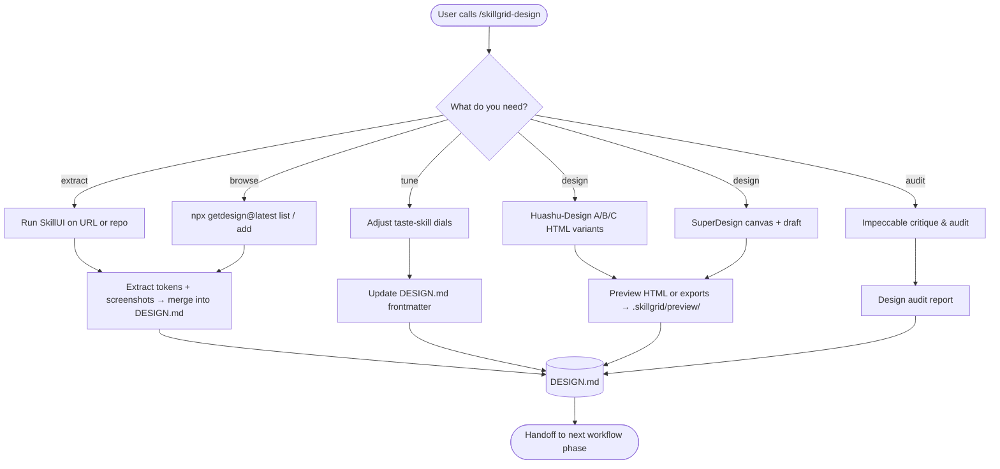

# Skillgrid Design Workflow

> How the Skillgrid workflow handles visual identity, user experience, and design systems – from discovery to audit – without adding extra document types.

---

## 1. Overview

The Skillgrid design layer is **optional** and **tool‑supported**. It treats the project’s root `DESIGN.md` as the single source of truth for all visual and interaction decisions. Design‑related activities are spread across the existing workflow phases (`Init`, `Explore`, `Brainstorm`, `Validate`) and are concentrated in a dedicated, on‑demand command: **`/skillgrid-design`**.

You never need a separate “design document”. Everything – tokens, taste parameters, sources, and component guidelines – lives inside `DESIGN.md` and the optional `.skillgrid/preview/` folder.

---

## 2. DESIGN.md – The Single Source of Truth

`DESIGN.md` sits at the project root and follows the [Google Stitch format](https://stitch.withgoogle.com/docs/design-md/format/). It contains:

- **Machine‑readable frontmatter** – colors, typography, rounding, and the three *taste‑skill* dials (`design_variance`, `motion_intensity`, `visual_density`).
- **Human‑readable body** – color roles, font choices, component rules, do’s and don’ts.
- **Provenance** – a `design_sources` list that records where the design came from (e.g., `getdesign.md` slug, `skillui` URL, Figma link).

All design tools read from and write to this one file – no drift, no duplicates.

**Example frontmatter:**

```yaml
---
name: MyApp
colors:
  primary: "#2665fd"
  secondary: "#475569"
  surface: "#0b1326"
  on-surface: "#dae2fd"
  error: "#ffb4ab"
typography:
  body-md:
    fontFamily: Inter
    fontSize: 16px
    fontWeight: 400
rounded:
  md: 8px
design_variance: 4        # 1 = conservative, 10 = wild
motion_intensity: 3       # 1 = static, 10 = lively
visual_density: 5         # 1 = sparse, 10 = dense
design_sources:
  - type: getdesign.md
    slug: linear
    url: https://getdesign.md/linear
---
```

## 3. Design Toolchain

The workflow integrates design‑specific tools. None are mandatory; install only the ones you need.

| Tool | What it does | Install |
|------|-------------|---------|
| **getdesign.md** | Browse a curated collection of 69+ brand design systems (Stripe, Linear, Notion, etc.) and copy one as a starting point. | No install – use `npx getdesign@latest` |
| **SkillUI** | Extract a complete `DESIGN.md` and token files from a live URL or the local codebase. | `npm install -g skillui` (or `npx skillui`) |
| **taste-skill** | Tune the “personality” of the design with three 1–10 dials: variance, motion, density. | `npx skills add taste-skill` |
| **Huashu-Design** | Create high-fidelity HTML prototypes, design variants, and three-direction visual explorations. | Included skill: `.agents/skills/huashu-design/` |
| **SuperDesign** | Generate visual mockups directly in your IDE canvas using natural language. | `npx skills add superdesigndev/superdesign-skill` |
| **Impeccable** | Audit an existing UI for UX quality (hierarchy, cognitive load, emotion) and detect anti‑patterns. | `npx skills add pbakaus/impeccable` |

All tools produce output that ends up in (or is referenced by) `DESIGN.md`.

---

## 4. Integration with the Main Workflow

Design is not a standalone phase – it intersects with the existing Skillgrid commands:

### 4.1 Init (`/skillgrid-init`)
- **Greenfield:** asks about design preferences and scaffolds a minimal `DESIGN.md` with empty tokens and the three taste dials set to neutral (`5`).
- **Brownfield:** can recommend running `/skillgrid-explore` to discover the existing design system.

### 4.2 Explore (`/skillgrid-explore`)
- Scans the codebase for existing design tokens (Tailwind config, CSS variables, theme files).
- If a live URL is available, can invoke `skillui` to extract tokens and screenshots.
- If nothing is detected, offers to pull a reference from `getdesign.md`.
- Updates the root `DESIGN.md` (merges, never overwrites) and asks targeted questions for missing values.

### 4.3 Brainstorm (`/skillgrid-brainstorm`)
- Can use `getdesign.md` to search for inspiration and `skillui` to extract references.
- When multiple visual directions exist, can scaffold **A/B/C preview HTML** with `.skillgrid/scripts/preview.sh <slug>`, then fill it with Huashu-Design, SuperDesign, or other UI-tool output under `.skillgrid/preview/`.
- If the session settles on specific tokens or components, it writes them into `DESIGN.md`.
- The **taste‑skill** dials can be adjusted during brainstorming to guide the aesthetic direction.

### 4.4 Validate (`/skillgrid-validate`)
- Optionally runs a design audit using Impeccable to evaluate UX quality and detect anti‑patterns.
- Findings are included in the verification report.

---

## 5. The `/skillgrid-design` Command

`/skillgrid-design` is an on‑demand design workshop that can be invoked at any point. It is **not** part of the linear Plan → Breakdown → Apply pipeline.

### 5.1 Flow



### 5.2 Modes

Ask the user which mode they want, or infer from their argument.

#### 1. Extract — pull a design system from a reference

- **From a URL:** `skillui --url <reference-url>`  
  Produces a complete `DESIGN.md`, token JSON files, and screenshots.
- **From the repo itself:** `skillui --dir ./`  
  Scans the local codebase for Tailwind/CSS tokens and builds a `DESIGN.md`.
- After extraction, review the output and merge relevant tokens into the project's root `DESIGN.md`. Keep the `design_sources` frontmatter updated with provenance.

#### 2. Browse — pick from the getdesign.md collection

- **List available brands:** `npx getdesign@latest list`
- **Search:** `npx getdesign@latest search "<query>"`
- **Add one:** `npx getdesign@latest add <slug>` (e.g. `stripe`, `linear`, `notion`)
- This drops a ready-made `DESIGN.md`. Review it, keep what fits, and update `design_sources`.

#### 3. Tune — adjust the aesthetic dials

- Read the current `design_variance`, `motion_intensity`, and `visual_density` from `DESIGN.md` frontmatter.
- Present the three dials (1–10) and ask the user what to change:
  - **Design variance (1=conservative, 10=wild):** how far to push visuals from convention.
  - **Motion intensity (1=static, 10=lively):** how much animation and transition.
  - **Visual density (1=sparse, 10=dense):** how much information per screen.
- Update the frontmatter. These dials guide all agents reading the file.

#### 4. Design — create A/B/C mockups with Huashu-Design or SuperDesign

- Prefer Huashu-Design for HTML-based design variants, direction-advisor work, and three clearly differentiated options.
- Ensure the skill is installed: `npx skills add superdesigndev/superdesign-skill`
- Use `/superdesign help me design <feature description>` to generate visual mockups on the canvas.
- For multiple UI options or browser-viewable comparisons, scaffold an A/B/C preview with `.skillgrid/scripts/preview.sh <change-or-surface-slug>` and ask the user to open the generated `.skillgrid/preview/*.html` file locally.
- Save screenshots, HTML exports, or optional Markdown comparison notes to `.skillgrid/preview/` for later A/B/C selection.
- Update `DESIGN.md` with any concrete tokens chosen from the mockups.

#### 5. Audit — critique the current UI

- Ensure the skill is installed: `npx skills add pbakaus/impeccable`
- Follow Impeccable's critique commands: it scores UX on visual hierarchy, cognitive load, emotional resonance, and more.
- Write findings into the session. If this is part of a Validate pass, include them in the verify report.
- Flag any anti-patterns Impeccable finds; update `DESIGN.md` with recommended fixes.

### 5.3 Guardrails

- **Never** create a parallel design document. Everything flows through `DESIGN.md` and `.skillgrid/preview/`.
- **Always** update `design_sources` in the frontmatter when pulling from an external source.
- This command is **optional** and **on‑demand** – don’t run it unless design needs attention.

---

## 6. Design in the Test and Security Phases

- **Test (`/skillgrid-test`):** No direct design impact, but visual regression testing (if configured) can validate the design’s implementation.
- **Security (`/skillgrid-security`):** A design audit of agent/IDE config files (`.cursor/`, prompts) is part of the security review, ensuring no unsafe defaults leak through.

---

## 7. Anti‑patterns

- **Parallel design docs** – Don’t create a separate `UIDesign.md` or `DesignSystem.fig` as the sole source; use `DESIGN.md`.
- **Skipping provenance** – Always record where the design tokens came from in `design_sources`.
- **Over‑engineering before understanding** – Don’t tune taste dials or generate mockups until the problem and user journeys are clear (via Brainstorm).
- **Ignoring the taste dials** – After initial setup, revisit the dials – they inform all AI‑driven design decisions.

---

## 8. Getting Started

1. Run `/skillgrid-init` — it will ask about design preferences and create `DESIGN.md`.
2. For an existing project, run `/skillgrid-explore` — it will detect tokens or prompt you to provide a reference.
3. When you need to refine the visual direction, run `/skillgrid-design` and pick a mode.
4. For any feature work, the `DESIGN.md` is automatically consulted by later phases; any design changes are merged back in.