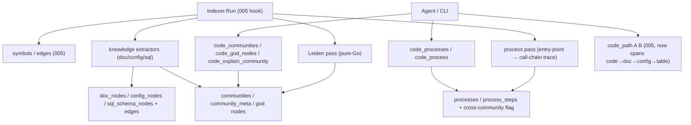

# Change: 008-mnemonic-community-knowledge-graph — Mnemonic Community Detection + Knowledge-Graph Expansion

> **STATUS:** `draft` (2026-09-08)
>
> **For agentic workers:** REQUIRED: follow `.agents/skills/_shared/conventions/sdd-structure.md`. This file is WHY + HOW (former intent + plan). Spec phase instantiates `tasks.md` + `acceptance.feature` from the Step Blueprint and per-step WHAT below.

**Goal:** Extend the 005 code-intelligence graph with Leiden community detection + god nodes (architectural orientation), a **precomputed process layer** (entry-point → execution flows, so agents see what a subsystem *does* end-to-end), and a knowledge-graph layer that maps docs, configs, and SQL schemas as nodes linked to code — so agents see subsystems, their flows, and the "why" beyond the call graph.

**Architecture:** Additive `012_*` schema (communities, community_meta, processes, process_steps, doc/config/sql nodes + their edges) on top of 005's symbols/edges. A Leiden clustering pass runs over the existing edges table to produce communities + god nodes. A **process pass** traces execution flows from 010's entry points (routes/handlers/CLI mains) through 005's call edges into named, LLM-labeled processes (each with steps + a cross-community flag). A second extractor layer (doc-link, config-ref, SQL-schema) adds non-code nodes and `references`/`configures`/`reads`/`writes` edges into the same graph. New `code_*` MCP/CLI tools expose community + process views; existing 005 tools stay name- and signature-stable.

**Tech stack:** Go (`skillgrid-cli`), SQLite (`modernc.org/sqlite`, CGo-free), existing gotreesitter graph from 005, `bluuewhale/loom` (pure-Go Leiden/Louvain, zero deps, no CGo), MCP (`mcp-go`), CLI.

**Research:** `docs/skillgrid/changes/008-mnemonic-community-knowledge-graph/research.md` (graphify comparison) | none

**Prototype:** none

**Ticket:** none

**Depends on:** `005-mnemonic-hybrid-code-intelligence` (needs 005's symbols/edges schema + extractors; this change is additive on top)

---

## Goal

Coding agents and operators get subsystem-level orientation (communities, god nodes), **precomputed execution flows (processes)**, and a knowledge graph that connects code to its docs, configs, and data schema — answering "what are the core modules?", "what does this subsystem *do*, end to end?", "which flow does this symbol participate in?", and "which code reads/writes this table?" without reading files.

## Out of scope / Non-Goals

- Re-implementing 005's symbols/edges/extractors/hybrid search — this change is additive on top of 005's graph
- Git-diff / `code_affected` (CodeGraph `affected` / graphify `prs`) — pure edge-traversal on 005's `edges`; owned by `010-mnemonic-framework-routes-affected`, not this change
- Framework-aware routes (`route`/`navigates` edges) + fsnotify watcher + staleness banner — CodeGraph-derived; owned by `010-mnemonic-framework-routes-affected`, not this change
- Video/audio/image semantic extraction — docs + configs + SQL only
- Replacing the per-project SQLite store or the `code_*` tool surface
- Cloud sync; multi-project community merge

## Definition of Done

This change is done only when **all** of the following are true:

- [ ] `code_communities` returns Leiden-clustered subsystems with LLM-free labels
- [ ] `code_god_nodes` returns the most-connected symbols (with `--exclude-hubs` to suppress utility super-hubs)
- [ ] A community view explains what a subsystem contains and its key entry points
- [ ] `code_processes` returns precomputed execution flows traced from entry points through call chains; each process has named steps + a cross-community flag; `code_process <name>` returns the full trace; `code_explain_symbol` surfaces which processes a symbol participates in
- [ ] Doc files (`.md`) with `[text](./other.md)` / `[[wikilinks]]` become nodes with `references` edges
- [ ] Config files (`.yaml`/`.toml`/`.json`) become nodes with `configures` edges to the code they configure
- [ ] SQL schema (`.sql` DDL) becomes table/column nodes with `reads`/`writes` edges to code that references them
- [ ] Every new edge carries a Confidence Label (`EXTRACTED | INFERRED | AMBIGUOUS`)
- [ ] Existing 005 `code_*` tools are unchanged (name + required params); `go test ./...` passes for touched packages
- [ ] Every Step Blueprint entry has a matching section in `tasks.md` with Verdict `PASS` or `PASS WITH WARNINGS`
- [ ] Every `@step-NN` Feature in `acceptance.feature` has passing `@happy`, `@edge`, and `@failure` scenarios
- [ ] Applicable threat-matrix rows have RED coverage that passed
- [ ] Testing strategy commands below are green
- [ ] Rollback path below is still valid (or N/A documented)
- [ ] Change archived under `docs/skillgrid/archive/008-mnemonic-community-knowledge-graph/`

---

## Problem / why

005 delivers a call graph + hybrid search, but agents still can't answer *architectural* questions: "what are the 5 core modules?", "what subsystem owns auth?", "which code touches the `users` table?", or "what does the auth subsystem *do*, end to end?". GitNexus (47k★) shows these are high-value and answers them with Leiden community detection + god nodes + **precomputed processes** (entry-point → execution flows) + a knowledge graph that maps docs/configs/SQL into the same graph as code. 005 explicitly deferred these capabilities; this change delivers them.

## Target users

- **Coding agent** — subsystem orientation before edits; "what does this module do?" without reading every file; high urgency
- **Operator** — CLI parity for community + knowledge-graph queries; architecture review

## Business rules

- Additive on top of 005 — never rewrite 005's symbols/edges/extractors
- CGo-free: Leiden is a pure-Go implementation (no C dependency)
- Every new edge carries a Confidence Label: `EXTRACTED | INFERRED | AMBIGUOUS`
- Community labels are LLM-free (derived from top god-node names + file paths, not an API call)
- Processes are **precomputed at index time** (GitNexus "precompute, don't query" thesis) — traced from entry points through 005 call edges, LLM-labeled once, so a `code_processes` query returns complete flows in one call with no per-query traversal
- Process tracing is deterministic (graph traversal + LLM label only); no per-query LLM call
- Doc/config/SQL extraction is deterministic (AST/regex/link-parse), no LLM for the graph structure
- Per-file extract failure → `warn+continue` (fallback); never abort the whole index run
- Existing 005 `code_*` tools keep name + required params; all new tools use distinct `code_*` names
- Migration id `012_community_knowledge_graph.sql` — leave `011` for 005

## In scope

- Schema: `communities`, `community_meta`, `processes`, `process_steps`, `doc_nodes`, `config_nodes`, `sql_schema_nodes`, plus their edges (additive `012_*`)
- Leiden community detection (pure-Go) over 005's edges table + god-node ranking + LLM-free community labels
- **Process pass:** trace execution flows from 010's entry points (routes/handlers/CLI mains) through 005 call edges → `processes` + `process_steps` (cross-community flag), LLM-labeled
- `code_communities`, `code_god_nodes`, `code_explain_community`, `code_processes`, `code_process` MCP/CLI tools
- Knowledge-graph extractors: doc-link (markdown links/wikilinks → `references`), config-ref (`.yaml`/`.toml`/`.json` → `configures`), SQL-schema (DDL → table/column nodes + `reads`/`writes`)
- Indexer hook: run community + process + knowledge-graph passes after 005's symbol/edge extraction (same incremental transaction)

## Risks & rollback

- **Risk:** Leiden is non-deterministic across runs (tie-breaking) — **Mitigation:** Seed the RNG; pin resolution; communities are advisory, not load-bearing
- **Risk:** Community quality degrades on sparse or huge graphs — **Mitigation:** `--resolution` + `--exclude-hubs` tuning flags; document expected behavior on small repos
- **Risk:** Knowledge-graph extractors over-link (false `configures`/`reads` edges) — **Mitigation:** Confidence Labels; `INFERRED` for resolved refs, `EXTRACTED` only for explicit syntax
- **Risk:** Process tracing explodes on a huge call graph (combinatorial blowup) — **Mitigation:** depth cap + entry-point-only seeding (only 010 route/handler/main symbols start a trace) + `maxTokens`-style step cap; a process that can't be completed is truncated with a "stops at <dispatch>" note (reuses 005's graph-stops)
- **Risk:** LLM process labels are non-deterministic — **Mitigation:** label cached + keyed to process content-hash (re-label only on change); labels are advisory, the flow structure is deterministic
- **Risk:** Scope expands into git-PR-impact / video / images — **Mitigation:** Hard Non-Goals; three vertical steps only
- **Rollback:** Drop `012_*` migration + `community/` + `process/` + `knowledge/` packages + the new `code_communities`/`code_god_nodes`/`code_explain_community`/`code_processes`/`code_process` tools + indexer hook; 005's symbols/edges/chunks/hybrid search stay intact

## Error handling

| Failure | Behavior | Notes |
|---------|----------|-------|
| Leiden on a graph with < 2 nodes | `warn+continue` | Single trivial community; no crash |
| Community label resolution finds no god node | `warn+continue` | Label = "community-N"; never fabricated names |
| Doc file with unparseable links | `warn+continue` | Skip bad links; index the rest |
| Config ref that resolves to no known symbol | `warn+continue` | Edge marked `AMBIGUOUS`; not dropped |
| SQL DDL that fails to parse | `warn+continue` | Skip that statement; index the rest |
| Entry point with no traceable call chain | `warn+continue` | Process = single-step, or skipped; not fabricated; "stops at <dispatch>" if mid-flow
| Process trace exceeds depth/step cap | `warn+continue` | Truncate with a "stops at <symbol> (<reason>)" note; never a silent cut
| Bad / missing args on new `code_*` tools | `abort` | Clear validation error; do not invent communities or processes |
| Existing 005 `code_*` tool call | unchanged | Name + required params must not regress |

## Testing strategy

- **Unit:** `Run: go test ./skillgrid-cli/internal/mnemonic/community/... ./skillgrid-cli/internal/mnemonic/knowledge/... ./skillgrid-cli/internal/mnemonic/store/... -count=1` — Expected: PASS
- **Integration / acceptance:** `Run: go test ./skillgrid-cli/internal/mnemonic/mcp/... ./skillgrid-cli/internal/mnemonic/service/...` plus BDD `@step-NN` / `@p0` scenarios — Expected: PASS
- **Full suite:** `Run: go test ./...` (from `skillgrid-cli` / repo root per module layout) — Expected: PASS
- **Green means:** communities + god nodes + doc/config/SQL nodes are queryable after index; every new edge confidence-labeled; 005 tools unchanged; one-malformed-file-per-extractor path covered

---

## Step Blueprint

Contract for `sdd-spec`. Do not renumber after `tasks.md` exists. Per-step Out of scope / DoD live under Per-step WHAT (table is summary only).

| NN | Step slug | Goal (one line) | Primary package / entry | Depends on |
|----|-----------|-----------------|-------------------------|------------|
| 01 | `community-detection` | Additive schema + pure-Go Leiden + god nodes + LLM-free labels + community MCP/CLI tools | `skillgrid-cli/internal/mnemonic/community` | — (005 done) |
| 02 | `process-flows` | Process pass: entry-point → execution-flow tracing + `processes`/`process_steps` + LLM labels + `code_processes`/`code_process` | `skillgrid-cli/internal/mnemonic/process` | 01, 010 (entry points) |
| 03 | `knowledge-graph-nodes` | Doc/config/SQL extractors + nodes + edges + indexer hook + knowledge MCP/CLI tools | `skillgrid-cli/internal/mnemonic/knowledge` | 02 |

---

## Technical approach

Build three additive layers on top of 005's graph. Layer 1 (step 01) runs `bluuewhale/loom` Leiden over the existing edges table (symbol keys mapped via loom's `NodeRegistry`) to produce communities, ranks god nodes by degree, derives LLM-free labels, and exposes `code_communities` / `code_god_nodes` / `code_explain_community`. Layer 2 (step 02) is the **process pass**: from 010's entry points (route/handler/CLI-main symbols) it traces execution flows through 005's call edges (depth-capped, cross-community flag), LLM-labels each flow, and persists `processes` + `process_steps`, exposed via `code_processes` / `code_process` (and surfaced in 005's `code_explain_symbol`). Layer 3 (step 03) adds deterministic extractors for markdown doc-links, config-file references, and SQL DDL, creating non-code nodes and `references`/`configures`/`reads`/`writes` edges into the same graph. An indexer hook runs all three passes after 005's extraction in the same incremental transaction. Preserve all 005 `code_*` contracts.

## Architecture decisions

### Decision: Leiden via `bluuewhale/loom` for community detection

**Module / Interface / Seam / Adapter / Depth:** Adapter over the loom library; Seam at the post-extraction index hook
**Choice:** Use `bluuewhale/loom` (pure-Go Leiden, zero deps, no CGo) over 005's edges table. Map symbol string keys → `NodeID` via loom's `NodeRegistry`; run `NewLeiden(LeidenOptions{Seed, Resolution, MaxIterations, NumRuns})`; expose `--resolution` and `--exclude-hubs` tuning. Louvain (same library) is the faster fallback for pathologically large graphs.
**Alternatives considered:** CGo `igraph`/`leiden` bindings (breaks CGo-free); `andreswebs/meso` (best-in-class but **GPLv3 copyleft** — contaminates a distributed CLI); `intelligrit/graphwizard` (pulls in gonum + bbolt for one algorithm); `gonum` Leiden PR #2071 (unmerged, not `go get`-table); hand-rolled Leiden (more code + correctness risk); `vsuryav/leiden-go` (infinite-loop bug on large graphs per loom benchmarks)
**Rationale:** loom is zero-dependency stdlib-only (matches the codebase's minimal-deps, CGo-free stance — same reasoning as 005's modernc + gotreesitter choices), its `LeidenOptions{Seed, Resolution, MaxIterations, NumRuns}` map 1:1 to 008's reproducibility + tuning needs, `NodeRegistry` handles the string-key→ID mapping, and it's built for GraphRAG (connected communities = coherent subsystem labels). ~56ms/10K nodes. GPLv3 (meso) and heavy deps (graphwizard) are disqualifiers for a distributed CLI.

### Decision: Knowledge-graph nodes in the same graph, not a separate store

**Module / Interface / Seam / Adapter / Depth:** Adapters (doc/config/SQL extractors) feeding the existing graph store
**Choice:** Doc/config/SQL become nodes in the same `symbols`/`edges`-style tables (new node types + edge types), linked to code nodes via `references`/`configures`/`reads`/`writes` edges
**Alternatives considered:** Separate `graph.json` artifact (graphify's approach — loses queryability + incrementality); separate SQLite tables per source type (fragmentation)
**Rationale:** One traversable graph means `code_path` (005) can trace code→doc→config→table in one query; the per-project SQLite store stays the single source of truth; incremental indexing reuses 005's hash+mtime guard

### Decision: Deterministic extractors, no LLM for graph structure

**Module / Interface / Seam / Adapter / Depth:** Adapters per source type
**Choice:** Markdown link/wikilink parser → `references`; YAML/TOML/JSON key→symbol resolver → `configures`; SQL DDL parser → table/column nodes + identifier-ref scan → `reads`/`writes`. All deterministic; LLM optional later for semantic doc↔code links
**Alternatives considered:** LLM semantic extraction for all docs (graphify's approach — cost + non-determinism + API dependency)
**Rationale:** Keeps the graph offline, reproducible, and testable; matches 005's deterministic extraction philosophy; LLM semantic links can be a later additive pass without changing the schema

### Decision: Precomputed process flows (entry-point → execution)

**Module / Interface / Seam / Adapter / Depth:** Pass over the existing graph; persists `processes`/`process_steps`
**Choice:** From 010's entry points (route/handler/CLI-main symbols), trace execution flows through 005's call edges (depth-capped, cross-community flag, LLM-labeled once and cached by content-hash). Persist as `processes` + `process_steps`. Expose `code_processes` / `code_process`; surface process participation in 005's `code_explain_symbol`.
**Alternatives considered:** Trace at query time (the "traditional Graph RAG" — slow, per-query LLM, no completeness); community-only (tells you *where* code lives, not *what it does*)
**Rationale:** GitNexus's core thesis — **precompute at index time, not query time** — is what makes "what does the auth subsystem *do*, end to end?" a one-call answer. Seeding from entry points (010 routes/handlers/mains) keeps the trace bounded and meaningful (a flow starts where a request/command enters). Cross-community flag + LLM label turn a raw call chain into a named subsystem flow (LoginFlow, RegistrationFlow). The LLM labels once and caches; the flow *structure* is deterministic graph traversal. Depth cap + "stops at <dispatch>" (reusing 005's graph-stops) bound blowup.

### Decision: Migration number

**Module / Interface / Seam / Adapter / Depth:** Store migration Seam
**Choice:** `012_community_knowledge_graph.sql`
**Alternatives considered:** Extend `011` in place
**Rationale:** Leave `011` owned by 005; 008 is additive and independently rollable

## Data flow



## File layout

```
skillgrid-cli/internal/mnemonic/
├── store/migrations/012_community_knowledge_graph.sql   # communities, meta, doc/config/sql nodes + edges
├── community/leiden.go                                   # loom adapter: NodeRegistry + LeidenOptions + partition→communities
├── community/godnodes.go                                 # degree ranking + exclude-hubs
├── community/labels.go                                   # LLM-free community labels
├── process/trace.go                                      # entry-point → call-chain tracing (depth-capped, cross-community)
├── process/labels.go                                     # LLM process labels (cached by content-hash)
├── knowledge/doc.go                                      # markdown link/wikilink → references
├── knowledge/config.go                                   # yaml/toml/json → configures
├── knowledge/sql.go                                      # DDL → table/column nodes + reads/writes
├── mcp/tools_code_community.go                           # code_communities / code_god_nodes / code_explain_community
├── mcp/tools_code_process.go                             # code_processes / code_process
└── mcp/tools_code_knowledge.go                           # knowledge-graph query tools
```

## Impacted files map

| File | Action | Step | Description |
|------|--------|------|-------------|
| `skillgrid-cli/internal/mnemonic/store/migrations/012_community_knowledge_graph.sql` | Create | 01 | communities, community_meta, doc_nodes, config_nodes, sql_schema_nodes, edge types |
| `skillgrid-cli/internal/mnemonic/community/leiden.go` | Create | 01 | loom adapter: NodeRegistry (symbol→NodeID) + LeidenOptions{Seed,Resolution,NumRuns} + partition→community rows |
| `skillgrid-cli/go.mod` | Modify | 01 | Add `bluuewhale/loom` (pure-Go Leiden, zero deps) |
| `skillgrid-cli/internal/mnemonic/community/godnodes.go` | Create | 01 | Degree ranking + `--exclude-hubs` |
| `skillgrid-cli/internal/mnemonic/community/labels.go` | Create | 01 | LLM-free community labels from god nodes + paths |
| `skillgrid-cli/internal/mnemonic/mcp/tools_code_community.go` | Create | 01 | `code_communities`, `code_god_nodes`, `code_explain_community` |
| `skillgrid-cli/internal/mnemonic/service/service.go` | Modify | 01 | Community facade |
| `skillgrid-cli/cmd/skillgrid/code_intel.go` | Modify | 01 | CLI community commands |
| `skillgrid-cli/internal/mnemonic/process/trace.go` | Create | 02 | Entry-point → call-chain tracing (depth-capped, cross-community flag, graph-stops) |
| `skillgrid-cli/internal/mnemonic/process/labels.go` | Create | 02 | LLM process labels, cached by content-hash |
| `skillgrid-cli/internal/mnemonic/mcp/tools_code_process.go` | Create | 02 | `code_processes`, `code_process` |
| `skillgrid-cli/internal/mnemonic/service/service.go` | Modify | 02 | Process facade + process participation in `code_explain_symbol` |
| `skillgrid-cli/internal/mnemonic/knowledge/doc.go` | Create | 03 | Markdown link/wikilink → `references` edges |
| `skillgrid-cli/internal/mnemonic/knowledge/config.go` | Create | 03 | YAML/TOML/JSON → `configures` edges |
| `skillgrid-cli/internal/mnemonic/knowledge/sql.go` | Create | 03 | SQL DDL → table/column nodes + `reads`/`writes` |
| `skillgrid-cli/internal/mnemonic/codeindex/indexer.go` | Modify | 03 | Hook community + process + knowledge passes after 005 extraction (same tx) |
| `skillgrid-cli/internal/mnemonic/mcp/tools_code_knowledge.go` | Create | 03 | Knowledge-graph query tools |
| `skillgrid-cli/internal/mnemonic/mcp/server.go` | Modify | 03 | Register new tool sets |
| `skillgrid-cli/cmd/skillgrid/main.go` | Modify | 03 | CLI dispatch |

## Per-step WHAT

Observable behavior each step must deliver (feeds Gherkin). Not implementation HOW.

### Step 01 — `community-detection`

**Goal:** Additive schema + pure-Go Leiden + god nodes + LLM-free labels so agents see subsystems and the most-connected concepts
**Out of scope:** Doc/config/SQL knowledge nodes (step 02); hybrid search; changing 005 tools
**Definition of Done:** `code_communities` returns labeled subsystems; `code_god_nodes` returns ranked hubs (with exclude-hubs); `code_explain_community` explains a community; unknown/empty graph → no fabricated communities; 005 tools unchanged

- `code_communities` returns Leiden-clustered subsystems with LLM-free labels
- `code_god_nodes` returns the most-connected symbols; `--exclude-hubs` suppresses utility super-hubs
- `code_explain_community N` returns the community's members + key entry points
- A graph with < 2 nodes returns a single trivial community without crashing
- Existing 005 `code_*` tools are unchanged; bad community args are rejected clearly

### Step 02 — `process-flows`

**Goal:** Precomputed execution flows — trace from 010's entry points through 005 call edges into named processes, so "what does this subsystem do, end to end" is a one-call answer
**Out of scope:** Community detection (step 01); knowledge nodes (step 03); PDG/taint (011)
**Definition of Done:** `code_processes` returns precomputed flows (entry-point → steps → terminal), each with a cross-community flag + LLM label; `code_process <name>` returns the full trace; `code_explain_symbol` surfaces which processes a symbol participates in; depth/step caps bound blowup with a "stops at <dispatch>" note; no traceable entry point → single-step or skipped, not fabricated; 005 tools unchanged

- `code_processes` returns execution flows traced from 010 entry points (routes/handlers/CLI mains) through 005 call edges; each flow has named steps + a cross-community flag + an LLM label (e.g. `LoginFlow`)
- `code_process LoginFlow` returns the full step-by-step trace with each hop's Confidence Label
- `code_explain_symbol validateUser` (005) now surfaces which processes `validateUser` participates in (step N/M)
- A trace that hits a dispatch boundary (interface→impl, message bus, callback) is truncated with a "stops at <symbol> (<reason>)" note (reuses 005's graph-stops), not silently cut
- LLM labels are cached by process content-hash — re-label only when the flow structure changes; flow *structure* is deterministic
- An entry point with no traceable chain yields a single-step process or is skipped; never a fabricated flow
- 005 `code_*` tools are unchanged; bad process args are rejected clearly

### Step 03 — `knowledge-graph-nodes`

**Goal:** Doc/config/SQL extractors + nodes + edges + indexer hook so the graph spans code and its knowledge
**Out of scope:** Community detection (step 01); process flows (step 02); video/audio/image; LLM semantic links
**Definition of Done:** Markdown links → `references` edges; config refs → `configures` edges; SQL DDL → table/column nodes + `reads`/`writes` edges; every new edge confidence-labeled; one malformed file per extractor → fallback + continue; 005 tools unchanged

- Markdown `[text](./other.md)` and `[[wikilinks]]` become `references` edges between doc nodes
- Config files (`.yaml`/`.toml`/`.json`) become nodes with `configures` edges to the code they configure
- SQL DDL becomes table/column nodes with `reads`/`writes` edges to code that references them
- Every new edge carries a Confidence Label; unresolvable refs are `AMBIGUOUS`, not dropped
- `code_path` (005) can now trace code→doc→config→table in one query
- One malformed file per extractor uses fallback and the index continues

## Threat matrix

Mark each row `Applicable` or `N/A: reason`. Applicable rows name an owning step and propagate into RED tasks + acceptance scenarios.

| Boundary / threat | Applicable? | Owning step | Planned RED coverage |
|-------------------|-------------|-------------|----------------------|
| Documentation-like paths | N/A: docs are data nodes here, not executed | — | — |
| Git repository selection | N/A: no gitRoot / worktree authority change | — | — |
| Commit state | N/A: no commit automation | — | — |
| Push state | N/A: no push automation | — | — |
| PR commands | N/A: PR-impact is a Non-Goal | — | — |
| **Mnemonic tool surface** | Applicable — new `code_communities`/`code_god_nodes`/`code_explain_community` + `code_processes`/`code_process` + knowledge tools; 005 tools unchanged | 01, 02, 03 | 01: community tools registered + 005 `code_search` schema stable + bad args rejected; 02: process tools registered + `code_explain_symbol` surfaces process participation + 005 tools still stable + bad args rejected; 03: knowledge tools registered + 005 tools still stable + bad args rejected |
| **Shared-convention drift** | N/A: no `_shared/conventions/*` edits in this Change | — | — |

## Migration / rollout

- Additive `012_community_knowledge_graph.sql`. Leiden + knowledge passes run after 005's extraction in the same incremental transaction. No CGo. No LLM required for graph structure.
- Rollback drops `012_*` + `community/` + `knowledge/` + the new tools + the indexer hook; 005's graph + hybrid search stay.
- Leiden resolution + exclude-hubs defaults tuned in step 01; community labels always LLM-free.

## Open questions

- ~~Leiden vs. Louvain~~ — **Resolved:** Leiden via `bluuewhale/loom` (pure-Go, zero deps, no CGo); Louvain from the same library as the large-graph fallback
- Which config key→symbol resolution heuristics are reliable enough to mark `EXTRACTED` vs `INFERRED` — tune in step 02

## Glossary

| Term | Definition | Glossary file |
|------|------------|---------------|
| **Community** | A Leiden-clustered group of symbols forming a subsystem | technical |
| **God Node** | A high-degree symbol that many others connect through | technical |
| **Community Label** | LLM-free subsystem name derived from top god-node names + file paths | technical |
| **Process** | A precomputed execution flow traced from an entry point (route/handler/main) through call edges; steps + cross-community flag + LLM label | technical |
| **Cross-Community Flag** | Marks a process that spans more than one Leiden community (a flow crossing subsystem boundaries) | technical |
| **Knowledge Graph** | The code graph extended with doc/config/SQL nodes and their edges | technical |
| **References Edge** | Doc→doc link from markdown links/wikilinks | technical |
| **Configures Edge** | Config-file→code link from resolved key references | technical |
| **Reads/Writes Edge** | Code→SQL-table link from identifier reference scanning | technical |

<!-- Fold new terms here; also upsert docs/skillgrid/glossary/{business,technical}.md. No companion *-glossary-reference.md. -->

## Author self-review

- [x] **Goal**, **Out of scope / Non-Goals**, and **Definition of Done** are filled and testable
- [x] **Error handling** and **Testing strategy** are filled
- [x] Non-goals match Global Constraints that will appear in `tasks.md`
- [x] Rollback plan is present
- [x] Step Blueprint covers a vertical-slice sequence (no horizontal-only layers)
- [x] Every Impacted Files row maps to exactly one step
- [x] Every applicable threat row names an owning step
- [x] Glossary terms reused or defined; no companion reference file
