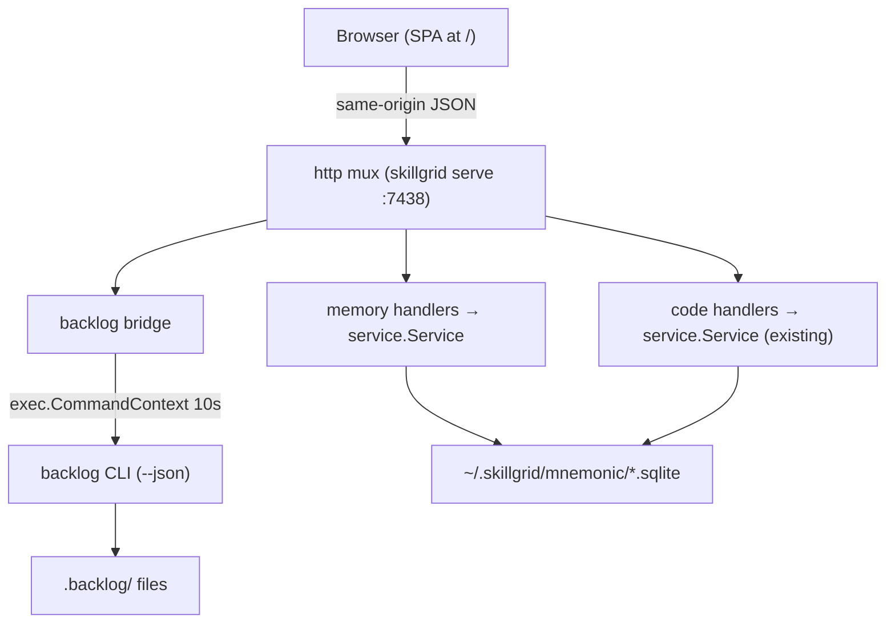

# Change: 009-web-admin-dashboard — Replan the Skillgrid Web Admin Dashboard

> **STATUS:** `draft` (2026-09-08)
>
> **For agentic workers:** REQUIRED: follow `.agents/skills/_shared/conventions/sdd-structure.md`. This file is WHY + HOW (former intent + plan). Spec phase instantiates `tasks.md` + `acceptance.feature` from the Step Blueprint and per-step WHAT below.
>
> **Migration note:** Question round already satisfied in-session (2026-09-08) — scope, delivery shape, frontend stack, existing-UI relationship, backlog bridge, and sessions-scope decisions are locked below; do not re-interview.

**Goal:** Replace the minimal embedded data viewer with a full admin dashboard served by `skillgrid serve` at `/` — memory browser, backlog browser, code-index status, and sessions view — backed by new HTTP endpoints where the service already has the method.

**Architecture:** The existing `internal/mnemonic/http` server (Go 1.22 mux, `embed.FS` static serving at `/`) is extended: new read endpoints expose service methods that are today MCP-only (single observation, session list, session summary, pin/unpin), a new `backlog` bridge package shells out to the `backlog` CLI (`--json`), and the embedded SPA under `internal/mnemonic/http/ui/` is rewritten in place (vanilla JS, no build step). All routes same-origin; write routes keep the existing bearer-token gate.

**Tech stack:** Go 1.22+ (`skillgrid-cli`), existing SQLite/MCP service layer (untouched), embedded static SPA (vanilla HTML/JS/CSS, `embed.FS`), `backlog` CLI (Bun, shell-out, `--json` output).

**Research:** `docs/skillgrid/changes/009-web-admin-dashboard/research.md` (UI pattern survey: Graphify-Labs/graphify, colbymchenry/codegraph, abhigyanpatwari/GitNexus — see "Adopted UI patterns" below)

**Prototype:** none

**Ticket:** none (to be created at spec/apply if `force_ticket_creation` fires)

**Depends on:** none (soft: 006-structured-session-handoff adds relay surfaces later — this change must not block on it)

---

## Goal

Operators can open `http://127.0.0.1:7438/` from a running `skillgrid serve` and administer all four surfaces in one dashboard: browse/search/edit Mnemonic memory, view and manage Backlog tasks, check code-index health and search it, and review sessions + summaries — without leaving the browser and without a separate frontend process.

## Out of scope / Non-Goals

- Session relay / cleave handoff surfaces (change 006) — sessions tab shows what exists today; relay view lands when 006 ships
- New MCP tools — MCP tool names, signatures, and return shapes are frozen for this change
- Mutations other than what is listed in In scope — e.g. no backlog task *creation* (read + status change only)
- Authentication beyond the existing `SKILLGRID_HTTP_TOKEN` bearer gate on write routes; no login UI, no sessions/cookies
- CORS, remote hosting, or any non-127.0.0.1 serving story
- React/Next.js or any npm build pipeline in `skillgrid-cli` — the SPA stays build-less
- Changes to Mnemonic storage schema, indexing, or retrieval logic
- Redoing Swagger UI — `/swagger-ui` stays as-is
- Graph canvas visualization (vis.js/Sigma.js) — deferred to a follow-up change that depends on 005/008 edges; 009 ships a forward-compat placeholder in the Code tab only
- AI chat panel in the dashboard — the agent lives in the terminal; the dashboard is operator-facing, not an agent client

## Definition of Done

This change is done only when **all** of the following are true:

- [ ] `GET /` serves the new dashboard; all four tabs (Memory, Backlog, Code, Sessions) render with live data from a real `skillgrid serve`
- [ ] Memory tab: search, observation detail view (full content via new endpoint), pin/unpin, soft-delete all work in-browser
- [ ] Backlog tab: grouped task board with status columns from `backlog config.yml`, task detail view, and status-change action that mutates the `.backlog` files via the CLI
- [ ] Code tab: index status (file/chunk counts, last indexed, stale flag), re-index action, BM25 search with expandable source view
- [ ] Sessions tab: session list with titles/started-at, recent context, session summaries
- [ ] `GET /openapi.yaml` and `/swagger-ui` still serve and reflect the new routes
- [ ] Adopted UI patterns implemented: "show numbers" table twin on every data widget, per-widget error isolation, freshness/completeness banners, query-first with suggested prompts, relation drill-down on observation detail
- [ ] New endpoints are covered by HTTP integration tests (happy + error per endpoint)
- [ ] Backlog bridge is covered by tests including CLI-missing and bad-JSON paths
- [ ] Every Step Blueprint entry has a matching section in `tasks.md` with Verdict `PASS` or `PASS WITH WARNINGS`
- [ ] Every `@step-NN` Feature in `acceptance.feature` has passing `@happy`, `@edge`, and `@failure` scenarios
- [ ] Applicable threat-matrix rows have RED coverage that passed
- [ ] Testing strategy commands below are green
- [ ] Rollback path below is still valid (or N/A documented)
- [ ] Change archived under `docs/skillgrid/archive/009-web-admin-dashboard/`

---

## Problem / why

`skillgrid serve` already runs a full HTTP API (:7438) and embeds a minimal data viewer (`internal/mnemonic/http/ui/index.html` + `app.js`, ~250 lines: mem/code/web tabs, no observation detail, no sessions, no backlog). The `docs/plan/02-future.md:42` webui wishlist (mnemonic memory visualization, include backlog browser, include opencode web) has never been planned as a change. In the meantime the API is missing the read surfaces a dashboard needs (single observation, session list, session summary, pin/unpin — all exist as service methods but only over MCP), and Backlog has zero HTTP exposure even though the `backlog` CLI already emits versioned JSON. Operators today switch between the CLI, MCP tools, and the backlog CLI to inspect one machine's state.

## Target users

- **Operator of a skillgrid-installed machine** — daily driver: "what did the agents remember / index / commit to the backlog, and can I clean it up?"
- **Agent (secondary)** — the JSON API + OpenAPI spec stays the machine-facing surface; the dashboard is human-facing

## Business rules

- The dashboard is read-mostly: mutations are limited to memory edits already available via API (pin/unpin/soft-delete/update), plus backlog **status change** — nothing else mutates
- Backlog mutations go through the `backlog` CLI, never direct `.backlog/*.md` file writes (metadata/history consistency rule from `AGENTS.md`)
- The dashboard must degrade gracefully when the `backlog` CLI is absent (Backlog tab shows a disabled state with reason; other tabs unaffected)
- Server stays bound to `127.0.0.1` by default; no new env vars for serving
- `GET /memory/project` keeps its current CWD-based behavior (quirk, not a regression — no change)

## In scope

- **New HTTP read endpoints** (service methods already exist): `GET /observations/{id}`, `GET /sessions`, `GET /sessions/{id}/summary`, `POST /memory/observations/{id}/pin`, `POST /memory/observations/{id}/unpin`
- **New backlog bridge**: `internal/mnemonic/http/backlog` package — shells out to `backlog` CLI: `GET /backlog/config`, `GET /backlog/tasks`, `GET /backlog/tasks/{id}`, `POST /backlog/tasks/{id}/status` (write-gated)
- **Dashboard SPA rewrite** at `internal/mnemonic/http/ui/`: four tabs (Memory, Backlog, Code, Sessions), observation detail, pin/unpin/delete, backlog board grouped by status, code search with source view, session list + summaries; project selector persists to localStorage (kept from current UI)
- **OpenAPI spec** (`ui/openapi.yaml`) updated for every new route
- **Tests**: HTTP integration tests per new route (happy/edge/failure), backlog bridge tests (CLI present/missing/bad JSON), existing suite stays green

## Risks & rollback

- **Risk:** `backlog` CLI is a separate Bun binary — version drift or absence breaks the Backlog tab — **Mitigation:** bridge treats the CLI as an external dependency: missing binary → 503 with JSON reason, tab renders disabled state; output pinned to `--json` `schemaVersion` field with a validation test
- **Risk:** SPA rewrite regresses the current viewer (mem/code/web tabs) — **Mitigation:** step 01 ships the SPA skeleton with Memory+Code tabs working before Backlog/Sessions land (vertical slices, each step independently shippable)
- **Risk:** shell-out from a long-running HTTP server accumulates subprocess state — **Mitigation:** each call is a fresh `exec.CommandContext` with a 10s timeout; no shared CLI session
- **Rollback:** the change is additive to routes + in-place UI rewrite; revert the commit and `skillgrid serve` returns to the previous viewer. No schema or config migration, so rollback is a plain git revert.

## Error handling

| Failure | Behavior | Notes |
|---------|----------|-------|
| `backlog` binary not on PATH | `warn+continue` | `GET /backlog/*` → 503 `{error: "backlog CLI not found"}`; dashboard renders disabled Backlog tab |
| `backlog` CLI exits non-zero or times out (>10s) | `warn+continue` | → 502 with CLI stderr excerpt (truncated 200 chars) |
| `backlog --json` output not valid / unknown `schemaVersion` | `warn+continue` | → 502 with reason; tab shows error state, no partial render |
| Unknown observation id on `GET /observations/{id}` | `abort` | 404 `{error: ...}` |
| Unknown session id on `GET /sessions/{id}/summary` | `abort` | 404 |
| Invalid status on `POST /backlog/tasks/{id}/status` (not in `config.yml` statuses) | `abort` | 400 listing valid statuses (validated client-side too) |
| Pin on already-pinned / unpin on non-pinned observation | `warn+continue` | idempotent 200 (service-level behavior preserved) |
| Write route called without token when `SKILLGRID_HTTP_TOKEN` is set | `abort` | 401 (existing `requireWriteAuth` behavior, unchanged) |

## Testing strategy

- **Unit:** `Run: go test ./skillgrid-cli/internal/mnemonic/http/...` — Expected: PASS
- **Integration / acceptance:** `Run: go test ./skillgrid-cli/internal/mnemonic/integration/...` — Expected: PASS (new per-route tests; `@step-NN` mapping in `acceptance.feature`)
- **Backlog bridge:** `Run: go test ./skillgrid-cli/internal/mnemonic/http/backlog/...` — Expected: PASS (fixture CLI on PATH via temp dir; missing-binary + bad-JSON cases)
- **Full suite:** `Run: go test ./...` — Expected: PASS
- **Green means:** all new route tests + backlog bridge tests pass, existing http/integration tests unmodified-and-passing, `go vet ./...` clean, and a manual smoke (`skillgrid serve` + browser) passes the DoD list

---

## Step Blueprint

Contract for `sdd-spec`. Do not renumber after `tasks.md` exists. Per-step Out of scope / DoD live under Per-step WHAT (table is summary only).

| NN | Step slug | Goal (one line) | Primary package / entry | Depends on |
|----|-----------|-----------------|-------------------------|------------|
| 01 | `memory-endpoints` | Expose observation detail, pin/unpin, session list, session summary over HTTP | `skillgrid-cli/internal/mnemonic/http` | — |
| 02 | `backlog-bridge` | Shell-out bridge to `backlog` CLI behind `/backlog/*` routes with graceful degradation | `skillgrid-cli/internal/mnemonic/http/backlog` | — |
| 03 | `dashboard-shell` | SPA rewrite skeleton: layout, routing, project selector, Memory tab (search + detail + pin/unpin/delete), Code tab (status + search + source view) | `skillgrid-cli/internal/mnemonic/http/ui` | 01 |
| 04 | `dashboard-backlog-sessions` | Backlog tab (board by status, detail, status change) + Sessions tab (list, context, summaries) | `skillgrid-cli/internal/mnemonic/http/ui` | 03 |
| 05 | `openapi-and-polish` | OpenAPI spec updated for all new routes; swagger-ui re-verified; DoD smoke pass | `skillgrid-cli/internal/mnemonic/http/ui` | 04 |

---

## Technical approach

Five vertical slices. First, the API gets the five missing read/patch routes by wiring existing service methods into the http package (no service-layer changes). Second, a small `backlog` bridge package owns subprocess execution and JSON validation, mounted as four routes with the existing write-auth on the mutating one. Third, the embedded SPA is rewritten in place with a no-build vanilla JS shell (hash-routed tabs) that fully covers Memory and Code — this is the point where the old viewer is replaced at `/`. The SPA adopts six UI patterns from a cross-tool survey (`research.md`): show-numbers table twin (codegraph), per-widget error isolation (codegraph), freshness/completeness banners (graphify + codegraph), query-first with suggested prompts (graphify), relation drill-down with confidence badges (graphify), and a forward-compat graph placeholder (GitNexus/graphify). Fourth, Backlog and Sessions tabs land on the same shell, promoting per-widget error isolation to a first-class pattern and adding the Backlog completeness banner. Fifth, the OpenAPI spec and swagger catch-up plus the full DoD smoke.

## Architecture decisions

### Decision: SPA stays embedded in the Go binary, vanilla JS, no build step

**Module / Interface / Seam / Adapter / Depth:** deep seam — `internal/mnemonic/http` exposes one `Handler()`; UI is a data adapter to it
**Choice:** Rewrite `internal/mnemonic/http/ui/` in place (vanilla HTML/CSS/JS, `embed.FS`, hash routing), served at `GET /`
**Alternatives considered:** (a) separate frontend app with dev server + CORS; (b) React/Next.js compiled to static and embedded
**Rationale:** (a) adds a second process and a CORS surface the API has no handling for; (b) adds an npm toolchain to a pure-Go repo with `go test ./...` as its only gate. The current UI already proves the embedded pattern works; the wishlist is about surfaces, not frameworks. The SPA is ~2–3k LOC of straightforward fetch-and-render — no framework needed.

### Decision: Backlog bridge shells out to the `backlog` CLI instead of parsing `.backlog/*.md`

**Module / Interface / Seam / Adapter / Depth:** adapter — CLI is the port adapter; the bridge is the boundary
**Choice:** `exec.CommandContext("backlog", ...)` with `--json`; parse `schemaVersion`-gated JSON
**Alternatives considered:** (a) parse `.backlog/tasks/*.md` + `config.yml` directly in Go; (b) hybrid (parse reads, CLI for writes)
**Rationale:** the `backlog` CLI is the documented single source of truth for task semantics (status, labels, AC counts, `isReady`) — parsing markdown duplicates its rules and drifts. The CLI already emits versioned JSON (`schemaVersion: 1`, `kind: "task-list"`) verified in-session. User chose shell-out over parse/hybrid. Missing-CLI degradation is designed in (503), so the dashboard never hard-depends on Bun.

### Decision: New routes extend the existing http package; no new service methods

**Module / Interface / Seam / Adapter / Depth:** shallow extension on a deep seam
**Choice:** Add handlers in `internal/mnemonic/http` calling existing `service.Service` methods (`GetObservation`, `PinObservation`/`UnpinObservation`, `SessionSummary`, session listing via existing store access)
**Alternatives considered:** (a) new `web` package with its own DTO layer; (b) move UI + routes into a separate `skillgrid web` command
**Rationale:** the service already has every method (confirmed by inventory: `service.go:694/780/790/190`); this change is a routing + rendering gap, not a capability gap. A second command would split the single-port serving story. If 007 (project handle facade) lands later, these handlers move with the rest of the package for free.

### Decision: Backlog status change is the only backlog mutation

**Module / Interface / Seam / Adapter / Depth:** boundary rule on the adapter
**Choice:** `POST /backlog/tasks/{id}/status` shells out to the CLI's status command; no create/update/delete
**Alternatives considered:** full CRUD via CLI
**Rationale:** the operator pain is unblocking/retriaging from the browser, not authoring tasks (which belong to the agent workflow). Smaller CLI-surface = smaller drift surface. Create/update stay CLI-only.

## Data flow



## File layout

```
skillgrid-cli/internal/mnemonic/http/
├── server.go                  # +5 routes (observations/{id}, sessions, sessions/{id}/summary, pin, unpin)
├── ui.go                      # unchanged (embed + GET / mount)
├── ui/
│   ├── index.html             # rewrite: shell + 4 tabs
│   ├── app.js                 # rewrite: hash router, tab modules
│   ├── app.css                # new (extracted from inline)
│   ├── favicon.png            # kept
│   ├── openapi.yaml           # + new routes
│   └── swagger/               # unchanged
└── backlog/
    ├── bridge.go              # new: CLI exec + JSON validation
    └── bridge_test.go         # new: fixture-CLI tests
```

## Impacted files map

| File | Action | Step | Description |
|------|--------|------|-------------|
| `skillgrid-cli/internal/mnemonic/http/server.go` | Modify | 01 | 5 new routes + handlers over existing service methods |
| `skillgrid-cli/internal/mnemonic/integration/integration_test.go` | Modify | 01 | per-route happy/edge/failure tests for the 5 new routes |
| `skillgrid-cli/internal/mnemonic/http/backlog/bridge.go` | Create | 02 | CLI exec adapter + JSON schema validation + route handlers |
| `skillgrid-cli/internal/mnemonic/http/backlog/bridge_test.go` | Create | 02 | fixture-CLI happy, missing-binary 503, bad-JSON 502, timeout 502 |
| `skillgrid-cli/internal/mnemonic/http/server.go` | Modify | 02 | mount `/backlog/*` routes (read open, status write-gated) |
| `skillgrid-cli/internal/mnemonic/http/ui/index.html` | Modify | 03 | dashboard shell, 4-tab layout, hash router |
| `skillgrid-cli/internal/mnemonic/http/ui/app.js` | Modify | 03 | Memory tab (search/detail/pin/unpin/delete) + Code tab (status/search/source) |
| `skillgrid-cli/internal/mnemonic/http/ui/app.css` | Create | 03 | extracted styles |
| `skillgrid-cli/internal/mnemonic/http/ui/index.html` | Modify | 04 | Backlog + Sessions tab markup |
| `skillgrid-cli/internal/mnemonic/http/ui/app.js` | Modify | 04 | Backlog board/detail/status-change + Sessions list/summaries |
| `skillgrid-cli/internal/mnemonic/http/ui/openapi.yaml` | Modify | 05 | all new routes + examples |
| `docs/skillgrid/user-manual/` (serve page) | Modify | 05 | dashboard documentation |

## Per-step WHAT

### Step 01 — `memory-endpoints`

**Goal:** The HTTP API exposes every read surface the dashboard's Memory and Sessions tabs need.
**Out of scope:** backlog, code, web routes; any service-method signature change; MCP surface
**Definition of Done:** new routes return correct JSON for happy/edge/failure per integration tests

- `GET /observations/{id}` returns full untruncated observation content (same shape as `mem_get_observation`)
- `GET /observations/{id}` → 404 JSON for unknown id
- `GET /sessions` returns the session list for a project (id, title, started_at, status)
- `GET /sessions/{id}/summary` returns the session summary; 404 for unknown session
- `POST /memory/observations/{id}/pin` and `.../unpin` (write-gated) are idempotent and reflected in `GET /observations` ordering
- Existing routes and their auth behavior unchanged

### Step 02 — `backlog-bridge`

**Goal:** `/backlog/*` routes give the dashboard a JSON view of Backlog that degrades gracefully without the CLI.
**Out of scope:** backlog create/update/delete; parsing `.backlog` files directly; auth model change
**Definition of Done:** four routes covered by bridge tests including all error-handling rows

- `GET /backlog/config` returns statuses/types/priorities from `backlog config`
- `GET /backlog/tasks` returns the versioned `task-list` JSON (id, title, status, priority, assignees, AC progress, isReady)
- `GET /backlog/tasks/{id}` returns one task; 404 when CLI reports not found
- `POST /backlog/tasks/{id}/status` (write-gated) changes status via CLI; 400 on status not in config; 502 with stderr excerpt on CLI failure
- CLI missing → 503 `{error: "backlog CLI not found"}` on all `/backlog/*`
- CLI timeout >10s → 502; every call is a fresh subprocess with context deadline

### Step 03 — `dashboard-shell`

**Goal:** `GET /` serves the new dashboard shell with working Memory and Code tabs — the old viewer is replaced.
**Out of scope:** Backlog and Sessions tab behavior (markup stubs may exist); any backend change
**Definition of Done:** manual smoke — Memory and Code tabs fully usable against a real `skillgrid serve`

- Tab shell with hash routing (`#/memory`, `#/backlog`, `#/code`, `#/sessions`); project selector persists to localStorage
- Memory tab: search box (debounced), results list, click → detail pane with full content via step-01 endpoint, pin/unpin and soft-delete actions with confirmation
- Memory tab: **relation drill-down** — observation detail pane lists relations via existing `GET /relations/{id}`, each with a confidence badge (EXTRACTED/INFERRED/AMBIGUOUS); clicking a related observation navigates to its detail
- Memory tab: **query-first with suggested prompts** — empty state shows recent session prompts (from `GET /context`) as clickable suggestions instead of a blank "no results"
- Code tab: **freshness banner** — last-indexed timestamp + stale flag rendered as a top banner (not a buried card field) with a "Re-index" action; matches graphify's "Graph Freshness: built from commit X, run Y to update" pattern
- Code tab: status card (file/chunk counts), "Re-index" button (write-gated `POST /code/index`), search with result list, click → source view via `GET /code/read`
- Code tab: **forward-compat graph placeholder** — a collapsed panel labeled "Code graph (coming in 010)" that renders a file-list fallback; when 005/008 edge data becomes available via a future endpoint, this panel is the mount point for the graph canvas
- **Show-numbers table twin** — every data widget (status card, search results, relation list) has a toggle to render the raw JSON/table behind it; this is the baseline interaction for all tabs
- Old viewer's mem/code/web functionality not lost: web-cache view moves into Memory tab (sub-section) or is preserved equivalently
- All data from same-origin JSON; no external CDN assets (binary must work offline)

### Step 04 — `dashboard-backlog-sessions`

**Goal:** Backlog and Sessions tabs are fully functional.
**Out of scope:** backlog mutations other than status; relay/cleave surfaces (006)
**Definition of Done:** manual smoke — board renders from live CLI data; status change round-trips; sessions list + summaries render

- Backlog tab: tasks grouped into columns by status (columns from `GET /backlog/config`), card shows id/title/priority/AC-progress; click → detail pane (references, assignees, dates); "Move to…" status action calls the step-02 endpoint and re-renders
- Backlog tab: **completeness banner** — shows `backlog` CLI version + `schemaVersion` from the response; if `schemaVersion` is unknown/unsupported, renders a warning banner (matches codegraph's `complete: false` / `incomplete_from` honesty pattern)
- Backlog tab degraded state: on 503 shows "backlog CLI not found — install with `skillgrid install`" and disables interactions
- Sessions tab: session list (title, started_at, status) via step-01 `GET /sessions`, recent context section via `GET /context`, click session → summary pane via `GET /sessions/{id}/summary`
- **Per-widget error isolation** (promoted to first-class pattern): each widget owns its own fetch + error render; a failed endpoint kills that widget only, never the tab or page; a 500 on `/backlog/tasks` leaves Memory, Code, Sessions fully interactive

### Step 05 — `openapi-and-polish`

**Goal:** Machine-facing docs and polish match the shipped surface.
**Out of scope:** feature work (bugs found here are fixed, nothing new)
**Definition of Done:** swagger-ui renders every new route with valid examples; user-manual updated; full DoD smoke passes

- `openapi.yaml` documents all step-01/02 routes with request/response examples
- `/swagger-ui` loads and can exercise each new route
- User-manual serve section documents the dashboard tabs and the backlog-CLI dependency
- Full DoD checklist from this file passes (manual smoke + `go test ./...` + `go vet ./...`)

## Threat matrix

Mark each row `Applicable` or `N/A: reason`. Applicable rows name an owning step and propagate into RED tasks + acceptance scenarios.

| Boundary / threat | Applicable? | Owning step | Planned RED coverage |
|-------------------|-------------|-------------|----------------------|
| **Subprocess execution** — shell-out to `backlog` CLI: missing binary, non-zero exit, timeout, stdout not JSON, huge output | Applicable | 02 | `bridge_test.go`: missing-binary → 503; fixture CLI exiting 1 → 502 with stderr excerpt; fixture CLI sleeping 11s → 502 timeout; fixture CLI printing garbage → 502; status-change writes verified by re-reading file via fixture |
| **Mnemonic tool surface** (`mem_*` / `code_*` / `web_cache_*`) | N/A: no MCP tool, param, return shape, or error code changes — this change adds HTTP routes only; MCP tools are frozen (non-goal) | — | inventory verification (grep) that no `tools_*.go` file is touched |
| **Authz / data leak** — new read routes expose full observation content and session summaries to same-origin callers; write routes must stay token-gated | Applicable | 01 | integration test: with `SKILLGRID_HTTP_TOKEN` set, `POST .../pin` without token → 401, with token → 200; `GET /observations/{id}` open (matches read-route policy); `POST /backlog/tasks/{id}/status` without token → 401 |
| **Shared-convention drift** — no `_shared/conventions/*.md` edits in this change | N/A: impacted files map contains no `.agents/skills/_shared` paths | — | — |
| **Git repository selection / commit / push / PR commands** | N/A: no git or PR automation — the backlog CLI manages its own git behavior internally; the bridge only invokes task-scoped commands | — | — |
| **Documentation-like paths / executable-file classification** | N/A: no file classification or execution of repo files — the only executable is the `backlog` binary on PATH | — | — |

## Migration / rollout

- No migration: additive routes + in-place UI rewrite in one change; single binary version
- Rollout: `skillgrid install` / rebuild → restart `skillgrid serve` → open `:7438/`
- If the `backlog` CLI is absent (fresh machine, Bun not installed), the dashboard works with Backlog tab disabled — acceptable degraded state, documented in the tab itself

## Open questions

- none — all six planning questions answered in-session (scope = all four surfaces; SPA served by `skillgrid serve`; stack = no preference → vanilla embedded; existing UI = replace at `/`; backlog = shell out; sessions = relay deferred to 006)

## Glossary

| Term | Definition | Glossary file |
|------|------------|---------------|
| **Dashboard** | The embedded SPA served at `GET /` by `skillgrid serve`, covering Memory, Backlog, Code, and Sessions tabs | technical |
| **Backlog bridge** | The `internal/mnemonic/http/backlog` adapter that shells out to the `backlog` CLI and translates its versioned JSON to HTTP responses | technical |
| **Write-gated route** | An HTTP route protected by the existing `SKILLGRID_HTTP_TOKEN` bearer check (`requireWriteAuth`) | technical |
| **Show-numbers table twin** | Every dashboard data widget has a toggle that renders the raw JSON/table behind the visual; the table is the source of truth, the visual is a convenience view (pattern from codegraph telemetry) | technical |
| **Per-widget error isolation** | Each dashboard widget owns its own fetch + error render; a failed endpoint kills that widget only, never the tab or page (pattern from codegraph telemetry) | technical |
| **Forward-compat placeholder** | A UI panel that renders a fallback today and is the designated mount point for a capability that depends on a future change (009's graph panel awaits 010) | technical |

## Author self-review

- [x] **Goal**, **Out of scope / Non-Goals**, and **Definition of Done** are filled and testable
- [x] **Error handling** and **Testing strategy** are filled
- [x] Non-goals match Global Constraints that will appear in `tasks.md`
- [x] Rollback plan is present
- [x] Step Blueprint covers a vertical-slice sequence (no horizontal-only layers)
- [x] Every Impacted Files row maps to exactly one step
- [x] Every applicable threat row names an owning step
- [x] Glossary terms reused or defined; no companion reference file
