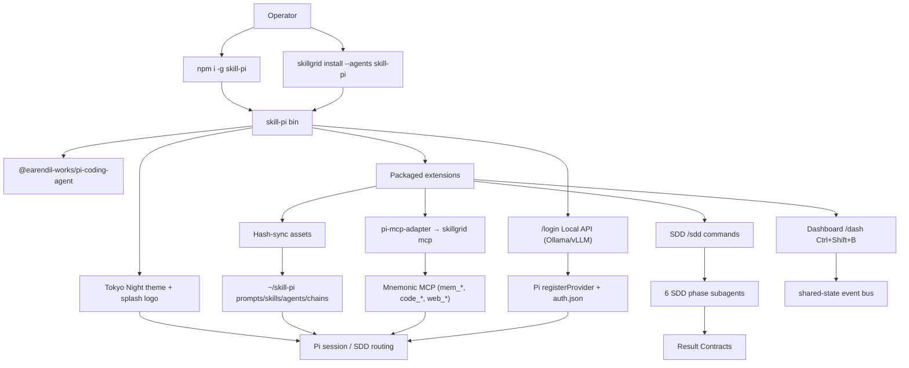

# Change: 012-skill-pi-coding-agent — skill-pi: Full-Featured Skillgrid Pi Distribution

> **STATUS:** `draft` (2026-09-08)
>
> **For agentic workers:** REQUIRED: follow `.agents/skills/_shared/conventions/sdd-structure.md`. This file is WHY + HOW (former intent + plan). Spec phase instantiates `tasks.md` + `acceptance.feature` from the Step Blueprint and per-step WHAT below.

**Goal:** Ship a fat `skill-pi` CLI distribution in this monorepo that vendors Pi and delivers Skillgrid SDD with phase sub-agents, Mnemonic wiring via pi-mcp-adapter, a Skillgrid Tokyo Night look with omegon-style splash, `/login`-integrated local Ollama/vLLM setup, bundled rpiv companions, a Skillgrid permission extension, SDD phase sub-agents with Result Contracts, and a custom TUI dashboard.

**Architecture:** Repo-root npm package `skill-pi/` depends on `@earendil-works/pi-coding-agent`, exposes bin `skill-pi` only, packages TS extensions (splash + mnemonic + sdd + permissions + dashboard + local-llm), ships a Tokyo Night Skillgrid theme + logo, pins and activates three `@juicesharp/rpiv-*` companions + `pi-mcp-adapter` + `pi-web-access` + `pi-subagents`, hash-syncs prompts/skills/agents/chains into `~/skill-pi`. Permission policy lives at `~/skill-pi/permission.json`. Go installer gains a `skill-pi` agent option beside OpenCode/Kilo/Cursor. SDD phase sub-agents (explore, propose, spec, apply, verify, archive) run as `pi --mode rpc` children with Result Contract returns. Custom TUI dashboard shows SDD status, memory, code index, session, and active agents.

**Tech stack:** Node/TypeScript (Bun runtime), npm publishable package at `skill-pi/`; Go (`skillgrid-cli` install/setup); Mnemonic MCP via pi-mcp-adapter; Pi themes JSON + splash; local Ollama/vLLM via `/login` Local API; npm deps `@juicesharp/rpiv-ask-user-question`, `@juicesharp/rpiv-todo`, `@juicesharp/rpiv-web-tools`, `pi-mcp-adapter`, `pi-web-access`, `pi-subagents`; permission extension inspired by `@gotgenes/pi-permission-system` + `@inobit/pi-permission` plan/ask UX; SDD subagents pattern from gentle-pi.

**Research:** `docs/skillgrid/changes/012-skill-pi-coding-agent/research.md`

**Prototype:** none

**Ticket:** TASK-006

**Depends on:** none (soft: existing `.agents/skills` SDD content as source for synced assets)

---

## Goal

Operators can install and run `skill-pi` (npm global and/or `skillgrid install`) and get a Pi-based coding agent that loads Skillgrid SDD workflow assets and Mnemonic wiring, presents a Skillgrid Tokyo Night splash/theme, can run SDD phases as sub-agents with Result Contracts, can add local Ollama/vLLM from the `/login` menu without hand-editing config, ships rpiv ask/todo/web-tools companions, enforces Skillgrid permissions (ask dialog + read-only `/plan`), and shows a live dashboard with SDD status, memory, code index, and session info.

## Out of scope / Non-Goals

- Thin launcher that only `exec`s a separately installed upstream `pi` (rejected depth)
- Shipping a `pi` PATH alias (rejected CLI identity)
- Sibling-repo publish for v1 (monorepo `skill-pi/` only for now)
- Gentle RDD / receipt-driven review / `gentle-ai` binary provisioning
- Full Gentle/omegon ambiance/QoL theme catalog beyond the single Skillgrid Tokyo Night look
- Forking or depending on oh-my-pi / `omp` as the runtime
- Replacing OpenCode/Kilo/Cursor install paths
- Shipping a **separate** slash command (`/localllm`, `/crossbar`, `/local`) as the primary UX — local setup must live under **`/login` → Local API**
- Full Crossbar multi-backend matrix in v1 (LM Studio, llama-swap, Anthropic cloud, LAN sweep) — **Ollama + vLLM (+ optional generic OpenAI-compatible URL)** only
- Enabling LAN/mDNS discovery by default (localhost-only unless operator opts in later)
- Installing the full `@juicesharp/rpiv-pi` pipeline / `/rpiv-setup` (advisor, workflow, voice, warp, btw, telemetry, …) — **only** the three named companions
- Forking or rebranding rpiv-mono; Skillgrid pins published npm packages and activates them
- Using gotgenes/inobit default config paths under `~/.pi/agent/...` — Skillgrid permission config is **`~/skill-pi/permission.json`**
- Shipping a full OS sandbox / container isolation layer (permission is an in-process gate, complementary to sandboxes)
- Depending on `@gotgenes/pi-subagents` / model-judge kitchen sink as required v1 surface
- Sub-agent orchestration beyond the 6 SDD phase agents (no generic `task` tool, no Agent Hub TUI in v1)
- Web UI / remote dashboard (TUI-only dashboard in v1)

## Definition of Done

This change is done only when **all** of the following are true:

- [ ] `skill-pi/` is an installable npm package with bin `skill-pi` (no `pi` alias) that starts a Pi session with Skillgrid extensions loaded
- [ ] Packaged extensions run; prompts, skills, agents, and chains sync into `~/skill-pi` without clobbering user-owned edits (hash-manifest policy)
- [ ] Mnemonic companion wiring works via pi-mcp-adapter (MCP) when Skillgrid Mnemonic is available
- [ ] Skillgrid look ships: Tokyo Night theme + startup splash/logo (omegon-style), reusing Skillgrid brand marks already used in OpenCode/Kilo plugins
- [ ] `/login` exposes a **Local API** entry that can add Ollama or vLLM (wizard + connection test) without hand-editing config files
- [ ] Distribution pins and activates `@juicesharp/rpiv-ask-user-question`, `@juicesharp/rpiv-todo`, and `@juicesharp/rpiv-web-tools` without a separate manual `pi install`
- [ ] Permission extension loads with skill-pi, reads/writes policy at **`~/skill-pi/permission.json`**, supports allow/ask/deny, interactive ask dialog, and read-only `/plan` (with `/build` return)
- [ ] SDD phase sub-agents (explore, propose, spec, apply, verify, archive) are defined, synced, and callable via `/sdd` commands
- [ ] Each SDD phase agent returns a validated Result Contract
- [ ] `/sdd full` chain runs: explore → propose → spec → [user gate] → apply → verify → archive
- [ ] Custom TUI dashboard (`/dash`, `Ctrl+Shift+B`) shows SDD status, memory, code index, session, and active agents
- [ ] `skillgrid install` / `setup` offers agent option **`skill-pi`** and can install/link the package
- [ ] Docs cover npm install, `skillgrid install`, update/lifecycle, Local API login flow, SDD subagent usage, dashboard, and coexistence with standalone Pi
- [ ] Every Step Blueprint entry has a matching section in `tasks.md` with Verdict `PASS` or `PASS WITH WARNINGS`
- [ ] Every `@step-NN` Feature in `acceptance.feature` has passing `@happy`, `@edge`, and `@failure` scenarios
- [ ] Applicable threat-matrix rows have RED coverage that passed
- [ ] Testing strategy commands below are green
- [ ] Rollback path below is still valid (or N/A documented)
- [ ] Change archived under `docs/skillgrid/archive/012-skill-pi-coding-agent/`

---

## Problem / why

Skillgrid wires OpenCode, Kilo, and Cursor today but has no Pi harness. Users want a Skillgrid-included Pi agent comparable to gentle-pi / omegon-pi / oh-my-pi. Without an owned distribution, Skillgrid SDD and Mnemonic stay second-class on Pi, and install remains fragmented.

## Target users

- **Operator** — installs Skillgrid hub and wants a terminal Pi agent that already knows Skillgrid SDD
- **Agent (inside skill-pi)** — loads Skillgrid phase skills/agents and Mnemonic tools without manual package hunting
- **Maintainer** — versions Pi + Skillgrid assets together in one fat package under this monorepo

## Business rules

- Fat distribution: depend on / bundle `@earendil-works/pi-coding-agent` (and related Pi packages as required); Skillgrid owns the `skill-pi` bin and lifecycle
- Never register a `pi` binary alias
- Agent home for synced markdown is **`~/skill-pi`**, not `~/.pi/agent`
- Extensions ship inside the npm package; prompts, skills, agents, and chains sync to agent home
- v1 scope: SDD + Mnemonic + install/update + Tokyo Night theme/splash + `/login` Local API + three `@juicesharp/rpiv-*` + Skillgrid permission + 6 SDD phase sub-agents + custom TUI dashboard
- `skillgrid install` agent key/display: **`skill-pi`** (not `pi`)
- npm package name: **`skill-pi`**
- Source tree: repo-root **`skill-pi/`**
- Brand look reuses Skillgrid wordmark / Tokyo purple (`#9854f1`) already used in `plugins/opencode/skillgrid-logo.tsx` and `plugins/kilo/skillgrid-logo.tsx`
- Local API UX is integrated into Pi **`/login`** (new menu element), not a standalone slash command
- API keys for local servers use Pi auth storage; never write secrets into synced markdown under `~/skill-pi`
- Localhost discovery/probe by default; connection test must succeed before registering a provider
- SDD phase agents return Result Contracts; invalid contracts produce a warning but do not block the chain
- User gate after spec is mandatory: no auto-apply

## In scope

- Scaffold and publishable layout for `skill-pi/` (package.json, bin, pinned Pi deps, `pi` manifest for packaged extensions and themes)
- Session extensions: asset sync, Skillgrid commands/status, Mnemonic wiring hooks via pi-mcp-adapter
- Synced asset trees: prompts, skills, agents, chains (Skillgrid SDD mapping)
- Skillgrid look: packaged Tokyo Night theme JSON + splash/startup logo extension (omegon `00-splash` / `themes/` pattern)
- Local API login integration: `/login` → Local API wizard for Ollama and vLLM (detect/probe, optional API key, register via Pi provider APIs, list models)
- Bundled rpiv companions (pinned npm): `@juicesharp/rpiv-ask-user-question`, `@juicesharp/rpiv-todo`, `@juicesharp/rpiv-web-tools`
- Bundled plugins: `pi-mcp-adapter` (Mnemonic MCP), `pi-web-access` (web), `pi-subagents` (sub-agent infrastructure)
- Skillgrid permission extension: allow/ask/deny gates; config file **`~/skill-pi/permission.json`**; ask dialog + read-only `/plan` (with `/build` return)
- SDD phase sub-agents: 6 agents (explore, propose, spec, apply, verify, archive) with Result Contracts, `/sdd` commands, `sdd-full` chain, user gate
- Custom TUI dashboard: `/dash` + `Ctrl+Shift+B`, showing SDD status, memory, code index, session, agents
- Installer: `AvailableAgents` + setup path for `skill-pi`
- User docs and plan harness list update
- Package tests / smoke for bin + sync + installer + theme/splash + Local API + rpiv companions + permission + subagents + dashboard

## Risks & rollback

- **Risk:** Pi upstream API/package churn — **Mitigation:** Pin exact Pi versions; CI smoke against pinned set; document bump procedure
- **Risk:** Fat distribution maintenance cost — **Mitigation:** Hard Core non-goals; no kitchen-sink in v1
- **Risk:** Sync overwrites user customizations in `~/skill-pi` — **Mitigation:** Hash-manifest managed files only; never overwrite dirty user edits
- **Risk:** Confusion with standalone `pi` — **Mitigation:** No `pi` alias; docs coexistence section
- **Risk:** Go installer regresses existing agents — **Mitigation:** Additive agent key; tests for existing AvailableAgents
- **Risk:** Local API SSRF / probing unintended hosts — **Mitigation:** Default localhost-only; validate URL scheme/host; connection test timeout; no LAN sweep in v1
- **Risk:** Secrets in plaintext config — **Mitigation:** Use Pi auth.json/keychain; never sync keys into `~/skill-pi`
- **Risk:** `/login` extension API unavailable or unstable across Pi versions — **Mitigation:** Pin Pi; feature-detect; degrade with clear doctor message if hook missing
- **Risk:** rpiv companion version drift / peer conflicts with Pi — **Mitigation:** Pin exact versions; CI smoke load; doctor reports missing companions
- **Risk:** Accidental pull of full rpiv-pi pipeline — **Mitigation:** Explicit allowlist of three packages only; no `/rpiv-setup` dependency
- **Risk:** Permission false-allow / config path drift to `~/.pi/agent` — **Mitigation:** Hard-code Skillgrid agent-home config path; fail-closed on gate errors; tests assert `~/skill-pi/permission.json`
- **Risk:** Plan mode not truly read-only — **Mitigation:** Acceptance scenarios for write deny in `/plan`; danger overlay still asks/denies
- **Risk:** SDD phase agent returns invalid Result Contract — **Mitigation:** Validate contract; warn + continue with degraded contract (executive_summary only); do not block the chain
- **Risk:** Subagent process crash mid-phase — **Mitigation:** Report which phase failed; suggest re-run; do not corrupt session state
- **Risk:** Dashboard renders stale state — **Mitigation:** Reactive updates via shared-state event bus; re-render on state change
- **Rollback:** Remove `skill-pi/` package publish; drop installer agent key and docs; leave `~/skill-pi` on disk (document manual delete). Upstream Pi installs untouched. Registered local providers remain in Pi auth/settings until operator removes them.

## Error handling

| Failure | Behavior | Notes |
|---------|----------|-------|
| Pi dependency missing / wrong version at runtime | `abort` | Clear message to reinstall/update `skill-pi` |
| Agent-home sync cannot write `~/skill-pi/` | `abort` | Fail closed before claiming ready |
| Managed file dirty vs package hash | `warn+continue` | Skip that file; report in status/doctor |
| Mnemonic MCP/HTTP unavailable | `warn+continue` | SDD assets still load; memory tools degraded with doctor hint |
| `skillgrid install` package install fails | `abort` | Non-zero; do not mark agent configured |
| Unknown agent key typo (`pi` instead of `skill-pi`) | `abort` | Suggest `skill-pi` |
| Local API connection test fails | `abort` (of that add) | Do not register provider; show reachable error |
| `/login` Local API hook unsupported on this Pi | `warn+continue` | Doctor explains; cloud `/login` entries still work |
| Disallowed host / scheme on Local API URL | `abort` (of that add) | Reject non-http(s) or non-allowed hosts |
| Required rpiv companion missing or unloadable | `warn+continue` | Doctor lists which of the three failed; core SDD still starts |
| Permission config missing | `warn+continue` | Seed safe defaults into `~/skill-pi/permission.json` |
| Permission gate internal error | `abort` (of that tool call) | Fail-closed: block the tool; surface gate_error |
| Operator denies in ask dialog | `abort` (of that tool call) | Model continues unless Esc hard-terminate |
| SDD phase agent returns invalid Result Contract | `warn+continue` | Log the contract, continue with executive_summary only |
| Subagent process crashes mid-phase | `abort` (of that phase) | Report which phase failed; suggest re-run |
| Dashboard state bus unavailable | `warn+continue` | Dashboard shows "state unavailable"; does not block agent |

## Testing strategy

- **Unit:** `Run: cd skill-pi && bun test` — Expected: PASS (sync/hash, package manifest, bin help smoke, permission gates, Result Contract validation, local LLM detection)
- **Integration:** `Run: cd skill-pi && bun test --integration` — Expected: PASS (`@step-NN` / `@p0`)
- **Go installer:** `Run: go test ./skillgrid-cli/internal/install/...` — Expected: PASS (agent key, install path)
- **Full suite:** `Run: go test ./...` (skillgrid-cli) and `cd skill-pi && bun test` — Expected: PASS
- **E2E:** `Run: cd skill-pi && bun test test/e2e.test.ts` — Expected: PASS (full SDD cycle in temp repo)
- **Green means:** Bin starts with extensions; sync populates `~/skill-pi`; installer lists/installs `skill-pi`; no `pi` alias in package.bin; SDD subagents return valid contracts; dashboard renders; permission gates block correctly; local LLM registers

---

## Step Blueprint

Contract for `sdd-spec`. Do not renumber after `tasks.md` exists. Per-step Out of scope / DoD live under Per-step WHAT (table is summary only).

| NN | Step slug | Goal (one line) | Primary package / entry | Depends on |
|----|-----------|-----------------|-------------------------|------------|
| 01 | `package-scaffold` | Repo-root `skill-pi/` npm package with pinned Pi deps, bin `skill-pi` only, no `pi` alias | `skill-pi/package.json`, `skill-pi/bin` | — |
| 02 | `extensions-core` | Packaged extensions load on start (status/doctor hooks, sync trigger) | `skill-pi/extensions` | 01 |
| 03 | `asset-sync` | Prompts/skills/agents/chains sync into `~/skill-pi/` with hash-manifest policy | `skill-pi/lib/agent-home.ts` + `assets/` | 02 |
| 04 | `sdd-mnemonic` | SDD phase assets mapped; Mnemonic via pi-mcp-adapter; fail-soft when unavailable | `skill-pi/extensions/01-mnemonic`, `02-sdd` | 03 |
| 05 | `installer` | `skillgrid install --agents skill-pi` installs/links the package; Go `AvailableAgents` updated | `skillgrid-cli/internal/install` | 01 |
| 06 | `branding-look` | Tokyo Night theme + startup splash/logo (omegon-style) using skillgrid brand | `skill-pi/themes`, `skill-pi/extensions/00-splash` | 02 |
| 07 | `local-api-login` | `/login` Local API entry: Ollama/vLLM auto-detect, wizard, connection test, register | `skill-pi/extensions/05-local-llm`, `lib/local-backends/` | 02 |
| 08 | `rpiv-companions` | Pin/activate `@juicesharp/rpiv-ask-user-question`, `rpiv-todo`, `rpiv-web-tools` | `skill-pi/package.json`, Pi package resources | 01 |
| 09 | `permission` | gotgenes gates + inobit ask/plan UX; config at `~/skill-pi/permission.json` | `skill-pi/extensions/03-permissions`, `lib/permission/` | 02 |
| 10 | `sdd-subagents` | 6 SDD phase subagents + Result Contracts + `/sdd` routing + `sdd-full` chain | `skill-pi/agents/`, `extensions/02-sdd` | 04 |
| 11 | `dashboard` | Custom TUI dashboard: SDD status, memory, code index, session, agents | `skill-pi/extensions/04-dashboard` | 04, 10 |
| 12 | `docs-rollout` | User docs + plan harness list; install/update/coexistence; smoke checklist | `docs/user-manual`, `docs/plan` | 04, 05, 06, 07, 08, 09, 10, 11 |

---

## Technical approach

Create a fat npm distribution at repo-root `skill-pi/` that depends on `@earendil-works/pi-*`, ships a `skill-pi` bin that launches the coding agent with Skillgrid extensions registered from the package. On session start, extensions sync managed markdown (prompts, skills, agents, chains) into `~/skill-pi` using a hash manifest so user edits are preserved. Map Skillgrid's `use-skillgrid` pipeline into Pi agents/chains/skills content sourced from `.agents/skills` where practical. Ship a packaged **Tokyo Night** Pi theme and an omegon-like **splash/startup logo** that reuses the existing Skillgrid wordmark / Tokyo purple brand from the OpenCode/Kilo logo plugins. Integrate a **Local API** flow into Pi's **`/login`** menu so operators can discover or enter Ollama/vLLM endpoints, run a connection test, and register providers/models via Pi's provider APIs. Extend the Go installer with an additive `skill-pi` agent. Pin and activate three `@juicesharp/rpiv-*` companions and `pi-mcp-adapter` + `pi-web-access` + `pi-subagents` as dependencies. Ship a Skillgrid permission extension based on gotgenes allow/ask/deny semantics, with config at `~/skill-pi/permission.json`, and ask-dialog + `/plan` read-only / `/build` UX. Define 6 SDD phase sub-agents with Result Contracts and `/sdd` routing. Ship a custom TUI dashboard showing SDD status, memory, code index, session, and active agents. Document npm and hub install paths; never claim the `pi` alias.

## Architecture decisions

### Decision: Fat distribution (not thin launcher, not omp fork)

**Module / Interface / Seam / Adapter / Depth:** Distribution module wrapping upstream Pi at the process/package seam
**Choice:** Fat npm package depending on / bundling `@earendil-works/pi-coding-agent`, Skillgrid-owned bin and lifecycle
**Alternatives considered:** (A) compose-only `pi install` package; thin launcher exec'ing upstream `pi`; oh-my-pi fork
**Rationale:** User lock after explore — owns UX/lifecycle like omegon while staying on earendil Pi; avoids omp maintenance and pure-extension product gap

### Decision: CLI and npm identity `skill-pi` only

**Module / Interface / Seam / Adapter / Depth:** Public Interface (PATH + npm name)
**Choice:** Bin and package name `skill-pi`; no `pi` alias; installer agent key `skill-pi`
**Alternatives considered:** Default `pi` alias; opt-in alias; scoped `@skillgrid/pi`; `skillgrid-pi` (009 name)
**Rationale:** User correction — `skill-pi` is the command; home folder is `~/skill-pi/`; safe coexistence with standalone Pi; one name everywhere

### Decision: Monorepo root `skill-pi/`

**Module / Interface / Seam / Adapter / Depth:** Repo Module layout
**Choice:** Sources live at repo-root `skill-pi/` (not `packages/`, not sibling repo for v1)
**Alternatives considered:** Sibling repo; `packages/skill-pi/`; hub-only `plugins/pi` without npm product
**Rationale:** User lock — keep distribution next to hub for now; npm cadence can split later

### Decision: Packaged extensions; synced markdown home `~/skill-pi`

**Module / Interface / Seam / Adapter / Depth:** Seam between package runtime and editable agent assets
**Choice:** Extensions packaged; prompts/skills/agents/chains sync to `~/skill-pi`
**Alternatives considered:** Everything packaged; sync into `~/.pi/agent`; agents packaged / prompts synced only
**Rationale:** User lock — Skillgrid-owned agent home; editable SDD surface; runtime hooks stay versioned with the package. User corrected home from `~/.skillgrid-pi` (009) to `~/skill-pi/`

### Decision: v1 Core + Skillgrid look + Local API + rpiv + permission + subagents + dashboard

**Module / Interface / Seam / Adapter / Depth:** Product Depth (YAGNI)
**Choice:** Pi + Skillgrid SDD + Mnemonic + install/update + Tokyo Night theme/splash + `/login` Local API for Ollama/vLLM + three `@juicesharp/rpiv-*` + Skillgrid permission + 6 SDD phase sub-agents + custom TUI dashboard
**Alternatives considered:** Core only (009 v1); Core + look only; full omegon kitchen-sink; generic sub-agent `task` tool + Agent Hub TUI
**Rationale:** User chose full-featured all-in-one. SDD phase sub-agents and dashboard are the differentiators vs 009. Kept generic sub-agent orchestration (Agent Hub, `task` tool) out of v1 to limit scope.

### Decision: Brand look = Tokyo Night + existing Skillgrid logo

**Module / Interface / Seam / Adapter / Depth:** Packaged `themes/` + splash extension Adapter on Pi TUI seam
**Choice:** Packaged Tokyo Night theme JSON; splash/startup logo adapted from `plugins/*/skillgrid-logo.tsx` (wordmark + `#9854f1`); omegon-style startup checklist/splash extension
**Alternatives considered:** Default Pi theme only; Gentle rose branding; inventing a new logo
**Rationale:** User revise request; keep one Skillgrid brand across OpenCode/Kilo/Pi; match omegon's `themes/` + `00-splash` packaging shape without copying omegon art

### Decision: Local API lives under `/login`, not a separate slash command

**Module / Interface / Seam / Adapter / Depth:** Extension Adapter on Pi `/login` provider-setup Interface
**Choice:** Add a **Local API** element to the `/login` menu that runs an in-TUI wizard (backend type Ollama/vLLM/generic OpenAI-compat, base URL, optional key, connection test, model pick) and registers via `registerProvider`
**Alternatives considered:** Ship/depend on Crossbar (`/crossbar`); ship/depend on pi-localllm-provider (`/localllm`); hand-edited `settings.json` only
**Rationale:** User lock — "directly integrated instead of a separate command"; learn from those projects' detection/register patterns without taking their CLI surface

### Decision: Bundle rpiv companions + pi-mcp-adapter + pi-web-access + pi-subagents

**Module / Interface / Seam / Adapter / Depth:** Adapter composing published Pi packages into the fat distribution Interface
**Choice:** Pin npm deps `@juicesharp/rpiv-ask-user-question`, `@juicesharp/rpiv-todo`, `@juicesharp/rpiv-web-tools`, `pi-mcp-adapter`, `pi-web-access`, `pi-subagents` and expose their extensions/tools via skill-pi's package `pi` resources
**Alternatives considered:** Manual `pi install` docs only; depend on `@juicesharp/rpiv-pi` + `/rpiv-setup`; custom MCP client instead of pi-mcp-adapter; custom web fetch instead of pi-web-access
**Rationale:** User chose pi-mcp-adapter for Mnemonic (not custom MCP client), pi-web-access for web, pi-subagents for sub-agent infrastructure. Avoid owning the full rpiv pipeline or re-implementing MCP/web/subagent infrastructure.

### Decision: Skillgrid permission (gotgenes model + inobit UX + agent-home config)

**Module / Interface / Seam / Adapter / Depth:** Adapter composing gotgenes-style gates with inobit-style plan/ask UX behind Skillgrid agent-home Interface
**Choice:** Packaged `skill-pi` permission extension that (1) enforces allow/ask/deny (and path/bash/sensitive surfaces) based on `@gotgenes/pi-permission-system`, (2) loads policy from **`~/skill-pi/permission.json`**, (3) presents an interactive ask dialog (y/s/n/r) and `/plan` read-only + `/build` modes like `@inobit/pi-permission`
**Alternatives considered:** Stock `pi install` of gotgenes only; stock `@inobit/pi-permission` only; dual-deps without Skillgrid config path; config under `~/.pi/agent/...`
**Rationale:** User revise — want gotgenes-grade gates and inobit ask/plan UX, but Skillgrid owns `~/skill-pi/` (user corrected from `~/.skillgrid-pi/` in 009)

### Decision: SDD phase sub-agents with Result Contracts (gentle-pi pattern)

**Module / Interface / Seam / Adapter / Depth:** Sub-agent orchestration layer on the pi-subagents seam
**Choice:** 6 SDD phase agents (explore, propose, spec, apply, verify, archive) as markdown definitions with YAML frontmatter. Each runs as a `pi --mode rpc` child process. Each returns a structured Result Contract (`status`, `executive_summary`, `artifacts`, `next_recommended`, `risks`). `/sdd` routes to the correct phase. `sdd-full` chains all phases with a user gate after spec.
**Alternatives considered:** Generic `task` tool with freeform output; no sub-agents (009 v1); sub-agents as separate npm package
**Rationale:** User chose full SDD cycle as subagent workflows. Result Contracts (from gentle-pi) provide structured returns vs freeform prose. Per-phase model routing (Haiku for explore/archive, Sonnet for others) saves cost. User gate after spec prevents auto-apply.

### Decision: Custom TUI dashboard (omegon-pi pattern)

**Module / Interface / Seam / Adapter / Depth:** Custom TUI component on the pi-tui seam
**Choice:** `/dash` + `Ctrl+Shift+B` opens a dashboard panel below the editor showing: SDD status (active change, phase, task progress), memory (Mnemonic status, observation count, recent saves), code index (fresh/stale, file/symbol counts), session (tokens, cost, model, thinking level), agents (active subagents, status). Reactive updates via shared-state event bus.
**Alternatives considered:** No dashboard (009 v1); web UI (separate process); simple status line only
**Rationale:** User chose custom dashboard. Omegon-pi's dashboard pattern (shared-state bus + reactive re-render) is the proven approach. TUI-only in v1; web UI deferred.

### Decision: Dual install path

**Module / Interface / Seam / Adapter / Depth:** Adapter into existing install Interface
**Choice:** `npm install -g skill-pi` and `skillgrid install --agents skill-pi`
**Alternatives considered:** npm-only; installer-only
**Rationale:** User lock — matches how Skillgrid already treats agent CLIs

## Data flow



## File layout

```
skillgrid/
├── skill-pi/                       # fat distribution (new)
│   ├── package.json                # name/bin skill-pi; pin Pi + rpiv + pi-mcp-adapter + pi-web-access + pi-subagents
│   ├── bin/skill-pi.mjs            # skill-pi launcher (spawn pi, inject extensions, restart loop)
│   ├── tsconfig.json
│   ├── extensions/
│   │   ├── 00-splash/              # startup banner, logo, tokyonight theme, project detection
│   │   ├── 01-mnemonic/            # pi-mcp-adapter bridge → Mnemonic tools
│   │   ├── 02-sdd/                 # SDD workflow: routing, phase subagents, Result Contracts
│   │   ├── 03-permissions/         # gotgenes gates + inobit ask/plan UX
│   │   ├── 04-dashboard/           # custom TUI dashboard
│   │   ├── 05-local-llm/           # Ollama + vLLM auto-detection, /login integration
│   │   └── lib/
│   │       ├── shared-state.ts     # in-memory state bus (cross-extension events)
│   │       ├── config.ts           # config.yaml discovery + parsing
│   │       ├── agent-home.ts       # resolve ~/skill-pi/, hash-manifest sync
│   │       ├── permission/         # policy load ~/skill-pi/permission.json; plan/build state
│   │       ├── local-backends/     # Ollama/vLLM detect, probe, register helpers
│   │       └── result-contract.ts  # SDD Result Contract type + validation
│   ├── agents/                     # SDD phase subagent definitions (source for sync)
│   │   ├── sdd-explore.md
│   │   ├── sdd-propose.md
│   │   ├── sdd-spec.md
│   │   ├── sdd-apply.md
│   │   ├── sdd-verify.md
│   │   └── sdd-archive.md
│   ├── skills/                     # SDD skills (source for sync)
│   ├── prompts/                    # SDD phase prompt templates (source for sync)
│   ├── chains/                     # SDD phase chains (source for sync)
│   ├── themes/
│   │   └── tokyonight.json         # Tokyo Night Skillgrid theme
│   └── test/                       # unit + integration + e2e tests
├── skillgrid-cli/internal/install/ # AvailableAgents + setup (modify: add skill-pi)
├── plugins/opencode|kilo/skillgrid-logo.tsx  # brand reference (read-only)
└── docs/user-manual/               # install docs (modify: add skill-pi)
```

## Impacted files map

| File | Action | Step | Description |
|------|--------|------|-------------|
| `skill-pi/package.json` | Create | 01 | Package identity, bin, Pi pins, `pi.extensions`, rpiv/pi-mcp/pi-web/pi-subagents deps |
| `skill-pi/bin/skill-pi.mjs` | Create | 01 | Launcher entry (spawn pi, inject extensions, restart loop) |
| `skill-pi/tsconfig.json` | Create | 01 | Build/test baseline |
| `skill-pi/test/scaffold.test.ts` | Create | 01 | Package identity, no pi alias, pack smoke |
| `skill-pi/extensions/*.ts` | Create | 02 | Session start, status/doctor, sync trigger |
| `skill-pi/test/extensions.test.ts` | Create | 02 | Extension load, status surface |
| `skill-pi/lib/agent-home.ts` | Create | 03 | Resolve `~/skill-pi/`, hash-manifest sync |
| `skill-pi/assets/{prompts,skills,agents,chains}/**` | Create | 03 | Synced markdown sources |
| `skill-pi/test/asset-sync.test.ts` | Create | 03 | Sync happy/dirty/unwritable/path-traversal |
| `skill-pi/extensions/01-mnemonic/` | Create | 04 | pi-mcp-adapter bridge, tool registration, fail-soft |
| `skill-pi/extensions/02-sdd/` (base) | Create | 04 | SDD command registration, phase detection, config gate |
| `skill-pi/test/sdd-mnemonic.test.ts` | Create | 04 | Mnemonic connect/disconnect, SDD asset mapping |
| `skillgrid-cli/internal/install/config.go` | Modify | 05 | Add `skill-pi` to `AvailableAgents()` |
| `skillgrid-cli/internal/install/*.go` | Modify | 05 | Install/link package + MCP wiring |
| `skillgrid-cli/internal/install/*_test.go` | Create/Modify | 05 | Agent key and install path tests |
| `skill-pi/themes/tokyonight.json` | Create | 06 | Tokyo Night Skillgrid theme |
| `skill-pi/extensions/00-splash/` | Create | 06 | Startup splash/logo (omegon-style) |
| `skill-pi/test/branding.test.ts` | Create | 06 | Theme + splash registration |
| `skill-pi/extensions/05-local-llm/` | Create | 07 | `/login` Local API menu integration |
| `skill-pi/lib/local-backends/` | Create | 07 | Ollama/vLLM detect, probe, register helpers |
| `skill-pi/test/local-api.test.ts` | Create | 07 | Wizard + fail-closed connection tests |
| `skill-pi/package.json` (rpiv/pi-mcp/pi-web/pi-subagents deps) | Modify | 08 | Pin/activate companions + plugins |
| `skill-pi/test/rpiv.test.ts` | Create | 08 | Assert deps present and declared/loadable |
| `skill-pi/extensions/03-permissions/` | Create | 09 | Permission extension entry + plan/build commands |
| `skill-pi/lib/permission/` | Create | 09 | Config load/save `~/skill-pi/permission.json`; gate helpers |
| `skill-pi/test/permission.test.ts` | Create | 09 | Config path, ask/deny, plan read-only |
| `skill-pi/agents/*.md` | Create | 10 | 6 SDD phase subagent definitions |
| `skill-pi/extensions/02-sdd/` (subagents) | Modify | 10 | Phase agent dispatch, Result Contract validation, sdd-full chain, user gate |
| `skill-pi/lib/result-contract.ts` | Create | 10 | Result Contract type + validation |
| `skill-pi/test/subagents.test.ts` | Create | 10 | Phase agent dispatch, contract validation, chain, gate |
| `skill-pi/extensions/04-dashboard/` | Create | 11 | Dashboard TUI component, state bus subscription |
| `skill-pi/test/dashboard.test.ts` | Create | 11 | Render, state updates, sections |
| `docs/user-manual/01-installation.md` | Modify | 12 | Document skill-pi install |
| `docs/user-manual/09-plugins.md` | Modify | 12 | Pi/skill-pi plugin notes |
| `docs/plan/01-workflow-new.md` | Modify | 12 | Add skill-pi to harness targets |
| `docs/plan/02-future.md` | Modify | 12 | Add skill-pi entry |
| `docs/plan/03-skill-pi.md` | Modify | 12 | Final plan reference |
| `AGENTS.md` | Modify | 12 | Mention skill-pi in agent list |

Every row MUST name exactly one Step NN from the blueprint.

## Per-step WHAT

### Step 01 — `package-scaffold`

**Goal:** A runnable npm package skeleton exists at repo root with correct identity and Pi dependency pins
**Out of scope:** Extensions behavior, asset sync, installer
**Definition of Done:** `npm pack` / local install exposes bin `skill-pi` only; package.json name is `skill-pi`

- Operator can `npm install` the local package and see bin `skill-pi`
- Package declares dependency on `@earendil-works/pi-coding-agent` (pinned)
- No `pi` key under `bin`
- Package declares deps on `pi-mcp-adapter`, `pi-web-access`, `pi-subagents`, `@juicesharp/rpiv-ask-user-question`, `@juicesharp/rpiv-todo`, `@juicesharp/rpiv-web-tools`

### Step 02 — `extensions-core`

**Goal:** Packaged extensions load when `skill-pi` starts
**Out of scope:** Full SDD asset tree; installer
**Definition of Done:** Status/doctor command reports package identity and extension load

- Session start loads packaged extensions from the distribution
- Operator can invoke a Skillgrid status/doctor surface from the running agent
- Status reports: package name, version, extension count, Mnemonic status, code index status

### Step 03 — `asset-sync`

**Goal:** Managed prompts/skills/agents/chains appear under `~/skill-pi/`
**Out of scope:** Semantic content completeness of every Skillgrid skill (mapping quality is step 04)
**Definition of Done:** Fresh home gets synced trees; dirty managed files are skipped with a warning

- First run creates `~/skill-pi/` with synced asset trees
- Re-run updates only hash-managed files; user-edited managed files are not overwritten
- Sync failure fails closed with a clear error when home is unwritable
- Path traversal in asset paths is refused

### Step 04 — `sdd-mnemonic`

**Goal:** Skillgrid SDD pipeline is usable inside skill-pi; Mnemonic wiring works via pi-mcp-adapter
**Out of scope:** Subagent orchestration (step 10); dashboard (step 11)
**Definition of Done:** SDD commands registered; Mnemonic MCP connected when available; fail-soft when not

- Synced agents/skills cover onboard → propose → spec → apply ⇄ verify → archive routing
- pi-mcp-adapter connects to `skillgrid mcp` and registers `mem_*`, `code_*`, `web_*` tools
- Missing Mnemonic does not prevent SDD asset use (warn+continue)
- `config.yaml` constraints are read and applied (TDD mode, test commands)

### Step 05 — `installer`

**Goal:** Hub installer treats `skill-pi` as a first-class agent option
**Out of scope:** Changing OpenCode/Kilo/Cursor behavior beyond additive list
**Definition of Done:** `AvailableAgents` includes `skill-pi`; setup installs/links package without registering a `pi` alias

- `skillgrid install --agents skill-pi` succeeds in dry-run and real path per tests
- Invalid `pi` agent key fails with a hint toward `skill-pi`
- Existing agent keys remain available

### Step 06 — `branding-look`

**Goal:** skill-pi presents a Skillgrid look: Tokyo Night theme and startup splash/logo like omegon-pi
**Out of scope:** Dashboard (step 11), ambiance catalog, inventing a second brand palette
**Definition of Done:** Packaged theme is selectable/defaulted; splash shows Skillgrid logo art; tests assert theme + splash registration

- Packaged Tokyo Night theme is declared in the `pi` manifest and loads with the distribution
- Startup splash/logo shows Skillgrid wordmark using Tokyo purple `#9854f1`
- Operator can disable or skip splash via documented config without breaking SDD
- Brand art matches the existing OpenCode/Kilo Skillgrid logo identity

### Step 07 — `local-api-login`

**Goal:** Operators add local Ollama or vLLM from `/login` → Local API without editing config by hand
**Out of scope:** Separate `/localllm` or `/crossbar` commands; full Crossbar backend matrix; default LAN discovery
**Definition of Done:** `/login` shows Local API; Ollama and vLLM can be added after a successful connection test; models appear in Pi's model picker

- `/login` menu includes a **Local API** entry
- Wizard supports at least **Ollama** and **vLLM** (+ optional generic OpenAI-compatible)
- Auto-detection: probes localhost:11434 (Ollama) and localhost:8000 (vLLM) on startup
- Failed connection tests do not register a provider
- Successful add registers a Pi provider/models without requiring hand-edited `settings.json`
- Secrets use Pi auth storage; not written into `~/skill-pi/` synced markdown
- Non-localhost requires explicit URL; non-http(s) rejected; no register on failed probe

### Step 08 — `rpiv-companions`

**Goal:** skill-pi ships and activates rpiv companions + pi-mcp-adapter + pi-web-access + pi-subagents without a separate manual install
**Out of scope:** Full `@juicesharp/rpiv-pi` pipeline, `/rpiv-setup`, advisor/workflow/voice/warp/btw/telemetry
**Definition of Done:** Package pins the deps; doctor/status reports them loaded; tests assert activation

- `@juicesharp/rpiv-ask-user-question` is a dependency and loads with skill-pi
- `@juicesharp/rpiv-todo` is a dependency and loads with skill-pi
- `@juicesharp/rpiv-web-tools` is a dependency and loads with skill-pi
- `pi-mcp-adapter` is a dependency and loads with skill-pi (Mnemonic MCP)
- `pi-web-access` is a dependency and loads with skill-pi (web fetch/search)
- `pi-subagents` is a dependency and loads with skill-pi (sub-agent infrastructure)
- Versions are pinned; missing companion is reported by doctor without crashing

### Step 09 — `permission`

**Goal:** skill-pi enforces permissions with Skillgrid-owned config path and inobit-like ask/plan UX
**Out of scope:** OS sandbox; gotgenes default `~/.pi/agent/...` config ownership
**Definition of Done:** Extension loads; config path is `~/skill-pi/permission.json`; ask dialog + `/plan` read-only + `/build` work; tests cover deny/ask/plan

- Policy file is read from (and written to) **`~/skill-pi/permission.json`**
- allow / ask / deny semantics cover tools and bash (path/sensitive + bash danger patterns)
- Ask dialog offers approve-once / approve-session / deny / deny-with-reason (y/s/n/r)
- `/plan` is read-only (writes denied); `/build` returns to normal; mode is session-scoped
- Gate errors fail closed (block the tool call)
- Read-only phases (spec, verify) automatically deny writes

### Step 10 — `sdd-subagents`

**Goal:** 6 SDD phase sub-agents with Result Contracts, `/sdd` routing, `sdd-full` chain, and user gate
**Out of scope:** Generic `task` tool, Agent Hub TUI, model-judge kitchen sink
**Definition of Done:** `/sdd` routes to correct phase; each phase agent returns valid Result Contract; `sdd-full` chains with user gate after spec

- `/sdd` detects current phase and suggests next action
- `/sdd explore` → sdd-explore subagent → research.md
- `/sdd propose` → sdd-propose subagent → change.md
- `/sdd spec` → sdd-spec subagent → tasks.md + acceptance.feature
- `/sdd apply` → sdd-apply subagent → implement, mark [x]
- `/sdd verify` → sdd-verify subagent → per-step verdicts
- `/sdd archive` → sdd-archive subagent → move to archive/
- `/sdd full` → chain: explore → propose → spec → [USER GATE] → apply → verify → archive
- Each phase agent returns a Result Contract: `{ status, executive_summary, artifacts, next_recommended, risks }`
- Invalid Result Contract → warn + continue with executive_summary only
- Subagent process crash → abort that phase, report error, suggest re-run
- User gate after spec: "Implement or Revise?" — no auto-apply
- Per-phase model routing: Haiku for explore/archive, Sonnet for others

### Step 11 — `dashboard`

**Goal:** Custom TUI dashboard showing SDD status, memory, code index, session, and active agents
**Out of scope:** Web UI, remote dashboard, custom themes beyond tokyonight
**Definition of Done:** `/dash` and `Ctrl+Shift+B` open dashboard; reactive updates on state change; tests assert render + sections

- `/dash` and `/dashboard` commands open the dashboard panel below the editor
- `Ctrl+Shift+B` shortcut also opens the dashboard
- SDD section: active change, current phase, task progress (x/y), next action
- Memory section: Mnemonic status (connected/disconnected), observation count, recent saves (last 3)
- Code index section: status (fresh/stale), file count, symbol count
- Session section: tokens used, cost, model, thinking level, session ID
- Agents section: active subagents, status, progress
- Reactive updates: state bus event triggers re-render within 1s
- State bus unavailable → dashboard shows "state unavailable" without blocking agent

### Step 12 — `docs-rollout`

**Goal:** Operators can discover install, update, and coexistence from docs
**Out of scope:** Marketing site / gallery listing
**Definition of Done:** Installation docs and plan harness list mention skill-pi; smoke checklist exists

- User manual documents npm and `skillgrid install` paths
- Plan/future harness lists include skill-pi
- Coexistence with standalone `pi` is documented (no alias)
- Docs mention the Skillgrid Tokyo Night look / splash briefly
- Docs describe `/login` → Local API for Ollama/vLLM
- Docs list the bundled companions (rpiv + pi-mcp-adapter + pi-web-access + pi-subagents)
- Docs describe permission config at `~/skill-pi/permission.json`, ask dialog, and `/plan`/`/build`
- Docs describe SDD subagent usage: `/sdd` commands, Result Contracts, `sdd-full` chain, user gate
- Docs describe dashboard: `/dash`, `Ctrl+Shift+B`, sections
- AGENTS.md mentions skill-pi in agent list

## Threat matrix

Mark each row `Applicable` or `N/A: reason`. Applicable rows name an owning step and propagate into RED tasks + acceptance scenarios.

| Boundary / threat | Applicable? | Owning step | Planned RED coverage |
|-------------------|-------------|-------------|----------------------|
| Accidental `pi` bin alias publish | Applicable | 01 | Package.json / pack listing asserts no `bin.pi` |
| Shell / subprocess install-update | Applicable | 01, 05 | Launcher/update and installer npm invocations fail closed on non-zero child exit |
| Agent-home path traversal / symlink escape | Applicable | 03 | Sync refuses to write outside resolved `~/skill-pi/` when asset paths contain `..` or symlink escape |
| Hash-manifest clobber of dirty user files | Applicable | 03 | Dirty managed file is skipped; clean hash match updates; status reports skipped paths |
| Documentation-like paths (executable markdown on sync) | Applicable | 03 | Sync refuses to treat unexpected executable bits under managed trees as runnable |
| Installer agent-key confusion (`pi` vs `skill-pi`) | Applicable | 05 | Unknown key `pi` rejected with message naming `skill-pi` |
| Local API URL SSRF / unexpected host probe | Applicable | 07 | Reject disallowed schemes/hosts; localhost-default; connection timeouts; no register on failed probe |
| Local API secret leakage into synced agent home | Applicable | 07 | Fixture asserts API keys never written under `~/skill-pi/` managed trees |
| Unpinned / undeclared rpiv companion or plugin | Applicable | 08 | Package identity test fails if any of the six deps is missing |
| Permission config loaded from wrong home (`~/.pi/agent`) | Applicable | 09 | Test asserts only `~/skill-pi/permission.json` is consulted |
| Plan mode allows write/edit | Applicable | 09 | Fixture: write/edit in `/plan` is denied |
| Ask path silently allows without dialog | Applicable | 09 | ask-policy tool call requires dialog decision before proceed |
| SDD phase agent returns invalid Result Contract | Applicable | 10 | Fixture: missing `status` or `artifacts` field → warn, continue with degraded contract |
| Subagent process crash mid-phase | Applicable | 10 | Fixture: child process exits non-zero → phase aborts, error reported |
| Dashboard renders stale state | Applicable | 11 | Fixture: state bus event triggers re-render within 1s |
| Mnemonic tool surface contract change | N/A: this change wires existing Mnemonic MCP; does not alter `mem_*` / `code_*` contracts | — | — |
| Git repository selection | N/A: distribution does not select git repos for commits/push | — | — |
| Commit / Push / PR state | N/A: no commit/push/PR automation in this change | — | — |

## Migration / rollout

- Additive: new package + new installer agent key; existing agents unchanged
- First publish may be local/`npm pack` before public registry; document both
- Existing `~/.pi/agent` users keep their setup; Skillgrid assets live under `~/skill-pi/`
- Optional later split to sibling repo does not block v1 archive

## Open questions

1. Exact Pi `/login` extension hook API — confirm against pinned `@earendil-works/pi-coding-agent` during step 07 apply
2. Whether optional generic OpenAI-compatible URL is exposed in the same Local API wizard in v1 (default: include as third choice)
3. Exact pin versions for `@juicesharp/rpiv-*` + `pi-mcp-adapter` + `pi-web-access` + `pi-subagents` — chosen at apply time against current npm + Pi peer compatibility
4. Whether permission implementation depends on `@gotgenes/pi-permission-system` with a config-path adapter, or ports the model into Skillgrid-owned extension code
5. Whether project-scoped overlay `.skill-pi/permission.json` is v1 or deferred (default: global `~/skill-pi/permission.json` only in v1)
6. Pi version floor to pin — need live release check at propose time
7. Whether `pi-subagents` native subagents (pi 0.82+) can replace the npm `pi-subagents` package — confirm at apply time

## Glossary

| Term | Definition | Glossary file |
|------|------------|---------------|
| **skill-pi** | Fat Skillgrid distribution of the Pi coding agent: npm package and CLI bin that vendors Pi and ships Skillgrid SDD + Mnemonic + sub-agents + dashboard + permissions + local LLM. | business |
| **Fat distribution** | Packaging shape that depends on / bundles upstream Pi and owns the Skillgrid CLI lifecycle, rather than a thin `exec pi` launcher or an omp fork. | technical |
| **Skillgrid Pi agent home** | Directory `~/skill-pi/` where managed prompts, skills, agents, and chains are hash-synced for the skill-pi distribution. | technical |
| **Skillgrid look** | Packaged Tokyo Night theme plus startup splash/logo for skill-pi, aligned with OpenCode/Kilo Skillgrid branding and omegon-style splash packaging. | business |
| **Local API (login)** | `/login` menu entry in skill-pi for adding local Ollama/vLLM providers without hand-editing config, inspired by Crossbar / pi-localllm-provider but not a separate slash command. | business |
| **rpiv companions** | The three pinned `@juicesharp/rpiv-*` Pi packages bundled with skill-pi: ask-user-question, todo, web-tools. | business |
| **Skillgrid permission** | Packaged permission extension for skill-pi: allow/ask/deny gates (gotgenes-inspired), config at `~/skill-pi/permission.json`, ask dialog + `/plan`/`/build` (inobit-inspired). | business |
| **Plan mode** | Read-only permission mode (`/plan`) where writes are denied; `/build` returns to normal. | business |
| **Result Contract** | Structured return from a SDD phase sub-agent: `{ status, executive_summary, artifacts, next_recommended, risks }`. Validated by the orchestrator before proceeding. | technical |
| **SDD phase sub-agent** | A pi sub-agent dedicated to one SDD phase (explore, propose, spec, apply, verify, archive). Runs as a `pi --mode rpc` child process with its own system prompt and tool surface. | technical |
| **shared-state event bus** | In-memory event bus that extensions use to publish state changes. The dashboard subscribes and re-renders reactively. | technical |

## Author self-review

- [x] **Goal**, **Out of scope / Non-Goals**, and **Definition of Done** are filled and testable
- [x] **Error handling** and **Testing strategy** are filled
- [x] Non-goals match Global Constraints that will appear in `tasks.md`
- [x] Rollback plan is present
- [x] Step Blueprint covers a vertical-slice sequence (no horizontal-only layers)
- [x] Every Impacted Files row maps to exactly one step
- [x] Every applicable threat row names an owning step
- [x] Glossary terms reused or defined; no companion reference file
