# Workflow usage

Day-to-day Spec-Driven Development with Skillgrid.

## Quick path

1. Start (or continue) a session in a project that has `docs/skillgrid/config.yaml`.
2. Ask the agent to use **`use-skillgrid`** for the work you want.
3. Follow the phase it announces. After **spec**, choose **Implement** or **Revise**.

```
onboard → propose → spec → apply ⇄ verify → archive
```

Optional before locking `change.md`:

```
[sdd-explore → research.md] → [design-spike] → propose
```

## Entry: `use-skillgrid`

The orchestrator only **routes**. It does not write `change.md` / `tasks.md` / product code.

| Your request | Route |
|--------------|--------|
| Uninitialized repo | `sdd-onboard` → `sdd-init` → stop for validation |
| Feature / bug / refactor / greenfield app | optional explore / spike → `sdd-propose` → `sdd-spec` → **user gate** |
| Q&A / lookup | Mnemonic / code-index / `investigate` (no pipeline) |
| Spike only | `design-spike` (promote to propose if you keep findings) |
| Mid-change | Resume from `tasks.md` `## State.phase` |

Announce pattern: `Using use-skillgrid to <route>`.

## Phases

| Phase | Skill | You get |
|-------|--------|---------|
| Onboard | `sdd-onboard` / `sdd-init` (+ helpers) | `config.yaml`, glossary stubs, AGENTS block |
| Propose | `sdd-propose` | `changes/<NNN-slug>/change.md` (WHY + HOW) |
| Explore (helper) | `sdd-explore` | Change-scoped `research.md` (may rot) |
| Spec | `sdd-spec` | `tasks.md` (blocking DAG) + `acceptance.feature` |
| **User gate** | — | **Implement** or **Revise** — never skip |
| Apply | `sdd-apply` | Unblocked steps executed; checkboxes + State updated |
| Verify | `sdd-verify` | Verdicts, evidence, human QA plan; findings → apply |
| Archive | `sdd-archive` | Move `changes/` → `archive/` when gates pass |

Onboard helpers (refresh anytime): `sdd-map-codebase`, `sdd-agent-context`, `sdd-constraints`, `sdd-domain`.

## Skill triggers (who calls who)

Order: `onboard → propose → spec → apply ⇄ verify → archive` (explore/spike are pre-propose helpers).

```mermaid
flowchart TD
    use["use-skillgrid<br/>router"] --> onboard["sdd-onboard"]
    use --> propose["sdd-propose"]
    use --> spec["sdd-spec"]
    use --> apply["sdd-apply"]
    use --> verify["sdd-verify"]
    use --> archive["sdd-archive"]

    onboard --> map["sdd-map-codebase"]
    onboard --> init["sdd-init"]
    onboard --> agentctx["sdd-agent-context"]
    onboard --> constraints["sdd-constraints"]
    onboard --> domain["sdd-domain"]
    init --> questioning1["questioning"]

    propose --> explore["sdd-explore"]
    propose --> spike["design-spike"]
    propose --> questioning2["questioning"]
    propose --> codesign["codebase-design"]
    propose --> glossary1["glossary"]
    explore --> investigate["investigate"]
    explore --> dispatch1["dispatching-parallel-agents"]

    spec --> glossary2["glossary"]
    spec --> issuecreation["issue-creation"]

    apply --> isolated1["isolated-workspace"]
    apply --> simple["simple-execution"]
    apply --> subexec["subagent-execution"]
    apply --> tdd["tdd"]
    apply --> debugging["debugging"]
    apply --> workunits["work-unit-commits"]
    subexec --> isolated2["isolated-workspace"]

    verify --> verification["verification"]
    verify --> reqreview["requesting-code-review"]
    verify --> reception["review-reception"]
    verify --> judgment["judgment-day"]
    verify -->|findings| apply

    archive --> finish["finishing-a-development-branch"]
    archive --> mnemonic["mnemonic"]
```



## Artifacts

```text
docs/skillgrid/changes/<NNN-slug>/
├── research.md          # optional
├── change.md
├── tasks.md             # State + steps + Depends + Verification / QA
├── acceptance.feature
├── qa-plan.md           # optional
└── interview.md         # optional
```

Numbering: change `NNN-slug` (propose); step `NN-name` (spec). Never reuse or renumber after creation.

## Resume map

| `## State.phase` | Action |
|------------------|--------|
| missing / onboard incomplete | onboard / init |
| propose / explore | finish propose (explore/spike first if needed) |
| spec | finish `sdd-spec` |
| apply | `sdd-apply` for unblocked work |
| verify | `sdd-verify` — human findings set phase back to apply |
| archive | `sdd-archive` |

## Apply ⇄ verify loop

1. Agent runs proof for steps and traces to acceptance.
2. Agent writes a **human QA plan**.
3. Code review as needed (`requesting-code-review` / `judgment-day`).
4. Your QA or review findings become new tasks → **apply** again.
5. Archive only when agent gates PASS/WARNINGS, no open tasks, and human QA accepted or waived.

## Vertical slices and context

- Prefer thin end-to-end steps over “all DB then all API then all UI”.
- Keep the orchestrator in the **smart zone** (~≤ 40% context): route and point; delegate heavy work to subagents and Mnemonic ([multi-agent](06-multi-agent-work.md), [memory](07-memory-and-indexing.md)).

## Checklist

- [ ] Initialized (`config.yaml` + AGENTS sentinel)
- [ ] Change folder reserved before writing
- [ ] Spec complete → user gate before apply
- [ ] Verify evidence + human QA before archive

## Next step

[Skills](03-skills.md) — what each skill owns.
